# Attention Is All You Need

## 摘要

主要的序列转导模型基于复杂的循环或卷积神经网络，包括编码器和解码器。性能最好的模型还通过注意力机制连接编码器和解码器。我们提出了一种新的简单网络架构 Transformer，它完全基于注意力机制，完全摒弃了循环和卷积。对两个机器翻译任务的实验表明，这些模型在质量上更优越，同时更可并行化，并且需要的训练时间显着减少。我们的模型在 WMT 2014 英语到德语翻译任务上实现了 28.4 BLEU，比现有的最佳结果（包括集成）提高了 2 BLEU 以上。在 WMT 2014 英法翻译任务上，我们的模型在 8 个 GPU 上训练 3.5 天后，建立了一个新的单模型 state-of-the-art BLEU 得分 41.8，这只是文献中最好模型的训练成本的一小部分。我们表明，Transformer 通过成功地将其应用于具有大量和有限训练数据的英语选区解析，可以很好地推广到其他任务。

## 1. 引言

循环神经网络、长短期记忆 [13] 和门控循环 [7] 神经网络，尤其是在序列建模和转导问题（如语言建模和机器翻译）中已被牢固确立为最先进的方法 [35, 2 , 5]。此后，许多努力继续推动循环语言模型和编码器-解码器架构的界限[38,24,15]。

循环模型通常沿输入和输出序列的符号位置考虑计算。将位置与计算时间的步骤对齐，它们生成一系列隐藏状态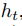，作为先前隐藏状态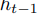和位置 t 的输入的函数。这种固有的顺序性质排除了训练示例中的并行化，这在更长的序列长度下变得至关重要，因为内存约束限制了示例之间的批处理。最近的工作通过分解技巧 [21] 和条件计算 [32] 显着提高了计算效率，同时在后者的情况下也提高了模型性能。然而，顺序计算的基本约束仍然存在。

注意机制已成为各种任务中引人注目的序列建模和转导模型的组成部分，允许对依赖项进行建模，而无需考虑它们在输入或输出序列中的距离 [2, 19]。然而，除了少数情况[27]，这种注意力机制与循环网络结合使用。

在这项工作中，我们提出了 Transformer，这是一种避免重复的模型架构，而是完全依赖注意力机制来绘制输入和输出之间的全局依赖关系。在八个 P100 GPU 上经过短短 12 小时的训练后，Transformer 可以实现更多的并行化，并且可以在翻译质量方面达到新的水平。

## 2. 背景

减少顺序计算的目标也构成了扩展神经 GPU [16]、ByteNet [18] 和 ConvS2S [9] 的基础，它们都使用卷积神经网络作为基本构建块，并行计算所有输入的隐藏表示和输出位置。在这些模型中，关联来自两个任意输入或输出位置的信号所需的操作数量随着位置之间的距离而增长，对于 ConvS2S 呈线性增长，而对于 ByteNet 则呈对数增长。这使得学习远距离位置之间的依赖关系变得更加困难[12]。在 Transformer 中，这被减少到恒定数量的操作，尽管由于平均注意力加权位置而降低了有效分辨率，我们使用多头注意力来抵消这种影响，如 3.2 节所述。

自注意力，有时称为内部注意力，是一种将单个序列的不同位置关联起来以计算序列表示的注意力机制。自注意力已成功用于各种任务，包括阅读理解、抽象摘要、文本蕴涵和学习任务无关的句子表示 [4, 27, 28, 22]。

端到端记忆网络基于循环注意机制而不是序列对齐循环，并且已被证明在简单语言问答和语言建模任务中表现良好 [34]。

然而，据我们所知，Transformer 是第一个完全依赖自注意力来计算其输入和输出表示而不使用序列对齐 RNN 或卷积的转导模型。在接下来的部分中，我们将描述 Transformer，激发自注意力并讨论其相对于 [17、18] 和 [9] 等模型的优势。

## 3. 模型架构

大多数竞争性神经序列转导模型具有编码器-解码器结构 [5, 2, 35]。这里，编码器将符号表示的输入序列 (x1, ..., xn) 映射到连续表示的序列 z = (z1, ..., zn)。给定 z，解码器然后一次生成一个元素的符号输出序列 (y1, ..., ym)。在每个步骤中，模型都是自回归的 [10]，在生成下一个时将先前生成的符号用作附加输入。

Transformer 遵循这种整体架构，对编码器和解码器使用堆叠的自注意力和逐点全连接层，分别如图 1 的左半部分和右半部分所示。

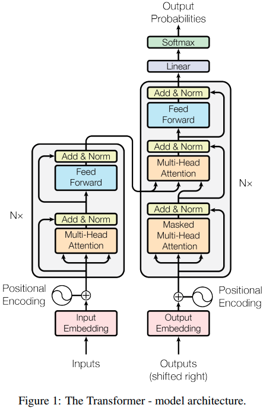

### 3.1 Encoder and Decoder Stacks

**Encoder:**编码器由 N = 6 个相同的层组成。每层有两个子层。第一个是多头自注意力机制，第二个是简单的、按位置的全连接前馈网络。我们在两个子层中的每一个周围使用残差连接 [11]，然后进行层归一化 [1]。即每个子层的输出为LayerNorm(x + Sublayer(x))，其中Sublayer(x)是子层自己实现的函数。为了促进这些残差连接，模型中的所有子层以及嵌入层都会产生维度 = 512 的输出。

**Decoder:**解码器也由一堆 N = 6 个相同的层组成。除了每个编码器层中的两个子层之外，解码器还插入了第三个子层，该子层对编码器堆栈的输出执行多头注意力。与编码器类似，我们在每个子层周围使用残差连接，然后进行层归一化。我们还修改了解码器堆栈中的自注意力子层，以防止位置关注后续位置。这种mask与输出嵌入偏移一个位置的事实相结合，确保对位置 i 的预测只能依赖于位置小于 i 的已知输出。

### 3.2 Attention

注意力函数可以描述为将查询和一组键值对映射到输出，其中查询、键、值和输出都是向量。输出计算为值的加权和，其中分配给每个值的权重由查询与相应键的兼容性函数计算。

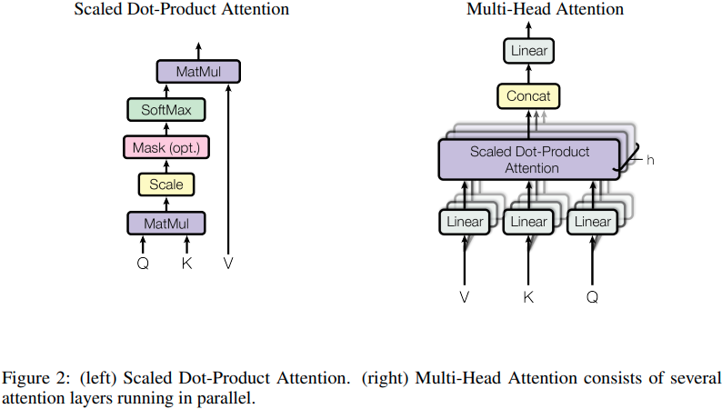

#### 3.2.1 Scaled Dot-Product Attention

我们将我们的特别attention称为“Scaled Dot-Product Attention”（图 2）。输入由维度的查询和键以及维度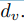的值组成。我们用所有键计算查询的点积，每个除以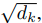，并应用 softmax 函数来获得值的权重。

在实践中，我们同时计算一组查询的注意力函数，并打包到矩阵 Q 中。键和值也打包到矩阵 K 和 V 中。我们将输出矩阵计算为：

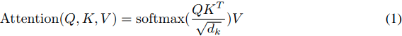

两个最常用的注意功能是加性注意 [2] 和点积（乘法）注意。点积注意力与我们的算法相同，除了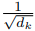的比例因子。加性注意力使用具有单个隐藏层的前馈网络计算兼容性函数。虽然两者在理论上的复杂性相似，但点积注意力在实践中更快且更节省空间，因为它可以使用高度优化的矩阵乘法代码来实现。

虽然对于较小的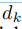值，这两种机制的性能相似，但加性注意力优于点积注意力，而无需对较大的值进行缩放 [3]。我们怀疑对于较大的值，点积的幅度会增大，从而将 softmax 函数推入具有极小梯度的区域(4:为了说明点积变大的原因，假设 q 和 k 的分量是独立随机变量，均值为 0，方差为 1。那么它们的点积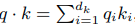，均值为 0，方差为)。为了抵消这种影响，我们将点积缩放。

#### 3.2.2 Multi-Head Attention

与使用维度的键、值和查询执行单个注意函数不同，我们发现使用不同、学习的线性投影将查询、键和值分别线性投影到、和维度上h次的是有益的。然后，在每个查询、键和值的投影版本上，我们并行执行注意功能，产生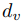维度输出值。这些被连接起来并再次投影，产生最终值，如图 2 所示。

多头注意力允许模型共同关注来自不同位置的不同表示子空间的信息。对于单个注意力头，平均化会抑制这一点。

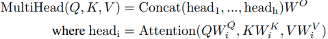

其中投影是参数矩阵

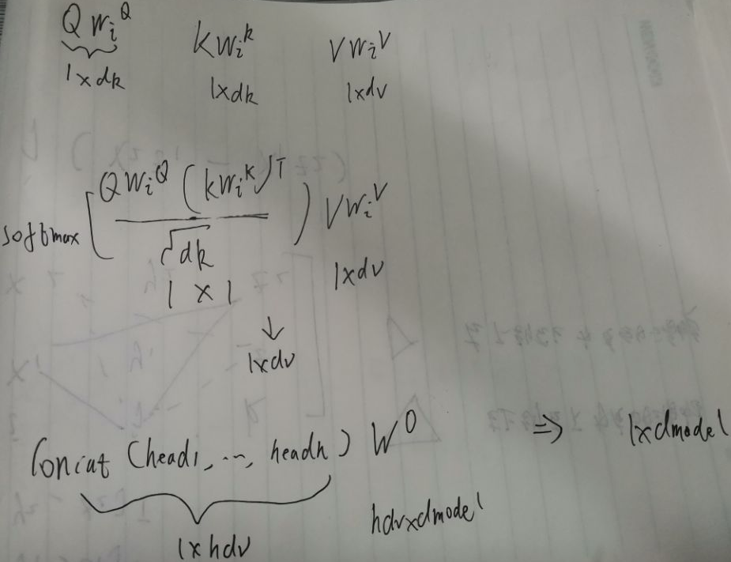

在这项工作中，我们使用 h = 8 个并行注意力层或头。对于其中的每一个，我们使用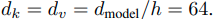。由于每个头的维度减少，总计算成本类似于具有全维度的单头注意力。

#### 3.2.3 Applications of Attention in our Model

Transformer 以三种不同的方式使用多头注意力：

在“编码器-解码器注意力”层中，查询来自前一个解码器层，记忆键和值来自编码器的输出。这允许解码器中的每个位置参与输入序列中的所有位置。这模仿了序列到序列模型中典型的编码器-解码器注意机制，例如 [38, 2, 9]。

编码器包含自注意力层。在自注意力层中，所有的键、值和查询都来自同一个地方，在这种情况下，是编码器中前一层的输出。编码器中的每个位置都可以关注编码器上一层中的所有位置。

类似地，解码器中的自注意力层允许解码器中的每个位置关注解码器中直到并包括该位置的所有位置。我们需要防止解码器中的信息向左流动，以保持自回归特性。我们通过屏蔽掉（设置为 -∞）softmax 输入中与非法连接相对应的所有值来实现scaled dot-product attention的内部。请参见图 2。

### 3.3 Position-wise Feed-Forward Networks

除了注意力子层之外，我们的编码器和解码器中的每一层都包含一个全连接的前馈网络，该网络分别且相同地应用于每个位置。这包括两个线性变换，中间有一个 ReLU 激活。

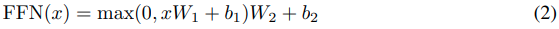

虽然线性变换在不同位置上是相同的，但它们在层与层之间使用不同的参数。另一种描述方式是内核尺寸为 1 的两个卷积。输入和输出的维数为  = 512，内层的维度为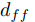= 2048。

### 3.4 Embeddings and Softmax

与其他序列转导模型类似，我们使用学习embedding将输入标记和输出标记转换为维度 的向量。我们还使用通常学习的线性变换和 softmax 函数将解码器输出转换为预测的下一个概率。在我们的模型中，我们在两个embedding层和 pre-softmax 线性变换之间共享相同的权重矩阵，类似于 [30]。在embedding层中，我们将这些权重乘以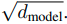。

### 3.5 Positional Encoding

由于我们的模型不包含循环和卷积，为了让模型利用序列的顺序，我们必须注入一些关于序列中标记的相对或绝对位置的信息。为此，我们在编码器和解码器堆栈底部的输入嵌入中添加“位置编码”。位置编码与embeddings具有相同的维度 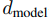，因此可以将两者相加。位置编码有很多选择，学习的和固定的 [9]。

在这项工作中，我们使用不同频率的正弦和余弦函数：

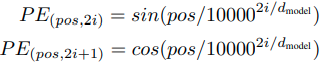

其中pos是位置，i是维度。也就是说，位置编码的每个维度对应一个正弦曲线。波长形成从 2π 到 10000 · 2π 的几何级数。我们选择这个函数是因为我们假设它可以让模型轻松学习通过相对位置来参与，因为对于任何固定的偏移量 k，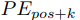可以表示为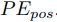的线性函数。

我们还尝试使用学习的位置embeddings [9]，发现这两个版本产生了几乎相同的结果（见表 3 行 (E)）。我们选择了正弦版本，因为它可以让模型推断出比训练期间遇到的序列长度更长的序列长度。

## 4. Why Self-Attention

在本节中，我们将自注意力层的各个方面与循环层和卷积层进行比较，这些层通常用于将一个可变长度的符号表示序列 (x1, ..., xn) 映射到另一个等长序列 (z1, ..., zn)，具有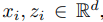，例如典型序列转导编码器或解码器中的隐藏层。为了激发我们对自我关注的使用，我们考虑了三个必要条件。

一是每层的总计算复杂度。另一个是可以并行化的计算量，以所需的最小顺序操作数来衡量。

第三个是网络中远程依赖关系之间的路径长度。学习长程依赖是许多序列转导任务中的关键挑战。影响学习这种依赖性的能力的一个关键因素是前向和后向信号必须在网络中遍历的路径长度。输入和输出序列中任意位置组合之间的这些路径越短，就越容易学习远程依赖[12]。因此，我们还比较了由不同层类型组成的网络中任意两个输入和输出位置之间的最大路径长度。

如表 1 所示，自注意力层将所有位置与恒定数量的顺序执行操作连接起来，而循环层需要 O(n) 顺序操作。在计算复杂度方面，当序列长度 n 小于表示维数 d 时，self-attention 层比循环层更快，这通常是机器翻译中最先进模型使用的句子表示的情况，例如 word-piece [38] 和 byte-pair [31] 表示。为了提高涉及非常长序列的任务的计算性能，可以将自注意力限制为仅考虑输入序列中以相应输出位置为中心的大小为 r 的邻域。这会将最大路径长度增加到 O(n/r)。我们计划在未来的工作中进一步研究这种方法。

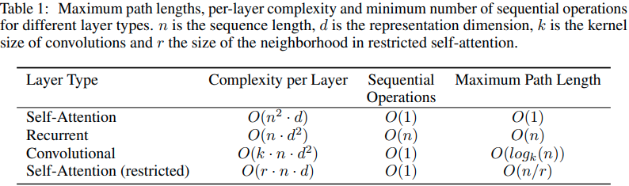

内核宽度 k < n 的单个卷积层不会连接所有输入和输出位置对。这样做需要在连续内核的情况下堆叠 O(n/k) 卷积层，或者在扩张卷积的情况下需要 O(logk(n)) [18]，从而增加在网络中任意两个位置之间最长路径的长度。卷积层通常比循环层更昂贵，高出 k 倍。然而，可分离卷积 [6] 将复杂度大大降低到。然而，即使 k = n，可分离卷积的复杂度也等于自注意力层和逐点前馈层的组合，这是我们在模型中采用的方法。

作为附带的好处，self-attention 可以产生更多可解释的模型。我们从我们的模型中检查注意力分布，并在附录中展示和讨论示例。不仅单个注意力头清楚地学习执行不同的任务，而且许多似乎表现出与句子的句法和语义结构相关的行为。

## 5. Training

本节描述我们模型的训练机制

### 5.1 Training Data and Batching

我们在由大约 450 万个句子对组成的标准 WMT 2014 英语-德语数据集上进行了训练。句子使用字节对编码 [3] 进行编码，该编码具有大约 37000 个标记的共享源目标词汇表。对于英语-法语，我们使用了更大的 WMT 2014 英语-法语数据集，该数据集由 3600 万个句子组成，并将标记拆分为 32000 个单词词汇表 [38]。句子对按近似的序列长度分批在一起。每个训练批次包含一组句子对，其中包含大约 25000 个源标记和 25000 个目标标记。

### 5.2 Hardware and Schedule

我们在一台配备 8 个 NVIDIA P100 GPU 的机器上训练我们的模型。对于我们使用整篇论文中描述的超参数的基础模型，每个训练步骤大约需要 0.4 秒。我们对基础模型进行了总共 100,000 步或 12 小时的训练。对于我们的大型模型，（在表 3 的最后一行进行了描述），步进时间为 1.0 秒。大型模型训练了 300,000 步（3.5 天）。

### 5.3 Optimizer

我们使用了 β1 = 0.9、β2 = 0.98 和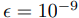的 Adam 优化器 [20]。我们根据以下公式在训练过程中改变学习率：

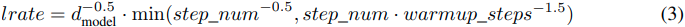

这对应于在第一个 warmup_steps 训练步骤中线性增加学习率，然后根据步数的平方根倒数按比例减少学习率。我们使用了 warmup_steps = 4000。

### 5.4 Regularization

在训练中使用了三种正则化：

**Residual Dropout**	我们将 dropout [33] 应用于每个子层的输出，然后将其添加到子层输入并进行归一化。此外，我们将 dropout 应用于编码器和解码器堆栈中embeddings和位置编码的总和。对于基本模型，我们使用的比率。

**Label Smoothing**	在训练期间，我们采用了值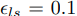[36] 的标签平滑。这会伤害困惑，因为模型会变得更加不确定，但会提高准确性和 BLEU 分数。

## 6. Results

### 6.1 Machine Translation

在 WMT 2014 英德翻译任务中，大 Transformer 模型（表 2 中的 Transformer (big)）比之前报道的最佳模型（包括集成）高出 2.0 BLEU 以上，建立了一个新的 state-of-the-艺术 BLEU 得分为 28.4。该模型的配置列于表 3 的最后一行。在 8 个 P100 GPU 上训练耗时 3.5 天。甚至我们的基础模型也超过了所有先前发布的模型和集成，其训练成本只是任何竞争模型的一小部分。

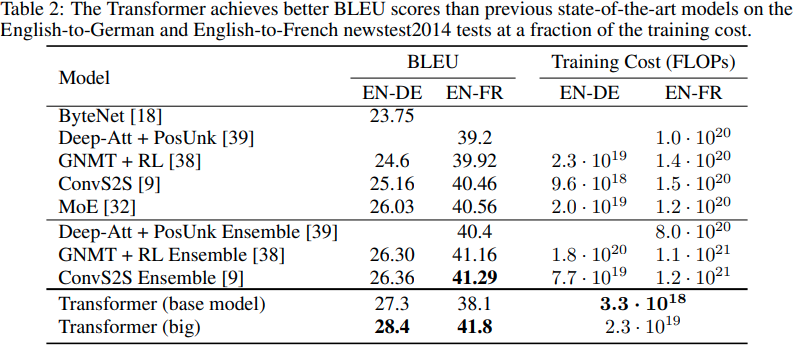

在 WMT 2014 英法翻译任务中，我们的大模型达到 41.0 的 BLEU 分数，优于之前发布的所有单一模型，其训练成本不到之前最先进技术的 1/4模型。为英语到法语训练的 Transformer（大）模型使用的辍学率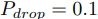，而不是 0.3。

对于基本模型，我们使用通过平均最后 5 个检查点获得的单个模型，这些检查点以 10 分钟的间隔写入。对于大型模型，我们平均了最后 20 个检查点。我们使用光束搜索，光束大小为 4，长度惩罚 α = 0.6 [38]。这些超参数是在对开发集进行实验后选择的。我们将推理期间的最大输出长度设置为输入长度 + 50，但在可能的情况下提前终止 [38]。

表 2 总结了我们的结果，并将我们的翻译质量和培训成本与文献中的其他模型架构进行了比较。我们通过将训练时间、使用的 GPU 数量和每个 GPU(5:我们对 K80、K40、M40 和 P100 分别使用了 2.8、3.7、6.0 和 9.5 TFLOPS 的值)的持续单精度浮点容量的估计值相乘来估计用于训练模型的浮点运算的数量。

### 6.2 Model Variations

为了评估 Transformer 不同组件的重要性，我们以不同的方式改变了我们的基础模型，测量了开发集 newstest2013 上英德翻译性能的变化。我们使用了上一节中描述的波束搜索，但没有检查点平均。我们在表 3 中展示了这些结果。

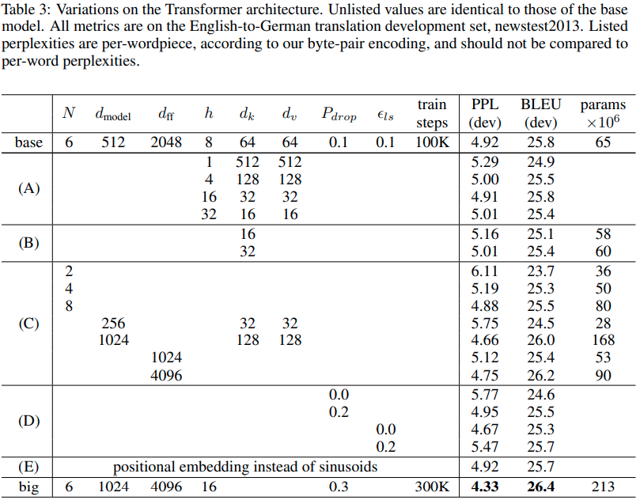

在表 3 行 (A) 中，我们改变了注意力头的数量以及注意力键和值维度，保持计算量不变，如第 3.2.2 节所述。虽然单头注意力比最佳设置差 0.9 BLEU，但质量也会因人头过多而下降。

在表 3 行 (B) 中，我们观察到减小注意力键大小 dk 会损害模型质量。这表明确定兼容性并不容易，比点积更复杂的兼容性功能可能是有益的。我们在行 (C) 和 (D) 中进一步观察到，正如预期的那样，更大的模型更好，并且 dropout 非常有助于避免过度拟合。在第 (E) 行中，我们用学习的位置嵌入 [9] 替换我们的正弦位置编码，并观察到与基本模型几乎相同的结果。

### 6.3 English Constituency Parsing

为了评估 Transformer 是否可以泛化到其他任务，我们对英语选区解析进行了实验。这项任务提出了具体的挑战：输出受到强烈的结构约束，并且明显长于输入。此外，RNN 序列到序列模型无法在小数据机制中获得最先进的结果 [37]。

我们在 Penn Treebank [25] 的华尔街日报 (WSJ) 部分训练了一个 dmodel = 1024 的 4 层转换器，大约 40K 训练句子。我们还在半监督环境中对其进行了训练，使用来自大约 1700 万个句子的更大的高置信度和 BerkleyParser 语料库 [37]。我们将 16K 令牌的词汇表用于 WSJ 唯一设置，将 32K 令牌词汇表用于半监督设置。

我们只进行了少量实验来选择第 22 节开发集上的 dropout、注意力和残差（第 5.4 节）、学习率和光束大小，所有其他参数与英德基础翻译模型保持不变。在推理过程中，我们将最大输出长度增加到输入长度 + 300。我们对 WSJ 和半监督设置都使用了 21 的光束大小和 α = 0.3。

我们在表 4 中的结果表明，尽管缺乏针对特定任务的调整，但我们的模型表现得非常好，比除递归神经网络语法 [8] 之外的所有先前报告的模型产生了更好的结果。

与 RNN 序列到序列模型 [37] 相比，即使仅在 WSJ 的 40K 句子训练集上进行训练，Transformer 的性能也优于 Berkeley Parser [29]。

## 7. Conclusion

在这项工作中，我们提出了 Transformer，这是第一个完全基于注意力的序列转导模型，用多头自注意力取代了编码器-解码器架构中最常用的循环层。

对于翻译任务，Transformer 的训练速度明显快于基于循环或卷积层的架构。在 WMT 2014 英语到德语和 WMT 2014 英语到法语的翻译任务上，我们都达到了新的水平。在前一项任务中，我们最好的模型甚至优于所有先前报道的集成。

我们对基于注意力的模型的未来感到兴奋，并计划将它们应用于其他任务。我们计划将 Transformer 扩展到涉及文本以外的输入和输出模式的问题，并研究局部的受限注意力机制，以有效处理图像、音频和视频等大型输入和输出。减少生成的顺序是我们的另一个研究目标。

我们用于训练和评估模型的代码可在 https://github.com/tensorflow/tensor2tensor 获得。