# Transformer架构

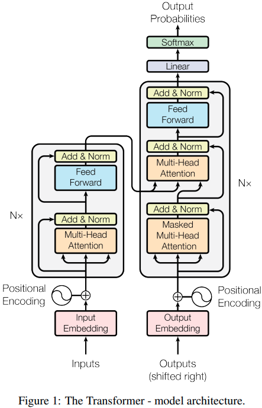

Transformer 模型的架构就是一个 seq2seq 架构，由多个 Encoder Decoder 堆叠而成。

**Encoder:**编码器由 N = 6 个相同的层组成。每层有两个子层。第一个是多头自注意力机制，第二个是简单的、按位置的全连接前馈网络。我们在两个子层中的每一个周围使用残差连接 [11]，然后进行层归一化 [1]。即每个子层的输出为LayerNorm(x + Sublayer(x))，其中Sublayer(x)是子层自己实现的函数。为了促进这些残差连接，模型中的所有子层以及嵌入层都会产生维度 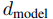= 512 的输出。

**Decoder:**解码器也由一堆 N = 6 个相同的层组成。除了每个编码器层中的两个子层之外，解码器还插入了第三个子层，该子层对编码器堆栈的输出执行多头注意力。与编码器类似，我们在每个子层周围使用残差连接，然后进行层归一化。我们还修改了解码器堆栈中的自注意力子层，以防止位置关注后续位置。这种mask与输出嵌入偏移一个位置的事实相结合，确保对位置 i 的预测只能依赖于位置小于 i 的已知输出。

概括来说，我们输入法语：je suis étudiant，经过六个 Encoder 后得到了类似于 Context Vector 的东西，然后将得到的向量放进 Decoder 中，每个 Decoder 会对上一个 Decoder 的输出进行 Self-Attention 处理，同时会把得到的结果与 Encoder 传递过来的 Vector 进行 Encoder-Decoder Attention 处理，将结果放入前馈网络中，这算是一个 Decoder，而把六个 Decoder 叠加起来学习，便可得到最后的结果。这里叠起来的编解码器的数量不是固定的，至于 Encoder 和 Decoder 的工作原理在下面章节介绍。

# Self-Attention(自注意力)

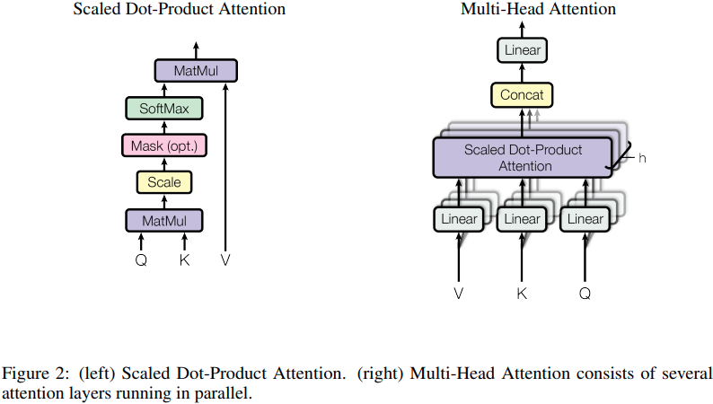

## 缩放点积注意力

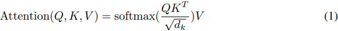

## 多头注意力

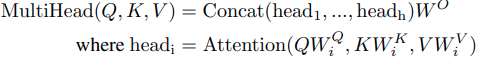

其中投影是参数矩阵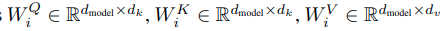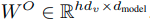

在这项工作中，我们使用 h = 8 个并行注意力层或头。对于其中的每一个，我们使用。由于每个头的维度减少，总计算成本类似于具有全维度的单头注意力。

## 理解缩放点积注意力

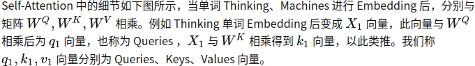

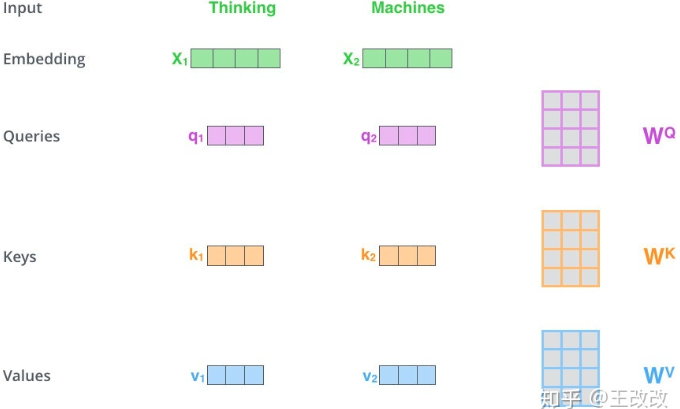

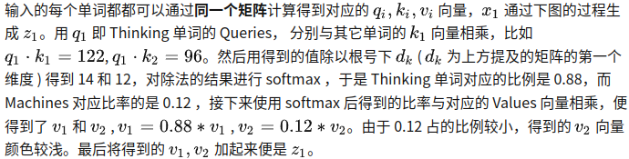

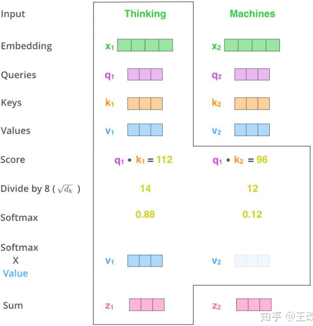

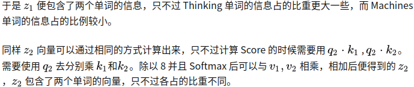

### 向量化

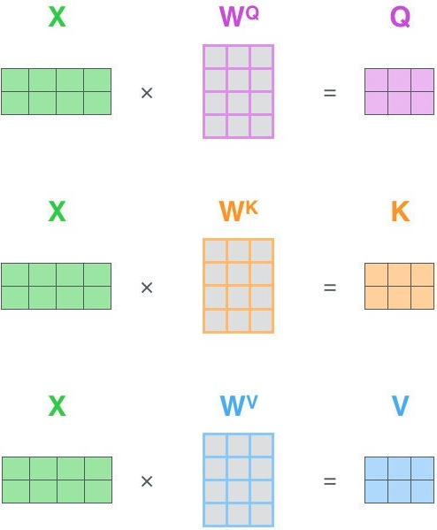

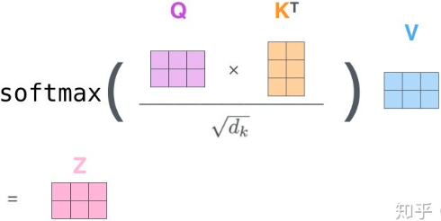

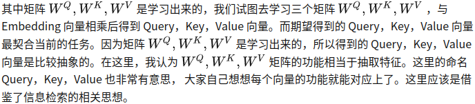

## 理解多头注意力

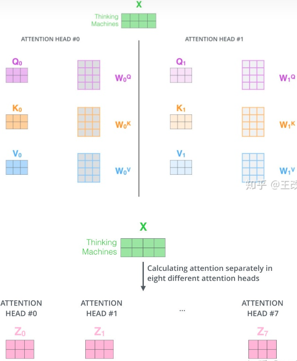

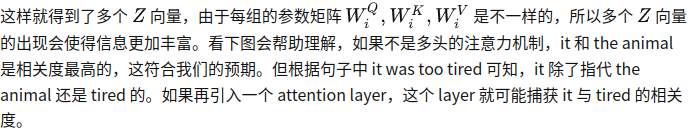

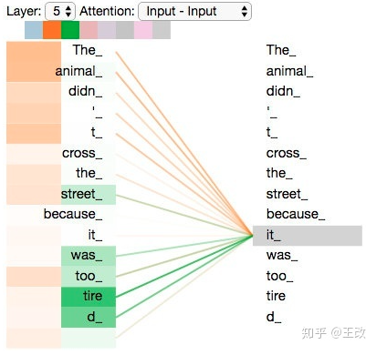

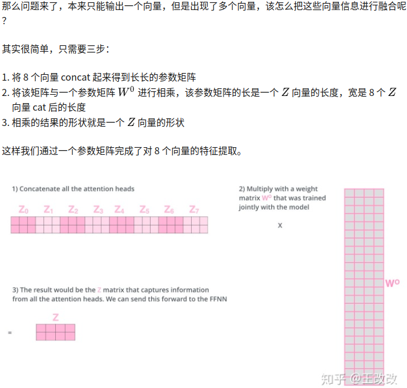

下图是多头注意力全部流程

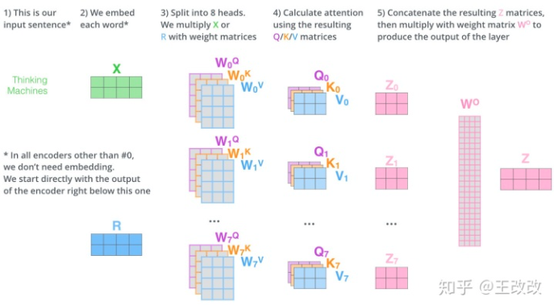

## 理解前馈网络和层归一化

### Feed Forward

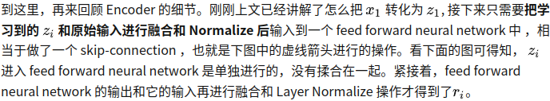

### Layer normalization

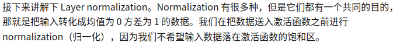

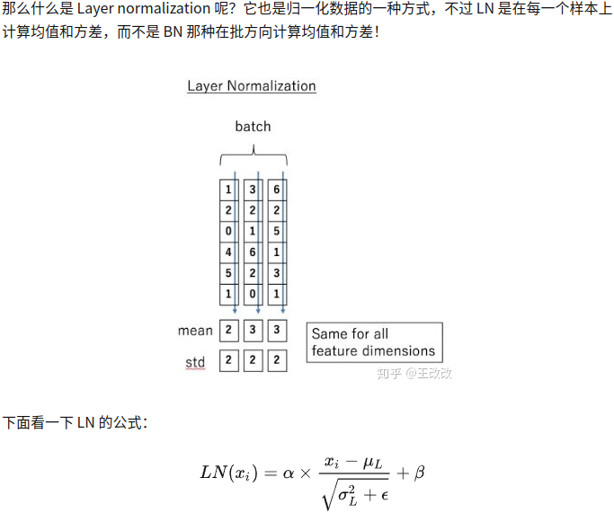

## 总结

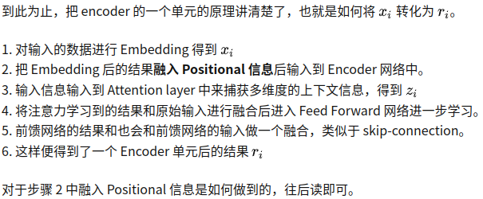

## Positional Encoding(位置编码)

在这项工作中，我们使用不同频率的正弦和余弦函数：

其中pos是位置，i是维度。也就是说，位置编码的每个维度对应一个正弦曲线。波长形成从 2π 到 10000 · 2π 的几何级数。我们选择这个函数是因为我们假设它可以让模型轻松学习通过相对位置来参与，因为对于任何固定的偏移量 k，可以表示为的线性函数。

我们还尝试使用学习的位置embeddings [9]，发现这两个版本产生了几乎相同的结果（见表 3 行 (E)）。我们选择了正弦版本，因为它可以让模型推断出比训练期间遇到的序列长度更长的序列长度。

## 理解位置编码

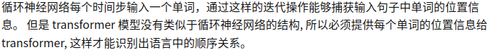

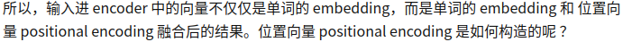

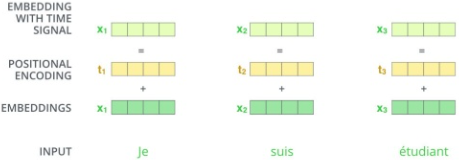

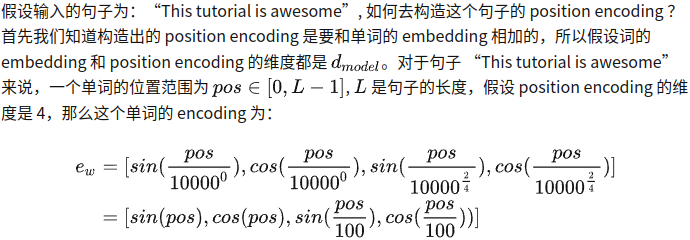

偶数维度(0,2,4,...)使用如下公式:

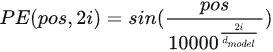

奇数维度采样如下公式:

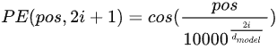

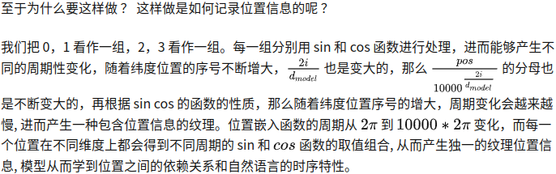

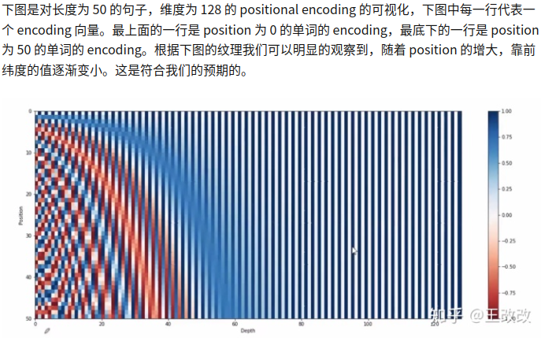

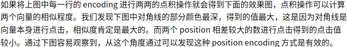

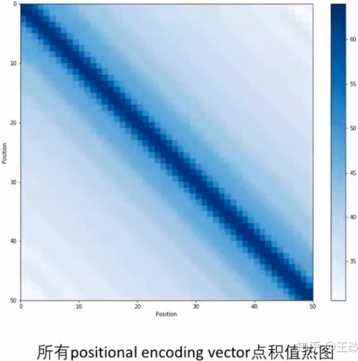

# Decoder(解码器)

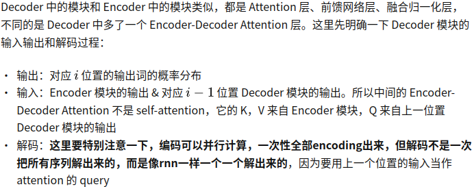

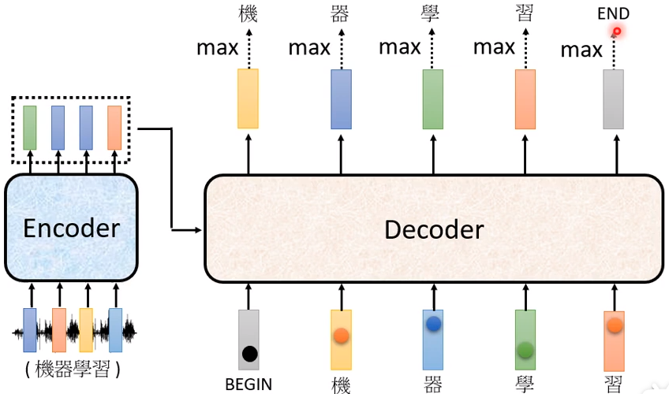

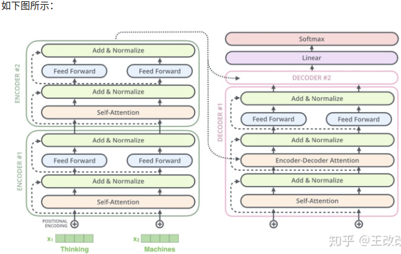

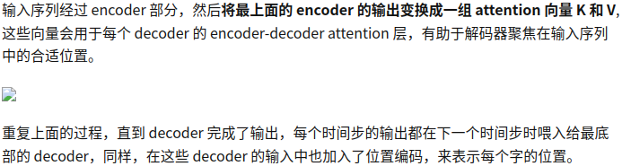

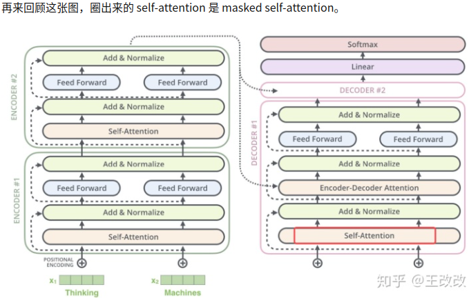

# Mask

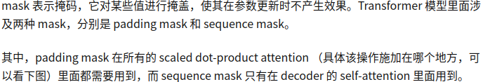

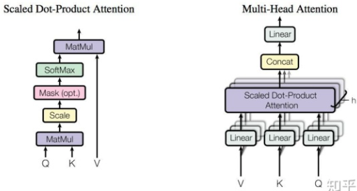

## Padding Mask

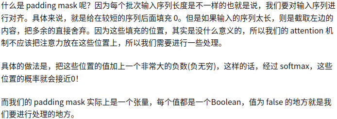

## Sequence Mask

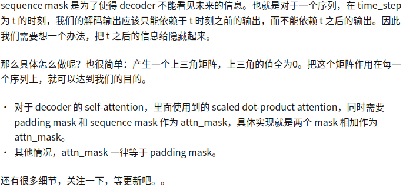

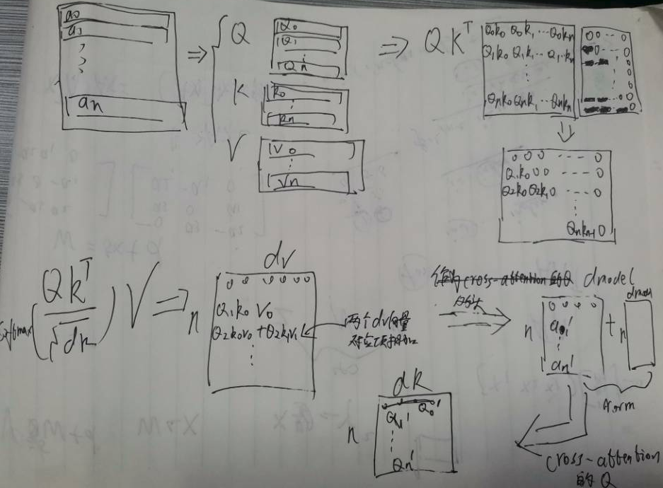

# 参考链接

https://zhuanlan.zhihu.com/p/264468193