# Pyramid Vision Transformer A Versatile Backbone for Dense Prediction without Convolutions

## 摘要

尽管卷积神经网络 (CNN) 在计算机视觉方面取得了巨大成功，但这项工作研究了一种更简单、无卷积的backbone网络，可用于许多密集预测任务。与最近提出的专门为图像分类设计的视觉transformer (ViT) 不同，我们引入了金字塔视觉transformer (PVT)，它克服了将transformer移植到各种密集预测任务的困难。与现有技术相比，PVT 有几个优点。 (1) 与通常产生低分辨率输出并导致高计算和内存成本的 ViT 不同，PVT 不仅可以在图像的密集分区上进行训练以实现对密集预测很重要的高输出分辨率，而且还使用渐进式缩小金字塔以减少大型特征图的计算。 (2) PVT 继承了 CNN 和 Transformer 的优点，使其成为各种视觉任务的统一backbone，无需卷积，可以直接替代 CNN backbone。 (3) 我们通过大量实验验证了 PVT，表明它提高了许多下游任务的性能，包括对象检测、实例和语义分割。例如，在参数数量相当的情况下，PVT+RetinaNet 在 COCO 数据集上达到 40.4 AP，超过 ResNet50+RetinNet (36.3 AP) 的4.1 绝对 AP（见图 2）。我们希望 PVT 可以作为像素级预测的替代和有用的backbone，并促进未来的研究。

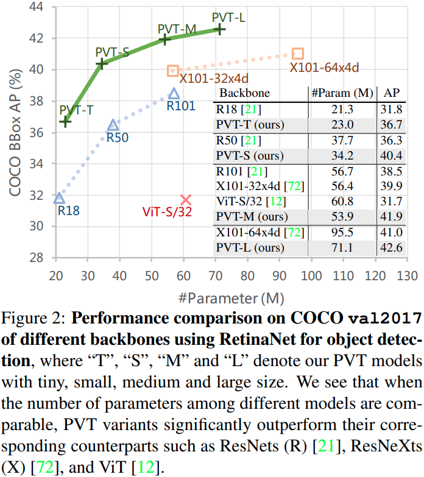

## 1.引言

卷积神经网络 (CNN) 在计算机视觉方面取得了显著成功，使其成为几乎所有任务的通用且占主导地位的方法 [53、21、72、48、20、38、8、31]。然而，这项工作旨在探索 CNN 之外的替代backbone网络，除了图像分类 [11] 之外，它还可用于密集预测任务，例如对象检测 [39、13]、语义 [81] 和实例分割 [39] ]。

受 Transformer [63] 在自然语言处理中的成功启发，许多研究人员探索了它在计算机视觉中的应用。例如，一些工作 [5, 82, 71, 55, 23, 41] 将视觉任务建模为具有可学习查询的字典查找问题，并将 Transformer 解码器用作 CNN backbone之上的特定任务头.尽管一些现有技术也将注意力模块 [69, 47, 78] 纳入 CNN，但据我们所知，探索干净且无卷积的 Transformer backbone网络来解决计算机视觉中的密集预测任务很少见研究过

最近，Dosovitskiy 等人。 [12] 引入了用于图像分类的视觉transformer (ViT)。这是用无卷积模型替换 CNN backbone的有趣且有意义的尝试。如图 1 (b) 所示，ViT 具有柱状结构，以粗图像patch作为输入(1.由于资源限制，ViT 不能使用细粒度的图像patch(例如，每个patch 4×4 像素)作为输入，而只能接收粗粒度的patch(例如，每个patch 32×32 像素)作为输入，这导致其低输出分辨率(例如，32 步长))。 虽然 ViT 适用于图像分类，但直接将其应用于像素级密集预测（如对象检测和分割，因为（1）它的输出特征图是单尺度和低分辨率的，（2）即使对于常见的输入图像大小（例如，COCO 基线中较短边缘为800像素的图像[39]），它的计算和内存成本也相对较高。

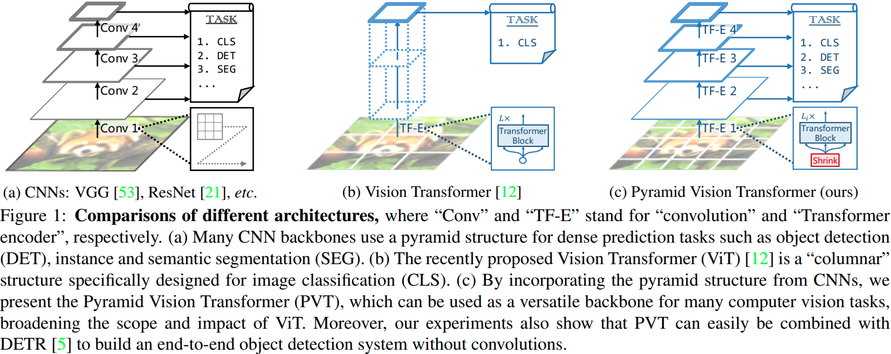

为了解决上述限制，这项工作提出了一个纯 Transformer backbone，称为 Pyramid Vision Transformer (PVT)，它可以在许多下游任务中作为 CNN backbone的替代品，包括图像级预测以及像素级密集预测.具体来说，如图 1 (c) 所示，我们的 PVT 通过 (1) 将细粒度图像patch（即每个patch 4×4 像素）作为输入来学习高分辨率表示，从而克服了传统 Transformer 的困难。对于密集预测任务至关重要； (2) 引入渐进式收缩金字塔，随着网络的加深，减少 Transformer 的序列长度，显着降低计算成本，(3) 采用空间减少注意力（SRA）层，进一步降低学习高分辨率特征时的资源消耗。

总体而言，提议的 PVT 具有以下优点。首先，与具有随着网络深度增加的局部感受野的传统 CNN backbone网络（见图 1（a））相比，我们的 PVT 始终产生全局感受野，更适合检测和分割。其次，与 ViT 相比（见图 1（b）），由于其先进的金字塔结构，我们的方法可以更容易地插入许多具有代表性的密集预测pipeline，例如 RetinaNet [38] 和 Mask R-CNN [20]。第三，我们可以通过将我们的 PVT 与其他特定于任务的 Transformer 解码器（例如用于对象检测的 PVT+DETR [5]）相结合来构建一个无卷积管道。据我们所知，这是第一个完全无卷积的目标检测pipeline。

我们主要的贡献如下所示：

(1) 我们提出 Pyramid Vision Transformer (PVT)，这是第一个专为各种像素级密集预测任务设计的纯 Transformer backbone。结合我们的 PVT 和 DETR，我们可以构建一个端到端的对象检测系统，而无需卷积和手工制作的组件，例如密集锚点和非最大抑制 (NMS)。

(2) 我们在将 Transformer 移植到密集预测时克服了许多困难，通过设计渐进式收缩金字塔和空间缩减注意 (SRA)。这些能够减少 Transformer 的资源消耗，使 PVT 能够灵活地学习多尺度和高分辨率的特征。

(3) 我们在几个不同的任务上评估所提出的 PVT，包括图像分类、对象检测、实例和语义分割，并将其与流行的 ResNets [21] 和 ResNeXts [72] 进行比较。如图 2 所示，与现有技术相比，我们具有不同参数尺度的 PVT 可以始终如一地存档改进的性能。例如，在相当数量的参数下，使用 RetinaNet [38] 进行对象检测，PVT-Small 在 COCO val2017 上达到 40.4 AP，比 ResNet50 高 4.1 个点（40.4 对 36.3）。而且，PVT-Large 达到了 42.6 AP，比 ResNeXt101-64x4d 提高了 1.6 个点，参数减少了 30%。

## 2.相关工作

### 2.1 CNN Backbones

CNN 是视觉识别中深度神经网络的主力军。标准 CNN 最初是在 [33] 中引入的，用于区分手写数字。该模型包含具有一定感受野的卷积核，可以捕获有利的视觉上下文。为了提供平移等方差，卷积核的权重在整个图像空间上共享。最近，随着计算资源（例如 GPU）的快速发展，在大规模图像分类数据集（例如 ImageNet [50]）上成功训练堆叠卷积块 [32、53] 已成为可能。例如，GoogLeNet [58] 证明了包含多个内核路径的卷积算子可以实现非常有竞争力的性能。在 Inception 系列 [59、57]、ResNeXt [72]、DPN [9]、MixNet [64] 和 SKNet [35] 中进一步验证了多路径卷积块的有效性。此外，ResNet [21] 在卷积块中引入了跳跃连接，使得创建/训练非常深的网络并在计算机视觉领域获得令人印象深刻的结果成为可能。 DenseNet [24] 引入了一种密集连接的拓扑结构，它将每个卷积块连接到所有先前的块。最新的进展可以在最近的调查/评论论文中找到 [30, 52]。

与成熟的 CNN 不同，视觉 Transformer backbone仍处于早期发展阶段。在这项工作中，我们尝试通过设计一种适用于大多数视觉任务的新型多功能 Transformer backbone来扩展 Vision Transformer 的范围。

### 2.2 密集预测任务

**初步**	密集预测任务旨在对特征图执行像素级分类或回归。对象检测和语义分割是两个具有代表性的密集预测任务。

**目标检测**	在深度学习时代，CNN [33] 已成为目标检测的主要框架，其中包括单阶段检测器（例如 SSD [42]、RetinaNet [38]、FCOS [61]、GFL [36、34] 、PolarMask [70] 和 OneNet [54]）和多阶段检测器（Faster R-CNN [48]、Mask R-CNN [20]、Cascade R-CNN [4] 和 Sparse R-CNN [56]）。这些流行的目标检测器中的大多数都建立在高分辨率或多尺度特征图上，以获得良好的检测性能。最近，DETR [5] 和可变形 DETR [82] 结合了 CNN backbone和 Transformer 解码器，构建了一个端到端的目标检测器。同样，它们还需要高分辨率或多尺度特征图来进行准确的对象检测。

**语义分割**	CNN 在语义分割中也发挥着重要作用。在早期阶段，FCN [43] 引入了一种全卷积架构来为任意大小的给定图像生成空间分割图。之后，Noh 等人引入了反卷积操作。 [46] 并在 PASCAL VOC 2012 数据集 [51] 上取得了令人印象深刻的性能。受 FCN 的启发，UNet [49] 被专门用于医学图像分割领域，桥接了相同空间大小的相应低级和高级特征图之间的信息流。为了探索更丰富的全局上下文表示，Zhao 等人79] 在各种池化尺度上设计了一个金字塔池化模块，和Kirillov 等人 [[31] 基于 FPN [37] 开发了一种称为语义 FPN 的轻量级分割头。最后，DeepLab 系列 [7, 40] 应用扩张卷积来扩大感受野，同时保持特征图分辨率。与目标检测方法类似，语义分割模型也依赖于高分辨率或多尺度特征图。

### 2.3 视觉中的自注意力和Transformer

由于卷积滤波器的权重通常在训练后是固定的，因此它们不能动态地适应不同的输入。已经提出了许多方法来使用动态滤波器 [29] 或自注意操作 [63] 来缓解这个问题。非局部块 [69] 尝试在空间和时间上对远程依赖关系进行建模，这已被证明有利于准确的视频分类。然而，尽管取得了成功，但非局部算子仍遭受高计算和内存成本的困扰。criss-cross[25]通过criss-cross的路径生成稀疏的注意力图，进一步降低了复杂性。Ramachandran等人。 [47] 提出了stand-alone 自我注意，用局部自我注意单元代替卷积层。 AANet [3] 在结合自注意力和卷积操作时取得了有竞争力的结果。 LambdaNetworks [2] 使用 lambda 层，一种有效的自我注意来替代 CNN 中的卷积。 DETR [5] 利用 Transformer 解码器将对象检测建模为具有可学习查询的端到端字典查找问题，成功消除了对 NMS 等手工过程的需求。在 DETR 的基础上，可变形 DETR [82] 进一步采用可变形注意力层来关注一组稀疏的上下文元素，获得更快的收敛和更好的性能。最近，Vision Transformer (ViT) [12] 采用纯 Transformer [63] 模型进行图像分类，将图像视为一系列patch。 DeiT [62] 使用一种新的蒸馏方法进一步扩展了 ViT。与之前的模型不同，这项工作将金字塔结构引入到 Transformer 中，以呈现用于密集预测任务的纯 Transformer backbone，而不是特定的任务头或图像分类模型。

## 3.Pyramid Vision Transformer(PVT)

### 3.1 Overall Architecture

我们的目标是将金字塔结构引入到 Transformer 框架中，以便它可以为密集预测任务（例如，对象检测和语义分割）生成多尺度特征图。 PVT 的概述如图 3 所示。与 CNN backbone [21] 类似，我们的方法有四个阶段，可以生成不同尺度的特征图。所有阶段共享一个相似的架构，由patch embedding层和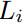 Transformer 编码器层组成。

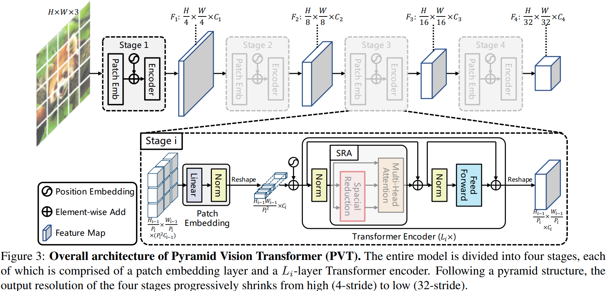

在第一阶段，给定一个大小为 H×W×3 的输入图像，我们首先将其划分为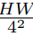个patch(2.与 ResNet 一样，我们将输出特征图的最高分辨率保持在 4 stride)，每个patch大小为 4×4×3。然后，我们将扁平化的patch送入线性投影并获得大小为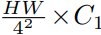的embedded patch。之后，embedded patch与位置embedding一起通过具有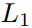层的 Transformer 编码器，并将输出reshape为大小为 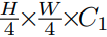的特征图 F1。同样，使用前一阶段的特征图作为输入，我们得到以下特征图：F2、F3 和 F4，其相对于输入图像的步幅分别为 8、16 和 32 个像素。借助特征金字塔 {F1, F2, F3, F4}，我们的方法可以轻松应用于大多数下游任务，包括图像分类、对象检测和语义分割。

### 3.2 Feature Pyramid for Transformer

与使用不同卷积步长来获得多尺度特征图的 CNN backbone[53、21] 不同，我们的 PVT 使用渐进收缩策略通过patch embedding层来控制特征图的尺度。

在这里，我们将第 i 个阶段的patch大小表示为 。在阶段 i 开始时，我们首先将输入特征图 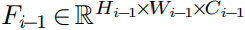平均划分为 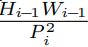个补丁，然后将每个patch展平并投影到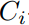维embedding。在线性投影之后，embedded patch的形状可以看作是 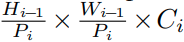，其中高度和宽度小于输入的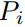倍。

这样我们就可以灵活地调整每个阶段的特征图的尺度，使得为Transformer构建特征金字塔成为可能。

### 3.3 Transformer Encoder

第 i 阶段的 Transformer 编码器有编码器层，每个编码器层由一个注意层和一个前馈层 [63] 组成。由于 PVT 需要处理高分辨率（例如，步长为4）特征图，我们提出了一个空间减少注意力（SRA）层来代替编码器中传统的多头注意力（MHA)层 [63]。

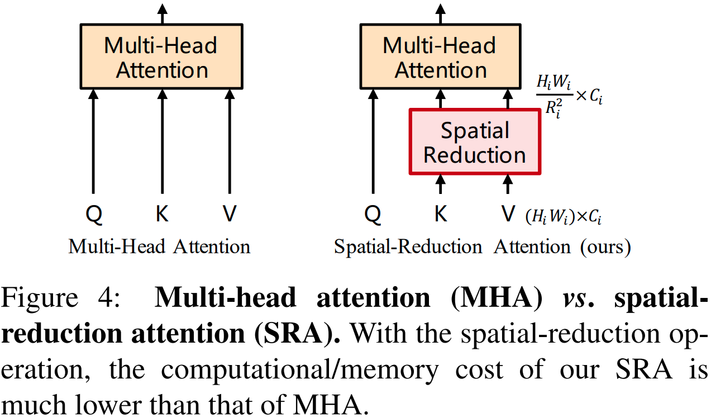

与 MHA 类似，我们的 SRA 接收查询 Q、键 K 和值 V 作为输入，并输出精炼的特征。不同之处在于，我们的 SRA 在注意力操作之前减少了 K 和 V 的空间尺度（见图 4），这大大减少了计算/内存开销。第 i 阶段 SRA 的详细信息可表述如下：

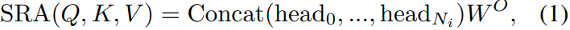

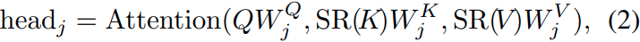

其中 Concat(·) 是 [63] 中的连接操作。 ,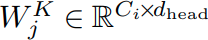 , 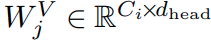 , 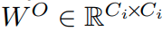 是线性投影参数。 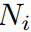是第 i 阶段注意力层的头部编号。因此，每个头的维度（即 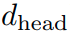）等于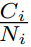 。 SR(FCOS [61]、GFL [36、34] 、PolarMask [70] 和 OneNet [54]）和多阶段检测器（Faster R-CNN [48]、Mask R-CNN [20]、Cascade R-CNN [4] 和 Sparse R-CNN [56]）。这些流行的目标检测器中的大多数都建立在高分辨率或多尺度特征图上，以·) 是减少输入序列（即 K 或 V )空间维度的操作，写为：

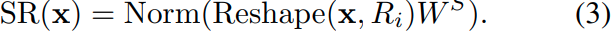

这里，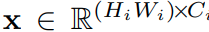表示输入序列，表示第 i 阶段的注意力层的缩减率。 Reshape(x, 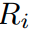) 是将输入序列 x 重塑为大小为 的序列的操作。 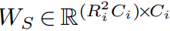是一个线性投影，它将输入序列的维度减少到 。 Norm(·) 指的是层归一化[1]。与原始的 Transformer [63] 一样，我们的注意力操作 Attention(·) 计算为：

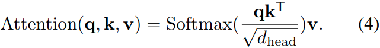

通过这些公式，我们可以发现我们的注意力操作的计算/内存成本比 MHA 低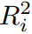倍，因此我们的 SRA 可以在资源有限的情况下处理更大的输入特征图/序列。

### 3.4 讨论

与我们的模型最相关的工作是 ViT [12]。在这里，我们讨论它们之间的关系和区别。首先，PVT 和 ViT 都是没有卷积的纯 Transformer 模型。它们之间的主要区别在于金字塔结构。与传统的 Transformer [63] 类似，ViT 的输出序列长度与输入相同，这意味着 ViT 的输出是单尺度的（见图 1（b））。此外，由于资源有限，ViT 的输入是粗粒度的（例如，patch 大小为 16 或 32 像素），因此其输出分辨率相对较低（例如，16-stride 或 32-stride）。因此，很难将 ViT 直接应用于需要高分辨率或多尺度特征图的密集预测任务。

我们的 PVT 通过引入渐进式收缩金字塔打破了 Transformer 的常规。它可以像传统的 CNN backbone一样生成多尺度特征图。此外，我们还设计了一个简单但有效的注意力层——SRA，用于处理高分辨率特征图并降低计算/内存成本。得益于上述设计，我们的方法相对于 ViT 具有以下优势： 1）更灵活——可以在不同阶段生成不同尺度/通道的特征图； 2）更多功能——可以在大多数下游任务模型中轻松插入和播放； 3）对计算/内存更友好——可以处理更高分辨率的特征图或更长的序列。

## 4.Application to Downstream Tasks

### 4.1 Image-Level Prediction

图像分类是图像级别预测中最经典的任务。为了提供实例供讨论，我们设计了一系列不同尺度的 PVT 模型，即 PVT-Tiny、-Small、-Medium 和 -Large，其参数数量分别与 ResNet18、50、101 和 152 相似。补充材料 (SM) 中提供了 PVT 系列的详细超参数设置。

对于图像分类，我们遵循 ViT [12] 和 DeiT [62] 将可学习的分类token附加到最后阶段的输入，然后使用全连接 (FC) 层在token之上进行分类。

### 4.2 Pixel-Level Dense Prediction

除了图像级预测，需要在特征图上进行像素级分类或回归的密集预测，也经常出现在下游任务中。在这里，我们讨论两个典型的任务，即目标检测和语义分割。

我们将我们的 PVT 模型应用于三种具有代表性的密集预测方法，即 RetinaNet [38]、Mask RCNN [20] 和 Semantic FPN [31]。 RetinaNet 是一种广泛使用的单阶段检测器，Mask R-CNN 是最流行的两阶段实例分割框架，Semantic FPN 是一种没有特殊操作（例如空洞卷积）的普通语义分割方法。使用这些方法作为基线使我们能够充分检查不同backbone的有效性。

实现细节如下： (1) 与 ResNet 一样，我们使用在 ImageNet 上预训练的权重初始化 PVT 主干； （2）我们使用输出特征金字塔{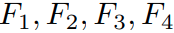}作为FPN[37]的输入，然后将细化的特征图馈送到后续的检测/分割头； (3) 在训练检测/分割模型时，PVT中没有任何层被冻结； (4) 由于检测/分割的输入可以是任意形状，因此在 ImageNet 上预训练的pose embeddings可能不再有意义。因此，我们根据输入分辨率对预训练的pose embeddings执行双线性插值。

## 5.Experiments

我们将 PVT 与两个最具代表性的 CNN backbone进行比较，即 ResNet [21] 和 ResNeXt [72]，它们广泛用于许多下游任务的基准测试。

### 5.1 图像分类

**设置**	图像分类实验在 ImageNet 2012 数据集 [50] 上进行，该数据集包括来自 1,000 个类别的 128 万张训练图像和 50K 验证图像。为了公平比较，所有模型都在训练集上进行训练，并在验证集上报告 top-1 错误。我们遵循 DeiT [62] 并应用随机裁剪、随机水平翻转 [58]、标签平滑正则化 [59]、mixup [76]、CutMix [75] 和随机擦除 [80] 作为数据增强。在训练期间，我们使用动量为 0.9、mini-batch为 128、权重衰减为 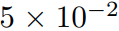的 AdamW [45] 来优化模型。初始学习率设置为 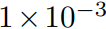，并按照余弦schedule [44] 递减。所有模型都在 8 个 V100 GPU 上从头开始训练 300 个 epoch。为了进行基准测试，我们在验证集上应用中心裁剪，裁剪 224×224 的patch来评估分类准确度

**结果**	在表 1 中，我们看到我们的 PVT 模型在相似的参数数量和计算预算下优于传统的 CNN backbone。例如，当 GFLOPs 大致相似时，PVT-Small 的 top-1 error 达到 20.2，比 ResNet50 [21] 高 1.3 个点（20.2 vs. 21.5）。同时，在相似或更低的复杂度下，PVT 模型的存档性能可与最近提出的基于 Transformer 的模型相媲美，例如 ViT [12] 和 DeiT [62]（PVT-Large：18.3 vs. ViT(DeiT)-Base/16： 18.3)。在这里，我们澄清这些结果在我们的预期之内，因为金字塔结构有利于密集预测任务，但对图像分类带来的改进很少。

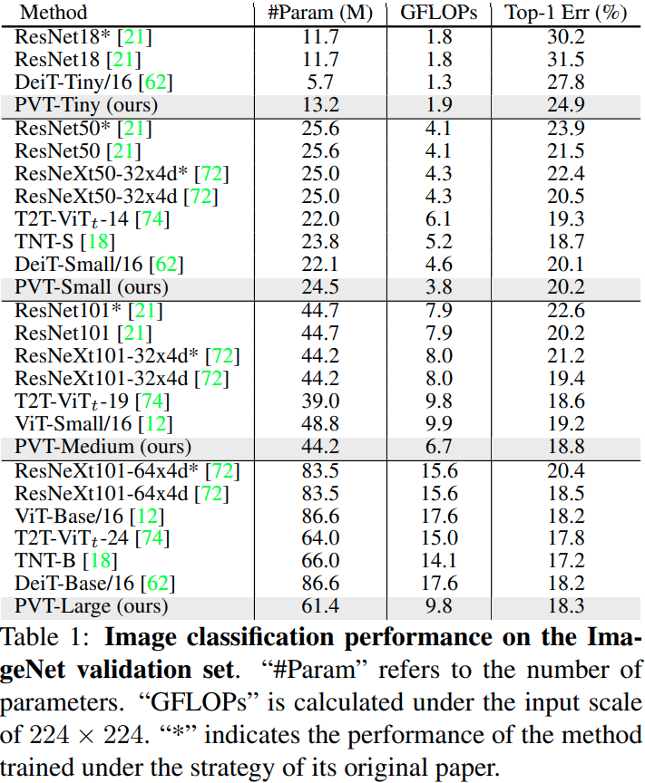

请注意，ViT 和 DeiT 有局限性，因为它们是专门为分类任务设计的，因此不适用于通常需要有效特征金字塔的密集预测任务。

### 5.2 目标检测

**设置**	目标检测实验是在具有挑战性的 COCO 基准 [39] 上进行的。所有模型都在 COCO train2017（118k 图像）上进行训练，并在 val2017（5k 图像）上进行评估。我们在两个标准检测器（即 RetinaNet [38] 和 Mask R-CNN [20]）之上验证了 PVT backbone的有效性。在训练之前，我们使用在 ImageNet 上预训练的权重来初始化backbone，并使用 Xavier [17] 来初始化新添加的层。我们的模型在 8 个 V100 GPU 上以 16 的batch size进行训练，并由 AdamW [45] 进行优化，初始学习率为 。按照惯例 [38, 20, 6]，我们采用 1× 或 3× 训练schedule（即 12 或 36 个 epoch)来训练所有检测模型。训练图像的大小调整为短边为 800 像素，而长边不超过 1,333 像素。当使用 3× 训练schedule时，我们在 [640, 800] 范围内随机调整输入图像较短边的大小。在测试阶段，输入图像的短边固定为 800 像素。

**结果**	如表 2 所示，当使用 RetinaNet 进行目标检测时，我们发现在相当数量的参数下，基于 PVT 的模型明显优于它们的对应模型。例如，在 1× 训练schedule下，PVT-Tiny 的 AP 比 ResNet18 高 4.9 个点（36.7 对 31.8）。此外，通过 3 xschedule计划和多尺度训练，PVT-Large 存档了 43.4 的最佳 AP，超过了 ResNeXt101-64x4d（43.4 对 41.8），而我们的参数数量减少了 30%。这些结果表明，我们的 PVT 可以很好地替代 CNN backbone进行目标检测。

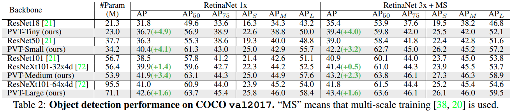

在基于 Mask R-CNN 的实例分割实验中也发现了类似的结果，如表 3 所示。在 1 x的训练schedule下，PVT-Tiny 达到了 35.1 的mask AP（），比 ResNet18 好 3.9 个点（35.1 vs. 31.2）甚至比 ResNet50 高 0.7 个点（35.1 对 34.4）。 PVT-Large 得到的最佳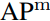为 40.7，比 ResNeXt101-64x4d 高 1.0 个点（40.7 vs. 39.7)，参数减少了 20%。

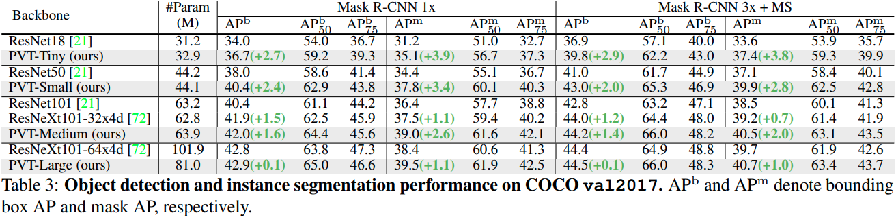

### 5.3 语义分割

**设置**	我们选择 ADE20K [81]，一个具有挑战性的场景解析数据集，来对语义分割的性能进行基准测试。 ADE20K 包含 150 个细粒度语义类别，分别有 20,210、2,000 和 3,352 张图像用于训练、验证和测试。我们基于语义 FPN [31] 评估我们的 PVT backbone，这是一种没有扩张卷积的简单分割方法 [73]。在训练阶段，使用在 ImageNet [11] 上预训练的权重初始化backbone，并使用 Xavier [17] 初始化其他新添加的层。我们使用 AdamW [45] 优化我们的模型，初始学习率为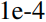。按照惯例 [31, 7]，我们在 4 个 V100 GPU 上以 16 的batch size训练我们的模型进行 80k 次迭代。学习率按照幂为 0.9 的多项式衰减schedule。我们随机调整图像大小并将其裁剪为 512 × 512 进行训练，并在测试期间重新调整为具有 512 像素的较短边。

**结果**	如表 4 所示，当使用 Semantic FPN [31] 进行语义分割时，基于 PVT 的模型始终优于基于 ResNet [21] 或 ResNeXt [72] 的模型。例如，在参数和 GFLOP 数量几乎相同的情况下，我们的 PVT-Tiny/Small/Medium 至少比 ResNet-18/50/101 高 2.8 个点。此外，虽然我们的 PVT-Large 的参数数量和 GFLOPs 比 ResNeXt101-64x4d 低 20%，但 mIoU 仍然高出 1.9 个百分点（42.1 对 40.2）。通过更长的训练时间和多尺度测试，PVT-Large+Semantic FPN 归档了 44.8 的最佳 mIoU，非常接近 ADE20K 基准的 state-of-the-art 性能。请注意，语义 FPN 只是一个简单的分割头。这些结果表明，我们的 PVT backbone可以提取比 CNN backbone更好的语义分割特征，这得益于全局注意机制。

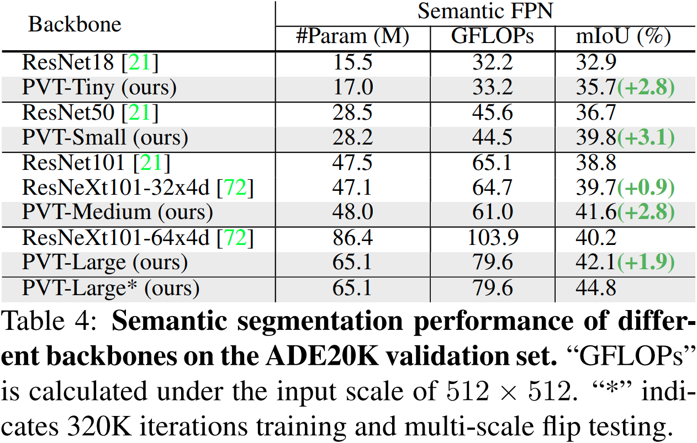

### 5.4 Pure Transformer Object Detection

为了达到无卷积的极限，我们通过简单地将我们的 PVT 与基于 Transformer 的检测头 DETR [5] 相结合，构建了一个用于对象检测的纯 Transformer 管道。我们在 COCO train2017 上训练模型 50 个 epoch，初始学习率为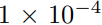。在第 33 个 epoch 时，学习率除以 10。我们使用随机翻转和多尺度训练作为数据增强。所有其他实验设置与第5.2节中的设置相同。如表 5 所示，基于 PVT 的 DETR 在 COCO val2017 上达到 34.7 AP，比原来的基于 ResNet50 的 DETR 高 2.4 个点（34.7 对 32.3)。这些结果证明，纯 Transformer 检测器也可以很好地用于目标检测任务。在 SM 中，我们还尝试使用纯 Transformer 模型 PVT+Trans2Seg [71] 进行语义分割。

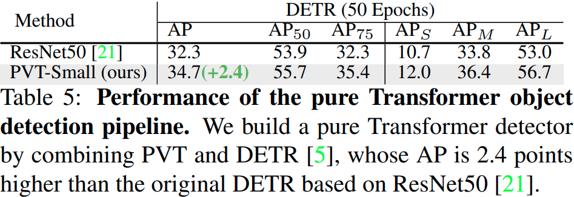

### 5.5 消融实验

**设置**	我们对 ImageNet [11] 和 COCO [39] 数据集进行消融研究。 ImageNet 上的实验设置与 Sec. 5.1中的设置相同。对于 COCO，所有模型都使用 1× 训练schedule（即 12 个 epoch）进行训练，并且没有进行多尺度训练，其他设置遵循 Sec. 5.2。

**金字塔结构**	在将 Transformer 应用于密集预测任务时，金字塔结构至关重要。 ViT（见图1（b））是一个柱状框架，其输出是单尺度的。当使用粗图像patch（例如，每个patch 32×32 像素）作为输入时，这会导致低分辨率输出特征图，从而导致检测性能差（COCO val2017 上的 31.7 AP)(3 为了使 ViT 适应 RetinaNet，我们从 ViT-Small/32 的第 2、4、6 和 8 层提取特征，并将它们插值到不同的尺度)，如表 6 所示。细粒度的图像ptach（例如，每个patch 4×4 像素）作为我们的 PVT 的输入，ViT 将耗尽 GPU 内存（32G）。我们的方法通过渐进式收缩金字塔避免了这个问题。具体来说，我们的模型可以在浅层处理高分辨率特征图，在深层处理低分辨率特征图。因此，它在 COCO val2017 上获得了 40.4 的promising AP，比 ViT-Small/32 高 8.7 个点(40.4 vs. 31.7)。

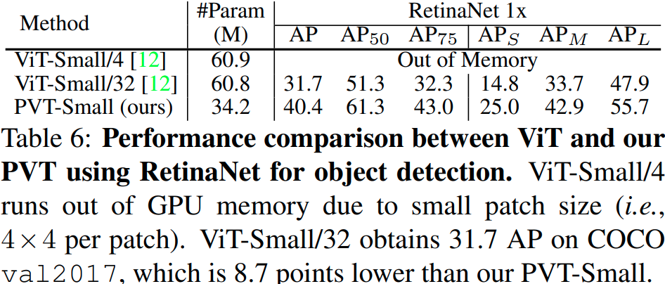

**计算开销**	随着输入规模的增加，我们的 PVT 的 GFLOPs 的增长率大于 ResNet [21]，但低于 ViT [12]，如图 5 所示。然而，当输入规模不超过 640×640 像素时， PVT-Small 和 ResNet50 的 GFLOP 相似。这意味着我们的 PVT 更适合中等分辨率输入的任务。

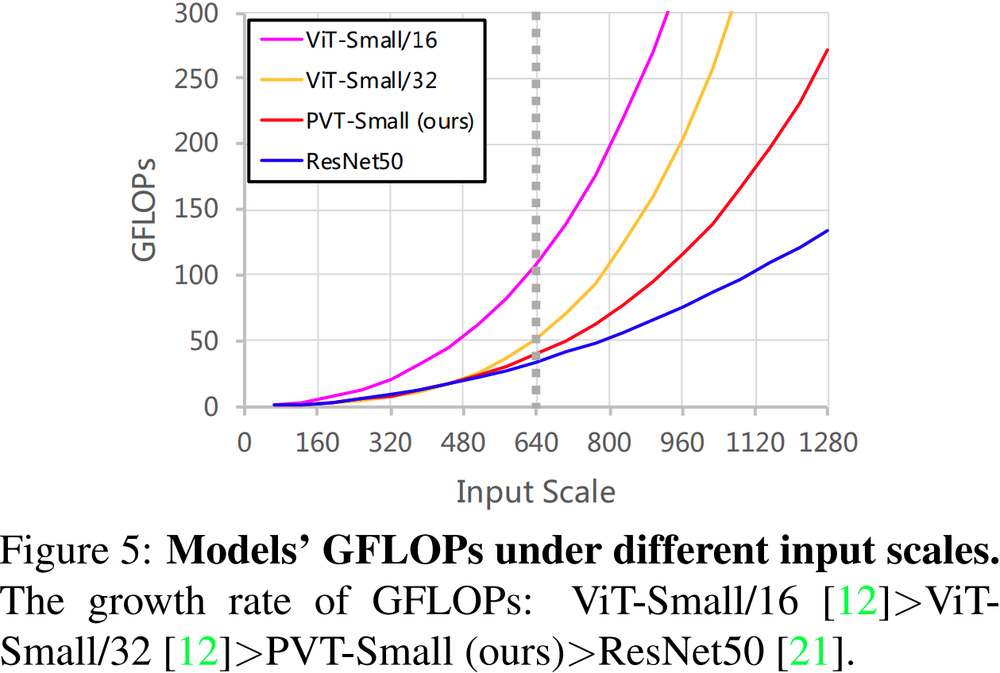

在 COCO 上，输入图像的短边是 800 像素。在这种情况下，基于 PVT-Small 的 RetinaNet 的推理速度比基于 ResNet50 的模型慢。 (1) 直接解决这个问题的方法是减少输入规模。当将输入图像的短边缩小到 640 像素时，基于 PVT-Small 的模型比基于 ResNet50 的模型运行得更快（51.7ms vs., 55.9ms），AP 高出 2.4（38.7 vs. 36.3）。 2）另一种解决方案是开发一个计算复杂度较低的自注意力层。这是一个值得探索的方向，我们最近提出了一个解决方案 PVTv2 [66]。

在 SM 中，我们对 PVT 的其他特征进行更多的定性或定量分析，并提供密集预测任务的可视化结果。

## 6.总结和未来工作

我们介绍了 PVT，这是一种用于密集预测任务的纯 Transformer backbone，例如对象检测和语义分割。我们开发了一个渐进式收缩金字塔和一个空间缩减注意力层，以在有限的计算/内存资源下获得高分辨率和多尺度特征图。对象检测和语义分割基准的大量实验证实，在相当数量的参数下，我们的 PVT 比精心设计的 CNN backbone更强。

尽管 PVT 可以作为 CNN backbone（例如 ResNet、ResNeXt）的替代品，但仍有一些为 CNN 设计的特定模块和操作在本工作中未考虑，例如 SE [22]、SK [35]、扩张卷积[73]、模型修剪 [19] 和 NAS [60]。此外，随着多年的快速发展，已经出现了许多精心设计的 CNN backbone，例如 Res2Net [16]、EfficientNet [60] 和 ResNeSt [77]。相比之下，计算机视觉中基于 Transformer 的模型仍处于早期发展阶段。因此，我们相信未来有许多潜在的技术和应用需要探索（例如，OCR [67, 65, 68]，3D [27, 10, 26] 和医学 [14, 15, 28] 图像分析），并希望 PVT 可以作为一个好的起点。