# Swin Transformer Hierarchical Vision Transformer using Shifted Windows

## 摘要

本文介绍了一种名为 Swin Transformer 的新视觉 Transformer，它能够作为计算机视觉的通用backbone。将 Transformer 从语言到视觉适应的挑战来自两个领域之间的差异，例如视觉entities的规模变化很大，以及与文本中的单词相比，图像中像素的高分辨率。为了解决这些差异，我们提出了一种分层 Transformer，其表示是用 Shifted windows 计算的。移位窗口方案通过将 self-attention 计算限制在不重叠的局部窗口上，同时还允许跨窗口连接，从而带来更高的效率。这种分层架构具有在各种尺度上建模的灵活性，并且具有相对于图像大小的线性计算复杂度。 Swin Transformer 的这些特性使其与广泛的视觉任务兼容，包括图像分类（ImageNet-1K 上 87.3 的 top-1 准确率）和密集预测任务，例如对象检测（COCO test-dev上的 58.7 box AP 和 51.1 mask AP)和语义分割（ADE20K val 为 53.5 mIoU）。它的性能大大超过了之前的最先进结果，在 COCO 上 +2.7 box AP 和 +2.6 mask AP，在 ADE20K 上 +3.2 mIoU，展示了基于 Transformer 的模型作为视觉 backbone的潜力。分层设计和移位窗口方法也证明对全 MLP 架构有益。代码和模型可以公开获得在 https://github.com/microsoft/Swin-Transformer

## 1.引言

长期以来，计算机视觉建模一直由卷积神经网络 (CNN) 主导。从 AlexNet [39] 及其在 ImageNet 图像分类挑战中的革命性表现开始，CNN 架构通过更大规模 [30, 76]、更广泛的连接 [34] 和更复杂的卷积形式 [70, 18, 84]。随着 CNN 作为各种视觉任务的backbone，这些架构上的进步带来了性能改进，从而广泛提升了整个领域。

另一方面，自然语言处理 (NLP) 中网络架构的演变采取了不同的路径，如今流行的架构是 Transformer [64]。 Transformer 专为序列建模和转导任务而设计，以其使用注意力来建模数据中的长期依赖关系而著称。它在语言领域的巨大成功促使研究人员研究它对计算机视觉的适应性，最近它在某些任务上展示了有希望的结果，特别是图像分类 [20] 和联合视觉语言建模 [47]。

在本文中，我们寻求扩展 Transformer 的适用性，使其可以作为计算机视觉的通用backbone，就像它对 NLP 和 CNN 在视觉中所做的那样。我们观察到，将其在语言领域的高性能转移到视觉领域的重大挑战可以通过两种模式之间的差异来解释。这些差异之一涉及规模。与用作语言Transformer中处理的基本元素的词token不同，视觉元素的规模可能会有很大差异，这是在对象检测等任务中受到关注的问题 [42,53,54]。在现有的基于 Transformer 的模型 [64, 20] 中，token都是固定比例的，这是不适合这些视觉应用的属性。另一个区别是与文本段落中的单词相比，图像中像素的分辨率要高得多。存在许多视觉任务，例如语义分割，需要在像素级别进行密集预测，这对于 Transformer 在高分辨率图像上的处理来说是很困难的，因为其自注意力的计算复杂度与图像大小成二次方。为了克服这些问题，我们提出了一个通用的 Transformer backbone，称为 Swin Transformer，它构建了分层特征图，并且对图像大小具有线性计算复杂度。如图 1(a) 所示，Swin Transformer 通过从小尺寸的patch（灰色轮廓）开始并逐渐合并更深的 Transformer 层中的相邻patch来构建分层表示。借助这些分层特征图，Swin Transformer 模型可以方便地利用高级技术进行密集预测，例如特征金字塔网络 (FPN) [42] 或 U-Net [51]。线性计算复杂度是通过在分割图像的非重叠窗口中局部计算自注意力来实现的（红色轮廓）。每个窗口中的patch数量是固定的，因此复杂度与图像大小成线性关系。这些优点使 Swin Transformer 适合作为各种视觉任务的通用backbone，与以前基于 Transformer 的架构 [20] 形成对比，后者产生单一分辨率的特征图并具有二次复杂度。

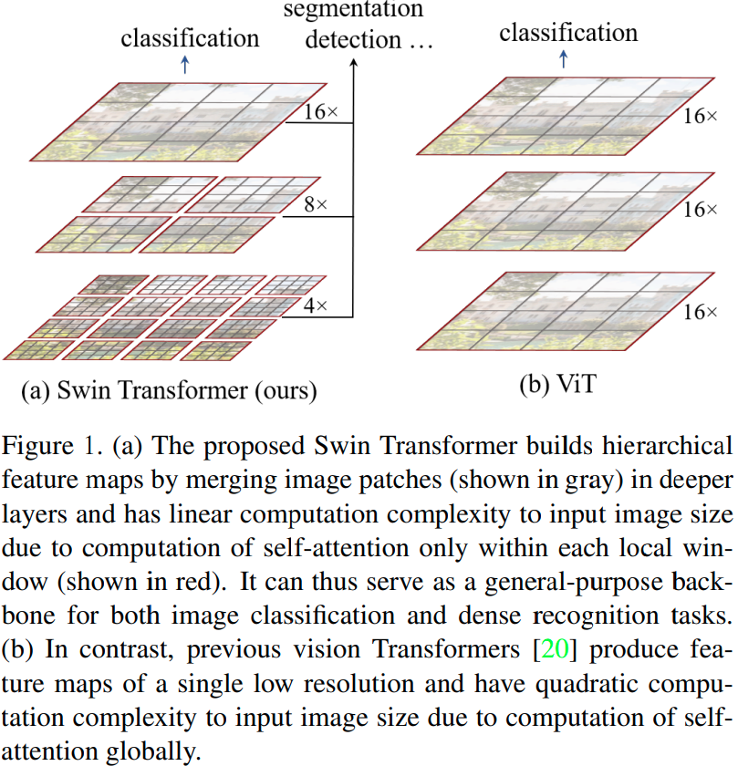

Swin Transformer 的一个关键设计元素是它在连续的 self-attention 层之间移动窗口分区，如图 2 所示。移动的窗口桥接前一层的窗口，提供它们之间的连接，从而显着增强建模能力（见表4）。这种策略在实际延迟方面也很有效：一个窗口内的所有query patch共享相同的key set(1.query和key是自注意力层中的投影向量)，这有助于硬件中的内存访问。相比之下，早期基于滑动窗口的自注意力方法 [33, 50] 由于不同查query像素的不同key set而在通用硬件上存在低延迟(2.虽然有一些有效的方法可以在通用硬件上实现基于滑动窗口的卷积层，但由于其在特征映射中共享内核权重，基于滑动窗口的自注意力层在实践中很难进行有效的内存访问)。我们的实验表明，所提出的移位窗口方法的延迟比滑动窗口方法低得多，但建模能力相似（见表 5 和表 6）。移位窗口方法也证明对全 MLP 架构有益[61]。

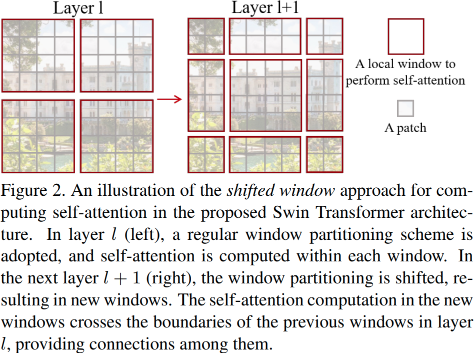

所提出的 Swin Transformer 在图像分类、目标检测和语义分割的识别任务上取得了强大的性能。它显著优于 ViT / DeiT [20, 63] 和 ResNe(X)t 模型 [30, 70]，在三个任务上具有相似的延迟。它在 COCO 测试开发集上的 58.7 box AP 和 51.1 mask AP 通过 +2.7 box AP（没有外部数据的复制粘贴 [26]）和 +2.6 mask AP（DetectoRS [ 46]）。在 ADE20K 语义分割上，它在 val 集上获得了 53.5 mIoU，比之前的最新技术（SETR [81]）提高了 +3.2 mIoU。它还在 ImageNet-1K 图像分类上实现了 87.3% 的 top-1 准确率

我们相信，跨计算机视觉和自然语言处理的统一架构可以使这两个领域受益，因为它将促进视觉和文本信号的联合建模，并且可以更深入地共享来自两个领域的建模知识。我们希望 Swin Transformer 在各种视觉问题上的出色表现能够在社区中更深入地推动这种信念，并鼓励视觉和语言信号的统一建模。

## 2.相关工作

**CNN和变体**	CNN 在整个计算机视觉中充当标准网络模型。虽然 CNN 已经存在了几十年 [40]，但直到 AlexNet [39] 的引入，CNN 才起飞并成为主流。从那时起，人们提出了更深入、更有效的卷积神经架构来进一步推动计算机视觉中的深度学习浪潮，例如 VGG [52]、GoogleNet [57]、ResNet [30]、DenseNet [34]、HRNet [65]和 EfficientNet [58]。除了这些架构上的进步之外，在改进单个卷积层方面也有很多工作，例如深度卷积 [70] 和可变形卷积 [18, 84]。虽然 CNN 及其变体仍然是计算机视觉应用的主要backbone，但我们强调了类似 Transformer 的架构在视觉和语言之间统一建模的巨大潜力。我们的工作在几个基本的视觉识别任务上取得了出色的表现，我们希望它有助于建模转变。

**基于自注意力的backbone架构**	同样受到 NLP 领域中自注意力层和 Transformer 架构成功的启发，一些工作使用自注意力层来替换流行的 ResNet [33、50、80] 中的部分或全部空间卷积层。在这些工作中，自注意力是在每个像素的局部窗口内计算以加速优化 [33]，并且它们比对应的 ResNet 架构实现了稍微更好的准确率/FLOPs 权衡。然而，它们昂贵的内存访问导致它们的实际延迟明显大于卷积网络的延迟[33]。我们建议在连续层之间移动窗口，而不是使用滑动窗口，这允许在通用硬件中更有效地实现

**自注意力/Transformer 补充 CNNs**	另一项工作是使用自注意力层或 Transformer 来增强标准 CNN 架构。自注意力层可以通过提供编码远距离依赖或异构交互的能力来补充backbone[67、7、3、71、23、74、55]或头部网络[32、27]。最近，Transformer 中的编码器-解码器设计已应用于对象检测和实例分割任务 [8、13、85、56]。我们的工作探索了Transformer对基本视觉特征提取的适应，并与这些工作相辅相成。

**基于Transformer的视觉backbone**	

与我们的工作最相关的是 Vision Transformer (ViT) [20] 及其后续工作 [63, 72, 15, 28, 66]。 ViT 的开创性工作直接将 Transformer 架构应用于不重叠的中型图像patch上进行图像分类。与卷积网络相比，它在图像分类上实现了令人印象深刻的速度-准确度权衡。虽然 ViT 需要大规模的训练数据集（即 JFT-300M）才能表现良好，但 DeiT [63] 引入了几种训练策略，使 ViT 也可以有效地使用较小的 ImageNet-1K 数据集。 ViT 在图像分类上的结果令人鼓舞，但其架构不适合用作密集视觉任务或输入图像分辨率较高时的通用backbone，因为其特征图分辨率低且在图像大小的复杂性。有一些工作通过直接上采样或反卷积将 ViT 模型应用于对象检测和语义分割的密集视觉任务，但性能相对较低 [2, 81]。与我们的工作同时进行的是一些修改 ViT 架构 [72, 15, 28] 以获得更好的图像分类。根据经验，我们发现我们的 Swin Transformer 架构可以在这些图像分类方法中实现最佳速度精度权衡，尽管我们的工作侧重于通用性能而不是专门用于分类。另一项并行工作 [66] 探索了类似的思路，以在 Transformer 上构建多分辨率特征图。它的复杂性仍然是图像大小的二次方，而我们的复杂性是线性的并且也在局部运行，这已被证明有利于对视觉信号中的高相关性进行建模 [36、25、41]。我们的方法既高效又有效，在 COCO 对象检测和 ADE20K 语义分割方面都达到了最先进的准确性。

## 3.方法

### 3.1 整体架构

图 3 展示了 Swin Transformer 架构的概述，该图说明了微型版本 (Swin-T)。它首先通过像 ViT 这样的patch分割模块将输入的 RGB 图像分割成不重叠的patch。每个patch都被视为一个“token”，其特征被设置为原始像素 RGB 值的连接。在我们的实现中，我们使用 4 × 4 的patch大小，因此每个patch的特征维度为 4 × 4 × 3 = 48。线性embedding层应用于这个原始值特征，以将其投影到任意维度（记为 C)。

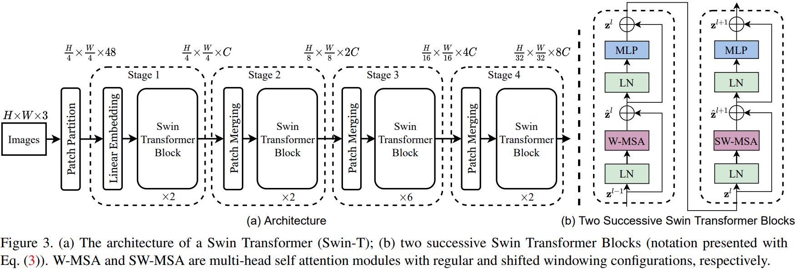

在这些patch token上应用了几个具有改进的自注意力计算的 Transformer 块（Swin Transformer 块）。 Transformer 块保持token的数量（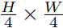)，并与线性embedding一起被称为“阶段 1”。

为了产生分层表示，随着网络变得更深，通过patch合并层减少token的数量。第一个patch合并层连接每组 2×2 相邻patch的特征，并在 4C 维连接特征上应用线性层。这将token数量减少了 2×2 = 4 的倍数（2× 分辨率下采样），并且输出维度设置为 2C。之后应用 Swin Transformer 块进行特征变换，分辨率保持在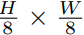。第一个块合并和特征转换被称为“阶段 2”。该过程重复两次，分别为“Stage 3”和“Stage 4”，输出分辨率分别为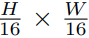和 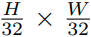。这些阶段共同产生分层表示，具有与典型卷积网络相同的特征图分辨率，例如 VGG [52] 和 ResNet [30]。因此，所提出的架构可以方便地替换现有方法中的backbone，用于各种视觉任务。

**Swin Transformer block**	Swin Transformer 是通过将 Transformer 块中的标准多头自注意力 (MSA) 模块替换为基于移位窗口的模块（在第 3.2 节中描述）而构建的，其他层保持不变。如图 3(b) 所示，一个 Swin Transformer 模块由一个基于移动窗口的 MSA 模块组成，然后是一个 2 层 MLP，其间具有 GELU 非线性。在每个 MSA 模块和每个 MLP 之前应用一个 LayerNorm (LN) 层，在每个模块之后应用一个残差连接。

### 3.2 基于移位窗口的自注意力

标准的 Transformer 架构 [64] 及其对图像分类的适应 [20] 都进行全局自我注意，其中计算了一个token和所有其他token之间的关系。全局计算导致token数量的二次复杂度，使其不适用于许多需要大量token集进行密集预测或表示高分辨率图像的视觉问题。

**非重叠窗口中的自注意力**	为了高效建模，我们建议在局部窗口内计算自注意力。窗口被布置成以不重叠的方式均匀地划分图像。假设每个窗口包含 M × M 个patch，全局 MSA 模块和基于 h × w 个patch图像的窗口的计算复杂度为(3.我们在确定复杂度时省略了 SoftMax 计算)：

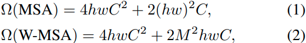

其中，前者是patch编号 hw 的二次方，后者在 M 固定时是线性的（默认设置为 7）。全局自注意力计算通常对于大hw来说是负担不起的，而基于窗口的自注意力是可扩展的。

**连续块中的移动窗口**	基于窗口的自注意力模块缺乏跨窗口的连接，这限制了它的建模能力。为了在保持非重叠窗口的有效计算的同时引入跨窗口连接，我们提出了一种移位窗口分区方法，该方法在连续 Swin Transformer 块中的两个分区配置之间交替。

如图 2 所示，第一个模块使用从左上角像素开始的常规窗口划分策略，将 8 × 8 特征图均匀划分为大小为 4 × 4 (M = 4)个patch的 2 × 2 窗口。然后，下一个模块采用与前一层不同的窗口配置，通过将窗口从规则分区的窗口中移动个像素。

使用移位窗口分割方法，连续的 Swin Transformer 块计算为

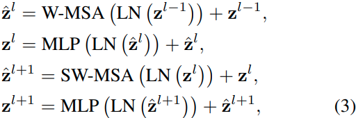

其中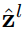和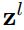分别表示块l的 (S)W-MSA 模块和 MLP 模块的输出特征； W-MSA 和 SW-MSA 分别表示使用常规和移位窗口分区配置的基于窗口的多头自注意。

移位窗口分割方法在前一层中引入了相邻非重叠窗口之间的连接，并被发现在图像分类、目标检测和语义分割中是有效的，如表 4 所示。

**Efficient batch computation for shifted configuration**	

移位窗口分区的一个问题是它会导致更多窗口，从移位配置中的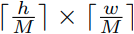到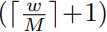，并且一些窗口将小于 M × M(4.为了使窗口大小 (M, M) 可被 (h, w) 的特征图大小整除，如果需要，在特征图上使用右下角填充)。一个简单的解决方案是将较小的窗口填充到 M × M 的大小，并在计算注意力时mask掉填充的值。当常规分区中的窗口数量较少时，例如2 × 2，使用这种简单的解决方案增加的计算量是相当大的（2 × 2 → 3 × 3，是 2.25 倍)。在这里，我们通过向左上方向循环移位提出了一种更有效的batch处理计算方法，如图 4 所示。在这种移位之后，batch处理窗口可能由几个在特征图中不相邻的子窗口组成，因此采用mask机制将自注意力计算限制在每个子窗口内。使用循环移位，batch处理窗口的数量与常规窗口分区的数量相同，因此也是有效的。这种方法的低延迟如表 5 所示。

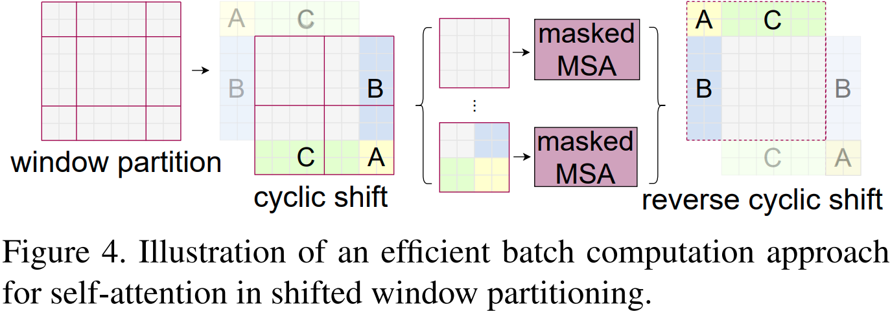

**Relative position bias**	在计算 self-attention 时，我们遵循 [49, 1, 32, 33]，在计算相似度时为每个头部包含一个相对位置偏差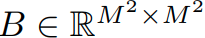：

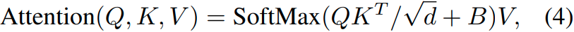

其中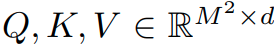是query、key和value矩阵； d 是querty/key维度，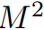是窗口中的patch数。由于沿每个轴的相对位置位于 [-M + 1, M -1] 范围内，我们参数化一个较小尺寸的偏置矩阵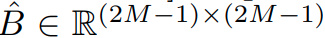，并且值在B取自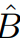。

我们观察到与没有此偏差项或使用绝对pos embedding的对应项相比有显着改进，如表 4 所示。如 [20] 中进一步向输入添加绝对pos embedding会略微降低性能，因此在我们的实现中未采用它。

在预训练中学习到的相对位置偏差也可用于通过双三次插值 [20, 63] 初始化模型以使用不同的窗口大小进行微调。

### 3.3 架构变体

我们构建了我们的基础模型，称为 Swin-B，具有类似于 ViT-B/DeiT-B 的模型大小和计算复杂度。我们还介绍了 Swin-T、Swin-S 和 Swin-L，它们分别是模型大小和计算复杂度的 0.25 倍、0.5 倍和 2 倍的版本。请注意，Swin-T 和 Swin-S 的复杂度分别类似于 ResNet-50 (DeiT-S) 和 ResNet-101。默认情况下，窗口大小设置为 M = 7。对于所有实验，每个头部的query维度为 d = 32，每个 MLP 的扩展层为 α = 4。这些模型变体的架构超参数是：

其中C是第一阶段隐藏层的通道数。表 1 列出了 ImageNet 图像分类模型变体的模型大小、理论计算复杂度 (FLOP) 和吞吐量。

## 4.实验

我们对 ImageNet-1K 图像分类 [19]、COCO 对象检测 [43] 和 ADE20K 语义分割 [83] 进行了实验。在下文中，我们首先将提出的 Swin Transformer 架构与之前在三个任务上的最新技术进行比较。然后，我们消融了 Swin Transformer 的重要设计元素。

### 4.1 在ImageNet-1K上的图像分类

**设置**	对于图像分类，我们在 ImageNet-1K [19] 上对提议的 Swin Transformer 进行基准测试，其中包含来自 1,000 个类别的 128 万张训练图像和 5 万张验证图像。报告了单个作物的 top-1 准确度。我们考虑两种训练设置：

常规 ImageNet-1K 训练。此设置主要遵循 [63]。我们使用了一个 AdamW [37] 优化器，使用余弦衰减学习率调度器和 20 个线性warm-up的 epoch 进行 300 个 epoch。使用 1024 的batch size、0.001 的初始学习率和 0.05 的权重衰减。我们在训练中包含了 [63] 的大部分增强和正则化策略，除了重复增强 [31] 和 EMA [45]，它们不会提高性能。请注意，这与 [63] 中的重复增强对于稳定 ViT 的训练至关重要。

ImageNet-22K 上的预训练和 ImageNet-1K 上的微调。我们还在更大的 ImageNet-22K 数据集上进行了预训练，该数据集包含 1420 万张图像和 22K 类。我们使用具有 5 个 epoch 线性warm-up的线性衰减学习率scheduler使用 AdamW 优化器 90 个 epoch。使用 4096 的batch size、0.001 的初始学习率和 0.01 的权重衰减。在 ImageNet-1K 微调中，我们以 1024 的batch size、的恒定学习率和的权重衰减来训练模型 30 个 epoch。

**常规ImageNet-1K的训练结果**	表 1(a) 展示了使用常规 ImageNet-1K 训练与其他backbone网络的比较，包括基于 Transformer 和基于 ConvNet 的。

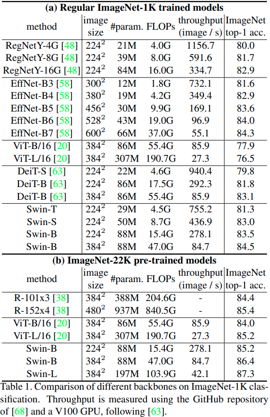

与之前最先进的基于 Transformer 的架构相比，即 DeiT [63]，Swin Transformers 明显优于具有相似复杂性的对应 DeiT 架构：Swin-T (81.3%) 比 DeiT-S (79.8%) + 1.5%在使用 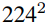输入下，Swin-B (83.3%/84.5%) 比 DeiT-B (81.8%/83.1%)在 使用 2242 /3842 输入下分别增加 1.5%/1.4%。

与最先进的 ConvNets，即 RegNet [48] 和 EfficientNet [58] 相比，Swin Transformer 实现了更好的速度-准确度权衡。注意到虽然 RegNet [48] 和 EfficientNet [58] 是通过彻底的架构搜索获得的，但所提出的 Swin Transformer 是从标准 Transformer 改编而来的，并且具有进一步改进的巨大潜力。

**ImageNet-22K预训练结果**	我们还在 ImageNet-22K 上预训练了更大容量的 Swin-B 和 Swin-L。 ImageNet-1K 图像分类的微调结果如表 1(b) 所示。对于 Swin-B，ImageNet-22K 预训练比从头开始训练 ImageNet-1K 带来 1.8%∼1.9% 的收益。与之前 ImageNet-22K 预训练的最佳结果相比，我们的模型实现了显着更好的速度-准确度权衡：Swin-B 获得 86.4% 的 top-1 准确度，比具有相似推理吞吐量的 ViT 高 2.4% （84.7 对 85.9 图像/秒）和略低的 FLOP（47.0G 对 55.4G）。较大的 Swin-L 模型实现了 87.3% 的 top-1 准确率，比 Swin-B 模型高 0.9%。

### 4.2 在COCO上的目标检测

**设置**	对象检测和实例分割实验在 COCO 2017 上进行，其中包含 118K 训练、5K 验证和 20K 测试开发图像。使用验证集执行消融研究，并在 test-dev 上报告系统级比较。对于消融研究，我们考虑了四种典型的对象检测框架：Cascade Mask R-CNN [29, 6]、ATSS [79]、RepPoints v2 [12] 和 mmdetection [10] 中的 Sparse RCNN [56]。对于这四个框架，我们使用相同的设置：多尺度训练 [8, 56]（调整输入大小，使短边在 480 到 800 之间，而长边最多为 1333），AdamW [44] 优化器（初始学习率为 0.0001，权重衰减为 0.05，batch size为 16）和 3x schedule（36 个 epoch）。对于系统级比较，我们采用改进的 HTC [9]（表示为 HTC++），具有 instaboost [22]、更强的多尺度训练 [7]、6x schedule（72 epochs）、soft-NMS [5] 和 ImageNet -22K 预训练模型作为初始化。

我们将我们的 Swin Transformer 与标准 ConvNet（即 ResNe(X)t）和之前的 Transformer 网络（例如DeiT。比较是通过仅更改backbone而其他设置不变来进行的。请注意，虽然 Swin Transformer 和 ResNe(X)t 由于它们的分层特征图而直接适用于上述所有框架，但 DeiT 仅产生单一分辨率的特征图，不能直接应用。为了公平比较，我们按照 [81] 使用反卷积层为 DeiT 构建分层特征图

**与ResNe(X)t比较**	表 2(a) 列出了 Swin-T 和 ResNet-50 在四个目标检测框架上的结果。我们的 Swin-T 架构比 ResNet-50 带来了一致的 +3.4∼4.2 框 AP 增益，模型尺寸、FLOP 和延迟稍大

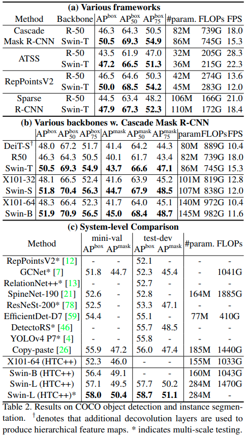

表 2(b) 比较了使用 Cascade Mask R-CNN 在不同模型容量下的 Swin Transformer 和 ResNe(X)t。 Swin Transformer 实现了 51.9 box AP 和 45.0 mask AP 的高检测精度，与 ResNeXt101-64x4d 相比，这是 +3.6 box AP 和 +3.3 mask AP 的显著增益，ResNeXt101-64x4d 具有相似的模型大小、FLOPs 和延迟。在使用改进的 HTC 框架的 52.3 box AP 和 46.0 mask AP 的更高基线上，Swin Transformer 的增益也很高，分别为 +4.1 box AP 和 +3.1 mask AP（参见表 2(c)）。关于推理速度，ResNe(X)t 是由高度优化的 Cudnn 函数构建的，而我们的架构是使用并非全部优化的内置 PyTorch 函数实现的。彻底的内核优化超出了本文的范围。

**与DeiT比较**	使用 Cascade Mask R-CNN 框架的 DeiT-S 的性能如表 2(b) 所示。 Swin-T 的结果是 +2.5 box AP 和 +2.3 mask AP 比具有相似模型大小（86M 对 80M）和显着更高的推理速度（15.3 FPS 对 10.4 FPS）的 DeiT-S 高。 DeiT 较低的推理速度主要是由于其对输入图像大小的二次复杂度。

**与以前的最先进技术比较**	表 2(c) 将我们的最佳结果与之前最先进模型的结果进行了比较。我们的最佳模型在 COCO test-dev 上实现了 58.7 box AP 和 51.1 mask AP，超过了之前的最佳结果 +2.7 box AP（没有外部数据的复制粘贴 [26]）和 +2.6 mask AP（DetectoRS [46]）。

### 4.3 在ADE20K上的语义分割

**设置**	ADE20K [83] 是一个广泛使用的语义分割数据集，涵盖了广泛的 150 个语义类别。它总共有 25K 图像，其中 20K 用于训练，2K 用于验证，另外 3K 用于测试。我们利用 mmseg [16] 中的 UperNet [69] 作为我们高效的基础框架。附录中提供了更多详细信息。

**结果**	表 3 列出了不同方法/backbone对的 mIoU、模型大小 (#param)、FLOP 和 FPS。从这些结果可以看出，在计算成本相似的情况下，Swin-S 比 DeiT-S 高 +5.3 mIoU（49.3 对 44.0）。它也比 ResNet-101 高 +4.4 mIoU，比 ResNeSt-101 [78] 高 +2.4 mIoU。我们的带有 ImageNet-22K 预训练的 Swin-L 模型在 val 集上达到了 53.5 mIoU，超过了之前的最佳模型 +3.2 mIoU（SETR [81] 为 50.3 mIoU，具有更大的模型尺寸）。

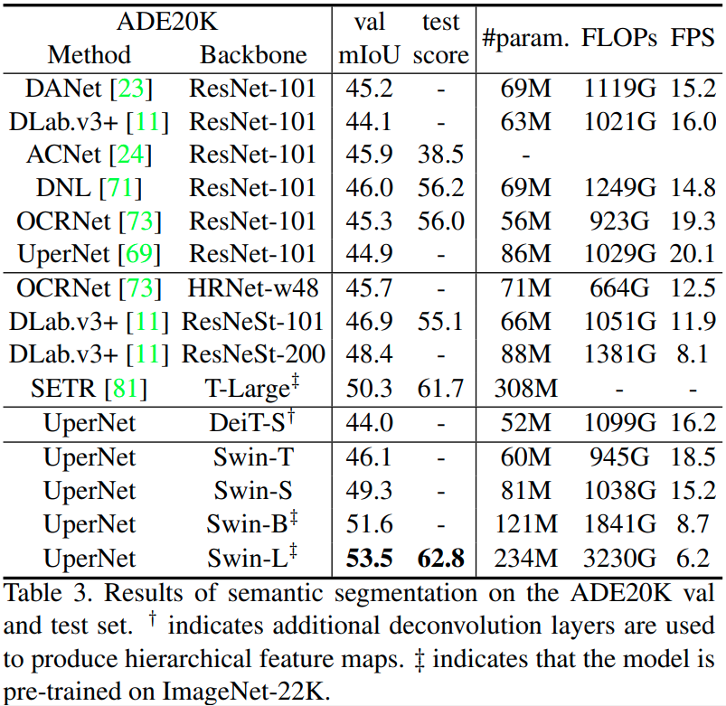

### 4.4 消融研究

在本节中，我们使用 ImageNet-1K 图像分类、COCO 对象检测上的 Cascade Mask R-CNN 和 ADE20K 语义分割上的 UperNet 消融了 Swin Transformer 中的重要设计元素。

**移位窗口**	表 4 报告了在三个任务上的移位窗口方法的消融。在 ImageNet-1K 上，具有移位窗口分区的 Swin-T 在每个阶段都优于基于单个窗口分区的对应方法 + 1.1% 的 top-1 精度，+ COCO上2.8 box AP/+2.2 mask AP，ADE20K上+2.8 mIoU。结果表明使用移位窗口在前几层的窗口之间建立连接的有效性。移位窗口的延迟开销也很小，如表 5 所示。

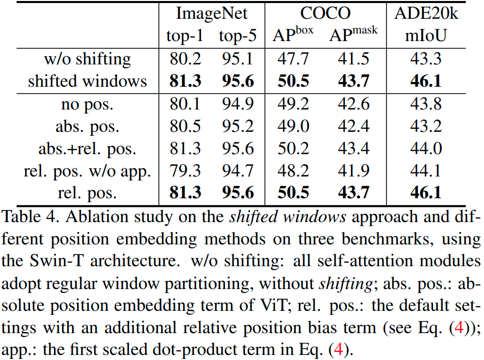

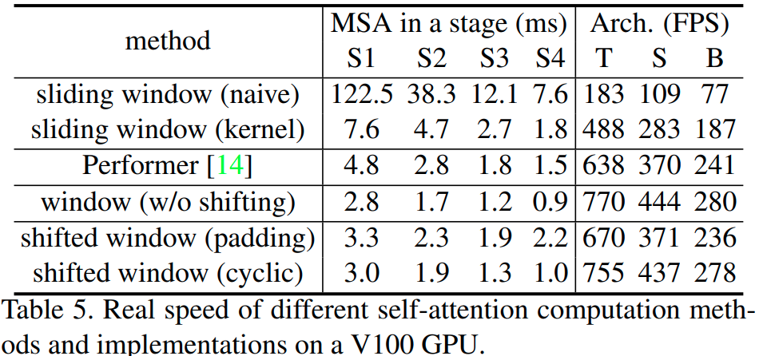

**相对位置偏差**	表 4 显示了不同position embedding方法的比较。具有相对位置偏差的 Swin-T 在 ImageNet-1K 上产生 +1.2%/+0.8% top-1 准确度，在 COCO 上产生 +1.3/+1.5 box AP 和 +1.1/+1.3 mask AP，在 +2.3/+2.9 mIoU 上ADE20K 与没有position embedding和绝对position embedding的那些分别相关，表明相对位置偏差的有效性。另请注意，虽然包含绝对位position embedding提高了图像分类精度（+0.4%），但它损害了对象检测和语义分割（COCO 上的-0.2 box/mask AP 和 ADE20K 上的 -0.6 mIoU）。

尽管最近的 ViT/DeiT 模型在图像分类中放弃了平移不变性，尽管它长期以来被证明对视觉建模至关重要，但我们发现鼓励某些平移不变性的归纳偏差对于通用视觉建模仍然是可取的，特别是对于目标检测和语义分割的密集预测任务。

**不同自注意力方法**	不同自注意力计算方法和实现的实际速度在表 5 中进行了比较。我们的循环实现比朴素填充更具有硬件效率，特别是对于更深的阶段。总体而言，它分别为 Swin-T、Swin-S 和 Swin-B 带来了 13%、18% 和 18% 的加速。

基于所提出的移位窗口方法构建的自注意力模块比在朴素/内核实现中的滑动窗口效率高 40.8×/2.5×、20.2×/2.5×、9.3×/2.1× 和 7.6×/1.8×四个网络阶段，分别。总体而言，基于移位窗口构建的 Swin Transformer 架构分别比构建在 Swin-T、Swin-S 和 Swin-B 滑动窗口上的变体快 4.1/1.5、4.0/1.5、3.6/1.5 倍。表 6 比较了它们在三个任务上的准确度，表明它们在视觉建模方面同样准确。

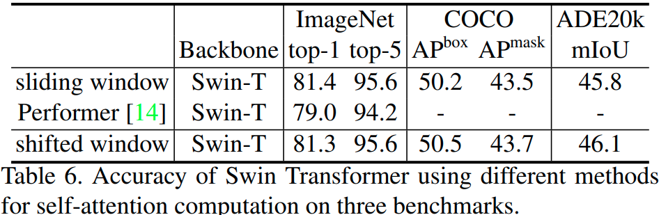

与最快的 Transformer 架构之一的 Performer [14] 相比（参见 [60]），所提出的基于移位窗口的自注意力计算和整体 Swin Transformer 架构略快（参见表 5），同时达到 +2.3与使用 Swin-T 的 ImageNet-1K 上的 Performer 相比，top-1 准确率百分比（参见表 6）。

## 5.结论

本文介绍了 Swin Transformer，这是一种新的视觉 Transformer，它产生分层特征表示，并且相对于输入图像大小具有线性计算复杂度。 Swin Transformer 在 COCO 对象检测和 ADE20K 语义分割方面实现了最先进的性能，显着超越了以前的最佳方法。我们希望 Swin Transformer 在各种视觉问题上的强大表现将鼓励视觉和语言信号的统一建模。

作为 Swin Transformer 的一个关键元素，基于移位窗口的自我注意在视觉问题上被证明是有效和高效的，我们也期待研究其在自然语言处理中的应用。

## A1.Detailed Architectures

详细的架构规范如表 7 所示，其中假设所有架构的输入图像大小为 224×224。 “Concat n × n”表示patch中 n × n 个相邻特征的连接。此操作导致特征图以 n 的速率下采样。 “96-d”表示输出维度为96的线性层。 sz 7 × 7” 表示窗口大小为 7 × 7 的多头自注意力模块。

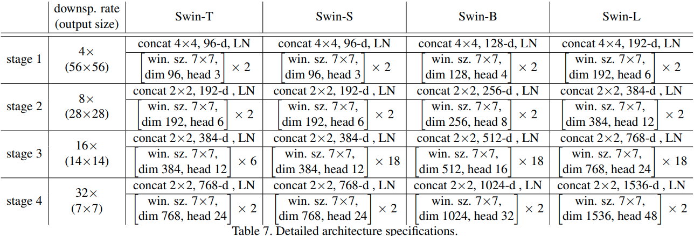

## A2.Detailed Experimental Settings

### A2.1 Image classification on ImageNet-1K

图像分类是通过在最后阶段的输出特征图上应用全局平均池化层，然后是线性分类器来执行的。我们发现这种策略与在 ViT [20] 和 DeiT [63] 中使用额外的类token一样准确。在评估中，报告了使用单个作物的 top-1 准确度。

**Regular ImageNet-1K training**	训练设置大多遵循 [63]。对于所有模型变体，我们采用默认输入图像分辨率。对于等其他分辨率，我们对以分辨率训练的模型进行微调，而不是从头开始训练，以减少 GPU 消耗。

当使用输入从头开始训练时，我们使用了一个 AdamW [37] 优化器，使用带有 20 个线性warm-up阶段的余弦衰减学习率scheuler进行 300 个 epoch。使用 1024 的batch size、0.001 的初始学习率、0.05 的权重衰减和最大范数为 1 的梯度裁剪。我们在训练中包含了 [63] 的大部分增强和正则化策略，包括 RandAugment [17]、Mixup [77]、Cutmix [75]、随机擦除 [82] 和随机深度 [35]，但不包括重复增强 [31] ] 和指数移动平均线 (EMA) [45]，它们不会提高性能。请注意，这与 [63] 中的重复增强对于稳定 ViT 的训练至关重要。对于较大的模型，随机深度增加的程度越来越高，即 Swin-T、Swin-S 和 Swin-B 分别为 0.2、0.3、0.5。

为了对更高分辨率的输入进行微调，我们使用 adamW [37] 优化器进行 30 个 epoch，恒定学习率为 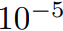，权重衰减为，以及与第一个相同的数据增强和正则化阶段，除了将随机深度比设置为 0.1。

**ImageNet-22k pre-training**	我们还在更大的 ImageNet-22K 数据集上进行了预训练，该数据集包含 1420 万张图像和 22K 类。培训分两个阶段进行。对于具有输入的第一阶段，我们使用具有 5 个 epoch 线性warm-up的线性衰减学习率scheduler使用 AdamW 优化器 90 个 epoch。使用 4096 的batch size、0.001 的初始学习率和 0.01 的权重衰减。在具有  /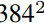 输入的 ImageNet-1K 微调的第二阶段，我们以 1024 的batch size、 的恒定学习率和 的权重衰减来训练模型 30 个 epoch。

### A2.2 Object dtection on COCO

对于消融研究，我们考虑了四个典型的对象检测框架：Cascade Mask R-CNN [29, 6]、ATSS [79]、RepPoints v2 [12] 和 mmdetection [10] 中的 Sparse RCNN [56]。对于这四个框架，我们使用相同的设置：多尺度训练 [8, 56]（调整输入大小，使短边在 480 到 800 之间，而长边最多为 1333），AdamW [44] 优化器（初始学习率为 0.0001，权重衰减为 0.05，batch size为 16）和 3x schedule（36 个 epoch，学习率在 epoch 27 和 33 衰减 10x）。

对于系统级比较，我们采用了改进的 HTC [9]（表示为 HTC++），具有 instaboost [22]、更强的多尺度训练 [7]（调整输入大小，使较短的边在 400 到 1400 之间，而较长的边side 最多为 1600），6x schedule（72 个 epoch，学习率在 epoch 63 和 69 衰减 0.1 倍），soft-NMS [5]，以及附加在最后一个输出的额外全局自我注意层阶段和 ImageNet-22K 预训练模型作为初始化。我们对所有 Swin Transformer 模型采用比率为 0.2 的随机深度。

### A2.3 Semantic segmentation onAED20K

ADE20K [83] 是一个广泛使用的语义分割数据集，涵盖了广泛的 150 个语义类别。它总共有 25K 图像，其中 20K 用于训练，2K 用于验证，另外 3K 用于测试。我们利用 mmsegmentation [16] 中的 UperNet [69] 作为我们高效的基础框架。

在训练中，我们使用 AdamW [44] 优化器，初始学习率为 6 × 10−5，权重衰减为 0.01，scheduler使用线性学习率衰减，线性warmup 1,500 次迭代。模型在 8 个 GPU 上训练，每个 GPU 有 2 个图像，进行 16 万次迭代。对于增强，我们采用随机水平翻转的 mmsegmentation、比率范围 [0.5, 2.0] 内的随机重新缩放和随机光度失真的默认设置。比率为 0.2 的随机深度适用于所有 Swin Transformer 模型。 Swin-T、Swin-S 在标准设置上进行训练，与之前的方法一样，输入为 512×512。带‡的 Swin-B 和 Swin-L 表示这两个模型是在 ImageNet-22K 上预训练的，并使用 640×640 的输入进行训练。

在推理中，采用了多尺度测试，使用的分辨率是训练中分辨率的 [0.5, 0.75, 1.0, 1.25, 1.5, 1.75]×。在报告测试分数时，训练图像和验证图像都用于训练，遵循惯例[71]。

## A3. More Experiments

### A3.1 Image classification with different input size

表 8 列出了从 到  不同输入图像大小的 Swin Transformers 的性能。通常，较大的输入分辨率会导致更好的 top-1 准确度，但推理速度较慢。

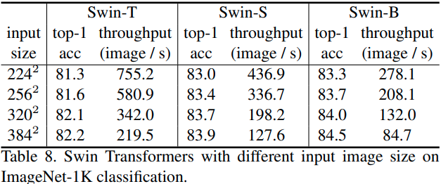

### A3.2 Different Optimizers for ResNe(X)t on COCO

表 9 比较了 ResNe(X)t backbone的 AdamW 和 SGD 优化器在 COCO 对象检测上的效果。在此比较中使用了 Cascade Mask R-CNN 框架。虽然 SGD 被用作 Cascade Mask R-CNN 框架的默认优化器，但我们通常观察到通过用 AdamW 优化器替换它来提高准确性，特别是对于较小的backbone。因此，与提出的 Swin Transformer 架构相比，我们将 AdamW 用于 ResNe(X)t backbone。

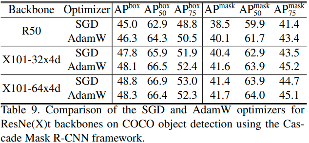

### A3.3 Swin MLP-Mixer

我们将提出的分层设计和移位窗口方法应用于 MLP-Mixer 架构 [61]，称为 Swin-Mixer。表 10 显示了 Swin-Mixer 与原始 MLP-Mixer 架构 MLP-Mixer [61] 和后续方法 ResMLP [61] 相比的性能。 Swin-Mixer 的性能明显优于 MLP-Mixer（81.3% 对 76.4%），使用略小的计算预算（10.4G 对 12.7G）。与 ResMLP [62] 相比，它还具有更好的速度精度权衡。这些结果表明所提出的分层设计和移位窗口方法是可推广的。

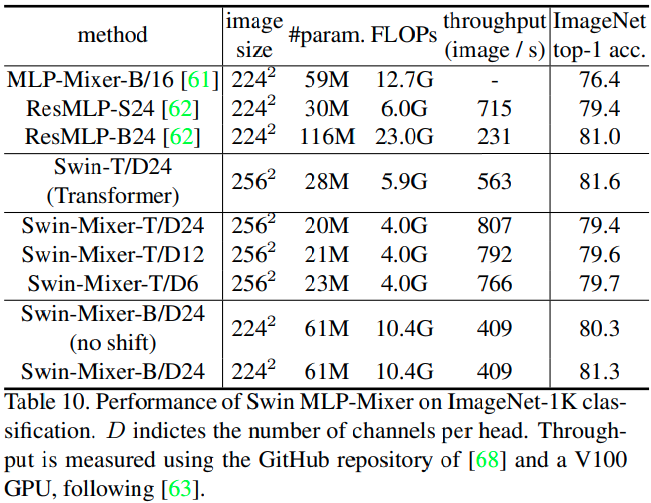