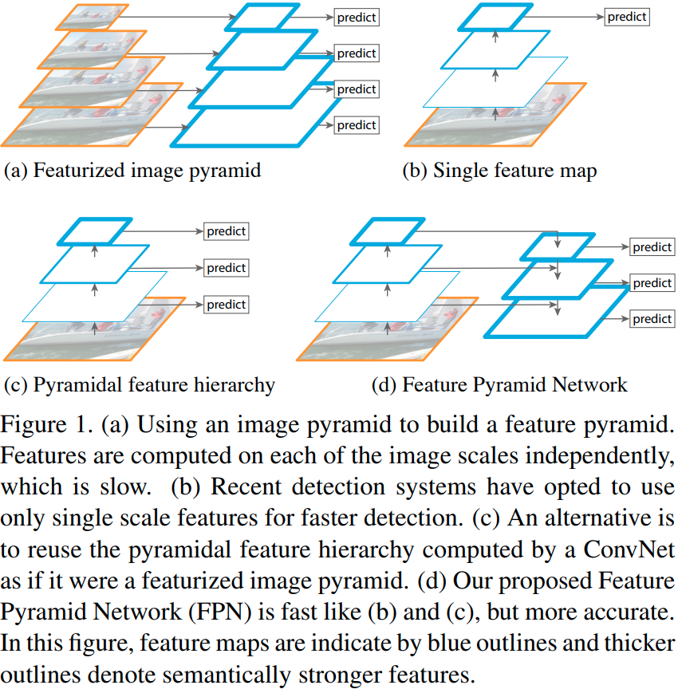
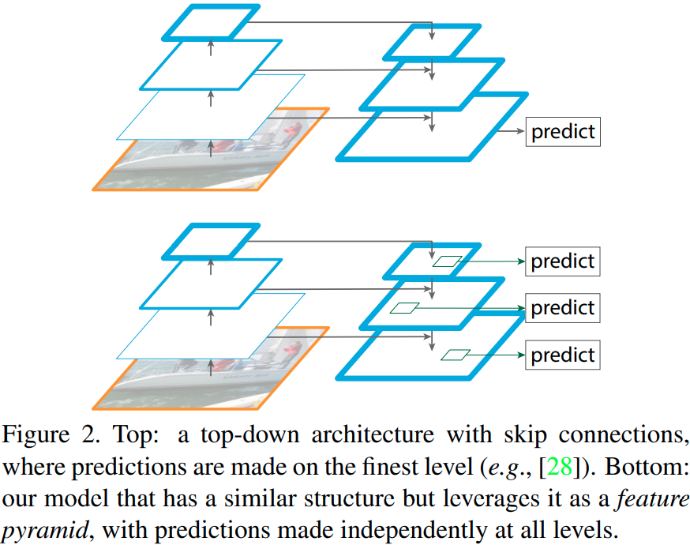
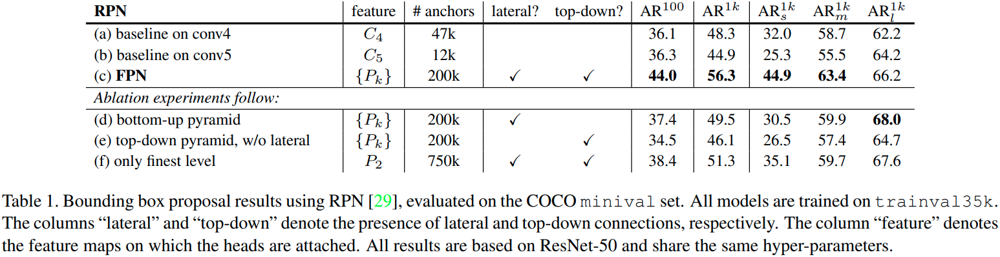
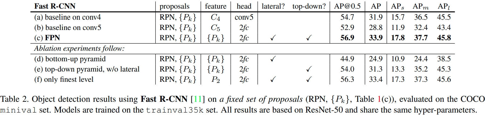
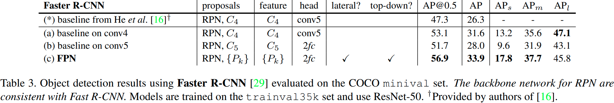
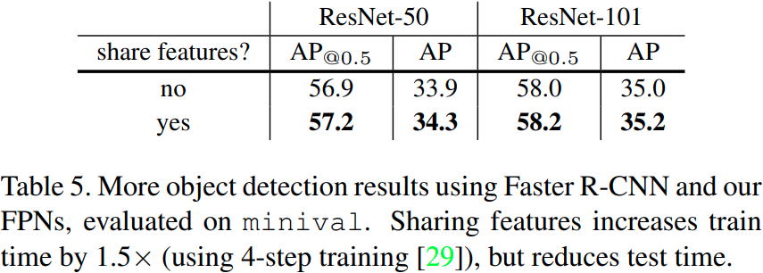
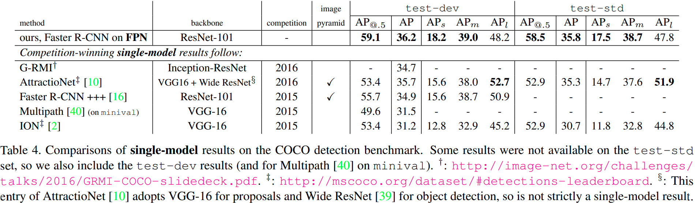
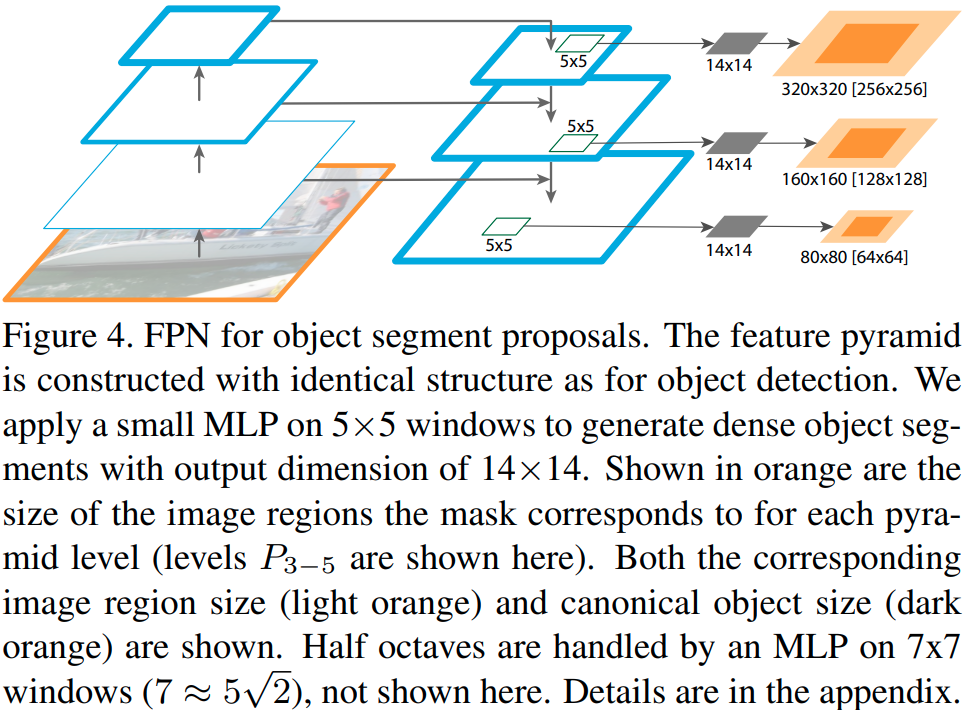
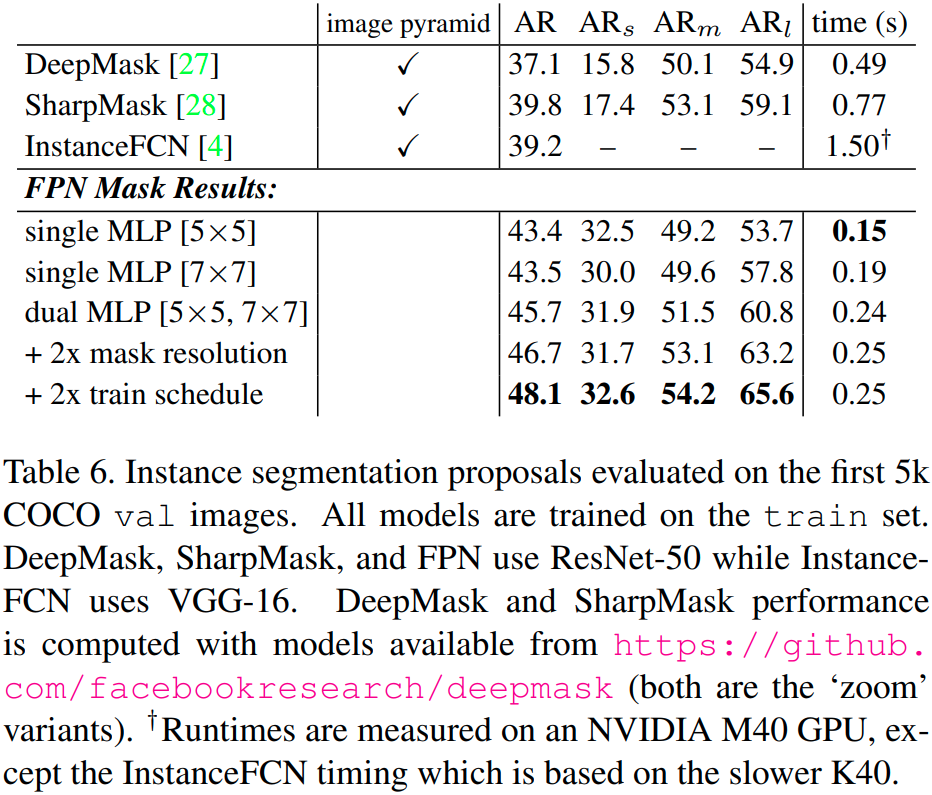

# Feature Pyramid Networks for Object Detection

## 摘要

特征金字塔是识别系统中用于检测不同尺度对象的基本组件。但最近的深度学习对象检测器避免了金字塔表示，部分原因是它们是计算和内存密集型的。在本文中，我们利用深度卷积网络固有的多尺度金字塔层次结构来构建具有边际额外成本的特征金字塔。开发了一种具有横向连接的自上而下的体系结构，用于构建所有尺度的高级语义特征图。这种称为特征金字塔网络 (FPN) 的架构在多个应用程序中显示出作为通用特征提取器的显着改进。在基本的 Faster R-CNN 系统中使用 FPN，我们的方法在 COCO 检测基准上实现了最先进的单一模型结果，没有花里胡哨，超过了所有现有的单一模型项，包括来自 COCO 2016 挑战赛获胜者的项。此外，我们的方法可以在 GPU 上以 6 FPS 的速度运行，因此是多尺度目标检测的实用且准确的解决方案。代码将公开。

## 1.引言

在截然不同的尺度上识别物体是计算机视觉中的一项基本挑战。建立在图像金字塔之上的特征金字塔（我们简称为这些特征化图像金字塔）构成了标准解决方案的基础 [1]（图 1（a））。这些金字塔在某种意义上是尺度不变的，因为对象的尺度变化会通过移动金字塔中的水平来抵消。直观地，此属性使模型能够通过在位置和金字塔级别上扫描模型来检测大范围内的对象。

特征化图像金字塔在手工设计特征的时代被大量使用 [5, 25]。它们是如此关键，以至于像 DPM [7] 这样的物体检测器需要密集尺度采样才能获得良好的结果（例如，每octave10 个尺度）。对于识别任务，工程特征在很大程度上已被深度卷积网络 (ConvNets) [19、20] 计算的特征所取代。除了能够表示更高级别的语义之外，ConvNets 还对尺度变化更稳健，因此有助于识别在单个输入尺度上计算的特征 [15、11、29]（图 1（b））。但即使具有这种稳健性，仍然需要金字塔来获得最准确的结果。 ImageNet [33] 和 COCO [21] 检测挑战中的所有最新顶级项都对特征化图像金字塔（例如 [16、35]）使用多尺度测试。对图像金字塔的每一层进行特征化的主要优点是它产生了多尺度特征表示，其中所有层在语义上都很强，包括高分辨率层。

然而，对图像金字塔的每一层进行特征化都有明显的局限性。推理时间显著增加（例如，增加了四倍 [11]），使得这种方法对于实际应用不切实际。此外，在图像金字塔上端到端训练深度网络在内存方面是不可行的，因此，如果利用图像金字塔，图像金字塔仅在测试时使用 [15、11、16、35]，这会造成两者之间的不一致训练/测试时间推理。由于这些原因，Fast and Faster R-CNN [11, 29] 选择在默认设置下不使用特征化图像金字塔。

然而，图像金字塔并不是计算多尺度特征表示的唯一方法。深度 ConvNet 逐层计算特征层次结构，并且通过子采样层，特征层次结构具有固有的多尺度金字塔形状。这种网络内特征层次结构产生不同空间分辨率的特征图，但引入了由不同深度引起的大语义差距。高分辨率地图具有低级特征，会损害其对象识别的表示能力。

Single Shot Detector (SSD) [22] 是首次尝试使用 ConvNet 的金字塔特征层次结构，就好像它是特征化图像金字塔一样（图 1（c））。理想情况下，SSD 风格的金字塔将重用前向传播中计算的不同层的多尺度特征图，因此是免费的。但是为了避免使用低级特征，SSD 放弃重用已经计算的层，而是从网络的高层开始构建金字塔（例如，VGG 网络 [36] 的 conv4_3），然后添加几个新层。因此它错过了重用特征层次结构的高分辨率图的机会。我们表明这些对于检测小物体很重要。

本文的目标是自然地利用 ConvNet 特征层次结构的金字塔形状，同时创建一个在所有尺度上都具有强语义的特征金字塔。为了实现这一目标，我们依赖于一种架构，该架构通过自上而下的路径和横向连接将低分辨率、语义强的特征与高分辨率、语义弱的特征相结合（图 1（d））。结果是一个特征金字塔，它在所有级别都具有丰富的语义，并且可以从单个输入图像尺度快速构建。换句话说，我们展示了如何创建网络内特征金字塔，这些金字塔可用于在不牺牲表征能力、速度或内存的情况下替换特征化图像金字塔。

采用自上而下和skip connections的类似架构在最近的研究中很流行 [28、17、8、26]。他们的目标是生成一个高分辨率的单一高级特征图，并在其上进行预测（图 2 顶部）。相反，我们的方法将架构用作特征金字塔，其中在每个级别上独立进行预测（例如，对象检测）（图 2 底部）。我们的模型呼应了一个特征化的图像金字塔，这在这些工作中没有被探索过。

我们在各种检测和分割系统中评估我们的方法，称为特征金字塔网络 (FPN) [11、29、27]。没有花里胡哨的东西，我们仅基于 FPN 和基本的 Faster R-CNN 检测器 [29] 在具有挑战性的 COCO 检测基准 [21] 上报告了最先进的单一模型结果，超越了所有现有的重度工程竞赛获胜者的单模型参赛作品。在消融实验中，我们发现对于边界框proposal，FPN 将平均召回率 (AR) 显着提高了 8.0 个点；对于目标检测，它在 ResNets [16] 上的 Faster R-CNN 强大的单尺度基线上将 COCO 风格的平均精度 (AP) 提高了 2.3 点，将 PASCAL 风格的 AP 提高了 3.8 点。我们的方法也很容易扩展到mask proposal，并提高了实例分割 AR 和速度，超过了严重依赖图像金字塔的最先进方法。

此外，我们的金字塔结构可以在所有尺度上进行端到端训练，并在训练/测试时始终如一地使用，这对于使用图像金字塔来说是内存不可行的。因此，FPN 能够实现比所有现有的最先进方法更高的精度。此外，这种改进是在不增加单尺度基线测试时间的情况下实现的。我们相信这些进步将促进未来的研究和应用。我们的代码将公开发布。

## 2.相关工作

**手工特征和早期神经网络**	SIFT 特征 [25] 最初是在尺度空间极值处提取的，用于特征点匹配。 HOG 特征 [5]，以及后来的 SIFT 特征，都是在整个图像金字塔上密集计算的。这些 HOG 和 SIFT 金字塔已被用于图像分类、目标检测、人体姿势估计等众多工作中。人们也对快速计算特征化图像金字塔产生了浓厚的兴趣。 [6] 通过首先计算稀疏采样（按比例）金字塔然后插入缺失级别来演示快速金字塔计算。在 HOG 和 SIFT 之前，使用 ConvNets [38、32] 进行人脸检测的早期工作计算了图像金字塔上的浅层网络，以跨尺度检测人脸。

**深度卷积网络目标检测**	随着现代深度 ConvNets [19] 的发展，像 OverFeat [34] 和 R-CNN [12] 这样的目标检测器在准确性上有了显着的提高。 OverFeat 通过将 ConvNet 用作图像金字塔上的滑动窗口检测器，采用了类似于早期神经网络人脸检测器的策略。 R-CNN 采用了基于区域proposal的策略 [37]，其中每个proposal在使用 ConvNet 分类之前都进行了尺度归一化。 SPPnet [15] 证明了这种基于区域的检测器可以更有效地应用于在单个图像尺度上提取的特征图。最近更准确的检测方法，如 Fast R-CNN [11] 和 Faster R-CNN [29] 提倡使用从单一尺度计算的特征，因为它在准确性和速度之间提供了良好的权衡。然而，多尺度检测仍然表现更好，尤其是对于小物体。

**使用多层的方法**	许多最近的方法通过在 ConvNet 中使用不同的层来改进检测和分割。 FCN [24] 对多个尺度上每个类别的部分分数求和以计算语义分割。 Hypercolumns [13] 使用类似的方法进行对象实例分割。其他几种方法（HyperNet [18]、ParseNet [23] 和 ION [2]）在计算预测之前连接多层的特征，这相当于对变换后的特征求和。 SSD [22] 和 MS-CNN [3] 在不组合特征或分数的情况下预测特征层次结构多层的对象。

最近有一些方法利用横向/skip connections将跨分辨率和语义级别的低级特征图关联起来，包括用于分割的 U-Net [31] 和 SharpMask [28]，用于人脸检测的Recombinator networks [17]，以及堆叠沙漏网络[26] 用于关键点估计，Ghiasi 等人。 [8] 提出了 FCN 的拉普拉斯金字塔表示，以逐步细化分割。尽管这些方法采用具有金字塔形状的架构，但它们与特征化图像金字塔 [5, 7, 34] 不同，在特征化图像金字塔中，预测是在所有级别独立进行的，见图 2。事实上，对于图 2 中的金字塔架构（顶部） ，仍然需要图像金字塔来识别跨多个尺度的对象 [28]。

## 3.特征金字塔网络FPN

我们的目标是利用 ConvNet 的金字塔特征层次结构，它具有从低层到高层的语义，并构建一个始终具有高级语义的特征金字塔。由此产生的特征金字塔网络是通用的，在本文中我们关注滑动窗口proposers（区域proposal网络，简称 RPN）[29] 和基于区域的检测器（Fast R-CNN）[11]。我们还将 FPN 推广到第 6 节中的实例分割proposal

我们的方法将任意大小的单尺度图像作为输入，并以完全卷积的方式在多个级别输出按比例大小的特征图。这个过程独立于backbone卷积架构（例如 [19,36,16]），在本文中我们使用 ResNets [16] 展示结果。我们的金字塔的构建涉及自下而上的路径、自上而下的路径和横向连接，如下所述。

**自下而上路径**	自下而上的路径是backbone ConvNet 的前馈计算，它计算由多个尺度的特征图组成的特征层次结构，缩放步长为 2。通常有许多层产生相同大小的输出图，我们说这些层处于同一网络阶段。对于我们的特征金字塔，我们为每个阶段定义一个金字塔级别。我们选择每个阶段最后一层的输出作为我们的特征映射参考集，我们将对其进行丰富以创建我们的金字塔。这种选择是很自然的，因为每个阶段的最深层应该具有最强的特征。

具体来说，对于 ResNets [16]，我们使用每个阶段的最后一个残差块输出的特征激活。对于 conv2、conv3、conv4 和 conv5 输出，我们将这些最后残差块的输出表示为 {C2、C3、C4、C5}，并注意它们相对于输入图像有{4, 8, 16, 32}步长pixels.由于 conv1 占用大量内存，我们不将其包含在金字塔中。

**自下而上路径和横向连接**	自上而下的路径通过对来自更高金字塔级别的空间上更粗糙但语义上更强的特征图进行上采样来产生更高分辨率的特征。然后通过横向连接使用自下而上路径的特征来增强这些特征。每个横向连接合并来自自下而上路径和自上而下路径的相同空间大小的特征图。自下而上的特征图具有较低级别的语义，但它的激活被更准确地定位，因为它被二次采样的次数更少。

图 3 显示了构建自上而下特征图的构建块。使用较粗分辨率的特征图，我们将空间分辨率上采样 2 倍（为简单起见，使用最近邻上采样）。然后通过逐元素相加将上采样图与相应的自下而上图（经过 1×1 卷积层以减少通道维度）合并。重复此过程，直到生成最精细的分辨率图。要开始迭代，我们只需在 C5 上附加一个 1×1 卷积层以生成最粗糙的分辨率图。最后，我们在每个合并后的图上附加一个 3×3 的卷积来生成最终的特征图，这是为了减少上采样的混叠效应。这最后一组特征图称为{P2，P3，P4，P5}，对应于分别具有相同空间大小的{C2，C3，C4，C5}。

因为金字塔的所有级别都像在传统的特征化图像金字塔中一样使用共享分类器/回归器，所以我们在所有特征图中固定特征维度（通道数，表示为 d）。我们在本文中设置 d = 256，因此所有额外的卷积层都有 256 个通道的输出。这些额外的层中没有非线性，我们凭经验发现影响很小。

简单性是我们设计的核心，我们发现我们的模型对许多设计选择都很稳健。我们已经尝试了更复杂的块（例如，使用多层残差块 [16] 作为连接）并观察到略微更好的结果。设计更好的连接模块不是本文的重点，因此我们选择上述的简单设计。

## 4.应用

我们的方法是在深度卷积网络中构建特征金字塔的通用解决方案。在下文中，我们在 RPN [29] 中采用我们的方法生成边界框proposal，在 Fast R-CNN [11] 中采用我们的方法进行对象检测。为了证明我们方法的简单性和有效性，我们在将 [29, 11] 的原始系统应用到我们的特征金字塔时对它们进行了最少的修改。

### 4.1 Fetaure Pyramid Networks for RPN

RPN [29] 是一种滑动窗口类不可知对象检测器。在最初的 RPN 设计中，小型子网络在密集的 3×3 滑动窗口上进行评估，在单尺度卷积特征图之上，执行对象/非对象二元分类和边界框回归。这是通过一个 3×3 卷积层和两个用于分类和回归的 1×1 卷积层实现的，我们称之为网络头。对象/非对象标准和边界框回归目标是相对于一组称为锚点 [29] 的参考框定义的。锚点具有多个预定义的比例和纵横比，以覆盖不同形状的对象。

我们通过用我们的 FPN 替换单尺度特征图来调整 RPN。我们将相同设计的头部（3×3 conv 和两个同级 1×1 convs）附加到特征金字塔的每个级别。因为头部在所有金字塔层级的所有位置上密集滑动，所以没有必要在特定层级上具有多尺度锚点。相反，我们为每个级别分配单一尺度的锚点。形式上，我们将锚点定义为在 $\{P_2, P_3, P_4, P_5, P_6\}$上分别具有 {$32^2, 64^2, 128^2, 256^2, 512^2$} 像素的区域(1.这里我们引入$P_6$只是为了覆盖更大的锚尺度$512^2$ 。$P_6$只是 $P_5$的一步二次采样。下一节中的 Fast R-CNN 检测器不使用 $P_6$)。与 [29] 中一样，我们也使用多个纵横比的锚点{1:2, 1:1, 2:1} 在每个级别。所以在金字塔上总共有 15 个锚点。

我们根据 [29] 中的 Intersection-over-Union (IoU) 与ground truth边界框的比值将训练标签分配给锚点。正式地，如果一个锚点对于给定的真值框具有最高的 IoU 或者与任何真值框的 IoU 超过 0.7，则它被分配一个正标签，如果它对所有真值框的 IoU 低于 0.3，则被分配一个负标签框。请注意，ground truht框的尺度并未明确用于将它们分配给金字塔的级别；相反，ground-truth boxes 与 anchors 相关联，这些 anchors 已分配给金字塔级别。因此，除了 [29] 中的规则外，我们没有引入额外的规则。

我们注意到头部的参数在所有特征金字塔级别共享；我们还评估了不共享参数的替代方案，并观察到类似的准确性。共享参数的良好性能表明我们金字塔的所有级别都共享相似的语义级别。此优势类似于使用特征化图像金字塔的优势，其中可以将通用头部分类器应用于以任何图像比例计算的特征。

通过上述调整，可以使用我们的 FPN 以与 [29] 中相同的方式自然地训练和测试 RPN。我们详细说明了实验中的实现细节。

### 4.2 Feature Pyramid Networks for Fast R-CNN

Fast R-CNN [11] 是一种基于区域的目标检测器，其中使用感兴趣区域 (RoI) 池来提取特征。 Fast R-CNN 最常在单尺度特征图上执行。要将其与我们的 FPN 一起使用，我们需要将不同尺度的 RoI 分配给金字塔层级。

我们将特征金字塔看作是从图像金字塔中生成的。因此，当它们在图像金字塔上运行时，我们可以调整基于区域的检测器 [15、11] 的分配策略。形式上，我们通过以下方式将宽度 w 和高度 h（在网络的输入图像上）的 RoI 分配给特征金字塔的级别 $P_k$：
$$
k = \lfloor k_0 + \log_2{(\sqrt{wh}/224)} \rfloor.
$$
这里 224 是规范的 ImageNet 预训练大小，$k_0$是 w × h = $224^2$ 的 RoI 应该映射到的目标级别。类似于使用 $C_4$ 作为单尺度特征图的基于 ResNet 的 Faster R-CNN 系统 [16]，我们将$k_0$设置为 4。直观地，Eqn.(1)意味着如果 RoI 的尺度变小（比如，224 的 1/2），它应该被映射到更精细的分辨率级别（比如，k = 3）。

我们将预测头（在 Fast R-CNN 中，头是特定于类的分类器和边界框回归器）附加到所有级别的所有 RoI。同样，所有头都共享参数，无论其级别如何。在 [16] 中，ResNet 的 conv5 层（一个 9 层深子网络）被用作 conv4 特征之上的头部，但我们的方法已经利用 conv5 来构建特征金字塔。因此，与 [16] 不同，我们简单地采用 RoI 池来提取 7×7 特征，并在最终分类和边界框回归层之前附加两个隐藏的 1,024-d 全连接 (fc) 层（每个后跟 ReLU）。这些层是随机初始化的，因为 ResNet 中没有可用的预训练 fc 层。请注意，与标准 conv5 头相比，我们的 2-fc MLP 头重量更轻，速度更快。

基于这些调整，我们可以在特征金字塔之上训练和测试 Fast R-CNN。实施细节在实验部分给出。

## 5. Experiments on Object Detection

我们对 80 类 COCO 检测数据集 [21] 进行了实验。我们使用 80k 训练图像和 35k val 图像子集 (trainval35k [2]) 的联合进行训练，并报告 5k val 图像子集（minival）的消融。我们还报告了没有公开标签的标准测试集 (test-std) [21] 的最终结果。

按照惯例 [12]，所有网络backbone都在 ImageNet1k 分类集 [33] 上进行预训练，然后在检测数据集上进行微调。我们使用公开可用的预训练 ResNet-50 和 ResNet-101 模型(2.https://github.com/kaiminghe/deep-residual-networks)。我们的代码是使用 Caffe2(4.https://github.com/caffe2/caffe2) 重新实现 py-faster-rcnn(3.https://github.com/rbgirshick/py-faster-rcnn)。

### 5.1 Region Proposal with RPN

我们按照 [21] 中的定义评估 COCO 风格的平均召回率 (AR) 和小型、中型和大型对象（$AR_s$、$AR_m$和 $AR_l$）的 AR。我们报告每张图像 100 和 1000 个提案的结果（$AR^{100}$和 $AR^{1k}$）。

**实施细节**	表 1 中的所有架构都经过端到端训练。调整输入图像的大小，使其短边有 800 像素。我们在 8 个 GPU 上采用同步 SGD 训练。一个mini-batch涉及每个 GPU 2 个图像和每个图像 256 个锚点。我们使用 0.0001 的权重衰减和 0.9 的动量。前 30k 个mini-batch的学习率为 0.02，接下来的 10k 个为 0.002。对于所有 RPN 实验（包括基线），我们包括图像外部的锚框进行训练，这与忽略这些锚框的 [29] 不同。其他实现细节如 [29] 中所述。在 8 个 GPU 上用 FPN 训练 RPN 在 COCO 上大约需要 8 个小时。

#### 5.1.1 消融实验

**基线比较**	为了与原始 RPN [29] 进行公平比较，我们使用 $C_4$（与 [16] 相同）或 $C_5$ 的单尺度图运行两个基线（表 1（a，b）），两者都使用与我们相同的超参数，包括使用 {$32^2, 64^2, 128^2, 256^2, 512^2$} 的 5 个尺度锚点。表 1 (b) 显示与 (a) 相比没有优势，表明单个更高级别的特征映射是不够的，因为在更粗略的分辨率和更强的语义之间存在权衡。

将 FPN 置于 RPN 中可将$AR^{1k}$提高到 56.3（表 1 (c)），比单尺度 RPN 基线（表 1 (a)）提高了 8.0 个点。此外，小物体 ($AR_s^{1k}$ ) 的性能大幅提升了 12.9 个百分点。我们的金字塔表示极大地提高了 RPN 对对象尺度变化的鲁棒性。

**How important is top-down enrichment?**	表 1(d) 显示了没有自上而下路径的特征金字塔的结果。通过这种修改，1×1 横向连接后跟 3×3 卷积连接到自下而上的金字塔。该架构模拟了重用金字塔特征层次结构的效果（图 1（b））。

表 1(d) 中的结果与 RPN 基线相当，远远落后于我们的结果。我们推测这是因为自下而上的金字塔（图 1（b））的不同层次之间存在较大的语义差距，尤其是对于非常深的 ResNet。我们还在不共享头部参数的情况下评估了表 1(d) 的变体，但观察到类似的性能下降。这个问题不能简单地由特定级别的网络头解决。

**How important are lateral connections?**	表 1(e) 显示了没有 1×1 横向连接的自顶向下特征金字塔的消融结果。这个自上而下的金字塔具有很强的语义特征和精细的分辨率。但我们认为这些特征的位置并不精确，因为这些地图已经过多次下采样和上采样。更精确的特征位置可以通过横向连接从自下而上图的更精细级别直接传递到自上而下图。结果，FPN 的$AR^{1k}$ 得分比表 1(e) 高 10 分。

**How important are pyramid representations?**	可以将头部附加到$P_2$的最高分辨率、强语义特征图（即我们金字塔中最好的级别），而不是求助于金字塔表示。与单尺度基线类似，我们将所有锚点分配给 $P_2$特征图。这种变体（表 1(f)）优于基线但不如我们的方法。 RPN 是一种具有固定窗口大小的滑动窗口检测器，因此扫描金字塔级别可以提高其对尺度方差的鲁棒性。

此外，我们注意到单独使用$P_2$会导致更多的锚点（750k，表 1（f）），这是由于其较大的空间分辨率。这一结果表明，大量的锚点本身不足以提高准确性。

### 5.2 Object Detection with Fast/Faster R-CNN

接下来我们研究基于区域（非滑动窗口）检测器的 FPN。我们通过 COCO 风格的平均精度 (AP) 和 PASCAL 风格的 AP（在 0.5 的单个 IoU 阈值）评估对象检测。我们还按照 [21] 中的定义报告了小型、中型和大型对象（即$AR_s$、$AR_m$和 $AR_l$）的 COCO AP。

**实施细节**	调整输入图像的大小，使其短边有 800 像素。同步 SGD 用于在 8 个 GPU 上训练模型。每个 mini-batch 每个 GPU 包含 2 个图像，每个图像包含 512 个 RoI。我们使用 0.0001 的权重衰减和 0.9 的动量。前 60k 个mini-batch的学习率为 0.02，接下来的 20k 个为 0.002。我们使用每张图像 2000 个 RoI 进行训练，1000 个用于测试。在 COCO 数据集上用 FPN 训练 Fast R-CNN 大约需要 10 个小时。

#### 5.2.1 Fast R-CNN(on fixed proposals)

为了更好地研究 FPN 单独对基于区域的检测器的影响，我们对一组固定的proposal进行 Fast R-CNN 的消融。我们选择冻结 RPN 在 FPN 上计算的proposal（表 1(c)），因为它在检测器要识别的小物体上具有良好的性能。为简单起见，除非指定，否则我们不在 Fast R-CNN 和 RPN 之间共享特征。

作为基于 ResNet 的 Fast R-CNN 基线，遵循 [16]，我们采用输出大小为 14×14 的 RoI 池，并将所有 conv5 层附加为头部的隐藏层。这在表 2(a) 中给出了 31.9 的 AP。表 2(b) 是利用具有 2 个隐藏 fc 层的 MLP 头的基线，类似于我们架构中的头。它获得 28.8 的 AP，表明 2-fc 头没有给我们任何超过表 2(a) 中基线的正交优势。

表 2(c) 显示了我们的 FPN 在 Fast R-CNN 中的结果。与表 2(a) 中的基线相比，我们的方法将 AP 提高了 2.0 个点，将小物体 AP 提高了 2.1 个点。与同样采用 2fc 头的基线相比（表 2(b)），我们的方法将 AP 提高了 5.1 个点(5.我们期望更强大的头部架构 [30] 将改进我们的结果，这超出了本文的重点)。这些比较表明，对于基于区域的对象检测器，我们的特征金字塔优于单尺度特征。

表 2(d) 和 (e) 表明移除自上而下的连接或移除横向连接会导致较差的结果，类似于我们在上述 RPN 小节中观察到的情况。值得注意的是，移除自上而下的连接（表 2(d)）会显着降低准确性，这表明 Fast R-CNN 在高分辨率图上使用低级特征会受到影响。

在表 2(f) 中，我们在 P2 的单个最细尺度特征图上采用 Fast R-CNN。其结果（33.4 AP）比使用所有金字塔级别（33.9 AP，表 2(c)）略差。我们认为这是因为 RoI 池化是一种类似warping的操作，对区域的尺度不太敏感。尽管此变体具有良好的准确性，但它基于 {$P_k$} 的 RPN 建议，因此已经受益于金字塔表示。

#### 5.2.2 Faster R-CNN(on consistent proposals)

在上面我们使用了一组固定的proposal来研究检测器。但是在 Faster R-CNN 系统 [29] 中，RPN 和 Fast R-CNN 必须使用相同的网络backbone才能实现特征共享。表 3 显示了我们的方法与两个基线之间的比较，所有基线都使用一致的 RPN 和 Fast R-CNN backbone架构。表 3(a) 显示了我们对 [16] 中描述的基线 Faster R-CNN 系统的再现。在受控设置下，我们的 FPN（表 3(c)）比这个强大的基线好 2.3 点 AP 和 3.8 点 AP@0.5

请注意，表 3(a) 和 (b) 是比 He 等人提供的基线强得多的基线。 [16] 为表 3(*)。我们发现以下实现导致了差距：（i）我们使用 800 像素的图像尺度而不是 [11、16] 中的 600； (ii) 我们用每张图像 512 个 RoI 进行训练，这加速了收敛，与 [11、16] 中的 64 个 RoI 形成对比； (iii) 我们使用 5 个尺度锚而不是 [16] 中的 4 个（添加 $32^2$）； (iv) 在测试时，我们每张图片使用 1000 个proposal，而不是 [16] 中的 300 个。因此，与表 3(*) 中 He 等人的 ResNet-50 Faster R-CNN 基线相比，我们的方法将 AP 提高了 7.6 个点，将 AP@0.5 提高了 9.6 个点。

**共享特征**	在上面，为了简单起见，我们不共享 RPN 和 Fast R-CNN 之间的特征。在表 5 中，我们根据 [29] 中描述的 4 步训练评估共享功能。与 [29] 类似，我们发现共享特征可以略微提高准确性。功能共享还减少了测试时间。

**运行时间**	通过特征共享，我们基于 FPN 的 Faster R-CNN 系统在单个 NVIDIA M40 GPU 上对 ResNet-50 的每张图像推理时间为 0.148 秒，对于 ResNet-101 为 0.172 秒作为比较(6.这些运行时间是从本文的早期版本更新而来的)，单尺度 ResNet-50表 3(a) 中的基线运行时间为 0.32 秒。我们的方法通过 FPN 中的额外层引入了少量的额外成本，但头部重量更轻。总体而言，我们的系统比基于 ResNet 的 Faster R-CNN 对应系统更快。我们相信我们方法的效率和简单性将有利于未来的研究和应用。

#### 5.2.3 Comparing with COCO Competition Winners

我们发现表 5 中的 ResNet-101 模型未使用默认学习率计划进行充分训练。因此，在训练 Fast R-CNN 步骤时，我们在每个学习率下将mini-batch的数量增加 2 倍。这将 minival 上的 AP 增加到 35.6，但不共享特征。这个模型是我们提交给 COCO 检测排行榜的模型，如表 4 所示。由于时间有限，我们没有评估它的特征共享版本，应该稍微好一点，如表 5 所示。

表 4 将我们的方法与 COCO 竞赛获胜者的单模型结果进行了比较，包括 2016 年获胜者 G-RMI 和 2015 年获胜者 Faster R-CNN+++。在不添加花里胡哨的情况下，我们的单一模型项已经超过了这些强大的、精心设计的竞争对手。

在test-dev集上，我们的方法比现有最佳结果提高了 0.5 点 AP（36.2 对 35.7）和 3.4 点 AP@0.5（59.1 对 55.7）。值得注意的是，我们的方法不依赖图像金字塔，仅使用单一输入图像尺度，但在小尺度物体上仍然具有出色的 AP。使用以前的方法只能通过输入高分辨率图像来实现。

此外，我们的方法没有利用许多流行的改进，例如迭代回归 [9]、hard negative mining [35]、上下文建模 [16]、更强的数据增强 [22] 等。这些改进是对 FPN 的补充，应该提升精度进一步。

近期，FPN在检测、实例分割、关键点估计等COCO竞赛的所有赛道上都取得了新的顶级成绩。有关详细信息，请参见 [14]。

## 6. Extensions: Segmentation Proposals

我们的方法是一种通用的金字塔表示，可用于对象检测以外的应用。在本节中，我们使用 FPN 生成分割proposal，遵循 DeepMask/SharpMask 框架 [27、28]。

DeepMask/SharpMask 接受了图像裁剪的训练，用于预测实例片段和对象/非对象分数。在推理时，这些模型以卷积方式运行以在图像中生成密集的proposal。要生成多个尺度的片段，图像金字塔是必要的 [27、28]。

很容易调整 FPN 来生成mask proposal。我们使用全卷积设置进行训练和推理。我们构建了我们的特征金字塔，就像在第5.1节中一样，并设置 d = 128。在特征金字塔的每一层之上，我们应用一个小的 5×5 MLP 以完全卷积的方式预测 14×14 masks和对象分数，见图 4。此外，受在 [27, 28] 的图像金字塔中每个octave使用 2 个尺度启发，我们使用输入大小为 7×7 的第二个 MLP 来处理半个octave。这两个 MLP 在 RPN 中扮演着类似于锚点的角色。该架构是端到端训练的；附录中给出了完整的实施细节。

### 6.1 Segmentation Proposal Results

结果如表 6 所示。我们在小型、中型和大型对象上报告分段 AR 和分段 AR，始终针对 1000 个proposal。我们具有单个 5×5 MLP 的基线 FPN 模型实现了 43.4 的 AR。切换到稍大的 7×7 MLP 时，精度基本没有变化。同时使用两个 MLP 可将准确度提高到 45.7 AR。将掩码输出大小从 14×14 增加到 28×28 会增加 AR 另一个点（更大的尺寸开始降低精度）。最后，将训练迭代次数加倍可将 AR 增加到 48.1。

我们还报告了与 DeepMask [27]、SharpMask [28] 和 InstanceFCN [4] 的比较，这些方法是mask proposal生成中以前最先进的方法。我们的准确率比这些方法高出 8.3 点 AR。特别是，我们几乎将小物体的准确度提高了一倍。

现有的mask proposal方法 [27, 28, 4] 基于密集采样的图像金字塔（例如，在 [27, 28] 中按$2 ^ { \{-2:0.5:1\} }$缩放），这使得它们的计算量很大。我们基于 FPN 的方法要快得多（我们的模型以 6 到 7 FPS 运行）。这些结果表明我们的模型是一个通用的特征提取器，可以替代图像金字塔来解决其他多尺度检测问题。

## 7.结论

我们已经提出了一个干净简单的框架，用于在 ConvNets 中构建特征金字塔。我们的方法显示出比几个强大的基线和竞赛获胜者有显著改进。因此，它为特征金字塔的研究和应用提供了一种实用的解决方案，而不需要计算图像金字塔。最后，我们的研究表明，尽管深度卷积网络具有强大的表征能力及其对尺度变化的隐含鲁棒性，但使用金字塔表征明确解决多尺度问题仍然至关重要。

## A. Implementation of Segmentation Proposals

我们使用我们的特征金字塔网络来有效地生成对象分割proposal，采用在对象检测中流行的以图像为中心的训练策略 [11, 29]。我们的 FPN 掩码生成模型继承了 DeepMask/SharpMask [27、28] 的许多想法和动机。然而，与这些在图像裁剪上训练并使用密集采样图像金字塔进行推理的模型相比，我们对特征金字塔进行掩码预测的全卷积训练。虽然这需要更改许多细节，但我们的实施在精神上仍然与 DeepMask 相似。具体来说，为了在每个滑动窗口定义mask实例的标签，我们将此窗口视为输入图像上的裁剪，允许我们从 DeepMask 继承正/负的定义。接下来我们将提供更多细节，另请参见图 4 的可视化效果。

我们使用与第 5.1 节中描述的相同架构构建具有$P_{2-6}$的特征金字塔。 我们设置 d = 128。我们的特征金字塔的每一层都用于预测不同尺度的mask。与 DeepMask 一样，我们将mask的比例定义为其宽度和高度的最大值。具有{32、64、128、256、512}像素尺度的mask分别映射到$\{P_2, P_3, P_4, P_5, P_6\}$，并由5×5 MLP处理。由于 DeepMask 使用具有半octave的金字塔，我们使用尺寸为 7×7 (7 ≈ $5\sqrt{2}$) 的第二个稍大的 MLP 来处理我们模型中的半octave（例如，$128\sqrt{2}$尺度掩码由 7 ×7 P4 上的 MLP）。中间尺度的对象被映射到对数空间中最近的尺度。

由于 MLP 必须在每个金字塔级别（特别是半octave范围）的尺度范围内预测对象，因此必须在规范对象大小周围提供一些填充。我们使用 25% 的padding。这意味着 $\{P_2, P_3, P_4, P_5, P_6\}$上的mask输出映射到 5×5 MLP 的 {40, 80, 160, 320, 640} 大小的图像区域（并映射到 $\sqrt{2}$ 个更大的对应大小7×7 MLP）。

特征图中的每个空间位置用于预测不同位置的mask。具体来说，在尺度$P_k$下，特征图中的每个空间位置用于预测其中心落在该位置$2^k$像素范围内的mask（对应于特征图中的 $\pm1$ 个单元格偏移）。如果没有对象中心落在这个范围内，则该位置被认为是负的，并且与 DeepMask 中一样，仅用于训练分数分支而不是mask分支。

我们用于预测mask和分数的 MLP 非常简单。我们应用具有 512 个输出的 5×5 内核，然后是全连接层来预测 14×14 mask（$14^2$个输出）和对象得分（1 个输出）。该模型以全卷积方式实现（使用 1×1 卷积代替全连接层）。用于处理半octave尺度对象的 7×7 MLP 与 5×5 MLP 相同，除了其更大的输入区域。

在训练过程中，我们以 1:3 的正/负采样率对每个mini-batch随机采样 2048 个示例（每个图像从 16 张图像中抽取 128 个示例）。 mask loss 的权重比 score loss 高 10 倍。该模型使用同步 SGD（每个 GPU 2 个图像）在 8 个 GPU 上进行端到端训练。我们从 0.03 的学习率开始，训练 80k mini-batches，在 60k mini-batches 后将学习率除以 10。在训练和测试期间图像比例设置为 800 像素（我们不使用尺度抖动）。在推理过程中，我们的全卷积模型预测所有位置的分数和尺度，并在 1000 个最高得分位置进行mask。我们不执行任何非最大抑制或后处理。