# ELSED: Enhanced Line SEgment Drawing

## 摘要

检测局部特征，例如角点、线段或斑点，是许多计算机视觉应用pipeline中的第一步。它的速度对于实时应用至关重要。在本文中，我们介绍了 ELSED，这是文献中最快的线段检测器。其效率的关键是局部线段增长算法，该算法在存在小不连续性的情况下连接梯度对齐的像素。所提出的算法不仅可以在非常低端的硬件设备上运行，而且还可以根据手头的任务进行参数化，以促进短或长段的检测。我们还引入了新的指标来评估线段检测器的准确性和可重复性。在我们对不同的公共基准进行的实验中，我们证明我们的方法是文献中最有效的，并量化了这种增益所换来的准确性。

**关键词：图像边缘检测， 高效线段检测，线段检测评估**

## 1.引言

检测数字图像中的线段和完整线条是计算机视觉 (CV) 中反复出现的问题。线段对于理解场景的几何内容起着重要作用，因为它们是图像内容的压缩和有意义的表示。此外，线段仍然存在于低纹理设置中，在这些设置中，基于角点或斑点的经典方法通常会失败。线段检测已用于大量 CV 任务，例如 3D 重建 [1、2]、SLAM [3、4]、视觉里程计 [5]、通过消失点检测 [6、7] 的 3D 相机定位、飞机电缆检测 [8] 中，或在合成孔径雷达图像中进行道路检测 [9]。

如今 CV 算法无处不在，它们有望在资源有限的设备上运行。为此，局部特征检测器等低级算法必须非常高效。传统的基于霍夫变换的全局线检测方法效率低下。因此，出现了各种局部方法来解决效率问题。 LSD [10] 是首批通过局部方法取得优异结果的方法之一。边缘绘制方法进一步提高了效率 [11, 12, 13]。在第一步中，他们通过沿着垂直于梯度的方向连接边缘像素来工作。在第二步中，他们将所需的曲线（在最简单的情况下是一条线）拟合到这些边缘。

本文提出的方法通过将线段拟合到连接的边缘像素并使用其方向来指导绘图过程来改进绘图方法。在一个步骤中融合绘图和线段拟合可以节省时间并提高检测到的线段的整体质量。此外，我们的建议允许跳过梯度不连续并检测完整的线或只检测单个线性段而不跳跃。这很重要，因为线段是在梯度级别上很容易被遮挡、阴影、故障等破坏的特征。通过这种方式，用户可以定义最适合应用程序的线段类型。例如，如果目标是进行消失点估计我们会选择检测大线段，或选择较短线段用于重建和匹配。

在本文中，我们提出了一种称为增强线段绘图 (ELSED) 的线段检测的有效方法。在我们的实验中，我们将 ELSED 的准确性和效率与文献中最相关的检测器进行了比较。如图 1 所示，ELSED 不仅是最有效的（注意速度维度中的对数刻度），而且在文献中最快的线段检测中也是最准确的，并且可重复性更高，正如我们在实验部分中展示的那样.它提高了资源有限设备中现有方法的效率，为在任何类型的硬件上运行的新 CV 应用程序打开了大门。

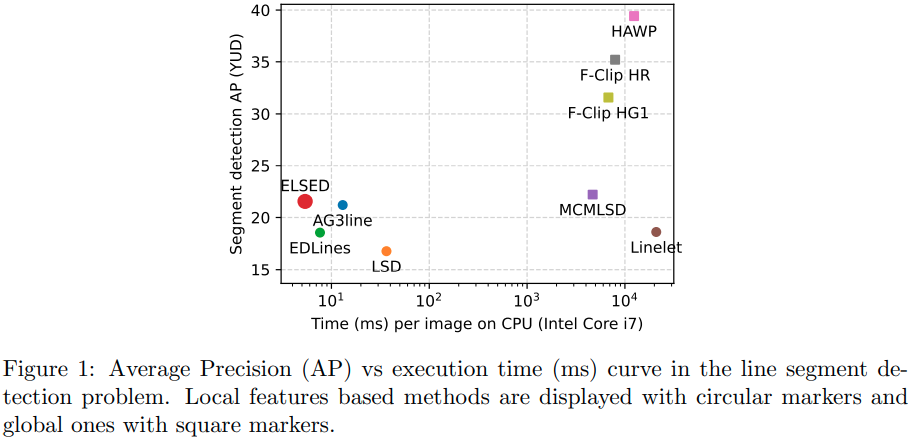

## 2.相关工作

在本节中，我们回顾了线段检测文献。为此，我们将其分为三大类：具有全局方法的全线检测器 [14、15、16、17]、使用局部属性贪婪地检测线段的检测器 [10、12、18、19、13] 和深线段检测器 [20、21、22、23、23、24、25、26]。

### 2.1 基于全局信息的方法

尽管有不连续性，但全局方法能够检测具有足够边缘像素支持的图像中的完整线条。这些方法从边缘检测开始，例如 Canny [27]，然后它们应用类似霍夫变换的 [28] 投票方案。这些方法存在众所周知的问题：遗漏了一些弱边缘，在边缘密度高的区域（例如树叶）中产生误报或存储累加器所需的大量内存。

渐进概率霍夫变换 (PPHT) [29, 14] 通过随机采样方案解决了改变整个图像投票方案的效率问题。最近的工作 [15、16] 解决了量化问题，并且还允许有效地执行该方法。在 [30] 中，线段的方向、长度和宽度以使用拟合二次多项式曲线的封闭形式提取。为了生成更好的线段，MCMLSD [17] 使用 Elder & Zucker 边缘检测器 [31] 将边缘不确定性传播到 Hough 直方图累加器。最后，他们使用马尔可夫链模型和标准动态规划算法将检测到的完整线分割成线段。这种方法的主要缺点是效率，处理一张 640×480 的图像需要 3.7 秒。

### 2.2 局部方法

局部方法通过偏离强梯度像素并使用梯度信息贪婪地添加相邻像素来克服全局方法的一些缺点。 LSD [10] 在 O(N) 中对具有显着梯度幅度和类似梯度方向的图像区域进行分组和验证，N 是图像像素的数量。与 Canny 边缘检测器中使用的 NMS 不同，LSD 使用区域增长过程来选择感兴趣的像素。然后，根据使用 A-Contrario 统计模型 [32] 计算的预期误报数 (NFA) 对每个区域进行验证。 LSD 是高效的，它能够处理边缘像素密度高的区域（例如树木）。

EDLines [12] 也是一种基于局部梯度方向的高效算法 (O(N))。它分两步执行线段检测：1) 边缘检测和 2) 使用局部方法的线段检测。边缘检测步骤是使用边缘绘制 (ED) 算法 [11] 执行的。 ED 应用前三个 Canny 步骤：高斯滤波、梯度估计、非极大值抑制 (NMS) 并尝试使用贪婪过程连接锚点像素（梯度幅值的局部最大值）。在第二步中，EDLines 执行线拟合。 OTLines [18] 使用方向转换来改进 EDLines 并避免在圆形结构上进行线段检测。 AG3line [13] 不是绘制所有像素，而是只找到对齐的锚点。他们还实施了连续验证策略来确定该段是否已到达终点，并实施了跳跃方案来克服梯度不连续性。 AG3line 和 ELSED 之间的一个关键区别是我们使用图像中的每个像素作为绘制过程的一部分，这会生成一系列连续的像素，而 AG3line 仅使用检测到的锚点。这使得该方法快速但不稳定，需要验证每个步骤，因此比 ELSED 慢。

Cho 等人的方法。 [19] 基于线条检测，即由线条数字化产生的水平或垂直连接像素块。 线条检测的时间复杂度为 O(N2)，因此每张图像需要 16.7 秒。使用具有 O($$L^2$$) 复杂性的概率模型将相邻的细线进一步分组为线段，其中 L 是检测到的细线的数量。最后，他们使用从梯度大小、方向和标记数据集中线段的线长中学习的专家模型混合进行验证。他们还提出了我们在实验中改进的定量评估（第 4 节）。

### 2.3 深度线段检测器

与线段检测密切相关的一个问题是线框解析。它包括预测场景中的显着直线及其交叉点。 ShanghaiTech Wireframe 数据集 [20] 包含超过 5,000 个手工标记的图像，允许使用不同的方法来训练获得有竞争力的结果。 AFM [21] 使用一个吸引场图，接下来对其进行压缩以获得线段。 L-CNN [22] 提出了一种端到端模型，该模型使用堆叠的沙漏主干来获得一个连接建议热图，该热图被广泛采样以获得输出段。 HAWP [23] 通过重新参数化整体 4-D 吸引力场图中的线段来改进 L-CNN 采样步骤，从中可以更快地获得线段。 HT-HAWP [23] 在 HAWP 模型中添加了一些 Deep Hough 层，提高了其捕捉线条的能力，并略微提高了一些基准测试的性能。 F-Clip [24] 提出了一种简单而有效的方法来将线段检测作为对象检测问题，可以使用完全卷积的单阶段方法来解决。 LETR [25] 使用 transformers 检测线段，transformers替换了 junction heatmap 和 segment proposals 以直接预测段端点。 SOLD2 [26] 提出了一种自监督的线检测和描述方法，可以优化检测到的线段的可重复性。

尽管这些深度方法取得了良好的效果，但它们的计算要求仍然与基于梯度的经典方法相去甚远。这一事实使它们无法用于没有 GPU 或电池消耗过高的有限设备。出于这个原因，我们引入了我们的绘图方法，该方法经过精心设计，可以避免浮点运算并最大限度地降低其复杂性，对 CPU 友好，并在最先进的技术水平上实现最快的执行时间。

## 3.Enhanced Line SEgment Drawing(ELSED)

在本节中，我们介绍了我们的线段检测方法并解释了我们方法中的不同步骤。

### 3.1 Enhanced Edge Drawing algorithm(EED)

EED 需要以下高级步骤： 1) 高斯平滑以抑制噪声； 2) 梯度大小和方向计算； 3) 提取锚像素，梯度幅值的局部最大值； 4）使用增强路由算法连接锚点

对于降噪步骤，我们使用具有 5 × 5 高斯核且 σ = 1 的卷积，对于梯度大小和方向计算，我们首先通过应用 Sobel 算子计算水平梯度 Gx 和垂直梯度 Gy，然后我们使用L1 范数，G = |$$G_x$$|+|$$G_y$$|。我们还定义了一个梯度阈值，并为小于它的那些像素设置 G = 0，并将梯度方向 O 量化为两个可能的值：垂直边缘 $$|G_x| \geq |G_y|$$，或水平边缘，$$|G_x| < |G_y|$$。其他两个步骤将在下一小节中说明。

#### 3.1.1 锚点像素提取

锚点是绘图过程开始的像素。我们用 G > 0 扫描图像像素，并测试它是否是梯度幅值 G 中沿梯度量化方向 O 的局部最大值。如果像素方向 O(x, y) 对应于垂直边缘，如果 G[x, y]−G[x−1, y] ≥ $$T_{anchor}$$ 且 G[x, y] − G[x + 1, y] ≥ $$T_{anchor}$$，则为锚点。这同样适用于垂直方向的水平边缘。为了提高处理速度，可以通过增加$$T_{anchor}$$的值以及每 SI = 2 列和行扫描像素来限制锚点的数量。

#### 3.1.2 通过一个增强路由算法连接锚点

ED 比 LSD 的区域增长更快，因为从初始锚点开始，它只沿着边缘像素链行走，每一步评估 3 个邻居（见图 2a）。这些评估对于算法的速度至关重要，因为它们是针对从锚点步行的每个可达边缘像素完成的。

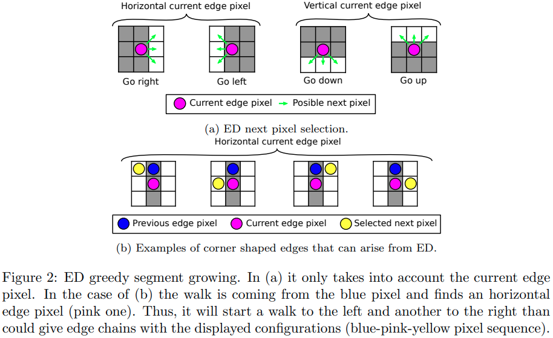

在我们的 EED 程序中，我们同时执行边缘绘制和线拟合。这将使我们能够通过减少检查像素的数量来节省计算。在步行过程的每一步中，我们都会考虑前一个像素和当前像素。这使我们能够避免原始 ED 算法会画一个角来打破线假设的情况（图 2b）。因此，我们在步行过程中探索相同的像素（参见图 3b 中的“向右走”、“向左走”、“向上走”和“向下走”），只要边缘方向与前一个像素相比没有变化到当前的。

当前一个像素处于垂直边缘，而当前像素处于水平边缘时，ED 有 6 个候选像素要添加到当前线段（见图 3a）。当前一个像素位于水平边缘而当前像素位于垂直边缘时，也会发生同样的情况。然而，如果我们现在添加边缘链应该形成一条线的假设，那么初始候选者的数量将从 6 个变为仅 2 个（参见图 3b 中的四个“对角线”情况）。这是EED算法的一个特点。它有两个优点：1）它比原来的 ED 路由算法更快，因为它探索更少的像素；2）它避免了寻找线段的无意义情况。

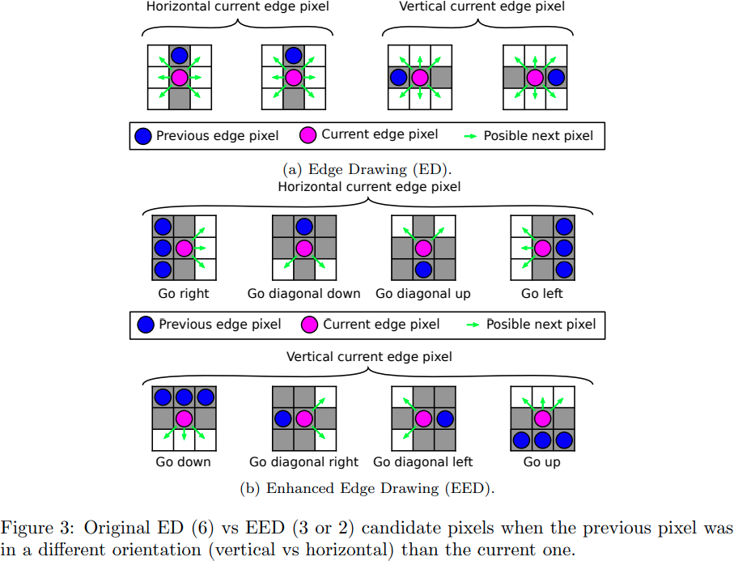

第二个重要的想法也是试图找到对齐的边缘像素的结果。当检测到边缘方向发生变化时，ED 会改变行走过程的方向（见图 4a），而 EED 会尝试沿着一条线继续沿同一方向前进。然而，边缘方向的任何变化都不会被遗忘，并且会被推入堆栈以供以后处理（参见算法 1）。如果链接了超过 $$T_{minLength}$$ 个像素并且像素对齐的平方误差低于 $$T_{LineFitErr}$$，EED 会尝试将一条线拟合到当前像素链。线段搜索的最后一个参数是 $$T_{PxToSegDist}$$，它是我们考虑像素是否适合当前线段的最大距离（以像素为单位）。这是在算法 1第 15 行的函数 addPxToSegment 内部完成的。当没有更多的像素可以链接时（即在图像的极限，只有已经访问过的像素或弱边缘像素作为候选）或检测到线边缘不连续（例如，两个对齐窗口之间的间隙，树枝遮挡建筑物的一部分等）过程停止。如果检测到不连续性，我们将按顺序执行以下操作：

1. 如果我们沿着一条线段行走（即我们已经拟合了一条线），请尝试沿线方向延伸它（行走过程使用算法 1，第 23 至 26 行 中的 canContinueForward 和 forwardPxAndDir 函数堆叠）
2. 如果我们沿着一条线段行走，我们不能继续向前，尝试向后延伸线段（行走过程使用算法 1 ，第 27 到 30 行中的 canContinueBackward 和 backwardPxAndDir 函数叠加）
3. 沿梯度方向继续，即在不连续处发生变化（行走过程叠加在 算法1，第 22 行）。

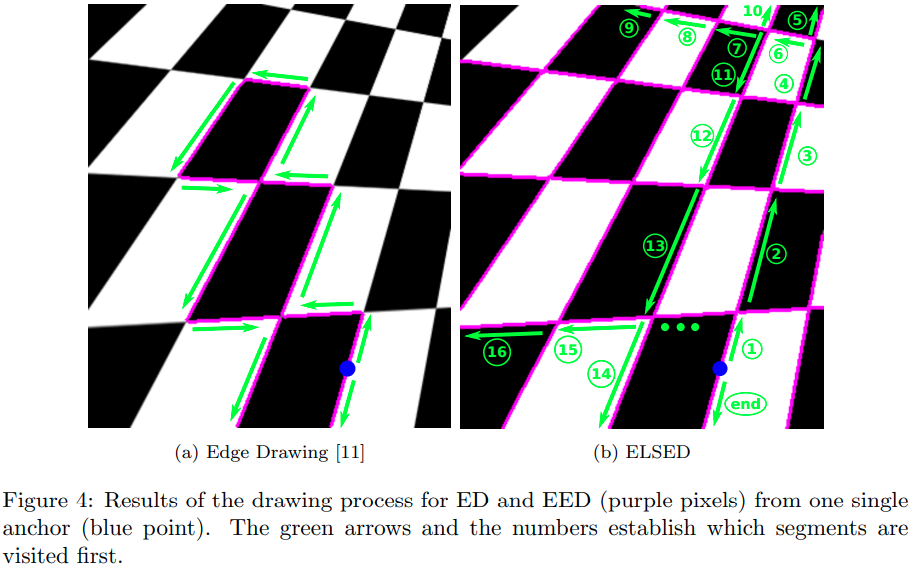

这个有序的动作序列保证如果检测到一条线段，它的所有像素将一起被检测到。

我们在图 4b 中展示了一个说明性示例，其中 EED 启动两个行走过程，一个向上，另一个向下。与 ED（见图 4a）不同，EED 检测棋盘角边缘方向的不连续性，并继续沿当前线方向行走。在线段 (1) 到 (5) 中的像素链接在一起后，从堆栈中提取检测到的最后一个边缘方向变化，并以与第一个长段像素相同的方式处理（即将段 (6) 的像素链接到 ( 9). 当堆栈中没有更多的边缘方向变化需要处理时，路由算法结束。然后，路由算法处理下一个锚点。能够从单个锚点检测更多的段是我们的一个重要特征正如我们将在实验 4.1 中展示的那样，增加关于 EDLines 的检测召回的方法。

### 3.2 线段不连续

一条线段可以被多个边缘不连续点打断。这些是梯度方向发生变化或梯度幅度变为零的图像区域。无论我们的目标是检测整条线还是仅检测线段，在绘制过程中都应正确跳过不同长度的不连续点（即没有边缘或边缘方向与线段不对齐的像素数）正确检测线段。

算法 1 自然地处理了这种现象。一旦检测到不连续性，我们的目标是跳过它并尽可能在线段方向继续绘制。先验的，不连续长度是未知的，我们的算法测试不同长度的候选者。由于我们使用 5 × 5 高斯平滑核，任何 1 像素的不连续性至少会影响大小为 5 像素的邻域，因此我们将最小不连续长度设置为 5 像素。在函数 canContinueFordward（算法 1，第 23 行）和 canContinueBackward（算法 1，第 27 行）中，检查了不同的跳跃长度 J（在算法的默认参数中，我们使用 J ∈ [5, 7, 9]）。绘图过程将在不连续后继续，如果以下条件为真：

1. 线段长于像素数J，我们要跳转。
2. 与线段对齐的像素 a 和远离当前像素 c 的 J 个像素位于图像内部并且 G[a] > 0（即不是弱边缘像素）。
3. 从a开始，EED能够沿着边缘方向绘制至少J个像素。我们称这组 J 像素为扩展像素。
4. 扩展像素与线段很好地对齐。为了检查这一点，我们计算了一个小邻域中图像梯度 M 的自相关矩阵（我们在扩展像素的每一侧取一个像素），然后我们断言：

$$
\frac{\lambda_1}{\lambda_2} \ge T_{EigenExt}
$$

​	其中 $$\lambda_1$$ 和$$\lambda_2$$ ( $$\lambda_1$$  >  $$\lambda_2$$ ) 是 M 的特征值，并且
$$
\angle(v_1,n) \le T_{AngleExt}
$$
​	$$\angle({\cdot},{\cdot})$$是角距，$$v_1$$是M的第一个特征向量，n为线段的法线向量。

在图 5 中，我们展示了合成图像中不连续性管理算法的不同步骤。在图 5d 中，我们展示了从图像左侧开始的检测过程，我们将边缘像素（蓝色）与水平线（绿色）相匹配。当边缘方向从水平变为垂直时，我们将最后一个边缘像素检测为异常值（橙色），因此我们的方法检测到我们处于不连续状态。在这种情况下，红色像素是$$|E|>T_{ol}$$时检测到的最后一个像素。其中$$T_ol$$是异常值的最大数量。

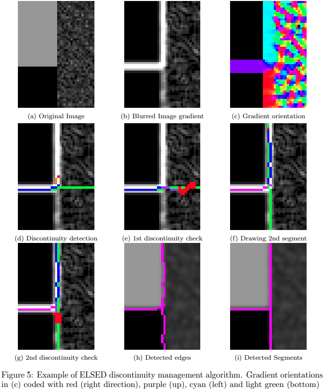

下一个子图 5e 显示了完成的检查，以确定我们是否应该继续直线绘制或线段已经完成。紫色像素是不连续点中的像素，在当前线段方向使用 Bresenham 算法绘制时会跳过。从不连续点 a 之后的第一个像素开始，沿着边缘方向（绿色）绘制红色像素。如果函数 canContinueForward 中的扩展像素，我们还将用于使用 M 的特征值验证区域的相邻像素标记为红色。这个合成示例中的像素没有统一的梯度方向，因此，该过程丢弃所有使用长度 J ∈ [5, 7, 9] 测试的扩展。在图中，我们显示了最后一个，J = 9。因此，该算法关闭了第一段并继续在主要梯度方向向上绘制。当收集到足够的像素时，我们会拟合另一个片段（图 5f）。当我们到达图像的顶部时，该段向后向下延伸。发生这种情况时，管理不连续性的机制将再次激活，如图 5g 所示，但这次该区域满足所有定义的标准，因此执行了跳跃。图 5h 和 5i 分别显示了拟合的边缘和片段。

局部线段检测方法的局限性之一是生成许多由梯度不连续性产生的小线段。上述过程帮助我们缓解了这一点。

### 3.3 生成线段候选者的验证

在 EED 之后，我们有几个线段检测，其中许多可能是错误的（见图 6 中的红色线段）。它们主要出现在边缘像素密度高的区域。为了验证一条线，我们使用线段像素的梯度方向，将其角度误差与线段的法线方向进行比较。可以有效地执行此验证，而不会损害整体性能。

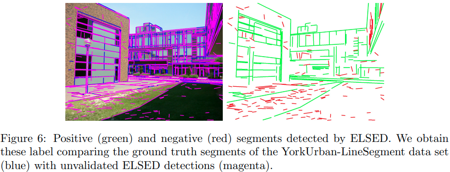

为了进行良好的验证，我们丢弃了位于不连续点和端点附近的像素，因为即使在正确的检测中，它们通常也具有不同的梯度方向。尽管如此，真实线段中的梯度方向误差是一个嘈杂的信号。在图 7 中，我们可以看到真阳性线段检测 (TP)（蓝色）、假阳性线段（FP）（橙色）和在随机噪声强度下检测到的假阳性线段（绿色）的像素方向误差的概率分布函数（PDF）图像。很明显，TP 段上的像素比 FP 上的像素具有更小的角度误差。但是，FP 和 TP 分布之间存在显着重叠。

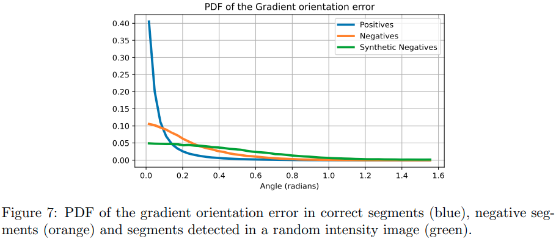

因此，我们使用对噪声具有鲁棒性的验证标准。如果至少 50% 的像素具有低于阈值$$T_{valid}$$的角度误差，我们将验证一个线段。为了将正检测（即有效检测）与负检测分开，我们学习了一个阈值 $$T_{valid}=0.15$$弧度，它保持高召回率并丢弃很少的真实检测。

### 3.4 参数选择

大多数 ELSED 参数已根据经验设置，用户无需更改。我们使用高斯平滑滤波器（σ = 1，内核大小 = 5×5），梯度阈值$$T_{grad}=30$$，锚点阈值 $$T_{anchor}=8$$ 和 SI = 2，它定义了每个 SI 行/列的锚点扫描间隔。对于线段拟合：$$T_{ol}=3$$，$$T_{minLength}=15$$，$$T_{LineFitErr}=0.2$$，$$T_{PxToSegDist}=1.5$$，对于验证 $$T_{EigenExt}=10$$，$$T_{AngleExt}=10/$$，$$T_{valid}=0.15$$ 弧度。

然而，用户可以调整其他参数来定义要检测的线段类型；将在不连续性管理中测试的跳跃长度列表就是这种情况。由于这与第一步中高斯平滑核的大小（在我们的实现中为 5×5）和梯度卷积核的大小（在我们的例子中为 3×3）直接相关，我们定义了一组默认值， (5, 7, 9)，在第 4.3 节的实验中提供了良好的结果。

## 4.实验

在本节中，我们介绍了一种评估线段检测器的准确性和可重复性的方法，并按照它来将我们的检测器与文献中最好的检测器进行比较。我们还提出了一项消融研究，以分析我们算法的每个组成部分如何对最终结果做出贡献。

我们从准确性和效率两个维度进行评估。为此，我们按照图 1 中的两个集群将算法分为两组。在第一组中，我们找到了在 CPU 中高效运行的算法（LSD、EDLine、AG3line 和 ELSED）。在第二组中，处理图像需要超过一秒的时间（MCMLSD、Linelet、HAWP、SOLD2、F-Clip）。虽然 HAWP、SOLD2 和 F-Clip 是 DL 方法并且应该在 GPU 中运行，但我们也在 CPU 上运行它们以显示每种方法的不同计算要求。还需要注意的是，大多数低功耗设备（如智能手机、无人机或物联网设备）通常不准备长时间运行 GPU。在我们的实验中，我们将 ELSED 的准确性和效率与每组中的方法进行了比较。

### 4.1 线段检测评估

我们评估了 YUD 数据集 [33] 中的线段检测，该数据集包含室内和室外人造场景，其中一些显着线段已被手动标记。稍后在 Linelet [19] 中对数据集进行了广泛的重新标记，其中包含场景中的所有线段，但也包含一些不一致的地方，例如瓷砖和电缆中的标签、小于 2 像素的线段或曲线上的线段以及价值可疑的对象。

Linelet [19] 和 MCMLSD [17] 是最早提出实证评估的两种方法。 Linelet 评估允许在ground truth标签和检测到的标签之间进行 1 对 N 检测，而 MCMLSD 方法基于成本矩阵 A 获得 1 对 1 分配，该矩阵是使用沿每个线段采样的点计算的，这很慢计算并可能导致非常接近的段中的错误匹配（参见图 8b）。 MCMLSD 还评估了从分配中获得的整个精确召回曲线，而 Linelet 仅使用其上的一个操作点。另一方面，线框线段检测度量[34]提出了结构平均精度（sAP）[22]。该指标可能会生成无意义的匹配，因为没有检查重叠、角度或垂直距离，而这些是正确匹配小片段所必需的。此外，由于使用最近邻分配而不是匈牙利算法，因此 1 对 1 分配的解决不是最优的。如果良好的匹配具有较大的结构距离，也可以省略它们，这种情况发生在碎片化的情况下。

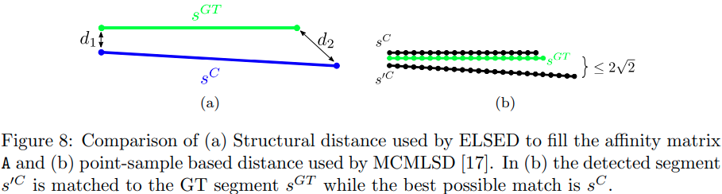

我们提出了一个新的评估框架，它结合了以前评估协议的优点，即计算速度快，是一种公平稳定的线段检测指标。我们通过使用匈牙利算法找到最佳二分匹配来确保良好的 1 对 1 匹配，分配问题使用成本矩阵 A 定义，该矩阵使用结构距离填充（见图 8a）。该指标是垂直距离、未对准和重叠之间的良好折衷。它的计算速度也比匹配的采样点数快。为了加速匈牙利算法并确保有意义的匹配，我们要求匹配段的并集交集大于 $$\lambda_{overlap}=0.1$$，角距离小于 $$\lambda_{ang}=15^{\circ}$$，垂直距离小于 $$\lambda_{dist}=2 \sqrt{2}$$ 。不满足这个条件的线段对，在A的相应条目中有无限的成本来避免它们的匹配。令 x 为检测到的线段集，y 为ground truth线段集。通过它们之间的 1 对 1 分配 A*，我们定义：

- $$\underline{Precision}$$：在检测到的线段$$x_i$$上测量的匹配交叉点的长度除以检测到的线段的长度

$$
P=\frac{\sum_{i,j \in A^*}X_i \cap x_i Y_i}{\sum_{i}|X_i|}
$$

- $$\underline{Recall}$$：在groundtruth线段$$y_j$$上测量的匹配交叉点的长度除以ground truth线段的长度

$$
P=\frac{\sum_{i,j \in A^*} Y_j \cap y_j X_i}{\sum_{j}|Y_j|}
$$

- $$\underline{Intersection \ over \ Union}$$：在ground truht线段上测量的匹配交叉点的长度除以在ground truth线段上测量的匹配并集的长度。

$$
IoU=\frac{\sum_{i,j \in A^*} Y_j \cap y_j X_i}{\sum_{i,j \in A^*} Y_j \cup y_j X_i}
$$

在图 9 中，我们展示了我们算法的 Precision-Recall 和最先进的检测器。这条曲线是计算 w.r.t.原始 YUD 数据集注释，我们使用原始代码提供的分数对每种方法生成的线段进行排序。对于 ELSED，分数是角度误差低于 $$T_{valid}$$ 的像素百分比。 ELSED 的曲线优于 LSD、EDLines 和 AG3line，这些方法能够在 CPU 上高效运行（见表 4）。我们获得了更好的精度并达到了相似或更高的召回率。 MCMLSD 获得了更好的召回率，但代价是精度非常差。这是意料之中的，因为它是唯一基于 HT 的方法，并且可以检测所有具有足够支持的完整线条，甚至是高纹理区域上的幻觉线条。 ELSED 之所以能够改进 AG3line，是因为它有更好的针对线段检测问题量身定制的绘图方案。在 ELSED 工作的召回范围内，ELSED 与最有效的 DL 方法 F-Clip (HG1) 相当。更深层次的网络，如 HAWP，需要 GPU 并且在 CPU 中远离实时，正如预期的那样，结果具有更好的召回率和精度。

在表 1 中，第 2 至 5 列显示了每种方法的 P-R 曲线中的最高召回值。它们对应于我们要求检测器检测尽可能多的线段的情况。最后两列显示了曲线所有 P-R 点的指标。如果我们使用原始 YUD 标签查看结果，ELSED 在 CPU 上的高效检测器中具有最佳精度 (0.3198)、F 分数 (0.4148) 和 IoU (0.7111)。它还在所有 Precision-Recall 点（Average Precision，AP）上获得了总体指标的最佳结果。 AP 是经典的分类指标，它偏向于具有更广泛召回范围的检测器。因此，我们还显示了 AP 与召回区间的界限，其中定义了每种方法的曲线 (bAP)。 ELSED 的 bAP 可与 F-Clip (HR) 媲美，但优于 F-Clip (HG1)。这意味着，尽管 ELSED 检测到的线段较少（召回范围低于 F-Clip），但它在检测到的片段中具有与顶级基于 DL 的方法相似的精度。

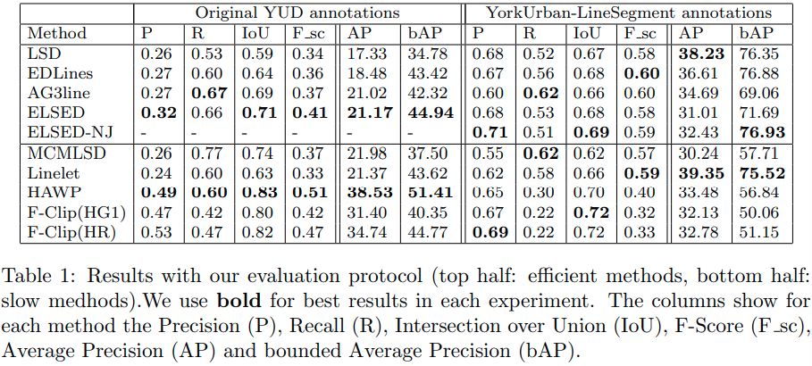

我们还展示了“YorkUrban-LineSegment 注释”[19] 的结果。在新注释中，线段的定义从原始 YUD 标签中的全局线更改为短线和虚线。在这种情况下，我们还展示了没有跳跃的 ELSED (ELSED-NJ) 的结果。 ELSED-NJ 获得了有竞争力的结果，在该数据集中的精度和 IoU 方面是最好的。这显示了拥有 ELSED 属性的好处，允许通过更改不连续点上的跳跃长度来调整段的定义以适应应用程序。

通过这些实验我们可以得出结论，尽管 ELSED 的设计目的是减少执行时间，但它在段检测精度方面也是一种有竞争力的算法。原因是 EED 过程适合段检测问题，并且跳过不连续点产生的输出与注释中段（即长段）的定义一致。

### 4.2 可重复性

无论旨在检测的线段类型如何，一个理想的特性是对视点、比例、旋转或光照变化的鲁棒性。在本小节中，我们评估检测器的可重复性。给定同一场景在不同条件下的两张图像，在两种情况下检测相同片段的能力。具体来说，给定两幅图像，我们将线段重复性定义为一对一线段匹配的长度与两幅图像中检测到的线段总长度之间的比率。我们只考虑位于两个图像中存在的场景部分的片段，相应地调整它们的端点。

我们使用 HPatches [35] 的图像，其中图像 A 和 B 中的线段检测的可重复性计算如下：
$$
repeatability=\frac{\sum_{i,j \in A^*} X^A_i \cap x^A_i X^{A|B}_i}{\sum_i |X^A_i| + \sum_j |X^{A|B}_j|} + \frac{\sum_{i,j \in B^*} X^B_i \cap x^B_i X^{B|A}_i}{\sum_i |X^B_i| + \sum_j |X^{B|A}_j|}
$$
其中$$X^I$$是在图像I中检测到的片段，$$x^{I|J}$$ 是在图像 J 中检测到的片段，使用它们之间的单应性投影到 I。匹配矩阵 A * 包含通过 4.1 小节中描述的匹配过程获得的线段$$x^A$$和$$x^{A|B}$$之间的一对一段分配和在$$x^B$$和$$x^{B|A}$$之间的$$B^*$$。

在表 2 中，第二列还显示了匹配线段数方面的重复性。根据 [26]，我们在这里使用$$\lambda_{overlap}=0.5$$和$$\lambda_{dist}=5$$ 。在这两种情况下，ELSED 都获得了最可重复的结果。这是因为 EED 为边缘检测提供了稳定性，也因为跳跃策略能够克服导致其他局部方法失败的小不连续性。我们还观察到像 SOLD2 或 HAWP 这样的深度模型在某些场景中得到了高度可重复的结果，而在另一些场景中得到了非常糟糕的结果，这可能是因为它们是针对一个非常具体的问题（室内场景的线框解析）而不是针对可以在 Hpatches 中找到的各种图像

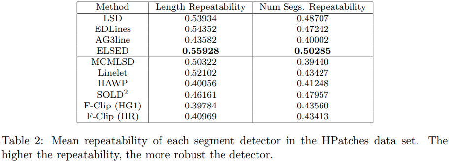

### 4.3 消融研究

我们从最简单的 ELSED 版本开始：没有不连续性跳跃，也没有验证步骤（见表 3）。对于长段检测，此版本的算法获得了最差的结果（表 3 中的 IoU= 0.646 和 F sc= 0.360）。当激活验证时，精度从 0.271 增加到 0.307，而召回率仍然很高 (0.59)。

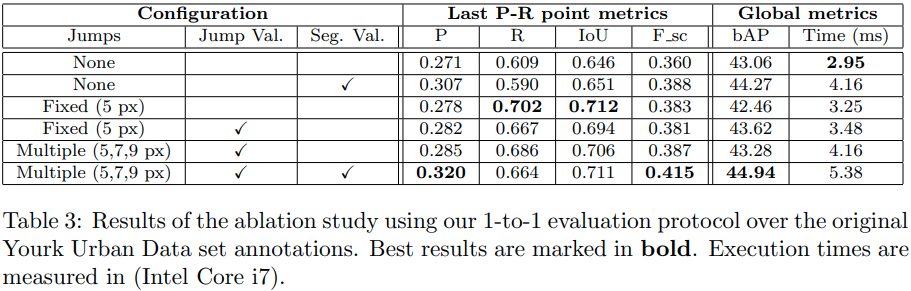

如果我们现在添加固定长度为 5 像素的不连续跳跃组件，它会消除一些小的检测错误。例如，在图 10 的第二行和列中，左侧墙壁的破损部分，增加了固定长度的跳跃能力，被检测为一个独特的部分。另一方面，现在该算法会执行一些超出段端点的错误跳跃。这种效果可以在表 3 的结果中观察到，其中 Recall 有了很大的飞跃（从 0.609 到 0.702），Precision 也适度增加（从 0.271 到 0.278）。为了解决跳转不正确的问题，我们添加了 3.2 节跳转目标区域的验证（参见图 10 中第三列的拟合良好的端点）。

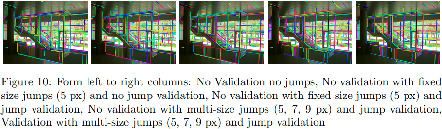

另一方面，如果不连续性很大，则 5 个像素的跳跃不够大。在这种情况下，跳跃验证是在不连续点上的像素上执行的。因此，由于不连续性包含与线段法线不同方向的梯度，因此跳跃验证失败。这就是为什么我们在图 10 的第四列中添加多长度跳跃的原因。有了它，我们可以处理更长的段不连续性。最后一步是对图 10 最后一列中显示的整个检测到的片段（参见第 3.3 节）的验证。片段验证提高了精度（从 0.285 到 0.320），召回率有小的惩罚（从 0.686 到 0.664） .

### 4.4 效率评估

如今的 CV 应用不仅需要良好的准确性，还需要快速的执行时间和低能耗。该实验测量了包含 101 640 × 480 图像的 YUD 数据集图像的平均执行时间。时间是在四个不同的平台上测得的：配备 Intel Core i7 8750H CPU、12 核和 16GB RAM 的笔记本电脑；配备 Exynox Octa S CPU、8 核和 2GB RAM 的智能手机 Samsung J5 2017；配备骁龙 855 CPU、8 核和 6GB 内存的智能手机 One Plus 7 Pro 以及配备 4GB RAM的 GPU GeForce GTX 1050。

我们使用每种方法的作者提供的实现：C++ 中的 LSD、EDLines AG3line 和 ELSED，Matlab 中的 Linelet 和 MCMLSD 以及 Python 中的 HAWP、SOLD2 和 F-Clip。 ELSED 是在 C++ 中通过 Python 绑定实现的。为了保持快速执行时间，我们只计算 L1 梯度范数，它比 L2 更快，以及主要梯度方向（垂直或水平）。我们使用我们增量计算的垂直或水平方向的最小二乘法来拟合这些段，如果可能的话，我们在 EED 算法中重用堆栈的顶部元素。

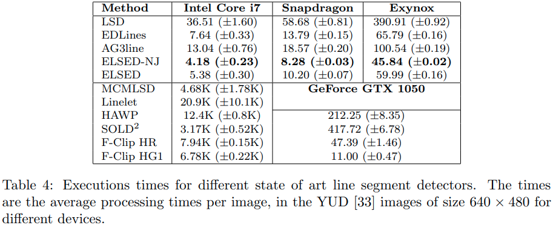

在所有平台中，ELSED 比 AG3line 和 EDLines 快 2 倍左右，比 LSD 快 6 倍，比 MCMLSD 和 Linelet 快得多。 DL 方法旨在在 GPU 中运行，但是 GPU 在某些平台（如无人机、物联网或手机）中可能并不总是可用，而且当它可用时，它通常涉及无法承受的能源消耗。查看 CPU 时间，DL 方法需要比 ELSED 多 2300× (HAWP) 和 1200× (F-Clip HG1) 的计算。此外，即使我们在笔记本电脑 GPU (Geforce GTX 1050) 上运行 DL 方法，ELSED 仍然比任何方法都快。因此，对于有限的平台，ELSED 代表了一个明确的替代方案，因为它不仅具有更快的执行时间，而且它比其他有效方法（见表 1）检测得更好，获得最可重复的段（表 2）。

## 5.结论

在实验部分，我们展示了 ELSED 是一种通用线段检测器，能够在几毫秒内检测出准确的线段。 ELSED 实现的执行时间是由于将边缘绘制和线段检测过程结合在一个镜头中，以及针对线段检测问题而设计的增强边缘绘制 (EED) 策略的结果。

ELSED 为有效方法解决的另一个重要问题是对小图像噪声和遮挡的鲁棒性，这些噪声和遮挡会导致大多数检测器打断片段。这在诸如消失点估计或基于片段的重建等问题中尤为重要，在这些问题中，几何信息的重复性可能会使算法的后续步骤失败。

总的来说，ELSED 是文献中最快的片段检测器，在片段检测和可重复性基准测试中也获得了相当有竞争力的结果，达到了与其他算法相比慢几个数量级的相同水平的最先进精度。这些属性使其成为实时应用程序的理想选择，例如视觉里程计、SLAM 或低功耗设备中的自定位。