# End-to-End Wireframe Parsing

## 摘要

我们提出了一种概念上简单但有效的算法来检测给定图像中的线框 [14]。与之前的方法 [14, 33] 首先预测中间热图，然后使用启发式算法提取直线相比，我们的方法是端到端可训练的，并且可以直接输出包含语义上有意义和几何上的向量化线框突出的连接点和线路。为了更好地了解输出的质量，我们提出了一种新的线框评估指标，用于惩罚重叠的线段和不正确的线连接。我们进行了广泛的实验，并表明我们的方法明显优于以前最先进的线框和线提取算法 [14、33、32]。我们希望我们的简单方法可以作为未来线框解析研究的基准。代码已在 https://github.com/zhou13/lcnn 公开。

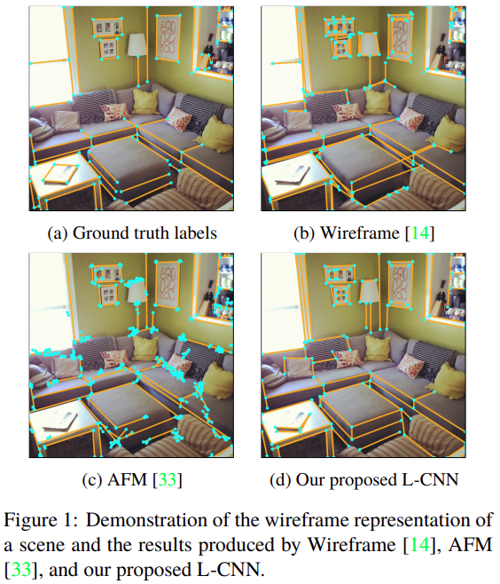

## 1.引言

对象识别 [17, 31, 29, 13] 和大规模数据集 [28, 3, 2, 1] 的最新进展使得识别、提取和利用高级几何特征或全局结构进行基于图像的 3D 重建场景成为可能。与传统 3D 重建系统（如运动结构 (SfM) 和视觉 SLAM）中使用的局部特征（SIFT [21]、ORB [27] 等）不同，高级几何特征提供了关于全局几何的更显著和稳健的信息的场景。这一研究方向引起了人们对提取结构的兴趣，例如线和连接点（线框）[14]、平面 [34、20]、表面 [11] 和房间布局 [37]。

在所有高级几何特征中，直线及其连接点（统称为线框 [14]）可能是可用于组装场景的 3D 结构的最基本元素。最近，诸如[14]之类的工作通过提供一个注释良好的数据集、一个基于学习的框架以及一组评估指标来鼓励对线框解析的研究。尽管如此，现有的线框解析系统非常复杂，仍然不足以用于具有复杂线连接的复杂场景。本文的目标是探索一个干净有效的解决方案来解决这个具有挑战性的问题。

现有的研究 [14, 33] 分两个阶段解决线框解析问题。首先，输入图像通过深度卷积神经网络生成逐像素的连接点和线热图（或其变体 [33]）。之后，使用启发式算法搜索生成的热图，以找到连接点位置、矢量化线段及其连接性。虽然这些方法直观且在当前文献中广泛使用，但它们的矢量化算法通常很复杂并且依赖于一组启发式算法，因此有时会导致较差的解决方案。受 [4, 12, 9] 的启发，其中端到端管道的性能优于其逐级对应部分，我们假设使线框解析系统端到端可训练也可以推动最新技术。

因此， 本文我们解决了如下问题：

如何以端到端可训练的方式学习线框的矢量化表示？

为此，我们提出了一种称为 L-CNN 的新网络，这是一种使用单一且统一的神经网络执行端到端线框解析的算法。我们的网络可以分为四个部分：特征提取backbone、连接点提议模块和由线路采样模块桥接的线路验证模块。以 RGB 图像作为输入，神经网络直接生成矢量化表示，无需使用启发式算法。我们的系统是完全可微的，可以通过反向传播进行端到端的训练，使我们能够充分利用最先进的神经网络架构的力量来解析场景。

此外，当前的线框评估指标将线视为独立像素的集合，因此无法考虑线连接的正确性，如 4.3 节所述。为了评估线框的这种结构正确性，我们引入了一个新的评估指标。我们提出的新指标使用线匹配来计算向量化线框上的精度和召回曲线。我们对线框数据集 [14] 进行了广泛的实验，并仔细研究了不同系统设计选择的影响。

## 2.相近工作

**线检测：**线检测是计算机视觉中广泛研究的问题。它旨在从图像中生成矢量化线表示。 [30, 32] 等传统方法基于局部边缘特征检测线。最近，[33] 将基于深度学习的特征与 [32] 中的线向量化算法相结合。与线框表示不同，传统的线检测算法不提供关于连接点以及线和连接点如何相互连接的信息，这限制了其在场景解析和理解中的应用。

**线框解析：**[14] 提出了线框解析任务。作者训练了两个独立的神经网络，以从输入图像中预测连接点和线热图。之后，使用启发式线框融合算法将两个预测结合起来，以产生最终的矢量化输出。虽然它很直观并且可以产生合理的结果，但这种两阶段的过程阻碍了端到端训练的好处。相比之下，我们的框架基于单个端到端的可训练神经网络，它直接提供矢量化线框表示作为输出。

**实例级识别：**在技术层面，我们的方法受到实例级识别框架的启发，例如 Fast R-CNN [9]、Faster R-CNN [25]、CornerNet [18]、Extremenet [35]。我们的管道和 LoI pooling（第 3.6 节）在概念上类似于 Faster R-CNN 和 Fast R-CNN 中的 RoI pooling(将输入图像的ROI框的尺寸转换为输出特征图上的对应尺寸)。两种方法都首先生成一组预测并提取特征以对这些预测进行分类。不同之处在于，在 [25, 9] 中，候选预测是通过滑动窗口方式生成的，而我们的预测是通过连接显著连接点生成的（线采样模块第 3.5 节）。从这个意义上说，预测生成过程也类似于基于点的对象检测 [18, 35] 中使用的过程。区别在于如何区分真线和假阳性。他们使用点特征嵌入 [18] 之间的相似性或几个显著点 [35] 几何中心的分类分数，而我们的提取特征以馈送到小型神经网络（线验证网络第 3.6 节）。

## 3.方法

### 3.1 数据表示

我们对线框的表示是基于图论的符号。它也可以看作是 [14] 中线框定义的简化版本。令 W = (V, E) 是图像的线框，其中 V 是连接点索引的集合，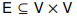 是由 V 中的连接端点对表示的线的集合。对于每个 i ∈ V，我们使用 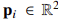 来表示图像空间中连接点 i 的（ground truth)坐标。

### 3.2 网络整体架构

图 2 说明了 L-CNN 架构。它包含四个模块：1）特征提取backbone（第 3.3 节），将单个图像作为输入，并为后续模块提供共享的中间特征图； 2) 一个连接点预测模块（第 3.4 节），它输出候选连接点； 3) 一个线采样模块（第 3.5 节），它根据来自连接点预测模块的连接点输出线预测； 4) 一个线验证模块（在第 3.6 节中），它对预测的线进行分类。 L-CNN 的输出是连接点的位置和这些连接点之间的连接矩阵。我们的系统完全可以通过随机梯度下降进行端到端训练。

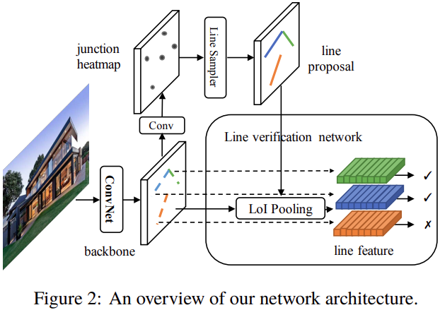

### 3.3 Backbone网络

backbone网络的功能是为 L-CNN 的连续模块提取语义上有意义的特征。我们选择堆叠沙漏网络 [23] 作为其效率和有效性的backbone。输入图像被调整为正方形。堆叠沙漏网络首先通过两个 2 步长卷积层在空间分辨率中对输入图像进行两次下采样。之后，学习到的特征图由多个类似 U-Net 的模块 [26]（沙漏模块）逐渐细化，并对每个模块的输出施加中间监督。网络的总损失是这些模块损失的总和。

### 3.4 连接点预测模块

**连接点预测：**我们使用 [14] 的简化版本来估计线框中的候选连接点位置。分辨率为 W × H 的输入图像首先被划分为 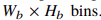。对于每个 bin，神经网络预测其内部是否存在连接，如果存在，它还预测其在该 bin 内的相对位置。在数学上，神经网络输出一个连接似然图 J 和一个偏移图 O。对于每个 bin b，我们有

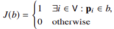

和

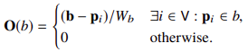

其中b表示bin b的中心位置，p表示V中顶点的位置。

为了预测 J 和 O，我们设计了一个由两个 1×1 卷积层组成的网络头，将特征图转换为 J 和 O。我们将预测 J 的问题视为分类问题，并使用平均二元交叉熵损失。我们使用 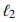 回归来预测偏移图 O。由于偏移 O(b) 的范围以 [−1/2, 1/2) × [−1/2, 1/2) 为界，因此我们附加了一个 sigmoid 激活在头部之后偏移-0.5以标准化输出。 O 上的损失在包含每个输入图像的ground-truth 连接点的 bin 上进行平均。

**非极大值抑制：**在实例级识别中，应用非极大值抑制（NMS）来去除正确预测周围的重复。我们使用相同的机制来去除正确预测周围的模糊分数图，并得到 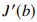：

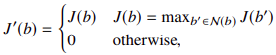

其中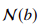表示b邻近的8个bins。在这里，我们抑制了连接点图上不是局部最大值的像素值。这种非极大值抑制可以通过最大池化算子来实现。连接点预测网络的最终输出是在 J ' 中概率最高的前 K 个连接点位置 。

### 3.5 线采样模块

给定来自连接点预测模块的 K 个最佳候选连接点列表 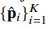，线采样模块的目的是在训练阶段生成线候选列表 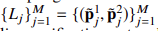 ，这样线验证网络就可以学习预测线的存在。这里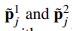表示第j个候选线段的两个端点的坐标。在这个任务中，正样本和负样本的数量非常不平衡，我们通过仔细设计采样机制来解决这个问题，如下所述。

**静态线采样器：**对于每张图像，静态线采样器返回 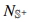正样本和 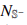 负样本，它们直接从ground truth标签导出。我们称它们为静态样本，因为它们与预测的候选连接点位置无关。正线样本是从所有ground truth线统一采样的，用 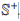表示，具有相应连接点的ground truth坐标。总负线样本的数量为 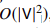，与正样本的数量 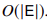 相比，这是巨大的。为了缓解这个问题，我们从  中采样负线，一组可能难以分类的负线。我们使用以下启发式方法来计算  ：我们首先将所有ground truth线光栅化到 64 × 64 低分辨率位图上。然后，对于由一对不是ground truth线的ground truth连接点形成的每个可能的连接，我们将其硬度分数(hardness score)定义为沿这条线的位图上的平均像素密度。对于每张图像，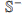 被设置为硬度分数最高的前 2000 条线。

**动态线采样器：**与静态线采样器相比，动态线采样器使用来自连接点预测模块的预测连接点对线进行采样。采样器首先将所有预测的连接点与ground truth连接点进行匹配。设 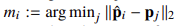是第 i 个候选连接点的最佳匹配 ground truth 连接点的索引。如果 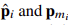 之间的 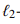距离小于阈值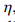，我们说候选连接点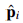 匹配。对于每一条候选线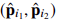，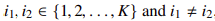 ，我们根据以下标准将其放入线集 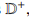 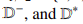中：

- 如果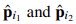匹配，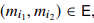，我们将这条线添加到正样本集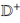；
- 如果匹配，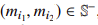，我们将这条线添加到硬负样本集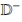；
- 随机样本集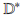包括来自预测连接点的所有候选线，无论它们的匹配结果如何。

最后，我们从正样本集中随机选择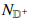条线，从硬负样本集中选择 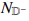条线，从随机行样本集中选择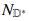条线，并将它们的并集作为动态线样本返回。

一方面，当来自动态采样器的准确正样本很少时，静态线采样器有助于在开始时冷启动训练。它还通过添加ground truth正样本和硬负样本来补充动态采样器，以帮助联合训练过程。另一方面，动态线采样器通过使线端点适应预测的连接点位置来提高线检测的性能。

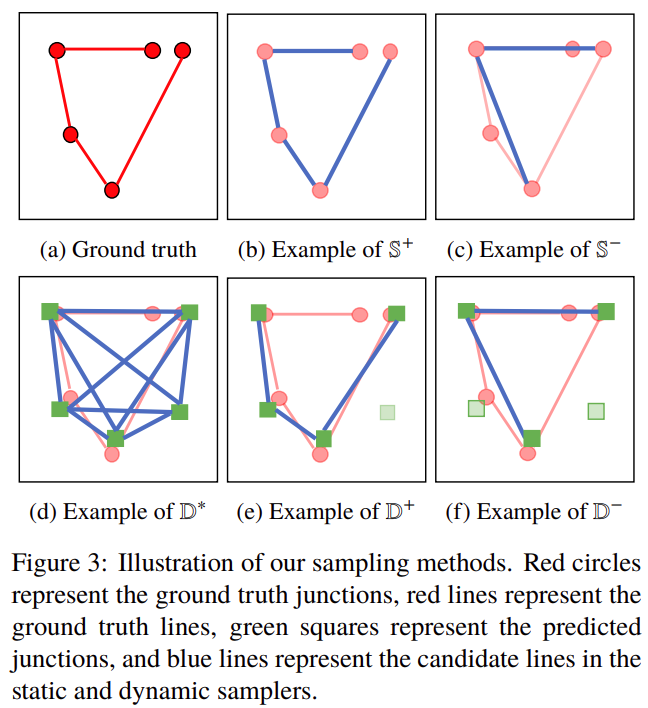

### 3.6 线验证网络

线验证网络将候选线列表  以及来自backbone网络的图像的特征图作为输入并预测每条线是否在场景的线框中。在训练过程中，L 由线采样模块计算，而在评估过程中，L 被设置为每对预测的连接点 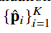 。

对于每个候选线段 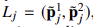，我们将其两个端点的坐标输入到感兴趣线 (LoI) 池化层（下面介绍)，它返回一个固定长度特征向量。然后，我们将连接的特征向量传递到由两个全连接层组成的网络头中，并得到一个 logit。线的损失是logit和这条线的标签之间的sigmoid二元交叉熵损失，即正样本或负样本。为了保持正负样本之间的损失平衡，线验证网络的每张图像上的损失是两个分离损失的总和，分别在正线和负线上平均。

**LOI Pooling:**为了检查图像中是否存在线段，我们首先将线段转换为特征向量。受来自对象检测社区 [10, 9, 25, 12] 的 RoIPool 和 RoIAlign 层的启发，我们提出了 LoI 池化层来提取线特征，同时它可以将梯度反向传播到backbone网络。

每个 LoI 由其两个端点的坐标定义，即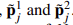。 LoI 池化层首先使用线性插值计算沿线的 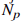个均匀间隔的中间点的坐标。

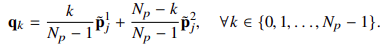

然后，它使用双线性插值来计算backbone特征图中那些  点的特征值，以避免量化伪影[4,15,6,12]。生成的特征向量具有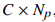的空间范围，其中 C 是来自backbone网络的特征图的通道维度。之后，LoI 池化层通过 1D 最大池化层减小特征向量的大小。结果特征向量的大小为 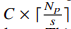，其中 s 是最大池化层的步幅大小。然后将该向量展平并作为 LoI 池化层的输出返回。

## 4.实验

### 4.1  实施细节

我们使用堆叠沙漏网络 [23] 作为我们的backbone。给定一个输入图像，我们首先应用一个 7 × 7 stride-2 卷积，三个通道维度为 64 的残差块，并在其上附加一个 stride-2 最大池化。然后这个中间特征表示被输入到两个堆叠的沙漏模块中。在每个沙漏中，特征图使用 4 个 stride-2 残差块进行下采样，然后使用最近邻插值进行上采样。每个残差块的输入通道和输出通道的维度都是 256。J 和 O 的网络头包含一个 3 × 3 卷积层，使用 ReLU 非线性，并通过一个 1×1 的卷积层来匹配输出维度将通道数减少到 128。

在将特征图输入线验证网络之前，我们使用 1×1 卷积核将特征维度从 256 减少到 128。对于 LoIPool 层，我们沿每条线选取 Np = 32 个点作为线的特征，从而为每条线生成 128 × 32 的特征。之后，我们应用一维 stride-4 最大池化将线特征的空间维度从 32 降低到 8。我们最终的线特征的维度为 128 × 8。然后线验证网络的头部采用扁平化的特征向量并将其馈入两个具有 ReLU 非线性的全连接层，其中中间层有 1024 个神经元。

所有实验均在单个 NVIDIA GTX 1080Ti GPU 上进行，用于神经网络训练。我们使用 ADAM 优化器 [16]。学习率和权重衰减分别设置为 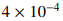 和 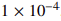。batch size设置为 6 以最大化 GPU 内存占用。我们将网络训练 10 个 epoch，然后将学习率降低 10。我们在 16 个 epoch 停止训练，因为验证损失不再减少。总培训时间约为8小时。所有输入图像的大小都调整为 (H, W) = (512, 512)，我们对 J 和 O 使用 Hb × Wb = 128 × 128 个 bin。连接点提议网络输出最佳的 K = 300 个连接点。对于线采样模块，我们使用 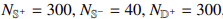，。J、O 和线验证网络的多任务学习的损失权重分别设置为 8、0.25 和 1。调整这些权重，使损失的大小具有相似的比例。

### 4.2 数据集

我们在 ShanghaiTech 数据集 [14] 上进行了大部分实验。它包含5462张人造环境图像，其中5000张图像作为训练集，462张图像作为测试集。该数据集的线框注释包括突出连接点 V 和线 E 的位置。我们还在 York Urban 数据集 [7] 上测试了使用 ShanghaiTech 数据集训练的模型，以评估所有方法的普遍性。

### 4.3 评估指标

以前，研究人员使用两个指标来评估检测线框的质量：基于热图的 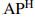 来评估线和连接点AP 来评估节点。在本节中，我们首先对这些指标进行简要介绍，并讨论它们不适用于线框解析任务的原因。然后我们给出了一个新的指标，称为结构 AP，这是一种更合理的评估线框结构质量的方法。

**Precision and Recall of Line Heat Maps:**线堆图上的精度和召回率曲线通常用于评估线框和线检测的性能 [14, 33]。给定一个矢量化表示（线条或线框），它首先通过对线条进行光栅化来生成置信度热图。为了将其与ground truth热图进行比较，运行将每个像素独立地视为图形节点的二分匹配以在两个热图之间进行匹配。然后根据每个像素的匹配和置信度计算精度和召回曲线。在我们的实验中，我们使用该指标提供了对不同方法的分析。我们将 F 分数（如 [33]）和 PR 曲线下面积（类似于 [8]）显示为定量测量，并将它们分别写为  和 。

这些指标最初是为评估边界检测 [22] 而设计的，它们可以很好地实现这一目的。然而，它们在线框检测中存在问题，因为

1. 它们不会因重叠线而受到惩罚(图 4a)；
2. 他们没有正确评估线框的连接性(图 4b)。

例如，如果将一条长线分成几条短线段，则生成的热图与ground truth热图几乎相同，如图 4 所示。上述两个属性的良好性能对下游依赖于线连接正确性的任务至关重要，例如通过线推断 3D 几何 [24, 36]。

**Structural AP:**为了克服这些缺点，我们提出了一个在矢量化线框而不是热图上定义的新评估指标。我们称我们的度量结构平均精度（）。该指标的灵感来自于对象检测中常用的平均精度 [8]。结构 AP 定义为从所有测试图像上检测到的线段的评分列表计算的精确召回曲线下的面积。召回率是正确检测到的线段（达到截止分数)与所有ground truth线段的比例，而精度是正确检测到高于该截止值的线段与所有检测到的线段的比例。

一个检测的线段只有当下式成立被认为是真阳性(正确)

其中是用户定义的数字，表示度量的严格性。在本节实验中，我们评估结构AP于在128x128的分辨率下。我们分别将它们缩写为  。此外，为了惩罚双重预测线，每个ground truth线段不允许匹配超过一次。也就是说，如果存在排在线 之上的线并且

那么线将一直被标记为一个假阳性。

**Junction mAP:**线检测和线框检测之间的主要区别在于线框表示对连接位置进行编码。连接点在 3D 中具有物理意义（拐角或遮挡点），并对线路连接信息进行编码。我们的连接点平均 AP () 评估线框检测算法的矢量化结点的质量，而不依赖于 [14] 中的热图。为了更好地理解显式建模连接点的优势，我们还使用如下所述的连接点 mAP 评估我们的方法：对于给定的预测连接点位置排名列表，如果该连接点与其最近的ground truth之间的  距离小于一个阈值，则认为该连接点是正确的。每个ground truth 连接点只允许匹配一次，以惩罚双重预测的连接点。使用这个标准，我们可以通过计算真假阳性的数量来绘制精确召回曲线。连接点 AP 定义为该曲线下的面积。平均连接点 AP 定义为连接点 AP 在差异距离阈值上的平均值。在我们的实现中，我们选择在 128×128 分辨率下超过 阈值为0.5、1.0 和 2.0 的平均值。

### 4.4 消融研究

在本节中，我们在 ShanghaiTech 数据集 [14] 上进行了一系列消融实验，以研究我们提出的方法。我们使用我们的结构平均精度（)作为评估指标。结果如表1所示。

**线采样模块:**我们比较了线采样模块的不同设计选择，如表 1 所示。(a) 仅使用来自动态采样器的随机对。  为 43.7，用作基线。 (b) 仅使用来自ground truth连接点的采样对，并获得更差的性能。当评估标准宽松时，性能差距甚至更大。这是因为（b）没有考虑连接点预测图的不完善性，并且无法解决连接点与ground truth略有偏差的问题。之后，我们将随机动态采样和静态采样结合起来，显着提高了性能，如表 1（c）所示。然后我们添加动态采样器候选  ，这导致 (f) 中的最佳得分为 58.9。该实验表明，精心挑选的动态线候选对良好的性能至关重要。最后，通过比较 (e) 和 (f)，我们发现与仅在 中进行随机抽样相比，包含困难示例  确实有帮助。

**线验证网络：**表 1 还显示了我们对如何设计线路验证网络的消融。我们尝试了两种不同的设计：在表 1 (e) 中，我们在 LoI Pooling 特征之后应用两个全连接层来获得分类结果，而在表 1 (d) 中，我们首先对特征应用一维卷积和然后使用扁平化特征向量上的全连接层得到最终的线分类。实验表明，使用卷积在很大程度上会降低性能。我们假设这是因为线分类需要位置敏感性，而平移不变卷积无法提供 [5, 19]。

### 4.5 与其他方法比较

按照 [14, 33] 的实践，我们将我们的方法与 LSD [32]、基于深度学习的线检测器 [33] 以及来自 ShanghaiTech 数据集论文 [14] 的线框解析器进行比较。具有不同阈值的 用于定量评估这些方法。所有模型都在 ShanghaiTech 数据集上进行了训练，并在 ShanghaiTech [14] 和 York Urban 数据集 [7] 上进行了评估。结果如表 2 和图 5 所示。我们注意到 APH 的数字和曲线与 [14, 33] 的差异是由于我们对的实现更正确：1)在 [14] 提供的代码中，他们评估每张图像的精度和召回率并将它们平均在一起，而我们首先将数据集上的真阳性和假阳性的数量相加，然后计算精度和召回率。 2)由于阈值数量不足，[14, 33] 中的 PR 曲线并未涵盖算法可以实现的所有召回率。我们在更多阈值上评估所有方法，以尽可能延长曲线。

图 5a 显示我们的算法在基于热图的线度量的 PR 曲线下优于最先进的线检测器方法，尤其是在高召回率区域。这表明与其他方法相比，我们的方法可以找到更多正确的线。我们还定量计算了 F 分数和平均 AP。表 2 显示，我们的算法在中的性能明显优于以前最先进的线检测器，提高了 13.3 分，在 中提高了 4.0 分[33]。我们还想强调，与线检测相比，线框检测方法在概念上更难，在基于热图的指标方面达到与线检测方法相同的性能。这是因为线框检测算法要求连接点的位置，即线的端点是正确的，而线检测器可以任意开始和结束一条线以“填充”线热图。在评估基于指标的热图之前，我们对来自 L-CNN 的线条进行后处理以消除重叠，如附录 A.1 中所述。

然后，我们使用我们提出的结构 AP 评估所有方法。精确召回曲线如图 5b 所示（这里缺少 LSD，因为它的分数太低而无法绘制）。我们的方法与以前的方法之间的差距更大。我们的方法比以前的最先进方法实现了 40 点的  改进。这是因为我们的线路验证网络会惩罚不正确的结构，而 AFM 和线框解析器等方法使用手工算法从热图中提取线路，其中连接点连接的信息会丢失。此外，[14] 的作者提到他们的矢量化算法将打破线条并添加连接点以更好地拟合预测的热图。这种行为会恶化结构的正确性，这可能解释了它的低  分数。

 结果如表 2 所示。对于 AFM，我们将每条线的端点视为连接点，并使用线 NFA 分数作为其端点的分数。我们注意到 AFM 的连接点质量差并不是因为他们的方法设计得不好，而是最终任务不同。这表明不能直接将线检测算法应用于线框解析任务。此外，由于pipeline的联合训练过程，我们的 L-CNN 大大优于之前的线框解析器 [14]。、

表 2 和图 5c 和 5d 表明，在没有微调的不同数据集 [7] 上进行测试时，L-CNN 在所有线框和线检测方法中也表现最好。这表明我们的方法能够推广到新的场景和数据。我们注意到，相对较低的  分数是由于重复的线条、纹理线条，同时在数据集的注释中缺少许多长线条。

### 4.6 可视化

我们在图 6 中可视化了算法的输出。连接点标记为青蓝色，线条标记为橙色。使用附录 A.1 中的方法对来自 L-CNN 的线框进行后处理。由于 LSD 和 AFM 没有明确输出连接点，我们将线的端点视为连接点。如图 6 所示，LSD 检测到一些没有语义意义的高频纹理。这是预期的，因为 LSD 不是数据驱动的方法。通过训练 CNN 来预测线热图，AFM [33] 能够抑制一些噪声。然而，LSD 和 AFM 仍然会产生很多短线，因为它们没有明确的连接概念。线框解析器 [14] 利用连接点来提供相对更清晰的结果，但它们的启发式矢量化算法不是最理想的，并且会导致交叉线和错误连接的连接点。相比之下，我们的 L-CNN 使用强大的神经网络来分类一条线是否确实存在，从而提供最佳性能。

