# Line Segment Detection Using Transformers without Edges

## 摘要

在本文中，我们提出了一种使用 Transformers 的联合端到端线段检测算法，该算法无需后处理和启发式引导的中间处理（边缘/连接点/区域检测）。我们的方法名为 LinE segment TRansformers (LETR)，通过跳过边缘元素检测和感知分组处理的标准启发式设计，利用了在Transformers中集成标记化查询、自注意机制和编码 - 解码策略的优势。我们为 Transformers 配备了多尺度编码器/解码器策略，以在直接端点距离损失下执行细粒度线段检测。该损失项特别适用于检测几何结构，例如不能方便地由标准边界框表示表示的线段。Transformers通过自注意力层学习逐渐细化线段。在我们的实验中，我们展示了 Wireframe 和 YorkUrban 基准的最新结果。

## 1.引言

线段检测是一个重要的中级视觉过程 [22]，可用于解决各种下游计算机视觉任务，包括分割、3D 重建、图像匹配和配准、深度估计、场景理解、目标检测、图像编辑、和形状分析。尽管具有实际和科学重要性，线段检测仍然是计算机视觉中未解决的问题。

尽管密集的逐像素边缘检测已经取得了令人印象深刻的性能[32]，但可靠地提取语义和感知意义的线段仍然是一个进一步的挑战。在自然场景中，感兴趣的线段通常在杂乱的背景中具有局部模糊或部分遮挡的异构结构。在检测到的边缘 [3] 上操作的形态学算子 [27] 通常会给出次优结果。Geatalt laws [10] 和上下文信息 [28] 等中级表示可以在感知分组中发挥重要作用，但它们通常难以无缝集成到端到端线段检测pipeline中。深度学习技术 [16, 20, 14, 32] 提供了极大增强的特征表示能力，并且 [37, 33, 34] 等算法在实际应用中变得越来越可行。然而，像 [37, 33, 34] 这样的系统仍然由启发式引导模块 [27] 组成，例如边缘/连接点/区域检测、线分组和后处理，限制了它们的性能增强和进一步发展的范围。

在本文中，我们通过设计基于 Transformer 的 [29, 4] 联合端到端线段检测算法，跳过了传统的边缘/连接点/区域检测 + 预测 + 感知分组管道。我们受到对 Transformer 框架 [29, 4] 的以下观察的启发：具有集成编码和解码策略、自注意机制和二分（匈牙利 https://zhuanlan.zhihu.com/p/188384371）匹配步骤的标记化查询，能够解决边缘元素检测、感知分组和集合预测的线段检测挑战；无启发式的 Transformer 通用管道。我们的系统名为 LinE segment TRsformer (LETR)，具有通用 Transformer 架构的建模能力，同时具有检测细粒度几何结构（如线段）的增强特性。 LETR 建立在开创性工作 DEtection TRansformer (DETR) [4] 之上。然而，如第 4.4 节的消融研究所示，直接应用 DETR 对象检测器 [4] 进行线段检测不会产生令人满意的结果，因为线段是细长的几何结构，对于边界框表示不可行。
我们的贡献总结如下。

- 我们以联合端到端的方式投射线段检测问题，没有明确的边缘/连接点/区域检测和启发式引导的感知分组过程，这与该领域的现有文献不同。我们在 Wireframe [15] 和 YorkUrban 基准 [5] 上取得了最先进的结果。
- 我们使用 Transformers 执行线段检测，特别是基于 DETR [4]，通过集成的编码器-解码器、自注意机制和 Transformers 内的联合查询推理来实现标记化实体建模、感知分组和联合检测。
- 我们向 DETR [4] 引入了两个新的算法方面：首先，多尺度编码器/解码器策略，如图 2 所示；其次，训练中的直接端点距离损失项，允许直接学习和检测像线段这样的几何结构——这在标准的 DETR 边界框表示中是不可行的。

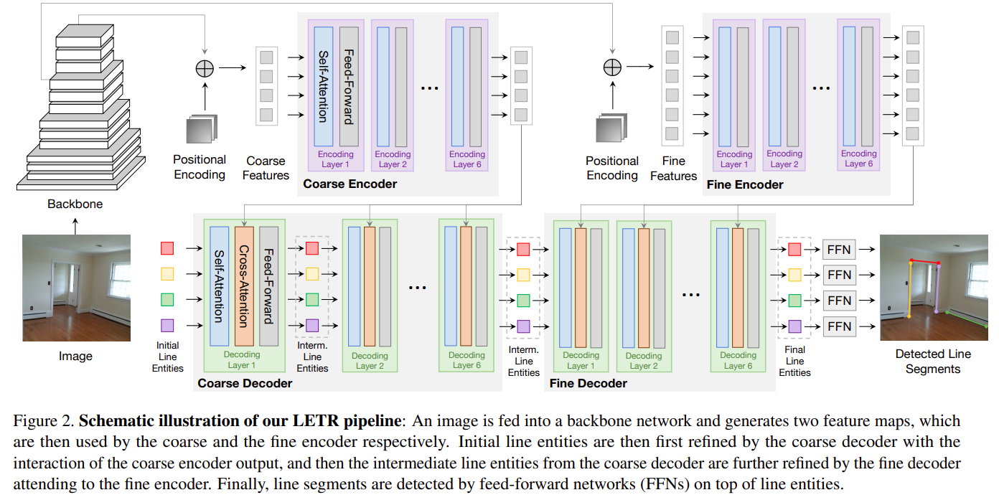

## 2.相关工作

### 2.1 线段检测

**传统方法：**线检测在计算机视觉领域有着悠久的历史。早期的开创性工作依赖于来自预定义特征（例如图像渐变）的低级线索。通常，线（段）检测执行边缘检测[3、23、7、8、32]，然后是感知分组[13、27、10]过程。经典的感知分组框架作品 [2, 1, 25, 21, 30] 聚合低级线索以自下而上的方式形成线段：通过对相似的像素特征进行分组，将图像划分为线支持区域.然后从线支持区域近似线段并通过验证步骤过滤以去除误报。另一个流行的线段检测方法系列是基于霍夫变换 [9, 13, 24, 12]，通过在参数空间中收集投票：将图像的逐像素边缘图转换为参数空间表示，其中每个点对应一个唯一的参数化线。参数空间中从候选边缘像素累积足够票数的点被识别为线预测。然而，由于建模/推理过程的局限性，这些传统方法通常会产生次优结果。

**基于深度学习的方法：**最近基于深度学习的方法的激增通过使用可学习的特征来捕获广泛的上下文信息，在线段检测问题 [15, 33, 37, 36, 34] 上取得了很大改进的性能。一个典型的方法族是基于连接点的pipelines：深度线框解析器（DWP）[15] 创建两个平行的分支来预测连接点热图和线热图，然后是合并过程。受 [26] 的启发，L-CNN [37] 将 [15] 简化为一个统一的网络。首先，连接点预测模块生成连接点热图，然后将检测到的连接点转换为线预测。其次，线验证模块对预测进行分类并删除不需要的误报线。 [37] 之类的方法是端到端的，但它们处于实例级别（用于检测各个线段）。我们的 LETR 与 DETR [4] 一样，具有通用架构，该架构以整体端到端的方式进行训练。 PPGNet [36] 建议创建一个点集图，其中连接点作为顶点，模型线段作为边。然而，上述方法严重依赖于高质量的连接点检测，这在各种成像条件和复杂场景下容易出错。

另一种方法采用密集预测来获得代理表示图，并应用后处理程序来提取线段：AFM [33] 提出吸引力场图作为包含二维投影向量指向的中间表示关联线。然后，挤压模块从吸引力场地图中恢复矢量化线段。尽管设计相对简单，但 [33] 与基于连接点的方法相比表现出较差的性能。最近，HAWP [34] 构建了 AFM [33] 和 L-CNN [37] 的混合模型，方法是从吸引力场图计算线段建议，然后在进一步的线验证之前使用连接点细化预测。

相比之下，如图 1 所示，我们的方法与以前的方法不同，它去除了用于检测边缘/连接点/区域预测和替代预测图的启发式驱动的中间阶段。我们的方法能够直接预测矢量化线段，同时在通用框架下保持竞争性能。

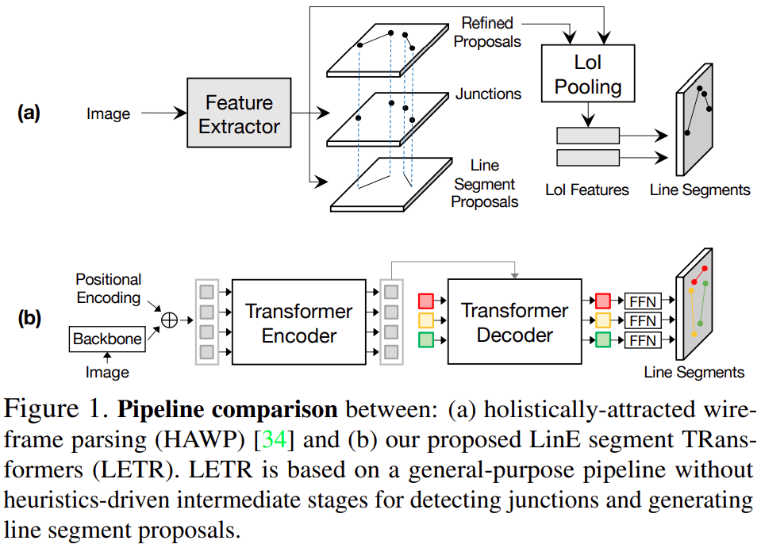

### 2.2 Transformer架构

Transformers [29] 在自然语言处理领域取得了巨大成功，并成为许多语言模型 [29, 6] 的事实上的标准主干架构。它引入了 self-attention 和 cross-attention 模块作为基本构建块，对输入序列元素之间的密集关系进行建模。这些基于注意力的机制也有利于许多视觉任务，例如视频分类 [31]、语义分割 [11]、图像生成 [35] 等。最近，使用 Transformer 的端到端对象检测（ DETR) [4] 通过消除对手工锚框和非最大抑制步骤的需要，使用 Transformers 重新制定对象检测pipeline。相反，[4] 建议将一组对象查询输入到编码器解码器架构中，并与图像特征序列进行交互，并生成一组最终预测。然后优化二分匹配目标以强制在预测和目标之间进行唯一分配。

在实现 LETR 时，我们向 DETR [4] 引入了两个新方面：1）多尺度编码器和解码器； 2) 线段的直接距离损失。

## 3.使用Transformers检测线段

### 3.1 动机

尽管最近基于深度学习的方法 [37, 33, 34] 在线段检测方面取得了卓越的性能，但它们的pipeline仍然涉及启发式驱动的中间表示，例如连接点和吸引力场图，提出了一个有趣的问题：我们能直接用神经网络对所有矢量化线段进行建模？一个简单的解决方案可以简单地将线段视为对象，并按照标准对象检测方法 [26] 构建pipeline。由于二维对象的位置通常被参数化为边界框，因此矢量化线段可以直接从与线段对象相关联的边界框的对角线读取。然而，有限的anchors选择使得标准的两阶段目标检测器难以预测非常短的线段或几乎平行于轴的线段（参见图 3）。最近出现的DETR[4]消除了anchors和非极大值抑制，完美地满足了线段检测的需要。然而，普通的 DETR 仍然专注于具有 GIoU 损失的边界框表示。我们通过在我们设计的模型中调整损失和增强多尺度特征的使用，进一步将 DETR 中的框预测器转换为矢量化线段预测器。

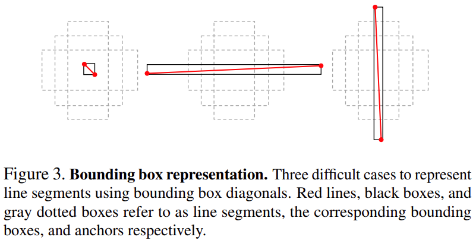

### 3.2 概况

在线段检测任务中，检测器旨在从给定图像中预测一组线段。使用 Transformers 执行线段检测无需显式边缘/连接点/区域检测 [37、34]（参见图 1）。我们的 LETR 完全基于 Transformer 编码器-解码器结构构建。预测的线段检测过程包括四个阶段：

(1) 图像特征提取：给定一个图像输入，我们从一个降维的 CNN backbone中获得图像特征图 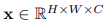。图像特征与位置嵌入连接以获得空间关系。 (2) 图像特征编码：扁平化特征图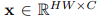然后通过多头自注意力模块和前馈网络模块按照标准 Transformer 编码架构编码为 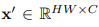结构。 (3) 线段检测：在 Transformer 解码器网络中，N 个可学习的线实体 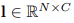 通过交叉注意力模块与编码器输出交互。 (4) 线段预测：线实体通过在 Transformer 解码器之上构建的两个预测头进行线段预测。线坐标由多层感知器 (MLP) 预测，预测置信度由线性层评分。

**Self-Attention and Cross-Attention**	我们首先访问由 Transformer 架构 [29] 推广的缩放点积注意力。基本的缩放点积注意力包括一组 m 个查询 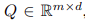，一组 n 个键值对表示为一个键矩阵 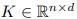 和一个值矩阵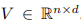。这里我们将 Q、K、V 设置为具有相同的特征维度 d。注意操作 F 定义为：

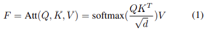

在我们的编码器-解码器 Transformer 架构中，我们采用了两个基于多头注意力的注意力模块，即自注意力模块（SA）和交叉注意力模块（CA）（见图 2）。 SA 模块接受一组表示为 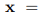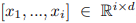的输入嵌入，并输出遵循公式 1的x内输入嵌入的加权和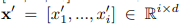 ，其中 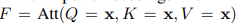。 CA 模块接收两组输入嵌入，其记为 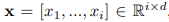 , 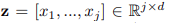 遵循公式 1 其中 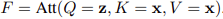。

**Transformer Encoder in LETR**堆叠有多个编码器层。每个编码器层从其前身编码器层获取图像特征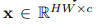 并使用 SA 模块对其进行处理以学习成对关系。 SA 模块的输出特征被传递到具有激活和dropout的逐点全连接层 (FC)，然后是另一个逐点全连接 (FC) 层。在 SA 模块和第一个 FC 层之间以及第二个 FC 层之后应用层范数。在第一个FC层之前和第二个FC层之后添加残差连接，以方便对深层的优化。

**Transformer Decoder in LETR**堆叠有多个解码器层。每个解码器层接收一组来自最后一个编码器层的图像特征 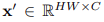和一组来自其前一个解码器层的线实体 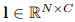。线实体首先用 SA 模块处理，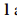 中的每个线实体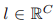通过 CA 模块处理图像特征嵌入 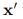 的不同区域。 FC 层和其他模块添加到pipeline中，类似于上面的编码设置。

线实体解释。线实体类似于 DETR [4] 中的对象查询。我们发现每个线实体在训练过程后都有自己偏好的现有区域、长度和潜在线段的方向（如图 4 所示）。当遇到第 4.4 节和图 5 中的异构线段结构时，我们一起讨论线实体通过 self-attention 和 cross-attention 细化做出更好的预测。

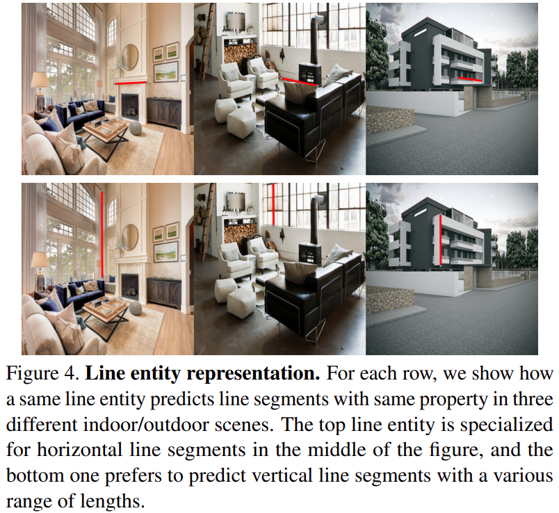

### 3.3粗到细策略

与目标检测不同，线段检测要求检测器将线段的局部细粒度细节与全局室内/室外结构一起考虑。在我们的 LETR 架构中，我们提出了一种从粗到细的策略来预测细化过程中的线段。该过程允许线实体通过多尺度编码特征的交互进行精确预测，同时了解整体架构以及与其他线实体的通信。在粗略解码阶段，我们的线实体关注潜在的线段区域，通常分布不均匀，分辨率低。在精细解码阶段，我们的线实体产生具有高分辨率的详细线段预测（参见图 2）。在粗略和精细解码阶段的每个解码层之后，我们要求线实体通过两个共享的预测头进行预测，以逐步做出更精确的预测。

**粗解码**	在粗解码阶段，我们将图像特征和线实体传递到编码器-解码器 Transformer 架构中。编码器接收来自 ResNet 的 Conv5 (C5) 输出的粗略特征，原始分辨率的 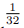。然后，线实体嵌入在每一层的交叉注意力模块中处理来自编码器输出的粗略特征。粗解码阶段是细解码阶段成功所必需的，它的效率高，内存和计算成本低。

**细解码**	细解码器继承了粗解码器的线实体和细编码器的高分辨率特征。细编码器的特征来自 ResNet 的 Conv4 (C4) 输出，原始分辨率的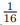。线实体嵌入以与粗解码阶段相同的方式解码特征信息。

### 3.4 线段预测

在之前的解码过程中，我们的多尺度解码器逐步细化 N 个初始线实体以产生相同数量的最终线实体。在预测阶段。每个最终实体 l 将被送入一个前馈网络 (FFN)，该网络由一个用于预测作为线段的置信度 p 的分类器模块和一个用于预测两个端点坐标 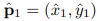，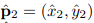的回归模块组成，参数化相关线段 。

**双向匹配**	通常，提供的线实体比图像中的实际线段多得多。因此，在训练阶段，我们在线段预测和ground truth目标之间进行基于集合的二分匹配，以确定预测是否与现有线段相关联：假设有 N 个线段预测 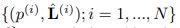和 M 个目标，我们在置换函数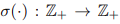上优化双向匹配目标，其将预测索引 {1, ..., N} 映射到潜在目标索引 {1 , ..., N}（包括用于ground truth目标的 {1, ..., M} 和用于不匹配预测的 {M + 1, ..., N})：

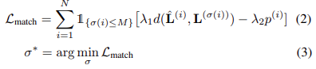

其中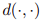表示坐标之间的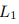距离，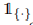是一个指示函数。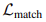通过平衡系数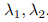同时考虑距离和置信度。最优排列 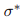使用匈牙利算法计算，将 M 个正预测索引映射到目标索引 {1, ..., M}。在推理阶段，我们通过在置信度 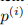 上设置一个固定阈值来过滤 N 个线段预测（如果需要，因为没有提供ground truth)。

### 3.5 线段损失

我们根据双向匹配过程中的最优排列 σ ∗ 计算线段损失，其中 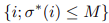表示正预测的索引。

**分类损失**	基于二元交叉熵损失，我们观察到困难示例在学习率衰减后的优化程度较低，并决定将受焦点损失 [18] 启发的自适应系数应用于分类损失项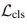：

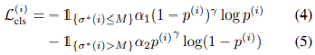

**距离损失**	我们为线段端点回归计算一个简单的基于 L1 的距离损失：

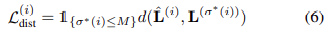

其中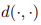表示预测和目标坐标之间的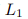距离之和。距离损失仅应用于正确预测。注意，我们从 [4] 中删除了 GIoU 损失，因为 GIoU 主要是为边界框而不是线段之间的相似性而设计的。因此，我们模型的最终损失 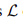表示为：

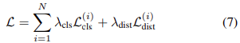

## 4.实验	

### 4.1 数据集

我们在 ShanghaiTech Wireframe 数据集 [15] 上训练和评估我们的模型，该数据集由 5000 个训练图像和 462 个测试图像组成。我们还在 YorkUrban 数据集 [5] 上评估了我们的模型，其中包含来自室内场景和室外场景的 102 个测试图像。

通过所有实验，我们对训练集进行数据增强，包括随机水平/垂直翻转、随机调整大小、随机裁剪和图像颜色抖动。在训练阶段，我们调整图像的大小，以确保最短的尺寸至少为 480 至多 800 像素，最长的尺寸为至多 1333。在评估阶段，我们调整最短边至少为 1100 像素的图像

### 4.2 实施

**网络**	我们采用 ResNet-50 和 ResNet-101 作为我们的特征backbone。对于输入图像 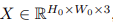 ，粗编码器从 ResNet backbone的 Conv5 (C5) 层获取特征图，分辨率为 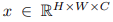其中 H = H0/32 , W = W0/32 , C = 2048。精细编码器从 ResNet 的 Conv4 (C4) 层获取更高分辨率的特征图 (H = H0/16 , W = W0/16 , C = 1024)。特征图通过 1x1 卷积减少到 256 个通道，并与正弦/余弦位置编码一起输入到 Transformer。我们的从粗到细的策略由两个独立的编码器-解码器结构组成，处理多尺度图像特征。每个编码器解码器结构由 6 个编码器和 6 个解码器层构成，具有 256 个通道和 8 个注意力heads。

**优化**	我们在所有实验中使用 4 个 Titan RTX GPU 训练我们的模型。来自带有 ResNet-50 和 ResNet-101 backbone 的 DETR [4] 的模型权重作为预训练加载，我们在第 5 节讨论预训练的有效性。我们首先训练粗编码器解码器 500 个 epoch 直到达到最佳状态。然后，我们冻结粗变换器中的权重，并训练由粗变换器权重初始化的细变换器 325 个epoch（包括 25 个epoch的焦点损失微调）。我们对 DETR [4] 之后的所有解码器层采用深度监督 [17, 32]。 FFN 预测头权重通过所有解码器层共享。我们使用 AdamW 作为模型优化器，并将权重衰减设置为 ****。初始学习率设置为 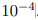，粗解码阶段每 200 个 epoch 减少 10 倍，精细预测阶段每 120 个 epoch 减少 10 倍。除非另有说明，否则我们在所有报告的基准中使用 1000 个线实体。为了缓解类不平衡问题，我们还将背景/无对象实例的分类权重降低了 10 倍。

### 4.3 评估指标

我们基于两个基于热图的指标 评估我们的结果，这两个指标广泛用于先前的 LSD 任务 [37, 15]，以及在 L-CNN [37] 中提出的结构平均精度 ()。最重要的是，我们使用新的指标结构 F 分数 (sF) 来评估结果，以便进行更全面的比较。

基于热图的指标，：首先通过对线进行光栅化将预测和ground truth线转换为热图，然后我们生成比较每个像素及其置信度的精确召回曲线。然后我们可以用曲线来计算。

基于结构的度量，sAP[37]，sF：给定一组ground truth线和一组预测线，对于每条ground truth线 L，如果它们的 距离小于预定义的阈值 ϑ ∈ {10, 15}，我们将预测线定义为 L 的匹配。在与 L 匹配的线集上，我们选择置信度最高的线作为真阳性，并将其余的线视为假阳性的候选者。如果匹配线的集合为空，我们会将这条真实线视为假阴性。每条预测线将最多匹配一个ground truth线，如果一条线与任何ground truth线都不匹配，则将其视为假阳性。在每个置信度级别重新计算匹配以产生精确召回曲线，我们将 sAP 视为该曲线下的面积。考虑到  作为  的补充 F分数 测量，我们评估了 sAP 的 F分数 测量，表示为 sF，是最平衡的性能测量。

### 4.4 结果和比较

我们在表 1 中总结了 LETR 和以前的线段检测方法之间的定量比较结果。我们报告了使用ResNet-101 backbone的LETR用于 Wireframe 数据集的结果以及使用 ResNet-50 backbone用于 York 数据集的结果。我们的 LETR 实现了 YorkUrban 数据集 [5] 上所有评估指标的最新技术水平。在基于热图的评估指标方面，我们的 LETR 在基准测试方面始终优于其他模型，并且在 YorkUrban 数据集上的  优于 HAWP [34] 1.5。我们在图 6 中显示了 Wireframe [15] 和 YorkUrban 基准的  和 APH 的 PR 曲线比较。在图 6 中，我们注意到 LETR 的当前限制来自较低的预测精度，与 HAWP 相比，我们包含的预测更少。当我们包含所有预测集时，LETR 的预测略好于 HAWP 和其他领先方法，这与我们的假设相吻合，即整体预测方式可以指导线实体以高置信度预测来改进低置信度预测（通常是由于局部模糊和遮挡)。

我们还在图 5 中展示了来自 LETR 和其他竞争方法的 Wireframe 和 YorkUrban 线段检测定性结果。前两行是来自 Wireframe 数据集的室内场景检测结果，而后两行是来自 YorkUrban 数据集的室外场景检测结果。

## 5.消融研究

**与对象检测基线进行比较**	我们将 LETR 结果与两个对象检测基线进行比较，其中线段在表 2 中的上下文中被视为二维对象。我们看到了对 Faster R-CNN 和 DETR 使用边界框对角线的明显限制，以响应我们在第3.1 节中的动机。

**多阶段训练的有效性**	我们在表 3 中比较了 LETR 中不同模块的效果。在粗解码阶段，使用 ResNet backbone的C5 层的编码特征的  的 LETR 达到 62.3 和 65.2，而来自 C4 的编码特征达到 63.8 和 66.5。通过使用来自高分辨率特征的细粒度细节改进粗略预测，对于 ，细解码器达到 64.7 和 67.4。然后，我们调整具有焦点损失的数据不平衡问题，以使  达到 65.2 和 67.7。

如图 7 (a) 所示，我们发现有必要在粗解码阶段收敛后训练细解码阶段。将两个阶段作为一个阶段模型一起训练会导致 400 个 epochs 后的性能明显变差。

**查询数量的影响**	通过对广泛的线实体数量进行试验，我们发现大量的线实体对于线段检测任务是必不可少的(参见图 7（c），使用 1000 个线实体对于平均包含 74个线段的Wireframe基线是最优的)。

**图像上采样的影响**	所有算法都看到相同的输入图像分辨率（通常为 640×480）。然而，一些算法通过对图像进行上采样来尝试更精确的预测。为了了解上采样的影响，我们在多个上采样尺度下训练和测试 HAWP 和 LETR。在下面的表 4 中，更高的训练上采样分辨率提高了这两种方法。 LETR 通过更高的测试上采样分辨率获得额外的增益。

**预训练的有效性**	我们发现模型预训练对于 LETR 获得最先进的结果至关重要。使用用于 COCO 对象检测的 DETR 预训练权重 [19]，我们的仅粗阶段模型在 500 个 epoch 处收敛。使用用于 ImageNet 分类的 CNN backbone预训练权重，我们的仅粗阶段模型在 900 个epoch收敛到较低的分数。如果没有预训练，由于 Wireframe 基准中的数据量有限，LETR 很难训练。

## 6.可视化

我们在图 8 中演示了 LETR 从粗到细的解码过程。前两列是粗解码器从 C5 ResNet 层接收解码特征的结果。虽然场景的全局结构得到了很好的有效捕捉，但低分辨率特征阻止了它进行精确的预测。最后两列是细解码器接收来自 C4 ResNet 层的解码特征和来自粗解码器的线实体的结果。注意力热图的叠加描绘了图像空间中更详细的关系，这是检测器性能的关键。这一发现也显示在图 7(b) 中，其中每一层之后的解码输出与多尺度编码器-解码器策略有一致的改进。

## 7.结论

在本文中，我们提出了 LETR，一种基于多尺度编码器/解码器 Transformer 结构的线段检测器。通过以整体端到端的方式投射线段检测问题，我们在没有明确的边缘/连接点/区域检测和启发式引导的感知分组过程的情况下执行集合预测。直接端点距离损失允许对超出边界框表示的几何结构进行建模和预测。