# Self-supervised Occlusion-aware Line Description and Detection

## 摘要

与特征点检测和描述相比，检测和匹配线段提供了额外的挑战。然而，线特征代表了对多视图任务的点的有希望的补充。线条确实由图像梯度很好地定义，即使在纹理不佳的区域也经常出现，并提供强大的结构线索。因此，我们在此介绍了单个深度网络中线段的第一个联合检测和描述。由于自我监督训练，我们的方法不需要任何带注释的线标签，因此可以推广到任何数据集。我们的检测器提供图像中线段的可重复和准确定位，与线框解析方法不同。利用描述符学习的最新进展，我们提出的线描述符是高度可区分的，同时对视点变化和遮挡保持鲁棒性。我们在使用单应变换以及现实世界视点变化创建的几个多视图数据集上针对先前的线检测和描述方法评估我们的方法。我们的完整管道产生更高的可重复性、定位精度和匹配指标，因此代表了用学习的特征点方法弥合差距的第一步。代码和训练的权重可在 https://github.com/cvg/SOLD2 获得。

## 1.引言

特征点是许多计算机视觉任务的核心，例如运动结构 (SfM) [14, 47]、同时定位和映射 (SLAM) [37]、大规模视觉定位 [44, 50]和 3D 重建 [9]，因为它们具有紧凑和鲁棒的表示。然而，世界是由更高层次的几何结构组成的，这些几何结构在语义上比点更有意义。在这些结构中，与点相比，线可以提供许多好处。线条在世界范围内广泛而频繁，尤其是在人造环境中，并且仍然存在于纹理不良的区域。与点相比，它们具有自然的方向，并且线的集合提供了关于场景结构的强大几何线索[61,53,16]。因此，线条代表了 3D 几何任务的良好特征。

以前检测图像中线段的方法通常依赖于图像梯度信息和手工过滤器 [57, 1]。最近，深度学习还实现了鲁棒和实时的线检测[19]。然而，大多数学习的线检测器都在处理一个密切相关的任务：线框解析，其目的是根据线段及其连接性推断场景的结构化布局 [18,67,63,68]。这些结构提供了强大的几何线索，特别是对于人造环境。然而，这些方法还没有针对跨图像的可重复性进行优化，这是多视图任务的一个重要特征，并且它们的训练需要很麻烦的手动标记的ground truth线 [18]。

跨图像匹配几何结构的传统方法是使用特征描述符。然而，线描述符面临几个挑战：线段可能被部分遮挡，它们的端点可能没有很好地定位，每条线周围描述的区域规模波动很大，并且在透视和失真变化下可能会严重变形[46 ]。早期的线描述符专注于提取每条线周围的支持区域并计算其梯度统计[60, 65]。最近，受学习点描述符 [7, 9, 42] 成功的推动，已经提出了一些深度线描述符 [25, 55, 24]。但是，它们并非旨在处理线遮挡，并且对局部定位不佳的端点保持敏感。

在这项工作中，我们建议联合学习线段的检测和描述。为此，我们引入了一个受 LCNN [67] 和 Super Point [7] 启发的自我监督网络，可以在没有任何标签的任何图像数据集上进行训练。在合成数据集上进行预训练，然后将我们的方法推广到真实图像。我们的线检测旨在最大限度地提高线的可重复性，并尽可能准确以允许其在几何估计任务中使用。学习的描述符被设计为对遮挡具有鲁棒性，同时保持与当前学习的点描述符一样的判别性。为了实现这一点，我们引入了一种基于动态规划的新型线匹配，并受到遗传学中的序列比对 [38] 和经典立体匹配 [8] 的启发。因此，我们的自我监督遮挡感知线描述和检测 (SOLD2) 提供了一个通用pipeline，旨在弥合与最近学习的特征点方法的差距。总的来说，我们的贡献可以总结如下：

1. 我们提出了第一个用于联合线段检测和描述的深度网络。
2. 我们展示了如何自我监督我们的网络进行线检测，允许在任何真实图像数据集上进行训练。
3. 我们的线匹配程序对遮挡具有鲁棒性，并在图像匹配任务上取得了最先进的结果。

## 2.相关工作

**线检测**	基于梯度的线段检测方法，如 LSD [57] 和 EDLines [1] 提供了很高的运行时效率，但在视点和外观变化下的可重复性不是很高。众所周知，深度学习擅长解决这些问题，但学习线检测器直到最近才出现，引入了线框解析 [18,63,62,2]。线框是由通常由人类标记的两个端点连接的线段的集合 [18]。线框可以通过与线路验证模块 [18, 67]、吸引力场图 (AFM) [62, 63]、连接图 [66]、根点和两个端点的位移[19]，并且可以从深度霍夫变换先验中受益[17, 30]。尽管这些方法可以从图像中提取质量好的线段，但它们还没有经过训练以在视点变化下产生可重复的线，并且仍然会错过一些用于定位的重要线地标。我们从它们中获得灵感，但旨在检测泛化到大多数场景的通用线段。

**线描述**	虽然早期的线描述符基于简单的颜色直方图 [4]，但大多数手工制作的描述符都利用图像梯度 [59, 60]。因此，最常见的方法是提取每条线周围的线支持区域，并总结子区域中的梯度信息 [59、60、15、65、56]。由于其良好的性能和效率，线带描述符（LBD）是其中最著名的，但它仍然存在较大的视点和外观变化。直到最近，线描述才通过深度学习得到解决。一种方法是围绕线提取一个patch并计算通过三元组损失优化的低维嵌入，如 DLD [25] 和 WLD [24]。另一方面，线描述符可以被认为是点描述符的集合，遵循 Liu 等人的想法。 [31]。学习线描述符（LLD）[55]因此对每条线上的多个点进行采样和描述，并且在概念上是最接近我们方法的先前方法。设计为快速并用于 SLAM，但是它对旋转不是不变的，并且它的性能会随着大的视点变化而迅速下降。

**学习特征的联合检测和描述**	联合学习的点检测器和描述符[45,7,42,34]建议在关键点检测和描述之间共享计算，以从多任务学习中获得快速推理和更好的特征表示。 describe-then detect 趋势首先计算一个密集的描述符图，然后从中提取关键点位置 [9, 34, 64, 54]。超级视觉由来自 SfM [9, 34] 的逐像素对应或仅来自图像级对应 [64] 提供。 HF-Net [43] 通过与多个教师网络的多任务蒸馏来统一关键点检测、局部和全局描述。对于完全无监督的频谱，最近的方法将检测器和描述符学习紧密结合，以输出可重复和可靠的点 [5, 42, 52]。另一方面，Superpoint [7] 首先通过在合成数据集上预训练角点检测器，然后将其转移到真实世界的图像中来学习兴趣点的概念。我们在这里采用类似的方法扩展到线段。

**线匹配**	除了简单地比较描述符的相似性之外，一些作品还试图利用更高层次的结构线索来指导线匹配[27]。一种方法考虑相邻的线/点并在图像中找到相似的模式，例如通过局部线簇 [58]、线之间的交叉点 [22] 或线-连接点-线结构 [29, 28]。但是，这些方法无法匹配孤立的线。另一个方向是找到共面的线和点集，并利用线点不变量以及简单的点匹配来实现线匹配[32,10,11,41]。最后，最后一种方法包括匹配沿线采样的点，例如使用强度信息和对极几何[46]或简单的点描述符[55]。我们的工作遵循这个方向，但提供了沿线的点的灵活匹配，可以处理遮挡。

## 3.方法

我们提出了一个统一的网络来执行线段检测和描述，允许匹配不同图像中的线。我们分两步实现自我监督。我们的检测器首先在具有已知ground truth的合成数据集上进行了预训练。然后可以通过使用预训练模型在真实图像上生成伪ground truth线段来训练完整的检测器和描述符。我们在图 2 中概述了我们的训练pipeline，并在以下部分详细介绍了它的各个部分。

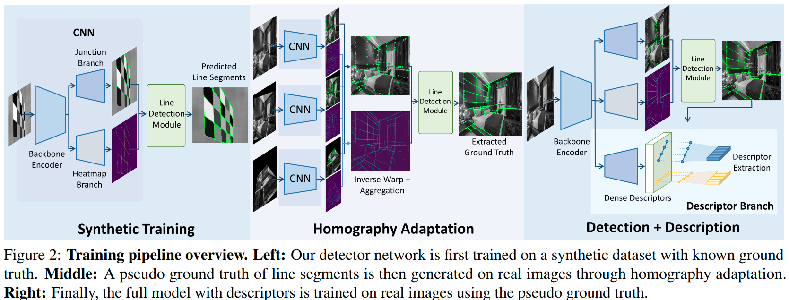

### 3.1 问题表述

线段可以通过多种方式进行参数化：两个端点；具有中点、方向和长度；带有中间点和端点的偏移量；在这项工作中，我们选择了具有两个端点的线表示，因为它的简单性和与我们在第 3.4 节中讨论的自我监督过程的兼容性。对于空间分辨率为 h × w 的图像 I，我们因此考虑如下；图像I的所有连接点的集合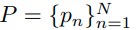和线段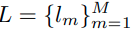. 线段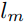由一对端点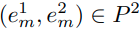定义。

### 3.2 连接点和线热力图推断

我们的网络将灰度图像作为输入，通过共享的backbone编码器对其进行处理，该编码器随后分为三个不同的输出。连接图 J 预测每个像素成为线端点的概率，线热图 H 提供像素在线上的概率，描述符图 D 产生逐像素的局部描述符。我们在这里关注前两个分支的优化，而后面章节部分描述它们的组合以检索和匹配图像的线段。

我们对连接点分支采用了与 SuperPoint 的关键点解码器 [7] 类似的方法，其中输出是粗略的 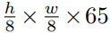特征图 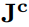。每个 65 维向量对应一个 8×8 的patch加上一个额外的“无连接点”dustbin。我们定义了ground truth 连接点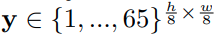，表示每个patch中真实的连接点位置的索引。当多个ground truth连接点位于同一patch中时，会随机选择一个连接点， 65的值表示没有交汇点。连接点损失是 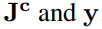之间的交叉熵损失：

在推理时，我们在通道维度上执行 softmax 并丢弃第 65 个维度，然后调整连接点图的大小以获得最终的 h × w 网格。

第二个分支以图像分辨率 h × w 输出线热图 H。给定一个二元ground truth，线上的像素值为 1，否则为 0，线热图通过二元交叉熵损失进行优化：

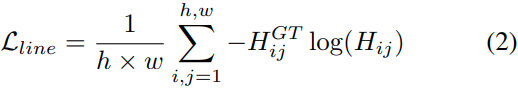

### 3.3 线检测模块

在推断出连结点图 J 和线热图 H 之后，我们对 J 设置阈值以保持最大检测并应用非极大值抑制 (NMS) 来提取线段连接点。候选线段集合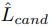由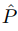中的每一对结点组成。基于 H 和提取最终线段预测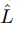并非易事，因为沿由两个端点定义的线段的激活在不同的候选者之间可能会有很大差异。我们的方法可以分为四个部分：（1）端点之间的常规采样，（2）自适应局部最大值搜索，（3)平均分数，以及（4)内点比率。

**端点之间的常规采样**	我们不是获取两个端点之间的所有光栅化像素[68]，而是沿线段采样 Ns 个均匀间隔的点（包括两个端点）。

**自适应局部最大值搜索**	使用双线性插值来获取提取点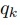处的热图值可能会由于端点和热图之间的未对齐而丢弃一些候选点，尤其是对于长线。为了缓解这种情况，我们在与线长成比例的半径 r 内搜索每个采样位置周围的局部最大热图激活值。

**平均分数**	平均分数定义为所有采样热图值的平均值：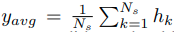。给定阈值 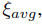，有效的候选线段应满足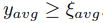。

**内点率**	仅依靠平均分数可能会保留具有一些高激活但沿线有漏洞的段。为了消除这些虚假检测，我们还考虑了一个内点率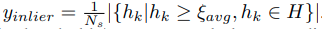。给定一个内点率阈值，我们只保留满足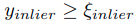的候选线。

### 3.4 自监督学习pipeline

受到 DeTone 等人成功的启发。 [7]，我们将它们的单应性自适应扩展到线段的情况。让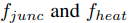代表我们的网络的前向传递，以计算连接点图和线热图。我们首先使用一组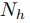单应性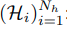来聚合连接点和热图预测，就像在 SuperPoint 中一样：

然后，我们将线检测模块应用于聚合图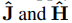，以获得预测的线段，然后将其用作下一轮训练的ground truth。图 2 提供了pipeline的概述。与 Superpoint 类似，此过程可以迭代应用以提高标签质量。然而，我们发现单轮适应已经提供了足够好的标签。

### 3.5 线描述

描述图像中的线条本质上是一个比描述特征点更困难的问题。一条线可能被部分遮挡，它的端点在视图中并不总是可重复的，并且在视点变化下，一条线的外观可能会显着不同。为了应对这些挑战，我们偏离了以线 [25, 24] 为中心的patch的经典描述，它对遮挡和端点缩短不鲁棒。受学习点描述符成功的启发，我们将线描述符制定为沿线采样的一系列点描述符。给定对沿线点的良好覆盖，即使线的一部分被遮挡，非遮挡部分上的点也会存储足够的线细节，仍然可以匹配。

我们网络的描述符head输出描述符映射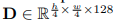，并通过其他密集描述符 [9] 中使用的经典基于点的三元组损失 [3, 36] 进行优化。给定一对图像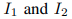以及两幅图像中的匹配线，我们定期沿每条线采样点，并从描述符映射中提取相应的描述符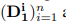和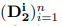，其中 n 是图像中的总点数。三元组损失使匹配点的描述符距离最小化并最大化非匹配点之一。正距离定义为

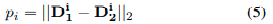

负距离是在一个点与batch中最难的负样本之间计算的：

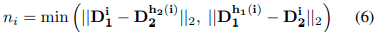

其中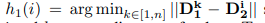使得点i和k至少相距T个像素，并且不是同一条线，对于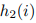也是如此。然后将边距为M的三元组定义为

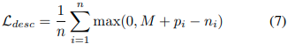

### 3.6 多任务学习

检测和描述线是具有不同同方差随机不确定性的独立任务，它们各自的损失可以有不同的数量级。因此，我们采用了 Kendall 等人提出的多任务学习。 [21] 对损失进行动态加权，其中权重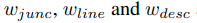在训练期间进行了优化 [20, 43]。总损失变为：

### 3.7 线匹配

在推理时，两个线段基于沿每条线采样的点描述符的各自集合进行比较。但是，某些点可能会被遮挡，或者由于透视变化，线的长度可能会发生变化，并且采样点可能会未对齐。尽管如此，沿线匹配的点的顺序应该是恒定的，即线描述符是描述符的有序序列，而不仅仅是一个集合。为了解决这个序列分配问题，我们从生物信息学中的核苷酸对齐 [38] 和立体视觉中沿扫描线的像素对齐 [8] 中获得灵感。因此，我们建议通过最初由 Needleman 和 Wunsch [38] 引入的动态规划算法找到最佳点分配。

当匹配两个点序列时，每个点可以与另一个点匹配或跳过。归因于两点匹配的分数取决于它们描述符的相似性（即它们的点积），因此更高的相似性给出更高的分数。跳过一个点会受到gap分数的惩罚，必须对其进行调整，以便更好地匹配具有高相似性的点，而跳过具有低相似性的点。线匹配的总得分是线点的所有跳过和匹配操作的总和。 Needleman-Wunsch (NW) 算法返回最大化该总分的最佳匹配序列。这是通过逐行填充分数矩阵的动态编程实现的，如图 3 所示。给定沿线的 m 个点、沿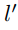的 个点以及相关的描述符 D 和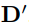的序列，这个分数矩阵S 是一个 (m + 1) × (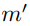 + 1) 网格，其中 S(i, j) 包含将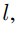的前 i 个点与 的前 j 个点进行匹配的最佳分数。网格由第一行和第一列中的gap分数初始化，并使用存储在左侧、顶部和左上角单元格中的分数逐行顺序填充：

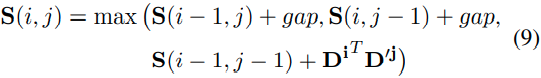

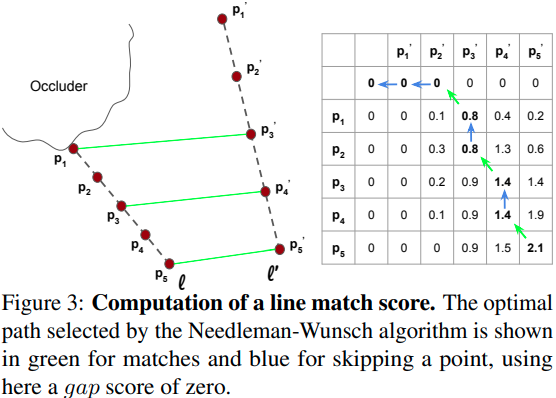

一旦矩阵被填充，我们选择网格中的最高分数并将其用作候选线对的匹配分数。然后将第一张图像的每一线与第二张图像中具有最大匹配分数的线进行匹配。

### 3.8 实施细节

**网络实施**	为了与大多数线框解析方法 [67, 63, 30] 进行公平比较，我们对backbone使用相同的堆叠沙漏网络 [39]。然后，我们网络的三个分支是一系列卷积、ReLU 激活和通过子像素shuffles的上采样块 [51]。有关架构的更多详细信息，请参阅补充材料。该网络使用 Adam 求解器 [23] 进行了优化，学习率为 0.0005。

**线参数**	我们使用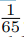的连接点阈值，热图阈值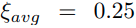，内点阈值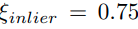，我们沿每条线提取 Ns = 64 个样本来计算热图和内点分数，我们使用 Nh = 100 单应性作为单应性自适应。

**匹配细节**	线描述符是通过沿每个线段定期采样最多 5 个点来计算的，但每个点之间的最小距离为 8 个像素。由于点的顺序可能会从一张图像反转到另一张图像，因此我们运行匹配两次，其中一个点集翻转。 0.1 的gap分数在 NW 匹配期间根据经验产生最佳结果。为了加快线匹配，我们使用简单的启发式方法对候选线集进行预过滤。给定在要匹配的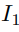线上采样的 5 个点的描述符，我们计算它们在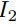的每一线中与它们最近邻的相似度，并对每条线的这些分数进行平均。这产生了对线匹配分数的粗略估计，我们保留前 10 条最佳线作为 NW 匹配的候选者。最后，我们在匹配时只保留相互匹配的对。

**训练数据集**	我们使用与 SuperPoint [7] 中相同的合成数据集，将几何形状的角点标记为连接点，将边缘标记为线段。对于真实图像的训练，我们使用 Wireframe 数据集 [18]，可以与当前最先进技术进行公平比较,也在这些图像上训练。我们遵循 LCNN [67] 中的拆分策略：5,000 张图像用于训练，462 张图像用于测试。然而，我们只使用图像并忽略数据集提供的ground truth线。

## 4.实验

### 4.1 线段检测评估

为了评估我们的线段检测，我们使用 Wireframe 数据集 [18] 和 YorkUrban 数据集 [6] 的测试拆分，其中包含 102 个室外图像。对于这两个数据集，我们生成一组固定的随机单应性并转换每个图像以获得一对匹配的图像。

**线段距离度量**	需要定义线距离度量来评估线检测的准确性。我们使用以下两个指标：

结构距离(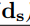)：两条线段的结构距离被定义为：

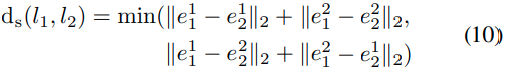

其中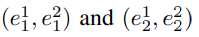是的端点。与最近的线框解析工作 [67, 63] 的公式相反，我们不使用平方范数来使其可以根据端点距离直接解释。

正交距离(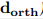)：两条线段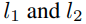的正交距离被定义为两个不对称距离的平均值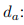

其中表示在线段上的正交投影。在搜索这个距离最近的线段时，我们忽略了重叠低于 0.5 的线段。这个定义允许对应于相同 3D 线段但具有不同线长的线段被认为是接近的，这在定位任务中很有用 [35]。

**线段检测度量**	由于我们的线段检测方法的主要目标是从图像中提取可重复且可靠的线段，因此在线框数据集 [18] 的手动标记线上对其进行评估是不合适的。因此，我们改为将针对 SuperPoint [7] 提出的检测器指标调整为使用图像对的线段。

重复型：可重复性测量在不同视图中可以重新检测到一条线的频率。它是在第二张图像中重新投影时，第一张图像中具有匹配线的线条的平均百分比。当它们的距离低于阈值时，两条线被认为是匹配的。该指标在两个图像上对称计算并取平均值。

定位误差：具有容忍值的定位误差是一条线与其在第二张图像中重新检测到的平均线距离，仅考虑匹配线。

**在Wireframe和YorkUrban数据集上评估**	我们在表 1 中将我们的线段检测方法与 5 个基线进行了比较，包括手工制作的线段检测 (LSD) [57]、线框解析方法，如 LCNN [67]、HAWP [63]、TP-LSD [19] 和 Deep霍夫变换线先验（DeepHough）[30]。 LSD 与 15 像素的最小线段长度一起使用。对于 LCNN、HAWP 和 DeepHough，我们在线得分上选择阈值（分别为 0.98、0.97 和 0.9）以最大化它们的性能。我们展示了两个 TP-LSD 变体：HG 使用与其他线框解析基线和我们的方法相同的backbone[39]，以及使用 ResNet34 [13] backbone的 TP512。

总体而言，我们的方法在两个数据集上的可重复性和定位误差方面都达到了最佳性能。我们还将我们的方法与候选选择 (CS) 结合起来，该方法删除了在两个端点之间具有其他连接点的线段，以避免预测  中的重叠线段。如果没有重叠线段，性能会略有下降，但我们会得到更少的线段和更快的推理速度。候选选择也用于我们的描述符评估部分，称为线 NMS。

### 4.2 线段描述评估

**线段描述指标**	我们的线描述符在几个匹配指标上进行评估，包括手工标记的线段和检测到的线段（LSD 或我们的预测线）。使用ground truth线时，存在精确的一对一对应关系。对于预测线，与检测器指标类似，使用阈值计算ground truht匹配。当深度可用时，将线条投影到 3D 并在 3D 空间中直接进行比较。仅考虑在其他图像中具有有效重投影的线。

准确性：给定一组ground truth线匹配的正确匹配线的百分比。

受试者工作特征 (ROC) 曲线：给定一组匹配线，我们计算每个端点的 SIFT [33] 描述符，平均每对线之间的 SIFT 距离，并使用第二近的相邻线作为负匹配。然后，ROC 曲线是真阳性率 (TPR) (真阳性占预测正确样本的比率，命中率)与假阳性率 (FPR)(假阳性占阴性样本的比率，虚警率) 的对比。通过改变定义正匹配的描述符相似度阈值来获得曲线。

精度：真阳性匹配与预测匹配总数的比率。

召回：真阳性匹配与ground truth匹配总数的比率，即真阳性匹配占实际匹配数量的比率。

**在ground truht线上描述符评估**	我们的第一个实验旨在在一对一匹配的完美线条上评估我们的方法。因此，我们使用带有真实线的线框测试集。我们将我们的线匹配器与 3 个竞争基线进行比较：手工制作的线带描述符 (LBD) [65]、可学习线描述符 (LLD) [55] 和小波线描述符 (WLD) [24]，一个升级版本的深度线描述符（DLD）[25]。结果如图 4 所示。

由于 LLD 是在图像之间几乎没有旋转的连续视频帧上训练的，因此它不具有旋转不变性，因此它在我们数据集的旋转图像上表现不佳。 WLD 表明他们能够超越手工制作的 LBD，我们的描述符比 WLD 略有提升 5%。

**遮挡实验的鲁棒性**	在实际应用中，跨多个视图检测到的线很少完全相同，有些可能被部分遮挡或具有不同的端点。为了评估我们的描述符对这些挑战的稳健性，我们修改了 Wireframe 测试集以包含人工遮挡物。更准确地说，我们在每对扭曲的图像上覆盖带有随机参数和合成纹理的椭圆，直到最多覆盖 s% 的线条。我们还相应地缩短了线段，以便每条线都停在遮挡物边界处。我们比较不同 s 值的线匹配，并得到图 5 所示的结果。

虽然所有方法都显示较大遮挡时性能下降，但 SOLD2 在所有遮挡程度下都大大优于其他基线。请注意学习的基线 WLD 的显着下降，它在线段patches上运行，因此受到遮挡的严重影响。因此，该实验验证了我们的方法对遮挡和不稳定线端点的鲁棒性。

**在预测线段上的描述符评估**	为了评估我们提出的线描述和匹配的性能，我们还计算预测线段上的匹配指标，而不是使用手工标记的线。我们在 Wireframe 测试集和 ETH3D [49] 图像上进行了两组实验，这些图像提供真实世界的相机运动，并且可以包含比单应变换更具挑战性的视点变化。对于后者，图像被下采样 8 倍，我们选择在提供的 3D 模型中共享至少 500 个共可见 3D 点的所有图像对。在这两个实验中，我们运行 LSD 检测器并计算所有线描述符方法，并将其与我们的全线预测和描述进行比较。表 2 和图 6 评估了所有方法的准确率和召回率。

无论是在合成扭曲的图像上，还是在真实的相机变化上，在 LSD 线上进行比较时，SOLD2 在匹配精度和召回率方面都优于所有描述符基线。使用我们自己的线条也可以提高指标，但是当我们应用线条 NMS 去除重叠片段时，可以获得最佳性能。没有重叠使得描述符确实更容易区分最接近的匹配线。

### 4.3 消融实验

为了验证我们方法的设计选择，我们对描述符进行了消融研究。 SIFT端点使用线方向作为关键点方向为两个端点计算SIFT描述符[33]，并对每个候选线对的端点描述符距离进行平均以获得线匹配分数。平均描述符通过平均沿每条线采样的所有点的描述符来计算线描述符。 NN 平均计算每个线点与其在另一条线上的最近邻居的描述符相似度，并对所有相似度进行平均以获得线匹配分数。 D2-Net 采样和 ASLFeat 采样是指我们提出的匹配方法，其中点分别根据 D2-Net [9] 和 ASLFeat [34] 中引入的显着性分数沿线进行采样。最后，我们使用沿每条线采样的不同数量的点来测试我们的方法。表 3 比较了所有这些方法在 Wireframe 数据集上与有和没有遮挡物的ground truth线的准确性。

结果表明，简单地将线端点与点描述符（例如 SIFT）进行匹配会很快受到限制，并确认了为线提供特定描述符的必要性。平均描述符和 NN 平均匹配精度的小幅下降凸显了在 NW 匹配中保持有序点的重要性。令人惊讶的是，沿每条线进行更智能的点选择，例如 D2-Net 和 ASLFeat 采样，其性能比常规的点采样稍差。最后，沿每条线的样本数量需要权衡：NW 算法在使用少量点时会失去优势，并且线描述符对遮挡的鲁棒性会降低。另一方面，沿线的许多点可能会产生彼此过于接近的描述符，这使得正确区分它们变得更加困难。我们发现 5 个样本总体上是一个很好的折衷方案，LLD [55] 也是如此。

## 5.结论

我们提出了第一个深度学习pipeline，用于联合检测和描述图像中的线段。由于采用了自我监督的训练方案，我们的方法可以应用于大多数图像数据集，而当前学习的线检测器仅限于手工标记的线框图像。我们的描述符和匹配程序通过处理部分遮挡和定位不佳的线端点来解决线描述中的常见问题，同时受益于深度特征描述符的判别能力。通过在一系列室内和室外数据集上评估我们的方法，与以前的基线相比，我们展示了改进的可重复性、定位精度和匹配性能。

虽然我们的线段预测被设计为通用的，但需要进一步的工作来调整它们以适应特定的应用。例如，基于线的定位可能更喜欢短而稳定的线，而 3D 重建和线框解析可能更喜欢更长的线，以便更好地估计场景的尺寸。由于我们灵活的线段定义，线参数的调整允许将输出段引导到一个方向或另一个方向。总的来说，我们希望我们的整个线检测和描述pipeline是赶上更成熟的特征点匹配领域的第一步，以便以后能够在统一的框架中结合点和线。

## 附录

在下文中，我们提供了有关我们的自监督遮挡感知线描述符和检测器 (SOLD2) 的更多详细信息。 A 节描述了用于预训练网络的合成数据集的生成。 B 节详细介绍了我们的网络架构。 C部分是指用于平衡我们不同损失的多任务方法。 D部分详细解释了线段检测模块的一些部分。 E 节给出了用于计算本工作中考虑的评估指标的精确方程。 F 部分提供了我们的结果具有统计意义的证据。 G 部分描述了我们如何预处理 ETH3D 数据集。 H 节讨论了将我们的方法应用于单应性估计任务的可行性。最后，I节展示了与其他基线相比，我们的线检测和匹配的定性示例。

### A. 合成数据集实例和单应性产生

我们在这里提供了一些合成数据集中的图像示例，以及我们在数据增强和单应性自适应中使用的单应性矩阵。这些形状包括多边形、立方体、星形、线条、棋盘格和条纹。图 8 显示了这些渲染形状的一些示例。

我们遵循与 SuperPoint [7] 中相同的过程来生成随机单应性。它们是作为具有预定义范围的简单变换的组合生成的：缩放（正态分布 N (1., 0.1)）、平移（图像边界内的均匀分布）、旋转（均匀分布在 [−90°、+90° ]) 和透视变换。可以在补充材料的图 11 和图 12 中观察到测试集的难度示例。

### B. 网络架构

我们在此处提供有关我们的架构和参数选择的更多详细信息。为了与大多数线框解析方法 [67、63、30] 进行公平比较，我们使用与 [39] 中相同的堆叠沙漏网络。给定分辨率为 h × w 的图像，backbone编码器的输出是特征图。网络的三个头实现如下：

[^]: 堆叠沙漏网络

[^]: SuperPoint backbone

连接点分支：由一个stride为2和256通道的3 x 3卷积组成，后续是一个stride为1和65通道的1x1卷积，最终得到的连接点图。

热力图分支：：为了保持轻网络并避免转置卷积产生的伪影，我们执行两个连续的子像素shuffles [51] 块以执行 a × 4 上采样。更准确地，我们使用两个输出通道为256和64的3 x 3卷积层，它们每一个都跟着batch normalization,ReLU激活函数和a x 2 subpixel shuffle来上采样。一个最终输出通道为1的1 x 1卷积和sigmoid激活被用来获得分辨率为h x w的最终线热力图。

描述符分支：backbone编码是通过两个连续的3x3和1x1核的卷积，其输出分别是256通道和128通道，产生一个特征描述图。这个半稠密图可以之后在任意点位置进行双线性插值。Triplet loss通过一个边距M = 1和一个对于hardest negative的最小距离T = 8 pixels进行优化。

我们在每次卷积后使用 ReLU 激活，并使用 Adam 求解器 [23] 优化网络。图像被调整为 512 × 512 分辨率并在训练期间转换为灰度。

### C. 多任务学习

检测线、它们的连接点和描述它们的任务是多种多样的，我们假设它们具有不同的同方差随机不确定性。此外，它们可以有不同的数量级，并且它们的相对值在训练期间会发生变化，特别是当将描述符分支添加到预训练的检测器网络时。因此，我们选择使用 Kendall 等人引入的多任务损失。 [21] 并成功用于其他几何任务 [20, 43]，在训练期间自动调整损失的权重。

等式 (8) 的最终权重优雅地收敛于每个损失的倒数，使得每个损失乘以其权重的值约为 1。最终的权重值如下：和。为了展示动态加权的有效性，我们尝试了两种变体：（1）所有损失权重都是 1，（2)我们使用动态加权的最终值作为静态损失权重。在第一种情况下，检测和描述结果分别至少差了 10% 和 5.5%。在第二种情况下，检测和描述结果分别至少差了 6.7% 和 76.2%。

### D. 线段检测细节

为了将我们的网络预测的原始连接点和线热图转换为线段，按顺序执行以下步骤：沿每条线定期采样点，自适应局部最大值搜索，并接受验证最小平均分数和内点比率的线。此外，一个称为候选选择的初始步骤可用于预过滤一些候选线。我们在这里更详细地描述了其中两个步骤：自适应局部最大值搜索和候选选择。

[^]: 为每条候选线段保留可以投影到线段上的连接点

[^]: 计算候选线段的起点到连接点向量与线段之间夹角的余弦值

**自适应局部最大值搜索**	给定沿候选线段采样的一组点，人们希望在这些采样位置提取线热图值。但是，由于热图仅限于一个像素的分辨率，因此如果某些样本落在实际线旁边，它们可能会获得较低的热图值。因此，我们改为使用自适应局部最大值搜索来找到每个采样位置周围的线热图的最高激活。在大小为 h × w 的图像中给定来自候选集的线段，搜索半径 r 定义为：

其中是最小搜索半径，是一个超参数来调整对线段长度的线性依赖性。我们在所有实验中使用个像素。通过在验证集上进行网格搜索来选择最佳线参数。 参数尤其可以在不同的图像分辨率下保持不变，而不会降低性能。

**候选选择(CS)**	在一些需要线匹配的应用程序中，具有多个重叠段可能会阻碍匹配，因为描述符在区分紧密线方面将更加困难。因此，线路需要非极大值抑制（NMS）机制。与点或边界框 NMS 不同，线 NMS 没有完善的程序。与用作后处理步骤的通常 NMS 方法相反，我们将线 NMS 实现为预处理步骤，这实际上加速了整体线段检测，因为它删除了一些候选线。从初始候选线集开始，我们删除包含它们两个端点之间的其他连接点的线段。为了确定连接点是否位于线段上，我们首先将连接点投影在线上并检查它是否落在线段边界内。当它在时，如果它与线的距离小于像素，则认为该连接点在线段上。通过我们的实验，我们采用像素。

### E. 检测评估指标

与 SuperPoint [7] 中引入的指标类似，我们提出了线段可重复性和定位误差指标。这两个指标都是使用图像对计算的，其中是在单应性 H 下的扭曲版本。每个图像都与一组线段和相关联，d 指本工作中定义的两个线距之一：结构距离和正交距离。

重复性：可重复性测量在不同视图中可以重新检测到一条线的频率。带容忍度的重复性定义为：

定位误差：具有容忍值的定位误差是一条线与其在另一个视图中的重新检测之间的平均线距离：

其中度量了集合的基数。

### F. 我们方法的统计评估

主要论文中显示的所有实验都来自一次训练。为了证明我们对基线的统计改进是合理的，我们每次使用不同的随机种子重新训练完整的检测器和描述符网络 5 次。图 9 显示了与我们的论文中对 Wireframe 数据集 [18] 相同的评估，其中我们的方法在这 5 次运行中的性能的平均值和标准差，因此显示了具有统计意义的结果。

### G. ETH3D数据集预处理

ETH3D 数据集 [49] 由 13 个在室内和室外环境中拍摄的场景组成。每个图像都带有相应的相机内参和深度图，并且还提供了使用 Colmap [48] 构建的每个场景的 3D 模型。我们使用 8 倍下采样的未失真图像来运行线检测和描述。然后我们使用深度图和相机内参来重投影 3D 中的线条并计算 3D 空间中的描述符度量。虽然深度图是从高精度激光扫描仪获得的，但它们包含一些孔，特别是靠近深度不连续的地方。由于这些不连续性实际上是线条经常位于的位置，因此我们在距有效深度像素最多 10 个像素处修复所有无效区域的深度。我们使用了 NLSPN [40]，以 RGB 图像为指导的目前最先进的深度修复技术。

### H. 单应性估计实验

为了验证我们方法的实际应用，我们使用线段检测和描述符来匹配由单应性 [18] 相关的 Wireframe 数据集的成对图像之间的线段，并使用 RANSAC [12] 估计单应性。我们对 4 线段的最小集合进行采样以适应单应性，并使用 Sattler 等人的 LORANSAC [26] 实现运行多达 1,000,000 次迭代(https://github.com/tsattler/RansacLib)。用正交线距离计算重投影误差。我们计算单应性估计的准确性，类似于在 SuperPoint [7] 中，通过用估计的单应性扭曲图像的四个角点，用ground truth单应性将它们扭曲回初始图像并计算角点的重投影误差。如果平均重投影误差小于 3 个像素，我们认为估计的单应性是正确的。结果列于表4。

在 LSD 线 [57] 上进行比较时，我们的描述符在所有基线中提供了最高的准确度，并且我们的完整pipeline实现了类似的性能。当使用我们的线时，我们使用与 LSD [57] 中类似的连接点改进：我们将端点的小扰动采样四分之一像素，并保持扰动端点最大化线平均得分。与特征点方法 [7, 9] 类似，该实验表明，在定位误差方面，学习到的特征仍然与手工检测相当或略差。

我们还将学习特征点检测器和描述符 SuperPoint [7] 的单应性估计结果添加到比较中。由于 Wireframe数据集中存在大量无纹理场景和重复结构，基于点的方法的性能明显低于我们的方法。我们还发现 SuperPoint 对 45 度以上的旋转不鲁棒，而我们的线描述符可以利用其有序的描述符序列来实现任何旋转的方差。

### I. 线段检测和匹配的定性结果

我们提供了图 11 中线段检测结果和图 10 中线匹配的一些可视化。图 12 还提供了在具有低纹理和重复结构的具有挑战性的图像中线匹配与点匹配的比较。我们的方法能够匹配足够多的线以获得准确的姿态估计，而基于点的方法（如 SuperPoint [7]）在这种情况下会失败。

