# Learning to Parse Wireframes in Images of Man-Made Environments

## 摘要

在本文中，我们提出了一种基于学习的方法，用于自动提取杂乱的人造环境图像的 "线框 "表示。 线框（见图1）包含了场景中所有突出的直线和它们的连接点，可以有效而准确地编码大规模的几何和物体形状。为此，我们建立了一个非常大的新数据集，其中包括5000多张由人类彻底标记的线框图像。我们提出了两个卷积神经网络，它们分别适用于提取具有大空间支持的连结点和线条。在我们的数据集上训练的网络在结点检测和线段检测方面分别取得了明显优于最先进方法的性能。我们进行了广泛的实验，对我们的方法获得的线框进行了定量和定性的评估，并令人信服地表明，有效和高效地解析人造环境图像的线框是一个可以实现的目标。这样的线框可以使许多重要的视觉任务受益，如特征匹配、三维重建、基于视觉的映射、定位和导航。数据和源代码可在https://github.com/huangkuns/wireframe获得。

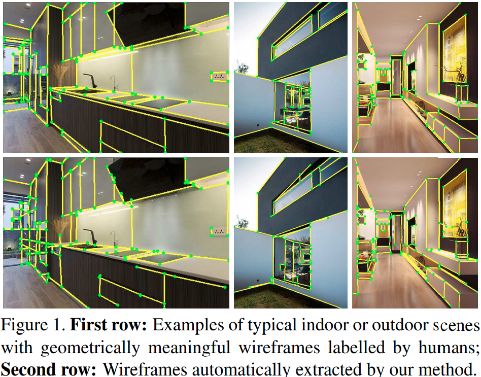

## 1.引言

如何从二维图像中推断出场景的三维几何信息一直是计算机视觉中的一个基本问题。建立三维模型的传统方法通常依赖于检测、匹配和三角测量局部图像特征（如角落、边缘、SIFT特征和patches）。使用局部特征的一个巨大优势是，只要场景包含足够多的可区分的特征，系统就可以在一定程度上对其视而不见。同时，计算机视觉系统的现代应用往往需要一个自主代理（如汽车、机器人或无人机）在杂乱的人造（室内或室外）环境中有效地与物理空间进行协商。这样的场景对目前基于局部特征的方法提出了重大挑战。人工环境通常由大面积的无纹理表面（如白墙或地面）组成；或者它们可能充满了重复的图案，因此局部特征的匹配是模糊的；视觉定位系统需要在延长的路线上稳健而准确地工作，有时还需要跨越视图之间的大基线。

然而，人类的视觉系统似乎能够毫不费力地在这样的环境中进行定位或导航，可以说是通过利用更大范围（全局或半全局）的结构特征或场景的规律性。例如，许多工作[6, 21, 14, 11, 35]已经证明，关于场景的先验知识，如曼哈顿世界，可以大大有利于三维重建任务。曼哈顿假设在杂乱的人造环境中经常被违反，但是假设人造环境主要是片状平面，因此有丰富的视觉上突出的线（平面的交叉点）和连结点（线的交叉点）是相当安全的。从概念上讲，这种交叉点或线条可能只是传统方法检测到的局部角落特征（或SIFTs）和边缘特征中的一个很小的 "子集"，但它们已经编码了关于场景中更大尺度的几何信息。为了简单起见，我们把这样一组线和它们的交叉点统称为 "线框"(1.在建筑设计中，线框通常指的是建筑或场景在纸上的线图。对这种三维物体的线图的解释在计算机视觉领域有很长的历史，可以追溯到70年代和80年代[19, 3, 42, 26]。)。

这项工作的目标是研究开发一种视觉系统的可行性，该系统可以高效且有效地提取人造场景的线框。直观地说，我们希望这样的系统可以模拟人类对场景几何体的感知水平，即使是从单个图像。 为此，我们收集了一个包含5，000多张典型室内和室外环境图像的数据库，并要求人类受试者手动标记出他们认为对理解常规物体的形状或场景的全局几何布局很重要的所有线段和连接点(2.为简单起见，这项工作仅限于由直线组成的线框。但这个想法和方法显然适用于带有曲线的线框)。图1(第1行)展示了标记线框的一些表示例子。

在文献中，已经提出了几种方法来检测图像中的线段[45]或连结点[35, 47]，并利用检测到的特征来进一步推理三维场景的几何结构[21, 11, 10, 34, 51]。这些方法通常采取自下而上的方法。首先，在图像中检测线段。然后，将两个或更多的线段进行分组，形成候选的连接点。然而，这种方法有几个固有的困难。首先，通过列举所有的线段对，会产生大量的交叉点。但其中只有很小的子集是图像中真正的交点。为了检索出真正的连结点，之前已经提出了各种启发式方法以及基于RANSAC的验证技术。结果，这些方法往往很耗时，甚至在场景的几何和纹理变得复杂时就会失效。其次，检测线段本身是计算机视觉中的一个难题。如果不能检测到图像中的某些线段，那么该方法就不可能找到相关的连接点。第三，由于所有现有的方法都依赖于低层次的线索，如图像梯度和边缘特征来检测线段和连结点，它们通常无法区分具有全局几何重要性的连结点和线段与由局部纹理或不规则形状产生的线段。

鉴于现有方法的基本困难，我们在本文中提出了一种补充性的线框（连结点和线段）检测方法。我们的方法不依赖于图像梯度和边缘等低层次特征的分组。相反，我们直接从上述大规模的手工标记的连结点和线段数据集中学习大空间支持的连结点和线段的检测器。特别是，受卷积神经网络最近在目标检测方面的成功启发，我们分别为连结点和线条检测设计了新的网络结构。然后，我们给出了一个简单而有效的方法来建立检测到的连结点和线条之间的入射关系，并为场景生成一个完整的线框。图1（第二行）显示了所提方法的典型结果。可以看出，我们的方法能够检测到由具有弱梯度的长线段形成的连结点，同时大大减少了错误检测的数量。此外，由于标记的连接点和线段主要与场景中突出的大尺度几何结构相关联，所得到的线框在几何上更有意义，模拟了人类对场景几何的感知。

**工作贡献**	包括:(i) 建立了一个大型数据集，用于基于学习的人造环境的线框检测；(ii) 开发了有效的、端到端可训练的CNN，用于检测几何信息的连接点和线段。与现有的连结点和线段检测方法相比，我们基于学习的方法在这两项任务上都取得了数量和质量上的优异表现，因此令人信服地验证了线框解析的可行性。此外，连结点和线段检测在测试时都达到了几乎实时的性能，因此适用于广泛的现实世界的应用，如特征对应、三维重建、基于视觉的制图、定位和导航。

### 相关工作

**边缘和线段检测**	在从图像中提取线段方面已经做了很多工作。现有的方法通常是基于低层次线索（即图像梯度）的感知分组[33, 45, 2, 23, 24]。这些局部方法的一个关键挑战是选择一些适当的阈值来区分真正的线段和错误的连接点。另一条工作路线是将Hough变换扩展到线段检测[30, 15, 50]。虽然Hough变换有能力在整个图像上积累信息以确定线段结构的存在，但识别图像中线段的端点仍然是一个挑战[1]。最近，基于机器学习的方法已被证明在生成像素级的边缘图方面产生了最先进的结果[8, 48, 28]。但是这些方法并不试图从图像中提取直线段。

**连接点检测**	由于存在大量零散的、虚假的和缺失的线段，检测和分析真实世界图像中的连接点仍然是一个具有挑战性的问题。在文献中，通常有两种方法来解决这个问题。第一类方法主要是基于局部图像线索的运算器，如Harris角点检测器[18]。然而，众所周知，局部连结点的检测是很困难的，即使对人类来说也是如此[31]。最近的方法是通过首先定位轮廓（在自然图像中）[25]或直线段（在人造环境中）[21, 35, 10, 47]，然后将它们分组形成连结点来检测结点。正如我们之前所讨论的，这种自下而上的方法（i）对场景的复杂性很敏感，（ii）容易受到不完美的线段检测结果的影响。

**基于线段和连接点的几何推理**	众所周知，关于连结点和相关线条结构的知识有利于许多现实世界的三维视觉任务。从单一图像中，最近的一系列工作使用这些特征来恢复场景的三维布局[21, 35, 34, 51]。同时，观察到连结点对相邻线段的入射约束，[20]设计了一种无需明确地跨视图匹配线段的三维重建方法，而[46]提出了一种表面支架结构，由连接的边缘集组成，以规范基于立体的建筑重建方法。此外，[10]使用线段和连结点开发了一种稳健有效的双视图姿势估计方法，[49]系统地研究了连结点知识如何影响透视-线（PnL）问题的复杂性和解决方案的数量。

**机器学习和几何学**	在基于机器学习的方法推断场景的像素级几何属性方面有大量的工作，如深度[40，9]和表面法线[12，13]。但是，在有监督的训练数据下检测中/高层次的几何基元方面的工作却很少。最近，[17]提出了一种识别单一图像中的平面的方法，[16]使用SVM对室内平面（如墙壁和地板）进行分类，[27，39，5]训练完全卷积网络（FCN）来预测由房间面的成对交叉点形成的 "信息 "边缘。然而，这些工作都不是为了检测图像中高度压缩的矢量化连结点或线段，更不用说完整的线框了。

## 2.一个新的线框检测数据集

作为我们基于学习的线框检测框架的一部分，我们已经收集了5462张人造环境的图像。一些例子显示在图2中。这些场景既包括室内环境，如卧室、客厅和厨房，也包括室外场景，如房子和院子。对于每张图片，我们都手动标记了与场景结构相关的所有线段。在这里，我们的重点是图像中的结构元素，也就是可以从中提取有意义的场景几何信息的元素（即线段）。因此，我们不标记与纹理（如窗帘、树叶）、不规则或弯曲的物体（如沙发、人、植物）、阴影等相关的线段。

有了标记的线段，可以很容易地从图像中两个或多个线段的交叉或入射关系中获得ground truth的连接点及其分支（图2，第二行）。请注意，与以前的工作[35, 34]不同，我们并不局限于曼哈顿连结点，这些连结点是由与场景中三个主要和互为正交的方向之一对齐的线段形成。事实上，我们数据集中的许多场景并不满足曼哈顿世界的假设[4]。例如，图2最后一列中描述的场景有两个以上的水平方向。

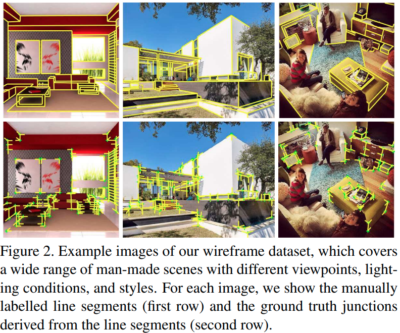

总之，我们在每个图像中的注释包括一组连结点和一组线段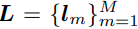。每个连结点p是几个，比如说R，线段的交点，称为其分支。p的坐标表示为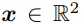，它的线段分支由它们的角度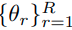记录。数字R被称为连结点的阶数，典型的 "L"、"Y "和 "X "型连结点的阶数分别为R=2、3和4。每条线段由其两个端点表示：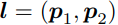。因此，线框，表示为W，记录了P中的连结点和L中的线段之间的所有入射和相交关系。它可以用一个N×M的矩阵W来表示，如果在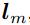上，其第nm项为1，否则为0。请注意，当且仅当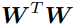中的相应项为非零时，两条线段在某个结点相交；类似地，对于连接的连结点，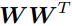也是如此。

## 3.线框检测方法

最近，深度卷积神经网络（CNN），如[41, 38, 37]，在物体检测任务中表现出令人印象深刻的性能。利用我们拥有的数据集，我们在这里设计了新的、端到端、可训练的CNN，分别用于检测连接点和线条，然后将它们合并成一个完整的线框。图3显示了我们提出的网络和方法的整体架构。请注意，由于连结点和线的几何性质，我们为它们选择了不同的网络架构，我们将在下面详细说明。

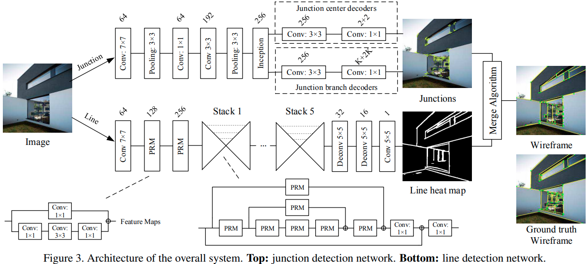

### 3.1 连接点检测

#### 3.1.1 设计原理

我们对网络结构的设计是以关于连结点的几个重要观察为指导。

**对于全局检测的全卷积网络**	

正如我们之前提到的，局部连结点检测是一项困难的任务，这往往会导致虚假的检测。因此，在进行预测时，使网络能够进行全局推理是很重要的。这促使我们选择全卷积网络（FCN），因为它最近在物体检测方面取得了成功[37]。与其他流行的基于滑动窗口[41]或区域建议[38]的物体检测技术不同，FCN可以看到整个图像，因此它隐含地捕获了关于连接点的上下文信息。与[36, 37]类似，我们的网络将输入图像划分为一个H×W网状网格，见图4右侧。如果一个连结点的中心落入一个网格单元，该单元就负责检测它。 因此，每个第ij个单元预测一个置信分数，反映了模型认为该单元存在一个连结点的信心程度。为了进一步确定连结点的位置，每个第ij个单元还预测其相对位移与单元中心的关系。请注意，网格单元的行为类似于所谓的 "锚"，在最新的物体检测pipeline中充当回归参考[38, 36, 22]。

**连结点分支的多bin表示**	
与传统的物体检测任务不同，由于连接点处的分支数量不同，我们网络中的每个单元需要进行不同数量的预测。为了解决这个问题，我们借用了空间网格的思想，提出了一个新的多bin的分支表示，如图4左所示。我们把圆（即从0到360度）分成K个相等的bin，每个bin横跨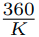度。让第k个bin的中心为，如果θ落入第k个bin，然后我们将角度θ表示为（k，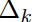)，其中是顺时针方向上从中心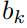出发的角度余量。因此，对于每个bin，我们回归到这个局部方向。

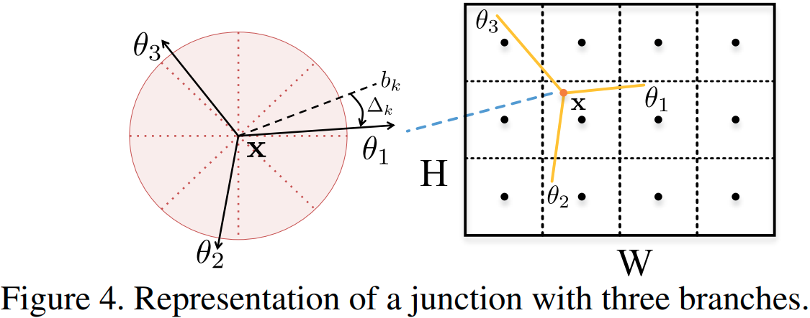

因此，我们的网络架构由一个编码器和两套解码器组成。编码器将整个图像作为输入，通过卷积网络产生一个H×W的高级描述符网格。然后，解码器使用特征描述符来进行连结点预测。每个连结点由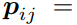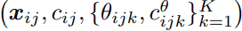，其中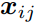是连接点中心的坐标，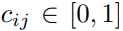是第ij网格存在一个连接点的置信分数，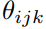是分支在第k个bin中的角度，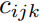是bin的置信分数。这两组解码器分别预测连结点中心和分支。每个FCN解码器只是一个卷积层，后面是一个回归器，如图3顶部所示。

与局部连结点不同，我们旨在检测的连结点都是由两个或更多的长线段（分支）相交形成的。虽然连结点检测没有明确依靠边缘/线段检测作为中间步骤，但通过强制网络对分支及其方向进行正确的检测，间接地学到了相关的边缘知识。

#### 3.1.2 损失函数

为了引导学习过程走向理想的输出，我们的损失函数由四个模块组成。给定一组ground truth连结点P={p1, ...... , pN }，我们把损失函数写成如下：

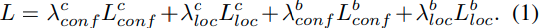

接下来，我们解释每一项的细节。

**连接点中心置信度损失**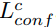	连接点中心置信度解码器预测一个分数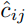，表示每个网格单元中连接点的概率。设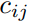是ground truth的二元分类标签，我们使用交叉熵损失：

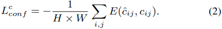

**连接点中心位置损失**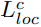	连结点中心位置解码器预测出每个网格单元的连结点的相对位置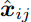。我们用ℓ2损失来比较预测值和每个ground truth连结点：

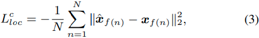

其中f(n)返回第 n 个ground truth连结点落入的网格单元的索引，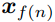是关于单元中心的ground truth连接点的相对位置。

**连接点分支置信度损失**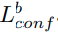	连结点分支置信度解码器为每个网格单元中的每个bin预测一个分数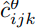，表示该bin中出现连结点分支的概率。与上面的连结点中心置信度损失类似，我们使用交叉熵损失来比较预测结果和ground truth标签。唯一的区别是，我们只考虑那些存在ground truth连结点的网格单元:

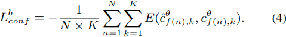

**连接点分支位置损失**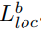	与连接点中心位置损失类似，我们首先确定，对于每个ground truth连接点，其分支落入的bin的索引，表示为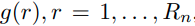，其中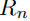是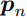的阶数。然后，我们使用 l2 损失将我们的预测与ground truth进行比较：

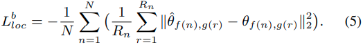

**实施细节**	我们构建的模型将图像编码为60×60的256维特征网格。 网格中的每个单元负责预测相应的图像区域中是否有连结点存在。我们的编码器是基于谷歌的Inception-v2模型[43]，它可以提取多尺度的特征，非常适合我们的问题。对于我们的问题，我们只使用Inception网络的早期层，即第一层到 "Mixed_3b"。每个解码器由一个3×3×256的卷积层组成，然后是一个ReLU层和一个回归器。注意，回归器被方便地实现为1×1×d卷积层，其中d是输出的维度。

公式1中权重的默认值被设定为：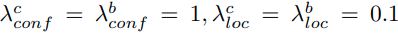

我们选择了K=15的bin的数量。我们的网络是用随机梯度下降法（SGD）从头开始训练的。动量参数被设置为0.9，batch size大小被设置为1。我们遵循训练深度神经网络的标准做法，用图像领域的操作来增加数据，包括镜像、翻转倒置和裁剪。最初的学习率被设定为0.01。 我们在每100,000次迭代后，以0.1的倍数减少它。在300,000次迭代时达到收敛。

### 3.2 线检测

接下来，我们设计并训练一个卷积神经网络（图3底部）来推断RGB图像的线条信息。神经网络预测每一个像素p是否落在一条(长)线l上。 为了抑制局部边缘、短线和曲线，像素p的预测值h(p)（热图）被设定为其所属线条的长度。给定一个具有ground truth线L的图像，h(p)的目标值被定义为：

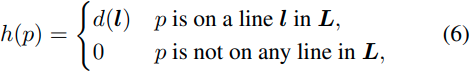

其中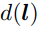是线l的长度。设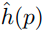为估计的热图值，那么我们试图最小化的损失函数为ℓ2损失

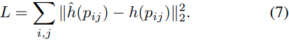

其中遍历图像的所有像素求和。

**实施细节**	网络架构的灵感来自堆叠沙漏网络[32]。它采用 320×320×3 RGB 图像作为输入，通过三个金字塔残差模块 （PRM） 提取 80×80×256 的特征图，参见图 3 底部。然后，特征图通过五个堆叠的沙漏模块，然后是两个完全卷积和 ReLU 层（5 × 5 × 32 和 5 × 5 × 16）和一个 5 × 5 × 1 卷积层，输出 320 × 320 × 1 个像素的热图。详细的金字塔残差模块和堆叠沙漏模块可以在[32]中找到。

在训练过程中，我们采用随机梯度下降（SGD）方法。动量参数设置为0.9，batch size设置为4。同样，我们用图像领域的操作来增加数据，包括镜像和翻转倒置。最初的学习率被设定为0.001。在100个epochs后，我们以0.1的倍数减少它。 在120个epochs中达到收敛。

请注意，我们使用Inception网络进行连结点检测，而使用沙漏网络进行线条检测。在连结点检测中，我们对线条的整个支持度不感兴趣，因此Inception网络的接受域足以完成此类任务。然而，我们发现，对于准确检测具有大空间支持的线条来说，叠加沙漏网络由于其大的（有效的）接收域而效果更好。此外，我们的实验还表明，上述与长度有关的ℓ2损失比基于学习的边缘检测中经常使用的交叉熵成本更有效。

### 3.3 结合线框的连接点和线段

系统的最后一步是结合连结点检测和线段检测的结果，生成图像的线框W，如前所述，它由一组结点P和一组线段L连接而成。

具体来说，给定一组检测到的连结点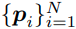和线热图h，我们首先应用一个阈值w将h转换成二进制图。然后，我们基于以下规则和步骤构建线框：

1. 集合P是用连结点检测器的输出来初始化的。如果一对检测到的连结点p和q∈P位于（或接近于）彼此的分支上，则由线段l=（p，q）连接，我们将此线段l添加到L中。如果连结点p的同一分支上有多个检测到的连结点，我们只保留最短的线段以避免重叠(3.因此，我们对检测具有尽可能长而支持的直线不太感兴趣，相反，我们对它与其他线和连接点的入射关系感兴趣。)。
2. 对于未连接到任何其他连接点的连接点 p 的任何分支，我们尝试使用 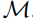恢复其他线段。我们首先找到最远的线像素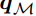（如果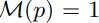，则像素p是线像素），它也在沿着分支从p开始的线上。然后，我们找到线段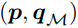与 L 中现有线段的所有交点 {q1， . . . ， 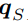} 。设 q0 = pi 且 ，我们计算每个段的线支持比 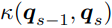， s = {1， . . . ， S， S + 1}。此处，κ 定义为线像素数与线段总长度的比率。如果 κ 高于阈值，比如 0.6，我们将线段添加到 L，将其端点添加到 P 。

请注意，集合 P 和 L 可能都有两个候选源。对于连接点集 P，除了连接点检测直接检测到的那些之外，线段还可以产生连接点检测遗漏的新连接点或端点。对于线段集L，它可以来自检测到的连接点分支和线检测。

我们将算法的更详细的描述留给补充材料。当然，可以有更高级的方法来合并检测到的连接点和线热图，我们将在未来的工作中探索。然而，从我们的实验中（见下一节），我们发现连接点检测和线检测的结果相当互补，并且上述简单的程序已经产生了相当不错的结果。

## 4.实验

在本节中，我们进行了广泛的实验，以评估我们的方法所产生的连结点和最终线框的质量，并将其与最先进的方法进行比较。所有的实验都在一台NVIDIA Titan X GPU设备上进行。在测试阶段，我们的方法以每秒两帧的速度运行，因此我们的方法有可能适用于需要实时处理的应用。

### 4.1 数据和评估度量

为了进行性能评估，我们将线框数据集分为训练集和测试集。在数据集中的5,462张图片中，随机选择5,000张图片进行训练和验证，其余462张图片用于测试。对于连结点检测（第4.2节），我们将任何方法检测到的连结点与ground truth连结点进行比较（图2，第二行）。对于线框构造（第4.3节），我们将任何方法检测到的线段与人类标示的ground truth线段进行比较（图2，第一行）。

对于连接点检测和线框构造实验，所有方法都通过召回和精度进行定量评估，如[29，25，47]中所述。在连接点检测的上下文中，召回率是检测到的真实连结点的分数，而精度是确实是真阳性的连接点检测的分数。在线框构造的上下文中，召回率是检测到的线段像素的分数，而精度是确实是真阳性的线段像素的分数。

具体来说，让G表示ground truth连结点（或线段像素）的集合，Q表示用任何方法检测到的连结点（或线段像素）的集合，精度和召回率定义如下：

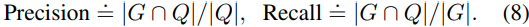

请注意，按照以前工作的协议[29, 25, 47]，召回率和精度的特定措施允许在连结点（或线段像素）的定位上有一些小的公差。在本文中，我们将该公差设定为图像对角线的0.01。

### 4.2 连接点检测比较

我们将我们的连结点检测方法与最近的两种方法进行比较，即曼哈顿连结点检测（MJ）[35]和逆向连结点检测（ACJ）[47]。 

**MJ[35]**：该方法使用一个简单的基于投票的方案检测由三个主要正交方向的线段形成的曼哈顿连结点。由于作者没有公布他们的代码，我们使用我们自己的方法实现。首先用LSD[45]检测线段，然后用J-Linkage[44]进行聚类，得到消失点。请注意，这个方法只适用于满足曼哈顿世界假设的场景。为了公平比较，我们只保留检测到三个主要消失点的图像。在我们的实施中，一个重要的参数是线段和点p之间的最大距离，以便该线段投票给p。我们改变了∈{10, 20, 30, 50, 100, 200, 300, 500}像素的值。

**ACJ[47]**：这种方法依赖于图像梯度的统计建模和一种相反的方法来检测连结点。具体来说，有意义的连结点被检测为那些在无效假设下非常不可能的连结点，该假设是基于任意自然图像的梯度分布而定义的。在该方法中，每个候选连结点都与一个取决于其周围图像梯度的强度值有关。然后，用一个阈值来验证候选连结点，这个阈值是通过控制下图像中的错误检测数量得出的。在实验中，我们使用了[47]作者提供的实现，并改变了

**性能比较**	图 5 显示了我们新数据集上所有方法的精确召回率曲线。对于我们的方法，我们将连接点置信度阈值 τ 从 0.1 更改为 0.9。正如人们所看到的，我们的方法比其他方法的表现好得多。图7定性地比较了我们测试数据上所有方法的结果。与其他两种方法相比，由于线段检测结果不完善，MJ往往会错过重要的连接点。 此外，由于MJ依赖于局部图像特征，因此它在某些连接点周围明显会产生相当多的重复检测。通过直接对图像梯度进行建模，ACJ能够找到场景结构上的大多数连接点。然而，作为一种局部方法，ACJ对纹理区域（例如，第一个图像的地板，第四个图像的天空）进行了很多错误的预测。相比之下，我们的方法能够检测由突出线相交的大多数连结点，同时最大限度地减少错误检测的数量。这并不奇怪，因为我们的监督框架隐式编码了场景的高级结构和语义信息，因为它从人类提供的标记数据中学习。

### 4.3 线段检测比较

在本节中，我们将我们的方法的线框结果与两种最先进的线段检测方法进行比较，即线段检测器（LSD）[45]和马尔科夫链边际线段检测器（MCMLSD）[1]。我们在我们的新数据集和MCMLSD[1]工作中使用的York Urban数据集[7]上测试并与这些方法进行比较。

**LSD[45]**：	该方法是一种线性时间的线段检测器，不需要调整参数。它还使用了一种相反的方法来控制错误检测的数量。 在这个实验中，我们使用作者发布的代码(4.http://www.ipol.im/pub/art/2012/gjmr-lsd/)，并在中改变阈值为-log(NFA)（NFA是错误警报的数量)。

**MCMLSD[1]**：该方法提出了一个两阶段的算法来寻找线段。在第一阶段，它使用概率Hough变换来识别全局最优线。在第二阶段，它在图像中搜索每条线的支持（线段），这些线段可以被建模为线性马尔可夫链中的标记隐藏状态。在这个实验中，我们使用了作者发布的代码(5.http://www.elderlab.yorku.ca/resources/)。请注意，[1]的作者引入了一个与我们不同的指标，倾向于惩罚过度分割的行为。 因此，我们的衡量标准对他们的方法可能是不公平的。尽管如此，我们的指标更适合于线框检测，因为如果一条长线与其他线相交，我们更愿意将其解释为连结点之间的若干段。

**性能比较**	图6分别显示了我们的数据集和York Urban数据集上所有方法的精确-召回曲线。正如人们所看到的，在我们的数据集上，我们的方法比其他方法的表现要好得多。York Urban数据集的边际是不错的，但不是那么大。根据[1]，York Urban数据集的标记对于突出线段并不那么完整，因此它不完全适合这里的线框检测任务。图8定性地比较了我们测试数据上所有方法的结果。由于其他两种方法依赖于局部测量，因此它们倾向于在纹理区域（例如第一幅图像的窗帘）上产生许多与场景结构不对应的线段。

## 5.结论

本文证明了在人造环境图像中解析线框的可行性。该方法基于结合在新的大规模数据集上训练的各自神经网络检测到的连接点和线。无论是在数量上还是在定性上，我们的方法的结果都近似于人类标记的结果。线框中的连接点和线段及其入射关系以高度压缩和高效的方式编码场景的丰富而精确的大比例几何体和其中规则对象的形状。因此，这项工作的结果可以显着促进和有益于视觉任务，例如特征匹配，3D重建，基于视觉的映射，定位和人造环境中的导航。
