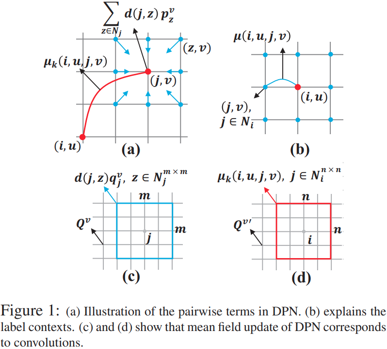
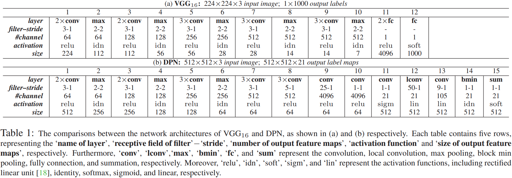
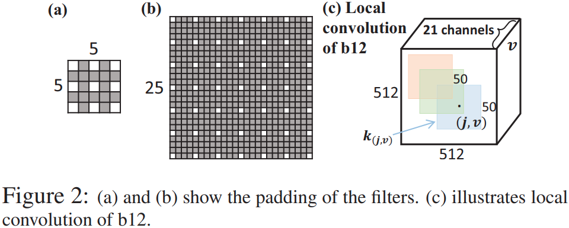
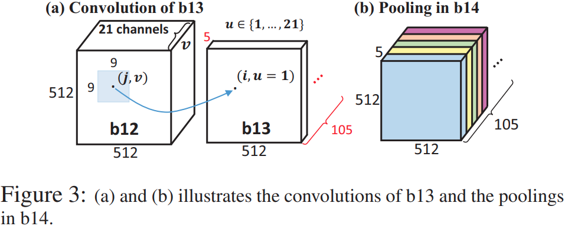
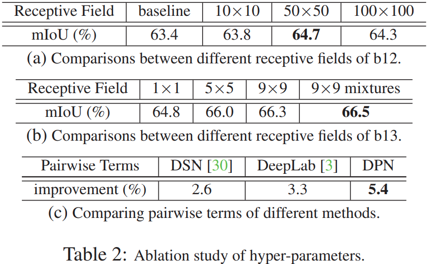
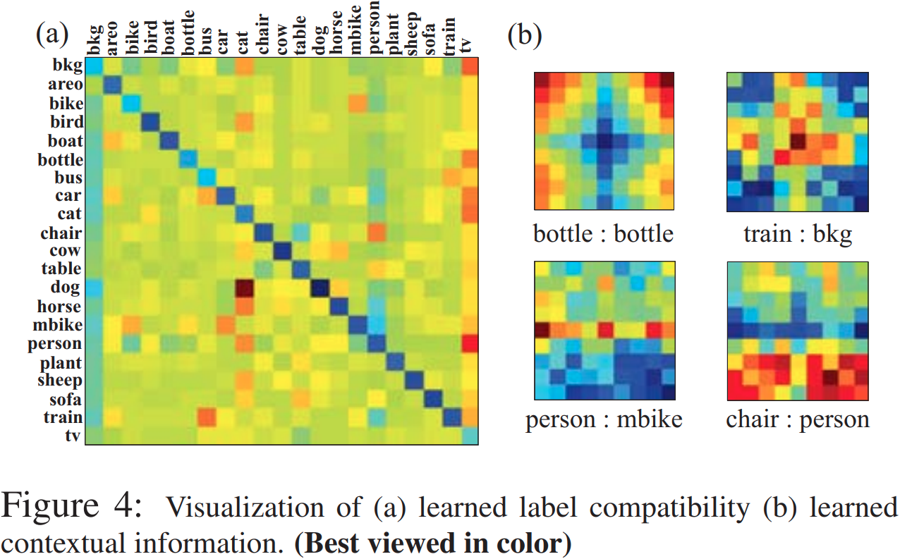
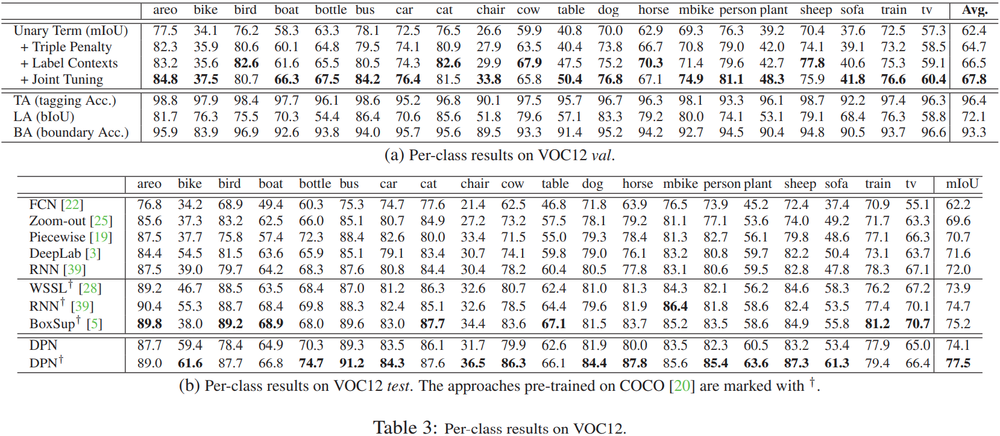
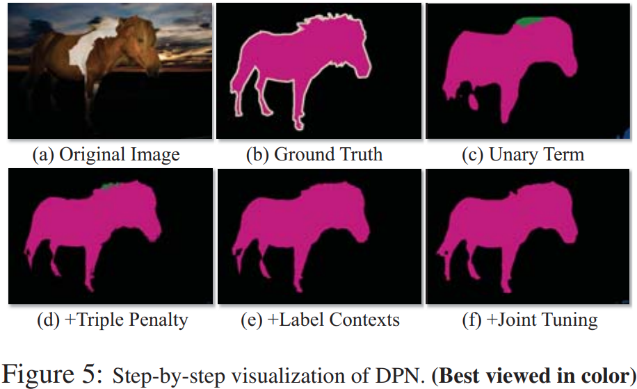
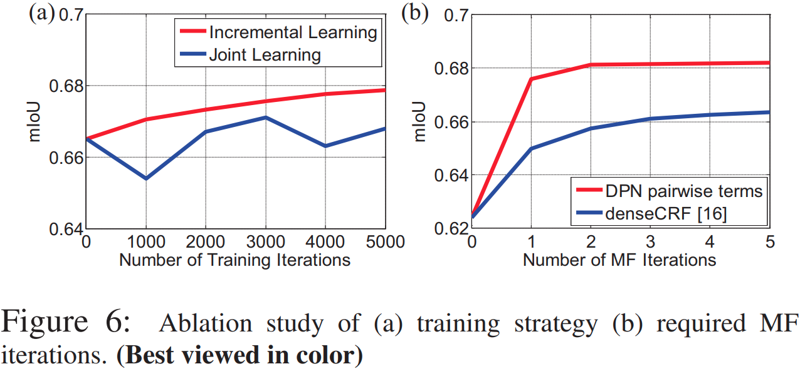
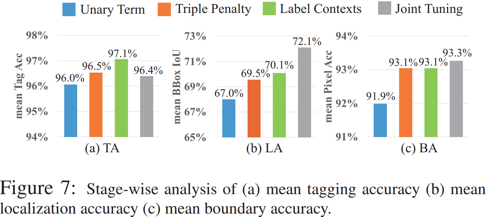

# Semantic Image Segmentation via Deep Parsing Network

## 摘要

本文通过将丰富的信息纳入马尔可夫随机场 (MRF) 来解决语义图像分割问题，包括高阶关系和标签上下文的混合。与之前使用迭代算法优化 MRF 的工作不同，我们通过提出卷积神经网络 (CNN)，即深度解析网络 (DPN)来解决 MRF，它可以在单个前向传递中实现确定性的端到端计算。具体来说，DPN 扩展了现代 CNN 架构以对一元项建模，并精心设计了附加层以近似成对项的平均场算法 (MF)。它有几个吸引人的特性。首先，与最近结合 CNN 和 MRF 的工作不同，在反向传播过程中每个训练图像需要多次 MF 迭代，DPN 能够通过近似 MF 的一次迭代来实现高性能。其次，DPN代表了各种类型的成对项，使得许多现有的工作成为它的特例。第三，DPN 使 MF 更容易在图形处理单元 (GPU) 中并行化和加速。 DPN 在 PASCAL VOC 2012 数据集上进行了全面评估，其中单个 DPN 模型产生了 77.5% 的新的最先进的分割精度

## 1.引言

马尔可夫随机场（MRF）或条件随机场（CRF）在语义图像分割方面取得了巨大成功，这是计算机视觉中最具挑战性的问题之一。现有工作 [31, 29, 9, 34, 11, 2, 8, 25, 22] 通常可以根据它们对 MRF 的一元和成对项的定义分为两组。

在第一组中，研究人员通过探索丰富的信息来定义成对函数，包括长程依赖性 [16、17]、高阶势 [37、36] 和语义标签上下文 [21、26、38]，从而提高了标签准确性。例如，Krahenbuhl 等人[16] 通过推断完全连接的图获得准确的分割边界。 Vineet 等人[37] 通过定义像素之间的高阶项和长程项扩展了 [16]。 [38] 还研究了标签之间的全局或局部语义上下文。尽管他们取得了可喜的成果，但他们将一元项建模为 SVM 或 Adaboost，其学习能力成为瓶颈。复杂的成对项的学习和推理通常是昂贵的。

在第二组中，人们利用卷积神经网络 (CNN) 等深度学习的最新进展来学习强大的一元分类器。对于深度模型，这些工作 [23、24、25、22、3、28、39、30、19] 使用成对函数的简单定义甚至忽略它展示了令人鼓舞的结果。例如，Long 等人[22] 将 CNN 的全连接层转换为卷积层，使用在 ImageNet [6] 上预训练的当代 CNN 架构可以实现准确的每像素分类。陈等[3] 通过将 CNN 的输出馈入具有简单成对势的 MRF 改进了 [22]，但它将 CNN 和 MRF 视为分离的组件。 [30] 获得了最近的进展，它通过将 MRF 推理的误差反向传递给 CNN 来联合训练 CNN 和 MRF，但是在反向传播（BP）期间中每个训练图像都需要 MRF 的迭代推理，例如平均场算法（MF）[27]。郑等[39] 进一步表明，MF 推理的过程可以表示为循环神经网络 (RNN)，但它们的计算成本相似。我们发现如上直接组合 CNN 和 MRF 是低效的，因为 CNN 通常有数百万个参数，而 MRF 推断出数千个潜在变量；更糟糕的是，将复杂的成对项合并到 MRF 中变得不切实际，从而限制了整个系统的性能。

这项工作提出了一种新颖的深度解析网络 (DPN)，它能够联合训练 CNN 和复杂的成对项。 DPN 有几个吸引人的特性。 (1) DPN 通过单次前馈求解 MRF，降低了计算成本，同时保持了高性能。具体来说，DPN 通过扩展在 ImageNet 上预训练的 VGG-16 网络 ($VGG_{16}$) [32] 来对一元项进行建模，同时精心设计附加层来对复杂的成对项进行建模。 BP 将对这些项的学习转化为确定性的端到端计算，而不是像 [30、19] 那样将 MF 嵌入到 BP 中。虽然 MF 可以用 RNN [39] 表示，但它需要循环计算前向传播以获得良好的性能，因此非常耗时，例如每个前向传播包含数十万个权重。 DPN 仅使用一次迭代来逼近 MF。这可以通过联合学习强一元项和丰富的成对信息来实现。 (2) 成对项决定图形结构。在以前的工作中，如果前者发生变化，后者及其推理过程也会发生变化。但是使用 DPN，修改成对项的复杂性，例如像素和上下文的范围，就像修改卷积的感受野一样简单，而不改变 BP。 DPN 能够表示多种类型的 成对项，使得许多先前的工作 [3, 39, 30] 成为它的特例。 (3) DPN 通过卷积和池化操作来逼近 MF，这可以通过低秩逼近 [14] 来加速，并且可以在图形处理单元 (GPU) 中轻松并行化 [4]。

我们的贡献总结如下。 (1) 提出了一种新的 DPN 来联合训练 $VGG_{16}$和丰富的成对信息，即标签上下文和高阶关系的混合。与现有的深度模型相比，DPN 仅需一次迭代即可逼近 MF，降低了计算成本，但仍保持高性能。 (2) 我们公开了 DPN 代表多种类型的 MRF，将许多先前的工作如 RNN [39] 和 DeepLab [3] 作为其特例。 (3) 广泛的实验调查了 DPN 的哪个组件对于实现高性能至关重要。单个 DPN 模型在 PASCAL VOC 2012 [7] 测试集上实现了 77.5% 的新的最先进精度。 (4)我们分析了DPN在GPU上的时间复杂度。

## 2.我们的方法

DPN 通过将$VGG_{16}$扩展到模型一元项来学习 MRF，并且为成对项精心设计了额外的层。

概述 MRF [10] 是一个无向图，其中每个节点代表图像 I 中的一个像素，每条边代表像素之间的关系。每个节点都与一个二进制潜在变量 $y^i_u \in {0,1}$ 相关联，指示像素 i 是否具有标签 u。我们有$\forall u \in L = {1,2,...,l}$，代表一组 l 个标签。 MRF的能量函数写为
$$
E(y) = \sum_{\forall i \in \nu} \Phi(y^u_i) + \sum_{\forall i,j \in \epsilon} \Psi(y^u_i,y^v_j),
$$
其中 y、$\nu$和$\epsilon$分别表示一组潜在变量、节点和边。$\Phi(y^u_i)$是一元项，衡量将标签 u 分配给第 i 个像素的成本。例如，如果像素 i 属于第一个类别而不是第二个类别，我们应该有 $\Phi(y^1_i) < \Phi(y^2_i)$。此外，$\Psi(y^u_i,y^v_j)$是成对项，用于衡量将标签 u、v 分别分配给像素 i、j 的惩罚。

直观上，一元项表示每个像素的分类，而成对项表示一组平滑度约束。等式（1）中的一元项通常定义为
$$
\Phi(y^u_i) = -\ln{p(y^u_i = 1 | I)}
$$
其中$p(y^u_i = 1 | I)$表示标签 u 在像素 i 处存在的概率，由$VGG_{16}$建模。为了简化讨论，我们将其缩写为 $p^u_i$ 。平滑项可以表示为
$$
\Psi(y^u_i, y^v_j) = \mu(u,v)d(i,j),
$$
其中第一项学习任何一对标签之间的全局共现的惩罚，例如如果 u 和 v 不应共存，则$\mu(u,v)$的输出值很大，而第二项计算像素之间的距离，例如$d(i,j)=\omega_1||I_i - I_j||^2 + \omega_2||[x_i \ y_i] - [x_j \ y_j]||^2$。这里，$I_i$表示从第i个像素提取的RGB值等特征向量，x、y表示像素位置坐标，ω1、ω2为常量权重。公式式（3）意味着如果两个像素很接近并且看起来相似，则鼓励它们具有兼容的标签。它已被大多数最近的深度模型 [3, 39, 30] 采用，用于语义图像分割。

然而，公式(3) 有两个主要缺点。首先，它的第一项捕获了训练数据中两个标签的共现频率，但忽略了对象之间的空间上下文。例如，“人”可能出现在“桌子”旁边，但不会出现在其底部。这种空间上下文是模式的混合，因为不同的对象配置可能出现在不同的图像中。其次，它仅定义了像素之间的成对关系，而忽略了它们的高阶交互。

为了解决这些问题，我们通过利用像素之间的丰富信息来定义平滑项，这是 DPN 优于现有深度模型的优势之一。我们有
$$
\Psi(y^u_i,y^v_j) = \sum^{K}_{k = 1} \lambda_k \mu_k(i, u, j, v) \sum_{\forall z \in N_j} d(j, z)p^v_z.
$$
公式(4) 中的第一项学习混合局部标签上下文，惩罚局部区域中的标签分配，其中 K 是混合中成分的数量，$\lambda_k$是一个指标，确定哪个成分被激活。我们定义 $\lambda_k \in \{0,1\}$和 $\sum^{K}_{k= 1}\lambda_k = 1$。
如图1（b）所示，其中红色和蓝色的点表示中心像素i及其相邻像素j，即$j \in N_i$，并且（i，u）表示将标签u分配给像素i。这里，$\mu(i, u, j, v)$ 输出 (i, u) 和 (j, v) 之间相对于它们的相对位置的标签成本。例如，如果 u，v 代表“人”和“桌子”，则位于中心 i 底部的位置 j 的学习惩罚应该很大。第二项基本上模拟了三重惩罚，涉及像素 i、j 和 j 的邻居，这意味着如果 (i, u) 和 (j, v) 兼容，则 (i, u) 也应该是
兼容j的附近像素（z，v），$\forall z \in N_j$，如图1（a）所示。

公式(1)中的学习参数（即$VGG_{16}$的权重和标签上下文的成本）是最小化ground-truth标签图与y之间的距离，需要在平滑约束下进行推断。

推论概述公式（1）的推论可以通过平均场（MF）算法[27]获得，该算法估计MRF的联合分布，$P(y)=\frac{1}{Z}exp\{-E(y)\}$，通过使用一个完全分解的提议分布，$Q(y) = \prod_{\forall i \in \nu} \prod_{\forall u \in L}q^u_i$，其中每个 $q^u_i$是我们需要估计的变量，表示将标签 u 分配给像素 i 的预测概率。为了简化讨论，我们将 $\Phi(y^u_i)$ 和 $\Psi(y^u_i,y^v_j)$分别表示为 $\Phi^u_i$和$\Psi^{uv}_{ij}$ 。 Q(y) 通常通过最小化 MRF 的自由能量函数 [15] 来优化，
$$
F(Q)=\sum_{\forall i \in \nu}\sum_{\forall u \in L} q^u_i \Phi^u_i + \sum_{\forall i,j \in \varepsilon}\sum_{\forall u \in L}\sum_{\forall v \in L} q^u_i q^v_j \Psi^{uv}_{ij} + \sum_{\forall i \in \nu}\sum_{\forall u \in L} q^u_i \ln{q^u_i}.
$$
具体来说，公式（5）中的第一项表征每个像素预测的成本，而第二项表征像素之间预测的一致性。最后一项是熵，衡量预测的置信度。为了估计$q^u_i$，我们对公式(5) 进行微分，并将结果表达式等同于零。然后我们有一个封闭形式的表达式，
$$
q^u_i \propto exp\{-(\Phi^u_i + \sum_{\forall j \in N_i}\sum_{\forall v \in L} q^v_j \Psi^{uv}_{ij})\},
$$
这样每个像素的预测都是通过重复公式（6）独立获得的，这意味着像素 i 是否具有标签 u 与其所有相邻像素的估计概率成正比，并由其相应的平滑度惩罚加权。将公式（4）代入（6），我们有
$$
q^u_i \propto exp\{-\Phi^u_i - \sum^K_{k = 1} \lambda_k \sum_{\forall v \in L}\sum_{\forall j \in N_i} \mu_k(i, u, j, v) \sum_{\forall z \in N_j} d(j,z)q^v_jq^v_z\},
$$
其中每个$q^u_i$由公式（2）中相应的$p^u_i$初始化，这是$VGG_16$的一元预测。等式（7）满足平滑约束。

在下文中，DPN 通过将公式（7）分解为两步来近似公式（7）的一次迭代。令$Q^v$为第 v 个类别的预测标签图。在如图 1 (c) 所示的第一步中，我们通过在每个位置 j 上应用 m × m 滤波器来计算 (7) 中的三重惩罚项，其中该滤波器的每个元素等于$d(j,z)q^v_j$ , 得到${Q^v}^{\prime}$。显然，这一步平滑了像素 j 相对于它与其邻域之间的距离的预测。在 (d) 所示的第二步中，可以通过将${Q^v}^{\prime}$与 n × n 过滤器进行卷积来获得标记上下文，其中每个元素等于$\mu_k(i, u, j, v)$，惩罚三元关系，如(a)中所示。

## 3.深度解析网络

本节描述公式（7）在深度解析网络（DPN）中的实现。 DPN 将$VGG_{16}$扩展为一元项，并且设计附加层以将 MF 推理的一次迭代近似为成对项。 $VGG_{16}$和 DPN 的超参数比较见表 1。

$VGG_{16}$ 如表 1 (a) 中所列，第一行表示层的名称，第二行中的“x-y”分别表示感受野的大小和卷积的步幅。例如，卷积层中的“3-1”表示每个过滤器的感受野为 3×3，并应用于输入特征图的每个像素，而最大池化层中的“2-2”表示每个特征图都池化在 2×2 局部区域内的所有其他像素上。最后三行分别显示了输出特征图的数量、激活函数和输出特征图的大小。如表 1 (a) 中总结的那样，$VGG_{16}$ 包含十三个卷积层、五个最大池化层和三个全连接层。这些层可分为十二组，每组覆盖一个或多个同质层。例如，第一组包含两个具有 3×3 感受野和 64 个输出特征图的卷积层，每个特征图为 224×224。

### 3.1 建模一元项

为了充分利用 ImageNet 预训练的$VGG_{16}$，我们采用它的所有参数来初始化前十组 DPN 的过滤器。为了简化讨论，我们以 PASCAL VOC 2012 (VOC12) [7] 为例。请注意，DPN 可以通过修改其超参数轻松适应任何其他语义图像分割数据集。 VOC12 包含 21 个类别，每个图像在训练中重新缩放为 512×512。因此，DPN总共需要预测512×512×21个标签，即每个像素一个标签。为此，我们在两个方面扩展了$VGG_{16}$。

特别地，令$a_i$和$b_i$分别表示表 1 (a) 和 (b) 中的第 i 个组。首先，我们通过移除 a8 和 a10 处的最大池化层来提高 $VGG_{16}$ 的分辨率，因为大部分信息在池化后丢失，例如a10 将输入大小减少了 32 倍，即从 224×224 减少到 7×7。因此，DPN 中特征图的最小尺寸为 64×64，与$VGG_{16}$ 相比保留了更多信息。请注意，b8 的过滤器被初始化为 a9 的过滤器，但 3×3 感受野被填充为 5×5，如图 2（a）所示，其中白色单元格是 a9 过滤器的原始值以及灰色单元格为零。这样做是因为 a8 没有出现在 DPN 中，因此 a9 中的每个过滤器都应该在 a7 的每隔一个像素上进行卷积。为了保持一步的卷积，我们用零填充过滤器。此外，b11 中的特征图通过双线性插值被上采样到 512×512。由于 DPN 是用整幅图像的标签图训练的，因此 b11 前面层中丢失的信息可以通过 BP 恢复。

其次，a11 处的两个全连接层分别转换为 b9 和 b10 处的两个卷积层。如表 1 (a) 所示，第一个‘fc’层学习了 7×7×512×4096 个参数，在 b9 中可以更改为 4096 个滤波器，每个滤波器为 25×25×512。由于 a8 和 a10 已被删除，7×7 的感受野被填充为 25×25，与上面类似，如图 2（b）所示。第二个“fc”层学习一个 4096×4096 的权重矩阵，对应于 b10 中的 4096 个过滤器。每个过滤器为 1×1×4096。

总体而言，b11 生成一元标注结果，生成 21 个 512×512 的特征图，每个特征图代表每个类别的概率标签图。

### 3.2 建模平滑项

DPN 的最后四层，即从 b12 到 b15，经过精心设计以平滑一元标记结果。

$\bullet$b12 如表 1 (b) 中所列，b12 中的“lconv”表示局部卷积层，广泛用于人脸识别 [33、35]，以从不同的面部位置捕获不同的信息。类似地，b12 的不同空间位置具有不同的过滤器，并且每个过滤器在 21 个输入通道之间共享，如图 2 (c) 所示。它可以表述为
$$
o^{12}_{(j,v)} = lin(k_{(j,v)}*o^{11}_{(j,v)}),
$$
其中 $lin(x) = ax + b$表示线性激活函数，'*' 是卷积运算符，k(j,v) 是通道 v 位置 j 的 50×50×1 滤波器。我们有 k(j ,1) = k(j,2) = ... = k(j,21) 在 21 个通道中共享。 $o^{11}_{(j,v)}$表示b11中的一个局部patch，而 $o^{12}_{(j,v)}$是b12对应的输出。由于 b12 的步幅为 1，因此 kj ∗ $o^{11}_{(j,v)}$ 的结果是一个标量。总之，b12 有 512×512 个不同的过滤器并产生 21 个输出特征图。

公式（8）实现了公式（7）的三重惩罚。回想一下，b11 的每个输出特征图都表示图像中出现的特定对象的概率标签图。结果，公式(8) 表明对象 v 在位置 j 出现的概率通过对其附近位置的概率进行加权平均来更新。因此，如图 1 (c) 所示， $o^{11}_{(j,v)}$对应于以 j 为中心的$Q^v$的一块，其值为$p^v_z$，$\forall z \in N^{50 \times 50}_j$。类似地，k(j,v) 由$d(j,z)p^v_j$初始化，这意味着每个过滤器捕获位置之间的差异。这些过滤器在 BP 期间保持固定，而不是像传统的 CNN那样学习。

(b12中的每个过滤器实际上代表了特定区域中像素之间的距离度量。在 VOC12 中，由于物体形状的不同，特定区域中所有训练图像的模式都是异质的。因此，我们用欧氏距离初始化每个过滤器。尽管如此，公式(8) 是比公式(7) 中的三重惩罚更通用的形式，即如果特定区域中的模式是同质的，例如面部或人类图像，其形状比 VOC12 中的图像更规则。)

$\bullet$b13 如表1（b）和图3（a）所示，b13是一个卷积层，使用105个大小为9×9×21的过滤器生成105个特征图。例如，(i, u = 1) 的值是通过在位置 {(j, v = 1, ..., 21)} 处应用 9×9×21 滤波器获得的。换句话说，b13 为每个类别学习一个过滤器来惩罚 b12 的概率标签图，对应于公式（7）中的局部标签上下文，假设 K = 5 和 n = 9，如图 1（d）所示)。

$\bullet$b14 如表 1 和图 3 (b) 所示，b14 是一个块最小池化层，它在每个 1×1 区域上池化，每 5 个输入通道一个步长，导致 21 个输出通道，即 105÷5=21 . b14 以最小的惩罚激活上下文模式。

b15 该层通过以类似于公式（7）的逐元素方式对 b11 和 b14 的输出求和来组合一元和平滑项，
$$
o^{15}_{(i,u)} = \frac{exp\{ \ln(o^{11}_{(i,u)}) -  o^{14}_{(i,u)}\}}{\sum^{21}_{u=1}exp\{ ln(o^{11}_{(i,u)}) - o^{14}_{(i,u)} \}},
$$
其中将标签 u 分配给像素 i 的概率在所有标签上归一化

与以前的深层模型有关，许多现有的深层模型，例如[39，3，30]采用公式（3）作为成对项，这是公式（7）的特殊情况。要看到这个，让k = 1和j = i，（7）的右侧降低至
$$
exp\{-\Phi^u_i - \sum_{v \in L} \lambda_1 \mu_1(i, u, i, v) \sum_{z \in N_j} d(j,z)p^v_ip^v_z\} \\
= exp\{-\Phi^u_i - \sum_{v \in L} \mu(u, v) \sum_{z \in N_i,z \neq i} d(i,z)p^v_z\}
$$
其中 $\mu(u,v)$ 和 d(i, z) 分别表示公式（3）的全局标签共现和成对像素相似性。这是因为$\lambda_1$是常数，d(i, i)=0，$\mu(i, u, i, v) = \mu(u, v)$。公式(10)是公式(3)对应的MF更新方程。

### 3.3 学习算法

**Learning** 前十组DPN由 $VGG_{16}$ 初始化，后四组可以随机初始化。然后通过四个阶段以增量方式对 DPN 进行微调。在微调期间，所有这些阶段都解决了像素对 softmax 损失 [22]，但更新了不同的参数集。

首先，我们给 b11 添加一个损失函数，微调 b1 到 b11 的权重，去掉最后四组，以学习一元项。其次，为了学习三重关系，我们将 b12 堆叠在 b11 之上并更新其参数（即距离度量中的 ω1、ω2），但前面组（即 b1∼b11）的权重是固定的。第三，将b13和b14堆叠到b12上，类似地，在前面所有参数固定的情况下更新它们的权重，以学习局部标签上下文。最后，对所有参数进行联合微调。

**Implementation** DPN 将公式（7）转换为 b12 到 b15 组中的卷积和池化，这样每个像素的滤波可以以并行方式执行。假设我们有 f 个输入和 $f^{\prime}$ 个输出特征图、N×N 像素、具有 s×s 感受野的滤波器和一个具有 M 个样本的mini-batch。 b12总共需要$f \cdot N^2 \cdot s^2 \cdot M$次操作，b13需要$f \cdot f^{\prime} \cdot N^2 \cdot s^2 \cdot M$次操作，而b14和b15都需要$f \cdot N^2 \cdot M$次操作。例如，当我们的实验中 M=10 时，我们在 b12 中有 $21 \times 512^2 \times 50^2 \times 10 = 1.3 \times 10^{11}$次操作，这在 DPN 中具有最高的复杂度。我们像 [4] 那样在 GPU 上使用矩阵乘法并行化这些操作，b12 可以在 30 毫秒内计算出来。最后四层 DPN 的总运行时间为 75ms。请注意，DPN 中的卷积可以通过低秩分解[14] 过滤器和模型压缩 [13]进一步加速。

然而，公式（7）的直接计算被快速高斯滤波加速[1]。对于十张 512×512 图像的mini-batch，最近优化的实现 [16] 在 CPU 上需要 12 秒来计算 (7) 的一次迭代。因此，DPN 使 (7) 更易于并行化和加速。

## 4.实验

**数据集**	我们在 PASCAL VOC 2012 (VOC12) [7] 数据集上评估了所提出的方法，该数据集包含 20 个对象类别和一个背景类别。继 [12, 22, 3] 等之前的工作之后，我们使用 10, 582 张图像进行训练，使用 1, 449 张图像进行验证，使用 1, 456 张图像进行测试。

**评估度量**	所有现有的工作都采用平均像素对的交叉联合（表示为 mIoU）[22] 来评估它们的性能。为了全面检验 DPN 的有效性，我们引入了另外三个指标，包括标记准确度 (TA)、定位准确度 (LA) 和边界准确度 (BA)。 (1) TA将预测的图像级标签与ground truth标签进行比较，计算多类图像分类的准确率。 (2) LA评估预测对象边界框(他们是预测分割区域的边界框)和ground truth边界框之间的IoU（表示为bIoU），测量对象定位的精度。 (3) 对于那些已经正确定位的对象，我们将预测的对象边界与ground truth边界进行比较，测量语义边界的精度，类似于[12]。

**对比**	DPN 与 VOC12 上表现最好的方法进行了比较，包括 FCN [22]、Zoom-out [25]、DeepLab [3]、WSSL [28]、BoxSup [5]、Piecewise [19] 和 RNN [39]。所有这些方法都基于 CNN 和 MRF，并根据 [22] 在 VOC12 数据上进行训练。它们可以根据不同的方面进行分组：（1）联合训练：Piecewise和RNN； (2) 没有联合训练：DeepLab、WSSL、FCN 和 BoxSup； (3) 在 COCO 上进行预训练：RNN、WSSL 和 BoxSup。第一组和第二组分别是使用和不使用联合训练 CNN 和 MRF 的方法。最后一组中的方法还使用 MS-COCO [20] 来预训练深度模型。为了进行全面比较，报告了 DPN 在两种设置下的性能，即使用和不使用 COCO 预训练。

在下文中，第 4.1 节研究了 DPN 的不同组件在 VOC12 验证集上的有效性。 4.2 节将 DPN 与 VOC12 测试集上的最新方法进行比较

### 4.1 DPN的有效性

本节评估的所有模型均在 VOC12 上进行训练和测试。

**三重惩罚**	b12 的感受野表示每个像素的三重关系范围。我们检查了感受野的不同设置，包括“10×10”、“50×50”和“100×100”，如表 2 (a) 所示，其中“50×50”实现了最佳 mIoU，这明显优于“100×100”。对于 512×512 的图像，这个结果意味着 50×50 的邻域足以捕捉像素之间的关系，而较小或较大的区域往往对训练数据欠拟合或过拟合。此外，所有三重关系模型都优于对密集成对关系建模的“基线”方法，即 VGG16+denseCRF [16]。

**标签上下文**	b13 的感受野表示局部标签上下文的范围。为了评估其有效性，我们将 b12 的感受野固定为 50×50。如表 2 (b) 中总结的那样，“9×9 混合”分别将前面的设置提高了 1.7%、0.5% 和 0.2%。我们观察到“1×1”和“5×5”之间存在很大差距。请注意，b13 的 1×1 感受野对应于在不考虑局部空间上下文的情况下学习全局标签共现。表 2(c) 显示 DPN 的成对项比 DSN 和 DeepLab(其他深度模型如 RNN 和 Piecewise在组合一元和成对项后并未报告确切的改进)更有效。

更重要的是，当增加感受野的大小和学习混合时，所有类别的 mIoU 都可以得到改善。具体而言，对于每个类别，表 2 (b) 中的后三个设置相对于第一个的改进分别为 1.2±0.2、1.5±0.2 和 1.7±0.3

我们还分别在图 4 (a) 和 (b) 中可视化学习到的标签兼容性和上下文。 (a) 是通过对 9×9 区域的 b13 中的每个过滤器求和而获得的，表示当呈现行对象时列对象出现的可能性有多大。蓝色代表高可能性。 (a) 是非对称的。例如，当“马”出现时，“人”比其他物体更有可能出现。此外，“chair”与“table”兼容，“bkg”与所有对象兼容。 (b) 可视化一些上下文模式，其中“A:B”表示当“A”出现时，“B”更有可能出现。例如，“bkg”在“train”周围，“motor bike”在“person”下方，“person”在“chair”上。

**增量学习**	如第 3.3 节所述，DPN 以增量方式进行训练。表 3 (a) 的右侧表明，与前一阶段相比，每个阶段都会带来性能提升。例如，“triple penalty”将“unary term”提高了 2.3%，而“label contexts”将“triple penalty”提高了 1.8%。更重要的是，联合微调 DPN 中的所有组件（即一元项和成对项）又实现了 1.3% 的增益。图 5 提供了逐步可视化。

我们还将“增量学习”与“联合学习”进行了比较，后者同时微调 DPN 的所有组件。它们的训练曲线绘制在图6（a）中，表明前者在不同的迭代中导致更高和更稳定的精度，而后者可能会卡在局部最小值。这种差异很容易理解，因为增量学习只会引入新参数，直到所有现有参数都已微调。

**一次迭代MF**	DPN 近似于 MF 的一次迭代。图 6（b）说明 DPN 通过一次 MF 迭代达到了很好的精度。具有密集成对边缘的 CRF [16] 需要超过 5 次迭代才能收敛。它与DPN相比也有很大的差距。请注意，现有的深度模型（例如 [3, 39, 30]）也需要 5∼10 次迭代才能收敛

**不同组件建模不同信息**	我们使用三个指标进一步评估 DPN。结果在图7中给出。例如，(a) 表明在第三阶段可以提高标记的准确性，因为它捕获了标签共现和上下文模式的混合。然而，TA 在最后阶段后略有下降。由于联合调整通过一起优化所有组件来最大化分割精度，因此丢弃了 VOC 训练集中很少出现的极小对象。如（b）所示，目标定位的准确性在第二阶段和最后阶段得到显着提高。这是直观的，因为一元预测可以通过远程和高阶像素关系进行细化，联合训练进一步提高了结果。 (c) 公开了第二阶段也捕获对象边界，因为它测量像素之间的差异。

**每类分析**	表 3 (a) 报告了四个评估指标的每类准确度，其中前四行代表四个阶段的 mIoU，而后三行分别代表 TA、LA 和 BA。我们有几个有价值的观察结果，它们激发了未来的研究。 (1)联合训练对大多数类别都有好处，除了“鸟”、“猫”和“牛”等动物。这些类别的一些实例非常小，因此联合训练会丢弃它们以获得更平滑的结果。 (2) 使用像素级标签图训练 DPN 隐含地对图像级标签进行建模，因为它实现了 96.4% 的高平均 TA。 (3) 对象定位总是有帮助的。然而，对于像“自行车”这样具有复杂边界的物体，即使它可以被定位，它的 mIoU 也很低，例如“自行车”具有高 LA 但低 BA 和 mIoU。 (4) 不同类别的故障有不同的因素。有了这三个指标，就可以很容易地识别它们。例如，“椅子”、“桌子”和“植物”的失败是由于难以准确捕获它们的边界框和边界造成的。尽管“瓶子”和“电视”也很难定位，但由于它们的形状规则，它们的 mIoU 适中。换句话说，如果能够准确定位，“瓶子”和“电视”的 mIoU 可以得到显着改善。

### 4.2 整体表现

如表 3 (b) 所示，我们将 DPN 与基于两种设置的 VOC12 测试集上表现最佳的方法进行了比较，即使用和不使用 COCO 预训练。在 COCO 上预训练的方法标有“†”。我们在图像的多个尺度上评估 DPN，然后根据 [3、19] 对结果进行平均。

DPN 优于所有在 VOC12 上训练的现有方法，但 DPN 只需要一次 MF 迭代来解决 MRF，而不是 RNN、DeepLab 和 Piecewise 的 10 次迭代。通过平均两个 DPN 的结果，我们在没有外部训练数据的情况下在 VOC12 上实现了 74.1% 的准确率。如第 3.3 节所述，MF 迭代是最复杂的步骤，即使它是作为卷积实现的。因此，与之前的作品相比，DPN 至少减少了 10 倍的运行时间。

在 [39, 5] 之后，我们使用 COCO 预训练 DPN，其中选择了 VOC12 中也存在的 20 个对象类别进行训练。单个 DPN† 在 VOC12 测试集上达到了 77.5% mIoU。如表 3 (b) 所示，我们观察到 DPN† 在超过一半的对象类上取得了最佳性能。

## 5.结论

我们提出了深度解析网络 (DPN) 来解决语义图像分割问题，它具有几个吸引人的特性。首先，DPN 统一了单个卷积网络中一元项和成对项的推理和学习。反向传播期间不需要迭代推理。其次，将高阶关系和标签上下文的混合纳入其成对术语建模，使现有工作成为特例。第三，DPN建立在CNN的常规操作之上，因此易于并行化和加速。

DPN 在 VOC12 上实现了最先进的性能，并且通过大量实验揭示了关于语义图像分割的多个有价值的事实。未来的方向包括研究 DPN 对更具挑战性场景的普遍性，例如大量的对象类别和大量的外观/比例变化。
