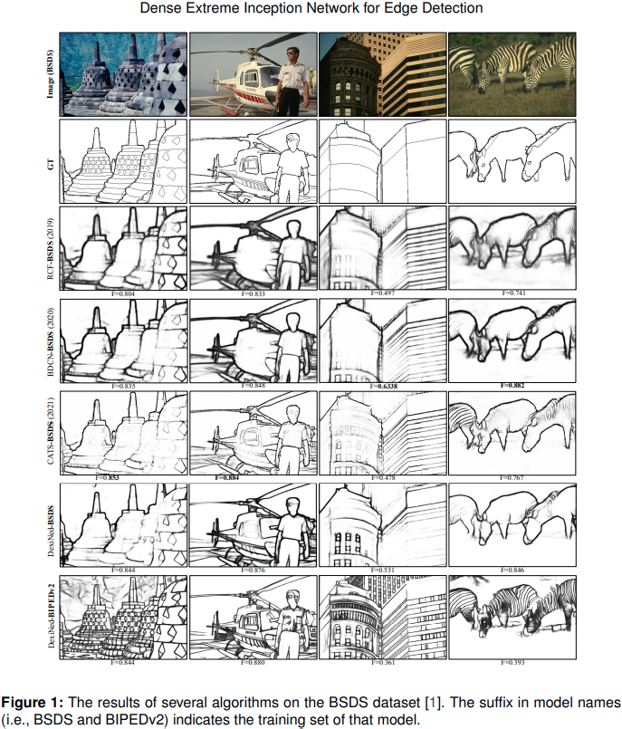
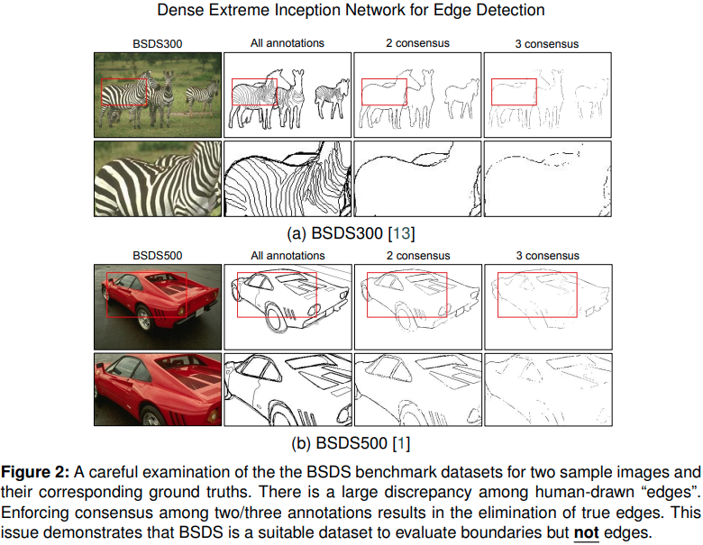
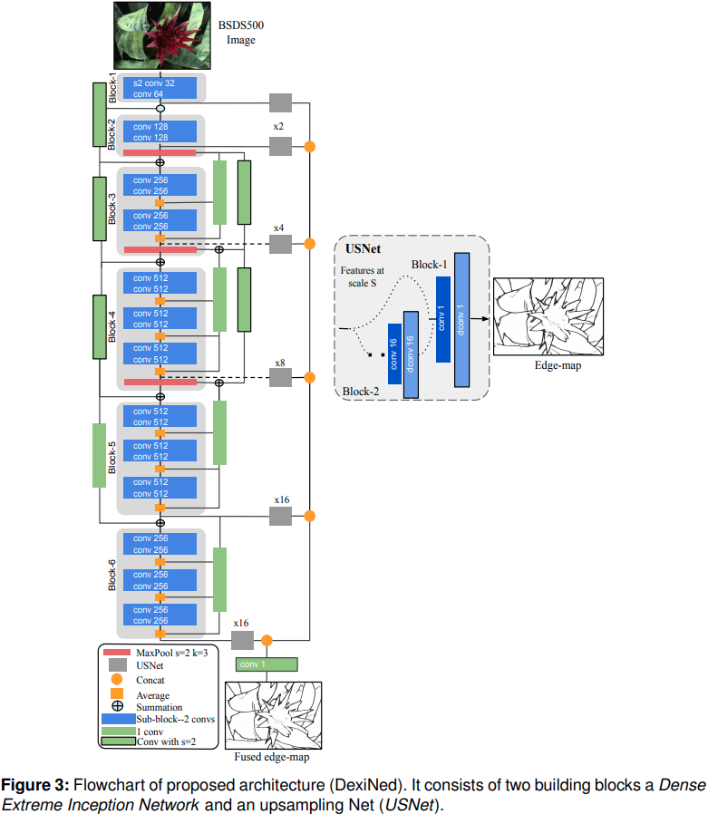
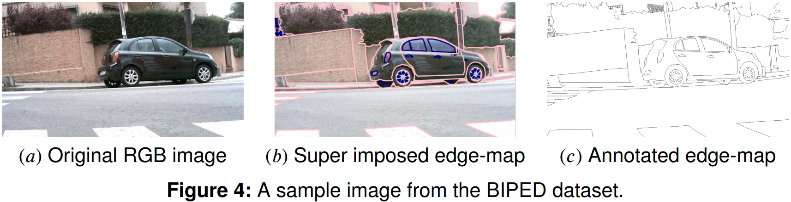
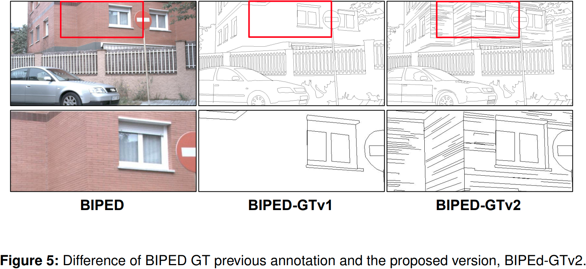
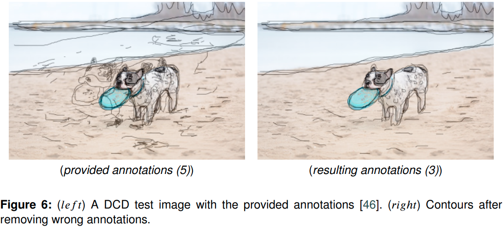
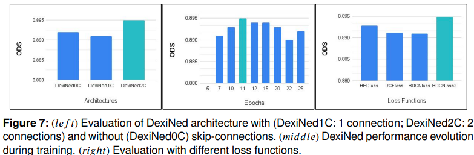
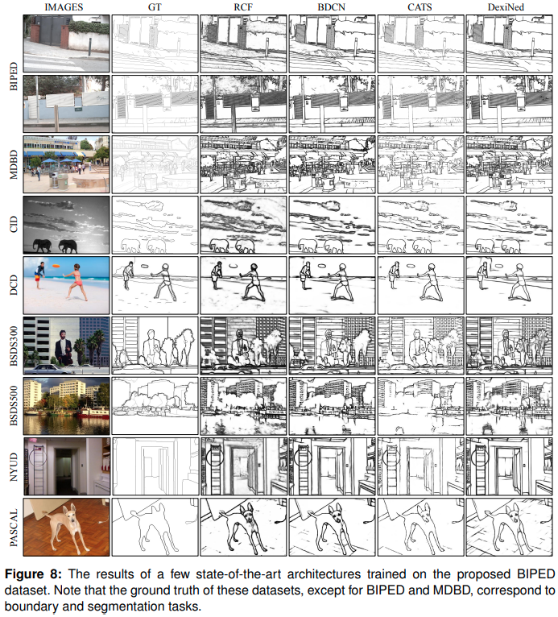

# Dense Extreme Inception Network for Edge Detection

## 摘要

边缘检测是许多计算机视觉应用的基础。最先进的技术主要依赖于深度学习的两个决定性因素：数据集内容和网络架构。大多数公开可用的数据集都不是为边缘检测任务策划的。在这里，我们提供了针对此约束的解决方案。首先，我们认为边缘、轮廓和边界是三种不同的视觉特征，需要单独的benchmark datasets，尽管它们有重叠。为此，我们提出了一个新的边缘数据集。其次，我们提出了一种新颖的架构，称为用于边缘检测的密集极端初始网络 (DexiNed)，它可以在没有任何预训练权重的情况下从头开始训练。 DexiNed 在所提供的数据集中优于其他算法。它还可以很好地推广到其他数据集而无需任何微调。由于 DexiNed 输出的边缘更锐利、更精细，其更高的质量在感知上也很明显。

## 1.引言

边缘为视觉信息处理提供了重要线索，从图像识别中的经典计算机视觉算法 [2] 到生成对抗网络 (GAN) 中的现代技术 [3]。尽管它们很重要，但稳健的边缘检测仍然是一个悬而未决的问题。为了证明这一点，让我们检查图 1 中的四个示例图像。第三到第五行说明了三个最先进模型（RCF [4]、BDCN [5] 和 CATS [6]）的结果在 BSDS 数据集 [1] 上进行训练。从质量上看，这些模型都没有忠实地检测到微小细节的边缘。例如，虽然钟形雕塑或直升机的内部边缘在ground truth中得到了充分注释，但这些模型的边缘输出并没有捕捉到这些细节。我们可以在建筑物和斑马的条纹中观察到类似的现象。在这种情况下，虽然这些细节也被排除在 ground truth 中，但边缘在图像中清晰可见。基于此，我们认为当前的边缘检测模型需要进一步改进以稳健地检测边缘并很好地推广到独立于训练集的新场景。

在此之后，我们认为当前深度学习 (DL) 方法的主要局限之一是训练集中带注释的ground truth。 BSDS 在社区中被广泛接受为训练和评估边缘检测算法的benchmark dataset。然而，这个数据集最初是为场景分割而设计和注释的。因此，带注释的ground truth主要对应于高级对象边界而不是低级边缘。鉴于基于 DL 的模型受其训练数据的强烈影响，我们需要为边缘、轮廓和边界检测这三个任务获取独立的数据集 [7]。这对于训练和评估都非常重要。对于网络来说，从混合了边缘、轮廓和边界的数据集中学习这三个概念是一项挑战。判断网络的适应性也很困难，无论它在其中一项任务中表现得更好还是更差

为了一目了然地展示这种重要性，我们可以看一下图 1 的底部两行。这两行之间的唯一区别是训练集。当我们的网络——用于边缘检测的密集极端初始网络 (DexiNed)——在 BSDS 上进行训练时，它会遇到与其他模型相同的一组问题。然而，当我们在数据集 (BIPEDv2) 上训练 DexiNed 时，它可以很好地泛化到精细边缘的 BSDS 图像。这两个数据集的图像内容非常不同。 BIPEDv2 主要包含城市环境的图像。斑马和铃铛雕塑图像中边缘的准确检测表明 DexiNed-BIPEDv2 对新场景具有鲁棒性。这种稳健性要归功于对proposed数据集中边缘的仔细注释。我们确保对象内部或对象之间的所有边缘都反映在ground truth数据中。

### 1.1 Edges, contours and boundaries

以下三个术语：边缘检测、轮廓检测和边界检测尽管存在差异，但通常可以互换使用。这是模型解释和评估中混淆的潜在原因。因此，我们首先回顾每个术语的起源。在 1980 年代，边缘检测被定义为由沿表面、反射率或照明的不连续性引起的附近区域的灰度强度变化 [8]。这是重新审视强调对象的属性，例如它们的光度、几何和物理特性 [9]。因此，轮廓和边界是边缘的子集，并且与语义上有意义的entities [10] 相关联，例如，对象的轮廓和剪影 [11]。边界是指图像平面中的对象边界，对应于场景中的像素所有权 [12、13]。相反，轮廓是指给定对象内区域的边界 [7]。

总而言之，边缘检测算法的目标是捕获图像中所有有意义的强度不连续性。它不关心像素所有权或开放和封闭的形状。这些是轮廓和边界检测的领域，用于消除与物体和形状的显着特征不对应的边缘。在本文中，我们关注边缘。

### 1.2 Structure of data matters

目前，深度学习是边缘检测任务的主要方法。众所周知，训练数据集的质量是该框架内的一个关键因素 [14]。为此，最先进的技术在很大程度上依赖于伯克利分割数据集（即 BSDS300 [13] 和 BSDS500 [1]），尽管图像分割是该数据集的原始目标并且其改进版本变成了边界检测的benchmark dataset。大多数研究在 BSDS300 上训练他们的模型并在 BSDS500 上验证。

每个图像包含至少五个不同参与者绘制的边界注释。在许多情况下，不同的人为边界之间存在很大差异（见图 2）。通过在一致的ground truth上计算损失函数，例如 [15, 4, 5]，可以部分克服这个问题。在共识阶段，被超过两个参与者注释的像素被认为是真实的边缘，否则被丢弃。这有助于训练过程的收敛[15]。尽管如此，这个共识阶段也过滤掉了很大一部分真实边缘。这在图 2 中很明显。例如，即使有两个参与者的适度共识，所有斑马条纹都会消失。在红色汽车的情况下可以进行类似的观察。这个问题存在于 BSDS 的许多图像中。

因此，在 BSDS 上训练的网络学会成为边界检测器而不是边缘检测器。两者之间的区别可能非常重要，例如，当边缘是另一个计算机视觉应用程序的构建块时，如 [16] 中所示。这个问题在本研究中得到解决。我们提出了一个边缘benchmark dataset，可以准确评估边缘检测算法。

### 1.3 Contributions

在本文中，我们通过提出一种用于边缘检测任务的端到端深度学习方法来解决上述问题。我们的主要目标是识别任何给定图像中的所有真实边缘。为了证明这一点，我们只在一个数据集上训练一个网络，并在几个公开可用的数据集上对其进行评估。我们表明，与其他最先进的算法相比，我们的模型获得了更高程度的泛化。我们对两个带有注释边缘的数据集（即 MDBD [7] 和 BIPED）进行了详尽的定量评估。在其他具有轮廓/边界注释的数据集上，我们定性地展示了我们模型的稳健性。在目前的工作中，我们在以下方面扩展了我们之前的会议论文 [17]：

- 详细描述了所提议的架构 DexiNed（用于边缘检测的密集极端初始网络），并彻底分析了其不同组件的影响。
- 在提出的边缘检测benchmark dataset中，提高注释程度，特别是针对精细尺度边缘，称为 BIPED（用于感知边缘检测的巴塞罗那图像)(1.Dataset and code: https://github.com/xavysp/DexiNed)。
- 通过交换两个边缘检测数据集（BIPED 和 MDBD）之间的训练和验证集，在四个最先进的网络之间建立共同的评估基准。
- 通过修改$\lambda$值以更好地平衡每个 DexiNed 输出中正样本和负样本的部分并在像素级别合并平均来改进 BDCN [5] 的损失函数

本文的其余部分组织如下。第 2 节总结了与边缘检测最相关的工作。然后，第 3 节描述了所提出的方法。第 4 节介绍了为训练和测试获取的数据集和生成的ground truth，以及用于验证所提出的 DexiNed 架构的数据集。在第 5 节中，总结了定量和定性细节。最后，第 6 节给出了结论。

## 2.相关工作

有大量关于边缘检测的文献，有关详细描述，请参阅 [9] 和 [10] 的评论。在本节中，详细介绍了一组具有代表性的算法。它们可以大致分为四组：𝑖）由低级功能驱动； 𝑖𝑖) 脑启发; 𝑖𝑖𝑖) 基于经典学习；和𝑖𝑣）深度学习。

由低级特征驱动的算法：早期的边缘检测算法，如 Sobel [18]、Robert 和 Prewitt [19]，都是基于一阶导数的。输入图像由线性局部滤波器平滑，通常是一组两个方向（水平和垂直）。最后，通过阈值检测边缘。这些运算符通过考虑二阶导数来推进，其中通过提取零交叉点来检测边缘。在八十年代中期，Canny [8] 通过对三个不同的关键过程进行分组提出了一种边缘检测器。尽管已经过时，但这些方法仍在某些现代计算机视觉应用程序中使用。上述算法的许多变体已经出现在文献中。

类脑算法：这组边缘检测算法依赖于生物视觉系统的已知机制。自 1960 年代以来，对猴子和猫的实验开始导致对初级视觉皮层 (V1) 的理解取得重要进展。例如，人们发现一组简单的细胞对边缘有反应 [20]。 [20] 中的作者开发了一个数学模型，通过高斯导数模拟人类视网膜视觉；从那时起，已经实施了许多算法，类似于现实世界图像中生物神经元的边缘检测。例如，在[21]中引入了一种特殊的线权重函数用于边缘增强，它由零阶和二阶Hermite函数的组合组成。后来，在 [12] 中提出了 Gabor 能量图来重建 V1 的非经典感受野以进行轮廓检测。该提议已经用 40 张图像进行了评估——该数据集可以被认为是文献中提出的第一个带注释的ground truth，用于验证轮廓检测算法。 [22] 通过分别使用局部分组函数和 Gabor 滤波器对空间促进和环绕抑制进行建模，对这种方法进行了改进。最近，在 [23] 中，执行双对立单元的调制以从颜色和纹理中提取更复杂的边缘属性。这是通过引入第二个视觉区域和考虑反馈连接 [24] 来补充的。随后的实验表明，对视觉皮层神经元中典型的各种环绕调制进行建模可以提高边缘检测的性能 [24]。 [7] 中提出了三个不同尺度的 Gabor 滤波器的组合，然后是 PCA 和机器学习分类器。让我们进入下一个以学习为基础的小组。

经典的基于学习的算法：自然场景中边缘检测的挑战推动了基于学习的算法的发展。 [13] 中介绍了边界检测的第一种学习方法，它使用不同的过滤器从亮度、颜色和纹理中提取梯度。然后，作者训练逻辑回归分类器以生成概率边界 (Pb)。后来，人们提出了 Pb 检测器的不同变体，例如 [25] 中的那个。除了像原始方法那样使用局部信息之外，这些新proposal还关注全局信息。它们被称为全局边界概率 (gPb)。在这些方法中，梯度由每个图像通道的三个尺度单独计算。在 [26] 中，提出了一种基于条件随机场的方法。它的最大似然参数是在给定图像边缘注释的情况下训练的。该模型通过连续性结构捕获不同junctions的连续性和频率。相反，[27] 中提出了使用稀疏代码梯度。在这种情况下，patch由支持向量机分类。最后，[28] 中考虑了贝叶斯模型的使用。通过基于顺序蒙特卡罗的方法使用不同的梯度分布预测了边缘图。随机森林框架也被考虑用于边缘检测，其中每棵树都经过独立训练以捕获复杂的局部边缘结构 [29]。

深度学习算法：在过去十年中，CNN 已成为计算机视觉领域的标准模型 [30]。已经表明，对象分类网络的内部表示依赖于边缘 [31]。 [32] 中提出了第一个基于 CNN 的边缘检测模型。在这种方法中，与大多数 DL 模型一样，给定带注释的边缘图数据集，网络从 RGB 图像中学习预测边缘。自这项原始工作以来，已经提出了几种方法 [10]；大多数架构的backbone是 VGG16 [33]。在这个架构中，只使用了卷积层（13 个卷积层）。该结构的参数是通过在 ImageNet 数据集 [30] 上作为分类问题训练网络而获得的。然后，通过在为边界检测设计的数据集上训练网络来对其进行微调。 HED [15]、RCF [4]、CED [34]、BDCN [5]、CATS [6] 和许多其他网络架构就是这种情况。在 HED [15] 中，配置了多尺度网络和深度监督技术。因此，每个 VGG 块都有一个边缘预测作为输出，可以将其视为空间尺度表示。 RCF [4] 使用与 HED 相同的配置，但它不是从每个 VGG 块中获取边缘，而是从块上的每一层提取边缘。与以前的方法相反，在 CED 中，细化块用于合并每个块的输出，并预测比 HED 更清晰的边界。尽管上述方法的定量性能克服了经典学习算法的最新技术水平，但预测的边缘图并不像预期的那样清晰，检测到的边缘在某种程度上是粗糙的。因此，生成对抗网络（GAN）[35]被认为可以锐化那些粗糙的边缘（例如，[36]）；最后，提出了上下文感知跟踪策略（CATS）来提高边缘图的清晰度。

尽管大多数基于 DL 的边缘检测模型都基于 VGG16 的使用，但也有一些方法基于其他模型，例如 [4] 中使用的 ResNet50 [37]。使用这些变体，已经获得了微小的改进，大约 1%。尽管如此，在当前的工作中，VGG16 将被描述为边缘检测方法中使用的标准架构。大多数基于 VGG16 的模型在 BSDS [1]、NYUD [38]、PASCAL-CONTEXT [39] 和 MDBD—Multicue Dataset for Boundary Detection [7] 等标准边缘检测数据集中的性能优于传统边缘检测方法。尽管如此，即使在获得高排名性能之后，这些方法中的一些仍然存在缺点或缺乏泛化或较粗糙的预测边缘图，见图 1 中的结果。例如，可以观察到在某些情况下生成的边缘图不预测人类的感知边缘。

## 3.提出的方法

本节介绍提出的架构和用于训练论文提出模型的损失函数。

### 3.1 用于边缘检测的密集极端初始网络

DexiNed 旨在允许端到端训练，而无需像大多数基于 DL 的边缘检测器那样从预先训练的对象检测模型进行权重初始化。在我们之前的工作 [40] 中，我们观察到在浅层中计算的边缘特征通常在深层中丢失。这启发了我们设计一种类似于 Xception [41] 的架构，但具有两个并行的skip-connection，这些连接实现了跨不同层计算的所有边缘信息。 DexiNed 可以解释为两个子网络的集合（见图 3）：密集极端初始网络（Dexi）和上采样网络（USNet）。 Dexi 接收 RGB 图像作为输入，在不同的块中对其进行处理，其特征图被馈送到 USNet。

### 3.2 Dexi

Dexi 架构包含六个类似于编码器的块。每个块都是具有一组卷积层的较小子块的集合。skip-connections耦合块及其子块（在图 3 中以浅灰色和蓝色矩形表示）。在每个块生成的特征图被馈送到单独的 USNet 以创建中间边缘图。这些中间边缘图被concat起来形成一堆学习过滤器。在网络的最末端，这些特征被融合以生成单个边缘图。

每个子块（图 3 中的蓝色矩形）构成两个卷积层（内核的数量在蓝色矩形的右侧指定）。所有内核的大小均为 3 × 3。在第一个块中，卷积的步幅为 2，因此其名称为 𝑠2。每个卷积层之后是批量归一化和整流线性单元 (ReLU)。从块 3（浅灰色矩形）开始，最后一个子块的最后一个卷积不包含 ReLU 函数。红色矩形是max pooling运算符，内核大小为 3 × 3，步长为 2。

处理深度上的大量卷积运算导致重要的边缘特征消失 [42、40]。为了避免这个问题，我们引入了并行skip-connection，灵感来自 [37] 和 [43]。从第三个块（Block-3）向前，每个子块的输出与另一个称为第二个skip-conncetion的skip-connection——SSC（图 3 右侧的绿色矩形）进行平均。在max pooling操作之后，这些 SSC 在与第一个skip-connection——FSC求和之前对连接子块的输出进行平均，图 3 左侧的绿色矩形。与此并行，max pooling层的输出直接馈送到后续子块。例如，块 3 的子块接收来自第一个max pooling的输入； block-4 的子块接收其中包含第一个和第二个max pooling总和的输入。

### 3.3 USNet

上采样网络 (USNet) 是两个块的条件堆栈。然后每一个都由一系列卷积层和反卷积层组成，在每次通过时这些层对特征进行上采样。 block-2 被激活只是为了缩放来自 Dexi 网络的输入特征图。迭代此块，直到特征图达到 GT 大小的两倍。一旦满足此条件，特征图就会被馈送到 block-1。 block-1 使用大小为 1 × 1 的内核处理输入，然后是 ReLU 激活函数。接下来，它使用大小为 𝑠 × 𝑠 的内核执行转置卷积（反卷积），其中 𝑠 是输入特征图尺度级别。通过 block-1 的最后一次反卷积，特征图达到与 GT 相同的大小。最后一个卷积层没有激活函数

我们考虑了三种上采样块策略：双线性插值、亚像素卷积和转置卷积。这是生成细边缘的一个影响因素，这是一个理想的特征，例如，可以增强边缘图的可视化。我们在 DexiNed 的设计中考虑了这一点，并在第 5 节中对其进行了详细评估。

### 3.4 Loss Functions

DexiNed 可以形式化为回归映射函数 ð(∶)；换句话说，$\hat{Y}$= ð(𝑥, 𝑦)，其中输入图像是$x\in \mathbb{R}^{m \times d \times c}$ 和 $y \in \{0,1\}^{m \times d \times 1}$是相应的ground truth边缘图，𝑚, 𝑑和 𝑐 是图像大小——由于模型训练中使用的 RGB 通道，𝑐 设置为 3。输出 $\hat{Y}$对应于一组预测的边缘图，$\hat{Y}=[\hat{y}_1,\hat{y}_2, \dots,\hat{y}_N]$， $\hat{y}_n$ 是根据 𝑛 DexiNed 预测的边缘图，𝑁 是 DexiNed 的输出数量（灰色矩形，图 3）和最后一个融合的边缘图。$\hat{y}_N$对应最后一个卷积层的结果，融合了所有$\hat{y}_n$（灰色矩形）的拼接，权重初始化为1∕(𝑁 − 1)。请注意$\hat{y}_N$与𝑦 的大小相同。我们初步工作 [17] 中的损失函数是从 HED [15]（加权交叉熵）中考虑的。目前，HED、RCF 和 BDCN的工作损失函数已经被评估；经过这样的评估，BDCN 损失函数$\mathcal{L}$已被选中，并稍作修改，如下所示：
$$
w_{(y>0)}=1 * \frac{y_-}{y_+ + y_-};w_{(y\leq0)}=1.1 * \frac{y_+}{y_+ + y_-},\\
l=mean(l^{(I \times J)}),l_{(i,j)}=[l_1,\dots,l_N],\\
l_n=-w[y*log\theta(\hat{y}_n) + (1-y)*log(1-\theta(\hat{y}_n))]
$$
然后，
$$
\mathcal{L} = \sum^{N}_{n = 1}{\lambda_n * l_n}
$$
其中𝑤是交叉熵损失的权重，$y_-$和$y_+$分别表示给定GT中的负边缘样本和正边缘样本。$\theta$是 sigmoid 函数。$ \lambda$是一组用于平衡正样本和负样本数量的超参数。这些值将在实施细节部分给出。

## 4.数据集

本节详细介绍了用于训练和评估所提出方法的数据集，并将其与最先进的方法进行比较。

### 4.1. 使用BIPED数据集训练

当前工作的第二个贡献是原始benchmark dataset的更新，称为巴塞罗那感知边缘检测图像 (BIPED)，它已在我们之前的工作 [17] 中首次提出。当前工作中提出的更新详述如下。开创性作品中包含的所有图像都经过了再次处理。 BIPED 数据集包含 250 张 1280 × 720 像素的城市环境真实世界图像。使用众包工具 Labelbox(2.https://labelbox.com/)生成了Ground truth (GT) 边缘图。图 4 显示了该数据集的插图及其带注释的边缘。图 4(𝑏) 中的粉红色线是折线，对应于场景中用于绘制开放轮廓的边缘；相反，蓝线是多边形的线，对应于场景中的闭合轮廓。图 4(𝑐) 显示了对应于图 4(𝑎) 的边缘图。注释过程已应用于整个数据集。为了生成高精度边缘图，每张图像都按照以下四个步骤进行处理：

1. 计算机视觉专家对每张图像的所有边缘进行注释，每张图像仅一个注释。
2. 管理员（也是计算机视觉专家）审查上一步的输出
3. 获得的 GT 用于训练 HED 模型 [15] 并验证预测边缘的完整性
4. 考虑到 HED 的结果，管理员交叉检查整个数据集，纠正错误并添加新的注释。这个版本出现在 [17]
5. 随着 LabelBox 的更新版本，缩放工具的改进使我们看到了以前版本中由于缺乏对 BIPED 图像的深度欣赏而没有考虑的额外细节。这使我们几乎可以在整个图像中添加更多注释。初始注释 (BIPED-GTv1) 和当前注释 (BIPED-GTv2) 之间的差异可以在图 5 中看到；新的注释工具允许从给定的图像中绘制非常细小的边缘。

管理员在整个过程中保持同一人，以确保将同一组标准应用于所有带注释的图像。 BIPED 是一个合适的数据集，用于对边缘检测算法的结果进行基准测试。为此，为了研究社区的利益，我们公开发布了它。 BIPED 和 DexiNed 的贡献可以在最近的作品 [44、45] 中得到赞赏，仅举几例。

### 4.2 使用Benchmark Datasets测试

已经在对边缘、轮廓和边界检测文献中最广泛使用的数据集上对提出的模型进行了全面定义评估，即 MDBD [7]、BSDS500 [1]、BSDS300 [13]、NYUD [38]、 PASCAL-CONTEXT [39]（以下简称 PASCAL）、CID [12]、DCD [46] 和我们提出的 BIPED。在此列表中，MDBD 是与所提出模型最相关的数据集，因为它的注释对应于真实的边缘。其他数据集更适合边界和轮廓检测任务。尽管如此，所有这些数据集的结果都是为了展示我们方法的有效性，并与现有技术进行更好的比较

**MDBD：**收集用于边界检测的多线索数据集用于复杂图像中对象边界感知的心理物理学研究。在其设计中考虑了亮度、颜色、运动和双目视差等多种线索 [7]。 MDBD 由自然场景的短双目视频序列组成（每个场景包含 10 帧）。从这些视频中提取了数百张大小为 1280 × 720 的高清图像。每个图像都由多个参与者注释（边缘检测六次，边界检测五次）。所提出的 DexiNed 架构已使用该数据集的边缘注释进行了评估。通常，在该数据集中，80% 的图像用于训练，而其余图像用于评估基于学习的算法。在此之后，我们随机选择了 20% 的图像来评估 DexiNed 的性能。考虑用于定量评估的模型已经再次训练，以便与当前工作中选择的 80% 进行公平比较。

**CID：**轮廓图像数据库是一组 40 个灰度图像及其相应的ground truth轮廓 [12]。该数据集中图像的大小为 512 × 512。该数据集的主要限制与带注释的图像数量少有关。提出的 DexiNed 架构已在整个数据集上进行了评估，类似于文献中的先前工作（例如 [24、22]）。该数据集对于基于 DL 的方法来说很困难，因为它们具有灰度特性并且在某些提供的图像中遗漏了注释。

**DCD：**收集轮廓图数据集的目的是生成轮廓图（捕捉给定视觉场景轮廓的类似边界的图）[46]。 DCD 包含 1000 张图像，从该集中选择 100 张图像进行测试。Ground truth注释是通过使用游戏应用程序收集的。为每个图像收集了几个注释；然后，经过详尽的评估，每张图像仅保留五个轮廓作为ground truth。在目前的工作中，在检查提供的ground truth后，发现了几个错误的注释；图 6(𝑙𝑒𝑓 𝑡) 显示了一个插图，可以很容易地理解 [46] 提供的错误轮廓。因此，为了对训练有素的架构进行公平的评估，已经通过删除错误的 GT 仔细检查了 100 个测试图像的注释。因此，在仍有 100 张图像的结果集中，每张图像包含 2 到 5 个注释。图 6(𝑟𝑖𝑔ℎ𝑡) 显示了 [46] 提供的检测和去除错误轮廓后的结果。

**BSDS500：**Berkeley Segmentation DataSet (BSDS)，第一个版本于 2001 年发布 [13]，由 300 张图像组成，分为 200 张用于训练和 100 张用于验证，称为 BSDS300；最新版本 [1]，添加了 200 个新图像用于测试。 BSDS 中的每张图像至少由 5 个主题进行注释，该数据集包含 481 × 321 的图像。该数据集主要用于图像分割和边界检测，因此，正如下一节中将说明的那样，用于边缘检测目的有些图像没有很好地注释。通常，为了评估 BSDS500 中 DL 模型的性能，新的 200 张图像用于测试，而 BSDS300 用于网络训练目的。由于 DexiNed 仅在 BIPED 数据集上进行训练，因此第 5 节中描述的定性评估将结果分为两部分：BSDS300 和 BSDS500。用于定性比较的图像取自 BSDS500 的测试部分和 BSDS300 的验证部分。

**NYUD：**纽约大学数据集是一组来自 464 个室内场景的 1449 张 RGBD 图像，用于分割目的。该数据集分为三个子集——即训练集、验证集和测试集。测试集包含 654 张图像，其余图像用于训练和验证目的。在当前的工作中，仅选择了测试集来评估所提出的模型，因为 DexiNed 仅使用 BIPED 进行了训练。尽管 NYUD 中的大部分图像都对分割进行了完整的注释，但也有一些图像的注释很差。这个事实（某些图像中缺少边缘）会影响基于 DL 的边缘检测方法的质量。

**PASCAL：**PASCAL [39] 是一种流行的数据集，用于对各种对象类别进行分割。目前，大多数用于边缘检测的主要 DL 方法都使用 PASCAL 进行训练和测试（例如，[15]、[4]），因为它的 ground-truth 对应于与 BSDS 中描述的场景不同的场景。该数据集包含 11530 张带注释的图像，但是，只有大约 5% 的随机选择图像 (505) 被考虑用于测试 DexiNed。尽管 PASCAL 中的图像具有更多样化的标记数据，但大多数图像仅针对几个对象进行了注释，即使场景具有大量特征。

## 5.实验结果

本节首先描述用于评估的指标；然后，提供了有关所提议方法的实施和设置的详细信息。最后，提出了大量的实验结果，并与最先进的方法进行了比较。同样，文献中的大多数非边缘检测数据集仅用于定性评估，对于边缘检测、BIPED 和 MDBD 方法，用于定量评估和与 DexiNed 的比较。

### 5.1 评估度量

可以按照两种方法评估边缘检测算法。间接地通过它们对其他计算机视觉任务的影响 [9]。直接与人类绘制的边缘进行比较。在这项工作中，我们选择了后者，这是评估基准数据集的常见做法。这些评估指标如下：

1. 通过使用整个数据集的全局阈值计算的最佳数据集规模（ODS）；
2. 通过在每个图像上使用不同的阈值计算出最佳图像比例（OIS）；
3. 平均准确率（AP）。F-measure——$F = {{2 \times Precision \times Recall} \over {Precision+Recall}}$

### 5.2 实施说明

所提出的 DexiNed 架构是从头开始训练的，不依赖于预训练的权重。这是所提出模型的一个独特之处。大多数最先进的网络都依赖于 ImageNet 数据集的预训练权重。平均而言，DexiNed 在 9 个epoches（[17] 中的 15 个epoches）后收敛，batch size为 8，使用 Adam 优化器和学习率为 $10^{-4}$——在 10 和 15 个epoch减少 0.1，权重衰减考虑训练是 $10^{-8}$。在 TITAN X GPU 输入中，训练过程大约需要 1 天，彩色图像大小为 352×352，MDBD 为 480×480。融合层的权重初始化为：$1 \over {N-1}$（有关 𝑁 的详细信息，请参阅第 3.4 节）。经过超参数搜索以优化 DexiNed，在不同的 conv 和 deconv 层上使用大小为 3×3、1×1 和 s×s 的内核获得最佳性能，在 Dexi 中使用 Xavier 初始化器 [47]，在USNet最后 的 conv 和 deconv 层使用正态分布。损失函数的𝜆设为tp [0.7, 0.7, 1.1, 1.1, 0.3, 0.3, 1.3]。

我们随机选择了 200 张 BIPED 图像来训练和验证 DexiNed。其余 50 张图像用于测试。为了增加训练图像的数量，执行了如下数据增强过程：i) 鉴于 BIPED 图像的高分辨率特性，每个图像沿其宽度分成两半； ii) 与 HED 类似，每个生成的图像都旋转 15 个不同的角度，并按内轴方向的矩形裁剪； iii) 图像水平翻转；最后 iv) 应用了两个伽玛校正 (0.3030, 0.6060)。此增强过程为每个给定图像生成 288 张图像。

### 5.3 架构设置

本节介绍对不同 DexiNed 配置的评估。第一部分详细介绍了上采样方法和为估计边缘图而选择的合并过程。在第二小节中，评估了使用skip connections的优势。

#### 5.3.1 上采样方法和DexiNed预测

关于最佳上采样方法的选择，在我们的初步工作[17]中评估了三种方法。在该评估中表明，由具有可训练内核的转置卷积执行的上采样给出了最佳结果。因此，在目前的工作中也选择它作为上采样方法。另一方面，关于用于合并不同输出的策略——Output1、Output2、Output3、Output4、Output5、Output6、DexiNed-f、DexiNed a——DexiNed 架构（图 3）已根据经验进行了评估，如在[17] 表明最好的结果是从 DexiNed-f 和 DexiNed-a 获得的。 DexiNed-f 对应于 DexiNed 架构末尾的融合过程获得的结果（见图 3），而 DexiNed-a 对应于从所有 DexiNed 预测（包括 DexiNed-f）的平均值获得的边缘图.在[17]中表明，两种合并策略都达到了相似的定量结果；因此，下文将介绍两种合并策略的结果；在某些情况下，由于空间限制，仅描述了 DexiNed-f 的结果，在这些情况下，结果被命名为 DexiNed。

#### 5.3.2 消融研究

本小节介绍了关键 DexiNed 部件和设置的定量研究。由于我们的模型由两种类型的skip connections组成（图 3 中左侧和右侧的绿色矩形），因此对不同数量的skip connections进行了研究。如图7(𝑙𝑒𝑓 𝑡)所示——𝐷𝑒𝑥𝑖𝑁𝑒𝑑0𝐶不使用skip-connections，𝐷𝑒𝑥𝑖𝑁𝑒𝑑1𝐶仅使用一个skip connection（图3左侧）； 𝐷𝑒𝑥𝑖𝑁𝑒𝑑2𝐶 使用这两个连接。很明显，两个skip connections (DexiNed2C) 的使用提高了所提出架构的性能。

所提出的架构还接受了不同损失函数的训练，以评估其性能。考虑了以下方法的损失函数：HED [15]、RCF [4]、BDCN [5] 和 BDCNloss2（它是 BDCN [5] 的一个略微修改的函数）。如图 7(𝑟𝑖𝑔ℎ𝑡) 所示，修改后的 BDCN 损失函数优于其对应的损失函数近 1%。最后，为了选择最佳的 DexiNed 性能，我们评估了它在不同epoch的预测，直到 25 个epoch。如图 7(𝑚𝑖𝑑𝑑𝑙𝑒) 所示，当考虑 11 个 epoch 时达到最佳性能。在本手稿的以下部分中，DexiNed 在不同边缘检测数据集上的性能比较对应于架构 DexiNEd2C，具有 11 个 epoch，并使用 BDCNloss2 函数，称为 DexiNed。

### 5.4 定量比较

本节介绍 DexiNed 与边缘检测数据集上最先进的方法的比较。此外，还研究了两个数据集（即 MDBD 和 BIPED）中泛化能力的比较；换句话说，提出了一项显示从一个数据集到另一个数据集的泛化结果的研究。正如在第二节中介绍的那样。 1，不考虑 BSDS [1]，因为该数据集无法概括边缘域上的结果。已选择最先进的边缘、轮廓和边界检测方法 [10] 与 DexiNed 进行比较；这些方法如下：RCF [4]、BDCN [5] 和 CATS [6]。为了进行公平比较，这些方法已经在两个用于边缘检测的数据集——MDBD 和我们的 BIPED 数据集上进行了训练。应该注意的是，在所有情况下都应用了相同的增强过程；此外，在 MDBD 的情况下，所有模型都使用相同的训练集进行训练，而不是像大多数出版物中那样从 MDBD 数据集中随机选择图像。

表 1 显示了对 DexiNed（DexiNed-f 和 DexiNed-a）的不同评估以及上述现有技术的方法。展示了两种场景的结果——在同一数据集上训练和测试以及交叉评估（即，在一个数据集中训练并在另一个数据集中评估）。可以看出，在同一数据集中进行训练和测试时，DexiNed 达到了最佳性能（在所有三个指标 ODS、OIS 和 AP 中）。此外，如果在 BIPED 中训练但在 MDBD 数据集中进行评估，DexiNed 也会达到最佳结果。另一方面，关于数据集的泛化能力，考虑 ODS 评估指标，我们知道在同一数据集中训练和评估时达到最佳性能。因此，我们建议分析在与用于训练的数据集不同的另一个数据集中进行评估时的性能损失。换句话说，在同一数据集中训练和评估时所达到的值的性能如何。如果在 BIPED 中训练不同的方法，这种性能损失会更小，在 MDBD 中评估时，平均只有 3.74% 的性能下降是值得赞赏的；相反，如果在 MDBD 中训练并在 BIPED 中评估，这种性能损失平均达到 7.14%

### 5.5 定性比较

本节仅提供一些插图，作为上一节定量比较期间考虑的所有模型预测的边缘图的定性比较。请注意，所有这些模型都经过 BIPED 训练；图 8 显示了在第 4.2 节详述的数据集中使用时评估架构（在 BIPED 上训练）的边缘图。定性结果类似于图 8 中的结果，但在 MDBD [7] 上进行了训练，作为补充材料提供。对所得结果的分析得出的一些评论和结论如下：

- BIPED：对于此数据集，提供了两个插图，因为此数据集用于训练比较中考虑的选定模型。这两个插图对应于 DexiNed 的最佳和最差 ODS 结果。如图 8 所示，BDCN、CATS 和 DexiNed 预测的边缘图是清晰准确的表示。在感知上，我们可以说 BDCN 和 DexiNed 预测的边缘图包含更正确检测到的边缘。相反，CATS 预测的边缘图更清晰，但包含的预测更少。作为结论，在寻找预测更多边缘但也更少伪影的模型时，DexiNed 为我们提供了这些要求而不妥协。
- 其他数据集：MDBD、CID、DCD、BSDS300、BSDS500、NUYD 和 PASCAL。如图 8 所示，这些数据集中的结果也类似于 BIPED 测试集的预测。 CATS 模型显示的边缘图更清晰，但边缘比 DexiNed 少。在 MDBD、CID、NYUD 和 PASCAL 的预测中可以观察到这种说法在感知上的差异。查看图 8 中对应于 PASCAL 数据集的最后一行，DexiNed 已经检测到场景地板上的几个边缘，但其他模型都无法检测到它们。

最后，BIPED 的第二个版本为考虑进行比较的模型提供了泛化稳健性。总体而言，在图 8 所示的所有数据集中，由于 BIPED 的独特特征，图像中预测的感知边缘最多。关于 DexiNed 架构，该模型给出的预测比其对应模型更清晰，并且在不影响真实边缘丢失的情况下，训练过程比考虑用于比较的任何其他基于 DL 的模型更简单。 DexiNed 不需要预训练权重，它可以比其他模型在更短的时间内收敛，但仍能达到最先进的结果。

## 6.结论

在本文中，我们提出了一种鲁棒的边缘检测模型，该模型对新场景具有很强的泛化能力。为此，首先，我们提出了一个为边缘检测任务精心设计的基准数据集。其次，我们设计了一个具有并行skip connections的网络，无需 ImageNet 预训练权重即可学习边缘。我们通过在单个数据集上训练网络并在其他基准数据集上对其进行评估来证明我们方法的泛化能力。总的来说，我们的结果显示了以端到端的方式从头开始训练深度学习边缘检测模型的可能性。这些发现为通过减少超参数设置的数量来探索用于边缘检测任务的较小网络提供了机会。
