# EDTER: Edge Detection with Transformer

卷积神经网络通过逐步探索上下文和语义特征在边缘检测方面取得了重大进展。然而，随着感受野的扩大，局部细节逐渐被抑制。最近，视觉transformer在捕获远程依赖方面表现出出色的能力。受此启发，我们提出了一种新颖的基于transformer的边缘检测器，边缘检测transformer（EDTER），通过同时利用完整的图像上下文信息和详细的局部线索来提取清晰明快的对象边界和有意义的边缘。 EDTER 分两个阶段工作。在第一阶段，全局transformer编码器用于在粗粒度图像patch上捕获远程全局上下文。然后在第二阶段，局部transformer编码器在细粒度patch上工作以挖掘短程局部线索。每个transformer编码器后面都有一个精心设计的双向多级聚合解码器，以实现高分辨率特征。最后，全局上下文和局部线索由特征融合模块组合并输入决策头进行边缘预测。在 BSDS500、NYUDv2 和 Multicue 上进行的大量实验证明了 EDTER 与最先进技术相比的优越性。

## 1.引言

边缘检测是计算机视觉中最基本的问题之一，具有广泛的应用，如图像分割[8、23、39、44、45、47]、对象检测[23]和视频对象分割[5 , 57, 59]。给定输入图像，边缘检测旨在提取准确的对象边界和视觉上显着的边缘。由于许多因素，包括复杂的背景、不一致的注释等，它具有挑战性。

边缘检测与上下文和语义图像线索密切相关。因此，获得适当的表示来捕捉高级和低级视觉线索是至关重要的。传统方法 [6,14,28,34,41,63] 大多基于低级局部线索（例如颜色和纹理）获取边缘。受益于卷积神经网络 (CNN) 在学习语义特征方面的有效性，边缘检测取得了重大进展 [3,4,29,48]。随着感受野的扩大，CNN 的特征逐渐捕捉到全局和语义感知的视觉概念，同时许多重要的细节不可避免地逐渐丢失。为了包含更多细节，[22,36,37,65,66] 中的方法聚合了深层和浅层的特征。然而，这种浅层特征主要反映的是局部强度变化，没有考虑语义上下文，导致边缘噪声。

受视觉transformer [9, 16, 61, 72] 最近成功的启发，特别是它们对远程上下文信息进行建模的能力，我们提出为边缘检测定制transformer。然而，有两个主要挑战需要解决。首先，由于计算问题，transformer通常应用于尺寸相对较大的patch，而粗粒度patch不利于学习边缘的准确特征。在不增加计算负担的情况下对细粒度patch执行自注意力是至关重要的。其次，如图 1 (d) 所示，从相交的和单薄的物体中提取精确边缘具有挑战性。因此有必要设计一种有效的解码器来生成边缘感知高分辨率特征。

为了解决上述问题，我们开发了一个名为 Edge Detection TransformER (EDTER) 的两阶段框架（图 2），以探索全局上下文信息并挖掘局部区域的细粒度线索。在第一阶段，我们将图像分割成粗粒度的补丁，并在它们上运行全局转换器编码器以捕获远程全局上下文。然后，我们开发了一种新颖的双向多级聚合 (BiMLA) 解码器，以生成用于边缘检测的高分辨率表示。在第二阶段，我们首先通过使用非重叠滑动窗口进行采样，将整个图像划分为多个细粒度补丁序列。然后局部transformer依次处理每个序列以探索短程局部线索。之后，所有局部线索都被整合并输入到局部 BiMLA 解码器中，以实现像素级特征图。最后，来自两个阶段的信息由特征融合模块 (FFM) 融合，然后输入决策头以预测最终的边缘图。通过上述努力，EDTER 可以生成清晰且噪声较小的边缘图（图 1）。

我们的贡献总结如下：（1）我们提出了一种新颖的基于transformer的边缘检测器，边缘检测transformer（EDTER），用于检测自然图像中的对象轮廓和有意义的边缘。据我们所知，它是第一个基于transformer的边缘检测模型。 (2) EDTER 旨在有效探索远程全局上下文（第一阶段）并捕获细粒度的局部线索（第二阶段）。此外，我们提出了一种新颖的双向多级聚合 (BiMLA) 解码器来提升转换器中的信息流。 (3) 为了有效整合全局和局部信息，我们使用特征融合模块 (FFM) 来融合从 Stage I 和 Stage II 中提取的线索。 (4) 大量实验证明了 EDTER 在 BSDS500、NYUDv2 和 Multicue 三个著名的边缘检测基准上优于最先进的方法。

## 2.相关工作

作为计算机视觉中的一项基本任务，边缘检测多年来一直被广泛研究。下面，我们重点介绍与我们最相关的两项工作。

**边缘检测**	早期的边缘检测器 [6, 28, 63]，例如 Sobel [28] 和 Canny [6]，专注于分析图像梯度以提取边缘。这些方法提供了基本的低级线索，并广泛用于计算机视觉应用中。基于学习的方法[14,34,41]倾向于整合不同的低级特征并训练分类器以获得边界和边缘。尽管与早期作品相比，这些方法实现了令人印象深刻的性能，但它们基于手工制作的特征，限制了检测语义边界和有意义边缘的能力。

最近，卷积神经网络 (CNN) 已成功引入边缘检测研究 [3,4, 11, 12, 26, 29, 40, 46, 48, 52, 66]。 DeepEdge [3] 利用多级 CNN 提取的对象感知线索进行轮廓检测。 [48] 中的方法首先将轮廓块划分为子类，然后学习模型参数以适应每个子类。最近，一些方法通过使用分层多尺度特征改进了边缘检测 [22、36、37、65、66]、分割 [8、54、70] 和对象检测 [35]。受 [65] 开创性工作的启发，大多数边缘检测器 [22、36、37、66] 通过多级学习从分层特征生成对象边界。具体来说，HED [65] 通过对侧输出层执行监督来学习丰富的层次特征，从而提高边缘检测的性能。 RCF [36] 将所有卷积层的分层特征组合成一个整体架构。为了获得有效的结果，BDCN [22]使用从双向级联结构推断出的特定层监督来指导每一层的训练。 PiDiNet [53] 将传统的边缘检测算子集成到 CNN 模型中以增强性能。

**Vision transformer**	Transformer 最初用于处理自然语言任务 [13、30、56]，后来扩展到视觉任务，因为它能够对包括图像分类 [16]、语义分割 [72] 和对象检测 [7] 的远程依赖项进行建模。最近，它在 DETR [7] 和其他变体 [10、27、31、58、73] 中与 CNN 结合使用。最近，视觉transformer (ViT) [16] 直接将transformer用于图像patch序列并实现了最先进的技术。这种架构为其他计算机视觉任务带来了直接的灵感 [32、38、55、68、72]。例如，SETR [72] 在图像patch上使用纯transformer在语义分割方面表现出卓越的准确性。这些工作证明了转换器在捕获远程依赖关系和全局上下文方面的有效性。

我们的工作受到上述先驱研究的启发 [16, 38, 72]，但在两个方面存在显着差异。首先，据我所知，提议的 EDTER 是第一次使用transformer进行通用边缘检测。其次，我们的关键思想是通过具有可承受计算成本的两阶段框架来学习包含全局图像上下文和细粒度局部线索的特征。结合全局上下文和局部线索，EDTER 在边缘检测方面具有优势。

## 3.Edge Detection with Transformer

### 3.1 概述

所提出的 EDTER 的总体框架如图 2 所示。EDTER 分两个阶段探索完整的图像上下文信息和细粒度线索。在第一阶段，我们首先将输入图像分割成一系列粗粒度的补丁，并使用全局transformer编码器来学习全局上下文信息。然后使用双向多级聚合 (BiMLA) 解码器生成高分辨率特征。在第二阶段，通过使用非重叠滑动窗口进行采样，将整个图像划分为多个细粒度块序列。然后我们依次在每个序列上执行一个局部transformer编码器以捕获短程局部线索。我们整合所有局部线索并将它们输入到局部 BiMLA 解码器中，以实现像素级特征图。最后，全局和局部特征由特征融合模块 (FFM) 集成，然后输入决策头以预测最终的边缘图。

### 3.2 回顾Vision Transformer

我们框架中的transformer编码器遵循 [16] 中的视觉transformer (ViT)，如下所述

**图像分区**	ViT 的第一步是将 2D 图像（由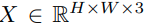表示）转换为 1D 图像patch序列 [16, 72]。具体来说，我们将 X 均匀地分割成一个展平的大小为 P × P 图像patch的序列，从而得到 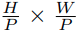视觉token。然后，通过可学习的线性投影将序列映射到潜在embedding空间。投影的特征称为patch embedding。此外，为了保留位置信息，标准的可学习一维位置embedding被添加到patch embedding中。最后，组合embedding（表示为 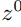 )被馈送到transformer编码器

**Transformer Encoder**	标准transformer编码器 [56] 由 L 个transformer块组成。每个块都有一个多头自注意力操作 (MSA)、一个多层感知器 (MLP) 和两个 Layernorm 步骤 (LN)。此外，在每个块之后应用一个残差连接层。通常，MSA 并行执行 M 个 self-attention 并投影它们的级联输出。在第 m 个 self attention 中，给定第 (l − 1) 个transformer 块的输出，查询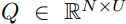，键 K ∈ 和值 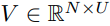是由以下计算

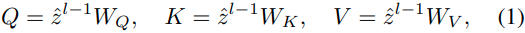

其中，是参数矩阵，C是embedding的维度，U是Q、K、V的维度。然后，我们根据序列的两个元素之间的成对相似性计算第 m 个自注意力的输出：

其中是计算的注意力权重。最后，MSA可以被公式化为

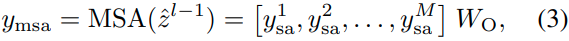

其中是MSA的输出，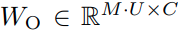表示投影参数，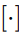是级联。在这项工作中，我们按照 [16] 中的设置固定 M = 16。

### 3.3 StageI: Global Context Modeling

通常，图像中的边缘和边界被定义为具有语义意义。捕捉整个图像的抽象线索和全局上下文至关重要。在第一阶段，我们通过全局transformer编码器  和全局解码器探索粗粒度patch上的全局上下文特征。

具体来说，我们首先将输入图像分割成大小为 16×16 的粗粒度patch的序列，然后生成用作编码器输入的embedding。接下来，全局transformer编码器处理embedding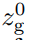以计算全局注意力，

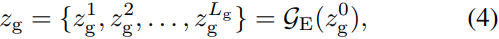

其中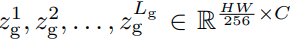表示中连续块的输出，是中transformer块的数量。在我们的实验中，我们按照[16] 将设置为 24。接下来，全局上下文特征序列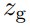被全局解码器上采样为高分辨率特征以进行合并。

**BiMLA Decoder**	生成边缘感知像素级表示以检测精确和细边缘是至关重要的。因此，我们期望设计一个实用的解码器，它可以鼓励 Transformer 编码器计算边缘感知注意力并以可学习的方式对注意力进行上采样。受视觉任务中多级特征聚合的启发 [22, 35–37, 65, 72]，我们提出了一种新颖的双向多级聚合 (BiMLA) 解码器，如图 3 所示，以实现目标。

在 BiMLA 中，设计了一种双向特征聚合策略，包括自上而下的路径和自下而上的路径，以增强 Transformer 编码器中的信息流。更具体地说，我们首先将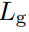transformer块均匀地分成四组，并将每组最后一个块的embedding特征 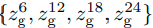作为输入。然后我们将它们重塑为大小为 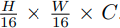的 3D 特征。对于自上而下的路径，我们将相同的设计（一个 1×1 卷积层和一个 3×3 卷积层）附加到每个重塑后的特征并按照 SETR-MLA [72] 的方式获得四个输出特征。同样，自下而上的路径从最低层（即 ）开始，通过在多层特征上附加一个 3×3 卷积层逐渐接近顶层（即  ），最后产生另一个四个输出特征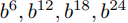。此外，与通过双线性操作对特征进行上采样的 SETR-MLA [72] 不同，我们的 BiMLA 将每个聚合特征通过一个反卷积块，包含两个分别具有 4×4 内核和 16×16 内核的反卷积层。每个反卷积层之后是Batch Normalization(BN) 和 ReLU 操作。然后将来自双向路径的八个上采样特征连接成一个张量。此外，BiMLA 使用额外的卷积层堆栈来平滑连接的特征。该堆栈由三个 3×3 卷积层和一个具有 BN 和 ReLU 的 1×1 卷积层组成。 BiMLA 解码器的过程可表述为

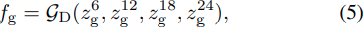

其中 fg 是像素级全局特征，代表全局 BiMLA 解码器。在获得粗粒度的全局上下文特征后，我们将在下一阶段捕获细粒度的局部上下文特征。

### 3.4 Stage II: Local Refinement

探索用于像素级预测的细粒度上下文特征至关重要，尤其是对于边缘检测。理想的边缘宽度是一个像素，而 16×16 的patch不利于提取薄边缘。将像素作为token听起来是一种直观的补救措施，但是由于计算成本高，实际上是不可行的。我们的解决方案是使用非重叠滑动窗口对图像进行采样，然后计算采样区域内的注意力。窗口中的patch数量是固定的，因此计算复杂度与图像大小线性相关。

因此，我们建议在第二阶段捕获短程细粒度上下文特征，如图 2 底部所示。特别是，我们执行大小为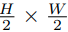的非重叠滑动窗口在图像 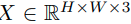上，输入图像 X 被分解为序列。对于每个窗口，我们将其拆分为大小为 8×8 的细粒度patch，并通过共享的局部transformer编码器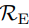计算注意力。然后我们连接所有窗口的注意力以获得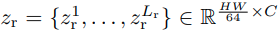。为了进一步节省计算资源，我们设置= 12，这意味着局部变压器编码器由 12 个transformer块组成。与全局 BiMLA 类似，我们从 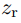 中均匀选择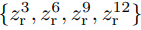 并将它们输入到局部 BiMLA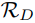以生成具有高分辨率的局部特征，

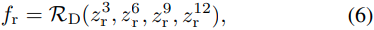

其中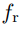表示局部特征。与全局BiMLA不同，我们将3×3卷积层替换为局部BiMLA中的1×1卷积层，以避免填充操作造成的人为边缘。

**Feature Fusion Module**	最后，我们通过特征融合模块 (FFM) 合并来自两个级别的上下文线索，并通过局部决策头预测边缘图。 FFM 将全局上下文作为先验知识，对局部上下文进行调制，产生包含全局上下文和细粒度局部细节的融合特征。如图 2 所示，FFM 由一个空间特征变换块 [60] 和两个 3×3 卷积层组成，然后是 BN 和 ReLU 操作。前者用于调制，后者用于平滑。然后将融合特征输入局部决策头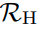以预测边缘图，

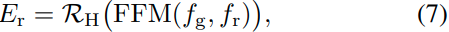

其中是由 1×1 卷积层和 sigmoid 操作组成的局部决策头。

### 3.5 Network Training

为了训练两阶段框架 EDTER，我们首先优化阶段 I 以生成代表整个图像上下文信息的全局特征。然后，我们固定 Stage I 的参数并训练 Stage II 以生成边缘图。

**Loss Function**	我们对每个边缘图使用 [65] 中提出的损失函数。给定边缘图 E 和相应的ground truth Y ，损失计算为

其中 Ei,j 和 Yi,j 分别是矩阵 E 和 Y 的第 (i, j) 个元素。此外，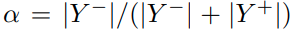表示负像素样本的百分比，其中 | · |表示像素数。在实践中，BSDS500 [1] 的注释由多个注释器标记。不一致的注释会导致有问题的收敛行为[65]。根据 [36] ，我们首先将多个标签归一化为范围为 [0, 1] 的边缘概率图，然后使用阈值 η 来选择像素。如果概率值高于 η，则该像素被标记为正样本；否则，表示为负样本。

**Training Stage I**	对于训练阶段 I，我们首先将全局决策头合并到全局特征图上以生成边缘图，例如

其中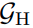表示由 1×1 卷积层和 sigmoid 层组成的全局决策头。此外，我们获得了通过对全局 BiMLA 解码器提取的中间特征执行相同的设计（一个 4×4 反卷积层和一个 16×16 反卷积层) 来获得多个侧输出，它逐渐增强编码器强调边缘感知注意力。

通过最小化每个边缘图和ground truth之间的损失来优化Stage I。Stage I的损失函数公式为

其中是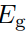的损失，表示 side loss，λ 是平衡和的权重。在我们的实验中，我们将 λ 设置为 0.4。

**Training Stage II**	在训练阶段 I 之后，我们固定阶段 I 的参数并进入阶段 II。与第一阶段的训练类似，我们对从局部 BiMLA 解码器提取的中间特征执行相同的操作（一个 4×4 反卷积层和一个 8×8 反卷积层），以生成侧输出.最后，Stage II 的损失函数定义为

其中和分别是和侧输出的损耗。我们再次设置 λ = 0.4。

## 4.实验

### 4.1 数据集

我们在三个流行的基准上进行了实验：BSDS500 [1]、NYUDv2 [49] 和 Multicue。

BSDS500 [1] 包含 500 个 RGB 自然图像，200 个用于训练，100 个用于验证，200 个用于测试。每个图像平均由五个不同的主题手动注释。我们的模型在训练集和验证集上进行了训练，并在测试集上进行了评估。与 [22, 36, 65] 类似，我们通过以 16 个不同角度旋转每个图像并在每个角度翻转图像来扩充数据集。此外，之前的大多数工作 [22, 36, 37, 62] 使用 PASCAL VOC Context Dataset [17] 作为额外的训练数据，它提供了超过 400 个类别的全场景分割注释，由 10,103 张图像组成用于训练。从分割注释中提取的外部边界有利于在Stage I推断语义和上下文线索。因此，我们首先在 PASCAL VOC Context Dataset [17] 上预训练Stage I，然后在 BSDS500 [1] 上对其进行微调。 PASCAL VOC Context Dataset [17] 仅用于训练Stage I。

NYUDv2 [49] 包含 1,449 对对齐的 RGB 和深度图像，分为 381 个训练图像、414 个验证图像和 654 个测试图像。根据 [36, 65] ，我们将训练和验证集组合为训练数据，然后通过将图像和注释旋转到 4 个不同的角度、随机翻转和缩放来增强它们。

Multicue [42] 由双目立体相机捕获的 100 个具有挑战性的自然场景组成。每个场景包含一个左视图和一个右视图短序列。每个场景的左视图序列的最后一帧都标有边缘和边界。根据 [22, 36, 65] ，我们随机选择 80 张图像进行训练，其余 20 张图像进行测试。我们重复该过程三次，并将三个独立试验的分数平均作为最终结果。数据增强遵循 [36, 65]。

### 4.2 实施细节

我们使用 PyTorch [43] 实现我们的 EDTER。我们使用 ViT [16] 预先训练的权重初始化模型的transformer块。我们将阈值 η 设置为 0.3 来为 BSDS500 和 Multicue Edge 选择正样本，为 Multicue Boundary 选择 0.4。每个图像在 NYUDv2 中只有一个注释，因此不需要 η。我们使用momentum = 0.9 和weight decay = 2e-4 的 SGD optimizer，并在所有数据集上采用多项式学习率衰减计划 [71]。 BSDS500、NYUDv2 和 Multicue Boundary 的初始学习率设置为 1e-6，Multicue Edge 的初始学习率设置为 1e-7。在训练期间，我们为两个阶段设置相同的迭代次数。特别是，我们为 BSDS500 和 Multicue boundary训练 80k 次迭代，为 NYUDv2 训练 40k 次，为 Multicue Edge 训练 4k 次。每个图像在训练中被随机裁剪为 320×320。与 BSDS500 相比，NYUDv2 的标注是单一的，Multicue 的规模较小，很快就会过拟合在其上训练的模型。因此，我们将 BSDS500 的批量大小设置为 8，将 NYUDv2 和 Multicue 的批量大小设置为 4。

所有实验均在 V100 GPU 上进行。 EDTER的培训大约需要26.4小时（第一阶段为15.1，第二阶段为11.3）。推理在 V100 上以 2.2 fps 运行。在训练期间，Stage I 和 Stage II 的 GPU 消耗分别为 320×320 图像的 15GB 和 14GB 左右。此外，EDTER 在第一阶段带来 332.0G FLOP，在第二阶段带来 470.25G FLOP。

在评估过程中，我们记录了所有数据集的三个指标：固定轮廓阈值 (ODS)、每幅图像最佳阈值 (OIS) 和平均精度 (AP)。此外，在评估之前对预测的边缘图执行非极大值抑制 [6]。根据之前的工作 [36,65]，定位容差控制边缘结果与ground truth之间匹配的最大允许距离，对于 BSDS500 和 Multicue，该距离设置为 0.0075，对于 NYUDv2 设置为 0.011。

### 4.3 消融实验

**Effectiveness of key components in EDTER**	我们首先进行实验以验证关键 EDTER 组件的影响：BiMLA 和 FFM。定量结果总结在表 1 中。首先，与 SETR-MLA [72] 相比，BiMLA 在两个阶段的 ODS、OIS、AP 性能都有很大提高（约 2.5%、3%、3%）。在任一解码器下，Stage II 的性能明显超过 Stage I。它说明了两阶段策略融合了更多用于边缘检测的关键信息。此外，我们展示了由 SETR-MLA 和 BiMLA 解码器预测的边缘图，如图 4 所示。使用 BiMLA 解码器，EDTER 可以准确地检测某些局部区域（红色边界框）中的边缘并产生较少噪声的边缘。为了验证 FFM 的有效性，我们移除了 FFM 并直接将两个阶段的特征图连接起来以构建 EDTER 的变体。在不使用 FFM（第 5 行）的情况下，ODS、OIS 和 AP 的分数分别下降了 0.4%、0.6% 和 1.3%。

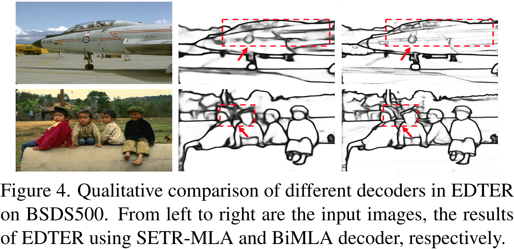

**Effectiveness of stages and patch size**	我们进行消融实验以验证两阶段策略的有效性。比较结果如表 2 所示。与第一阶段（第 1 行）相比，我们添加了第二阶段并将patch大小设置为 8×8（第 2 行），从而获得了 0.7%、0.6%、1.3 的性能增益ODS、IS 和 AP 中的百分比。此外，如图 5 所示，Stage II 的预测边缘在一些局部细节上更加清晰明了。这表明了两阶段策略对边缘检测的有效性。然后，为了分析patch大小的影响，我们创建了一个变体，它在第二阶段（第 3 行）中使用 4×4 的补丁大小。具体来说，在第二阶段，图像首先被大小为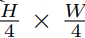的滑动窗口分解成一个序列，然后我们将每个窗口分割成一个 4×4 的patch序列并生成局部线索。与 Stage II 中使用 8×8 补丁的第 2 行相比，性能略有提高。此外，我们报告了 EDTER 模型变体的实验，这些变体使用更多阶段来捕获局部上下文，通过添加阶段 III 并将patch大小设置为 4×4 获得。在表 2（第 4 行)中，通过融合三个阶段的上下文线索，分数略有增加。由于从网络中提取的边缘不可避免地会占用多个像素，因此 4×4 补丁很少带来显著的收益。考虑到计算效率和性能之间的权衡，我们在第一阶段采用 16×16 和第二阶段 8×8 的设置来执行所有后续实验。	

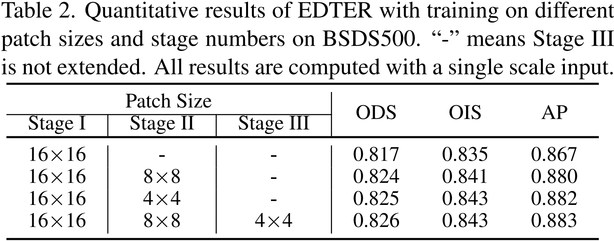

### 4.4 Comparison with State-of-the-arts

在 BSDS500 上。我们将我们的模型与传统检测器进行比较，包括 Canny [6]、Felz-Hutt [18]、gPb-owtucm [2]、SCG [64]、Sketch Tokens [34]、PMI [25]、SE [15]、OEF [ 21] 和 MES [50]，以及基于深度学习的检测器，包括 DeepEdge [3]、CSCNN [24]、DeepContour [48]、HFL [4]、HED [65]、Deep Boundary [29]、CEDN [67 ]、RDS [37]、COB [40]、DCD [33]、AMHNet [66]、RCF [36]、CED [62]、LPCB [12]、BDCN [22]、DexiNed [52]、DSCD [11 ] 和 PiDiNet [53]。所有方法的最佳结果均取自他们的出版物。

定量结果如表 3 所示，图 6 显示了所有方法的 Precision-Recall 曲线。通过在 BSDS500 的 trainval 集上进行训练，我们的方法通过单尺度测试实现了 0.824 的 F-measure ODS，在多尺度输入下获得了 0.840，这已经优于大多数边缘检测器。通过额外的训练数据和多尺度测试（遵循RCF、CED、BDCN等的设置），我们的方法达到了84.8%（ODS）、86.5%（OIS）、90.3%（AP），优于所有最先进的边缘检测器。一些定性结果如图 7 所示。我们观察到，所提出的 EDTER 在预测质量方面显示出明显的优势，既清晰又准确。

**On NYUDv2**	在 NYUDv2 中，我们对 RGB 图像进行实验，并与包括 gPb-ucm [1]、Silberman 等人在内的最先进的方法进行比较。 [49]、gPb+NG [19]、SE [15]、SE+NG+ [20]、OEF [21]、SemiCon tour [69]、HED [65]、RCF [36]、AMH-Net [66] ]、LPCB [12]、BDCN [22] 和 PiDiNet [53]。所有结果均基于单尺度输入。表 4 显示了我们的方法和其他竞争对手的定量结果。我们的方法在 ODS、OIS 和 AP 上分别取得了 77.4%、78.9% 和 79.7% 的最佳分数。与第二名相比，我们在三个指标上分别提高了 2.6%、2.6%、2.7% 的分数。补充材料中报告了更多结果，包括 HHA、RGB-HHA 输入和可视化。

**On Multicue**	Multicue由两种注释组成，即Multicue Edge和Multicue Boundary。对于每种类型的注释，我们与最先进的方法进行比较，包括 HED [65]、RCF [36]、BDCN [22]、DSCD [11] 和 PiDiNet [53]。我们在表 5 中报告了比较，结果显示出一致的性能。我们的方法在 Multicue Edge 上产生了有竞争力的结果。对于 Multicue Boundary，EDTER 实现了 86.1% 的 F-measure ODS，高于所有其他竞争对手。可视化结果在补充材料中提供。

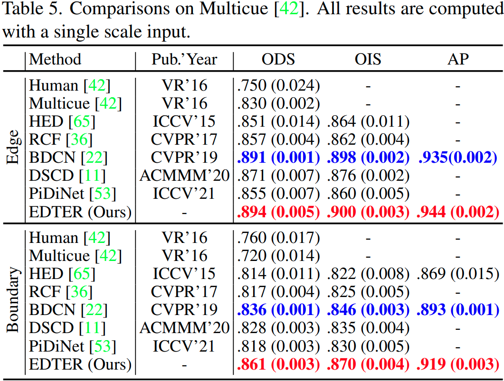

## 5.结论和局限性

在本文中，我们提出了一种新颖的两阶段边缘检测框架，即 EDTER。通过引入视觉transformer，EDTER 分两个阶段捕获粗粒度全局上下文和细粒度局部上下文。此外，它采用了一种新颖的双向多级聚合 (BiMLA) 解码器来探索高分辨率表示。此外，特征融合模块 (FFM) 结合了全局和局部上下文来预测边缘结果。实验结果表明，与最先进的技术相比，EDTER 产生了具有竞争力的结果。

**Limitation**	EDTER提取的边缘宽度占用多个像素，与理想边缘宽度仍有差距。在没有任何后期处理的情况下，生成清晰而薄的边缘仍然是未来探索的方向。
